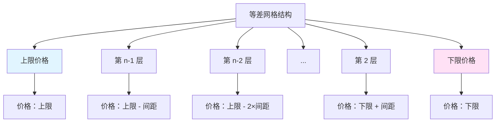
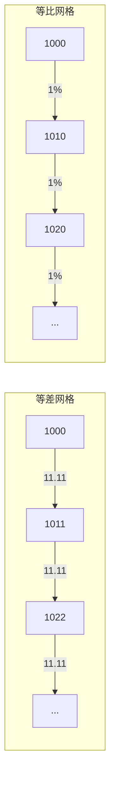
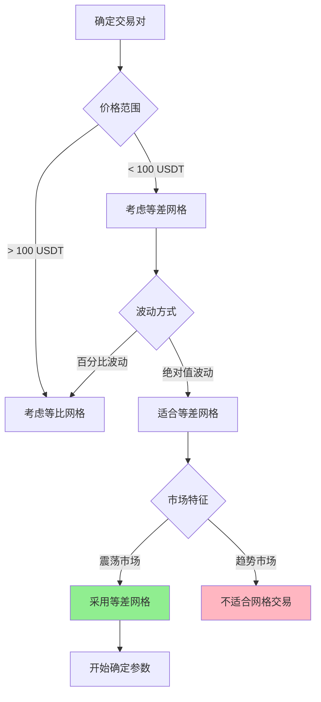

# 第 1 章：等差网格基础概念

## 本章导航

- [返回索引](arithmetic_grid_tutorial_index.md)
- [下一章：技术指标基础](arithmetic_grid_tutorial_02.md)

## 1.1 什么是等差网格

等差网格（Arithmetic Grid）是一种网格间距相等的交易策略。在这种策略中，所有的买卖订单按固定价格差均匀分布在设定的价格区间内。

### 1.1.1 核心特征

**价格间距相等**：

在等差网格中，相邻两个网格层级之间的价格差是恒定的。例如：

```text
价格区间：1000 USDT 至 1100 USDT
网格层级：10 层
网格间距：(1100 - 1000) / (10 - 1) = 11.11 USDT

网格层级分布：
第 10 层：1100.00 USDT（上限）
第 9 层：1088.89 USDT
第 8 层：1077.78 USDT
第 7 层：1066.67 USDT
第 6 层：1055.56 USDT
第 5 层：1044.44 USDT
第 4 层：1033.33 USDT
第 3 层：1022.22 USDT
第 2 层：1011.11 USDT
第 1 层：1000.00 USDT（下限）
```

### 1.1.2 数学表达式

在等差网格中，第 i 层的价格计算公式为：

```
价格_i = 下限 + (上限 - 下限) × (i - 1) / (层数 - 1)
```

或者更简单地：

```
价格_i = 下限 + 间距 × (i - 1)
```

其中：

- `间距 = (上限 - 下限) / (层数 - 1)`

### 1.1.3 视觉化表示

等差网格在价格图表上的分布是均匀的，就像等间距的水平线：



## 1.2 等差网格 vs 等比网格

理解等差网格与等比网格的区别，有助于选择最适合的网格类型。

### 1.2.1 核心区别对比

| 维度 | 等差网格 | 等比网格 |
|------|---------|---------|
| 价格间距 | 固定金额差（如 10 USDT） | 固定百分比差（如 2%） |
| 数学性质 | 等差数列 | 等比数列 |
| 适用场景 | 中低价格币种、稳定波动 | 高价格币种、百分比波动 |
| 资金分布 | 各层级资金需求相对均衡 | 高价区需更多资金 |
| 成本结构 | 每层交易成本相近 | 高价层成本更高 |

### 1.2.2 具体例子对比

假设价格区间：1000 USDT - 1100 USDT，共 10 层

**等差网格**：

```text
间距 = 11.11 USDT

层级分布：
1000.00, 1011.11, 1022.22, 1033.33, 1044.44,
1055.56, 1066.67, 1077.78, 1088.89, 1100.00

每层间距：固定的 11.11 USDT
```

**等比网格**（假设比率为 1.01，即 1%）：

```text
比率 = 1.01

层级分布：
1000.00, 1010.05, 1020.15, 1030.35, 1040.65,
1051.06, 1061.57, 1072.19, 1082.91, 1093.73

每层间距：约 10 USDT（但百分比固定为 1%）
```

### 1.2.3 视觉化对比



## 1.3 等差网格的优势

### 1.3.1 数学简单直观

- **易于理解**：价格间距是固定金额，计算简单
- **便于规划**：可以直观地看到每个价格点的绝对值
- **易于调试**：参数调整时逻辑清晰

### 1.3.2 资金需求可预期

- **相对均衡**：在价格区间内，各层级所需的资金量相对均衡
- **预算明确**：可以根据价格区间和层级数大致估算资金需求
- **风险可控**：不会因为某个高价层级而占用过多资金

### 1.3.3 适合稳定市场

- **波动稳定**：当市场波动以固定金额为主时，等差网格更有效
- **区间交易**：在明确的支撑阻力区间内效果最佳
- **中低价格币种**：对中小币种特别适用

## 1.4 等差网格的局限性

### 1.4.1 百分比波动不均

**问题**：

在百分比波动较大的市场中，等差网格可能导致高价区订单过于密集，低价区订单过于稀疏。

**例子**：

```text
价格区间：10 USDT - 20 USDT
等差间距：1 USDT

10 USDT 到 11 USDT：10% 涨幅
19 USDT 到 20 USDT：5.26% 涨幅

同样的 1 USDT 涨幅，在不同价格水平代表不同的百分比变化。
```

### 1.4.2 高价币种不适用

对于高价币种（如 BTC 在 50000 USDT 以上），等差网格需要极大的间距才能覆盖合理的百分比区间，这可能导致网格层级过少或区间过大。

### 1.4.3 市场适应性较弱

当市场从震荡转为趋势行情时，等差网格的固定间距可能无法适应市场的变化，需要手动调整参数。

## 1.5 适用场景分析

### 1.5.1 理想市场条件

**价格区间稳定**：

- 有明显的支撑位和阻力位
- 价格在区间内反复震荡
- 短期内不会突破关键价位

**波动方式适合**：

- 以绝对值波动为主（而非百分比波动）
- 波动幅度相对稳定
- 波动频率适中

**交易对特征**：

- 中小市值币种（价格在 0.1 - 100 USDT 之间）
- 流动性充足的交易对
- 24 小时交易量稳定

### 1.5.2 不适合的场景

**高价格币种**：

- BTC、ETH 等高价主流币
- 使用等比网格更合适

**百分比波动剧烈**：

- 小币种突然暴涨暴跌
- 波动率变化频繁

**单边趋势市场**：

- 明确的上升或下降趋势
- 价格容易突破网格区间

**低流动性市场**：

- 买卖价差大
- 订单簿深度不足
- 可能导致实际成交价格偏离网格价格

## 1.6 关键决策流程

选择是否使用等差网格的决策流程：



## 1.7 本章小结

等差网格是一种间距相等的网格交易策略，具有以下核心特点：

**优势**：

1. 数学简单，易于理解和实现
2. 资金需求相对均衡，便于规划
3. 适合中低价格币种的震荡市场

**局限性**：

1. 对百分比波动较大的市场适应性差
2. 不适合高价币种
3. 在趋势市场中效果不佳

**适用判断**：

- 交易对价格 < 100 USDT
- 市场以绝对值波动为主
- 有明显的震荡区间
- 流动性充足

在确定使用等差网格后，下一章我们将学习如何使用技术指标来分析和确定网格参数。

准备好了吗？让我们继续学习 [第 2 章：技术指标基础](arithmetic_grid_tutorial_02.md)，了解如何运用技术指标来辅助网格交易决策。

---

[返回索引](arithmetic_grid_tutorial_index.md) | [下一章：技术指标基础](arithmetic_grid_tutorial_02.md)