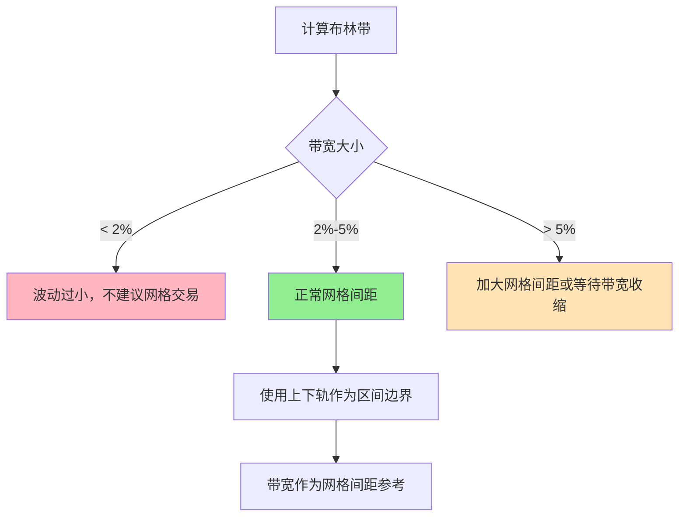
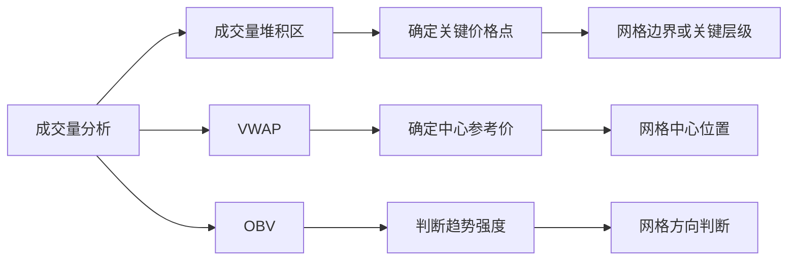
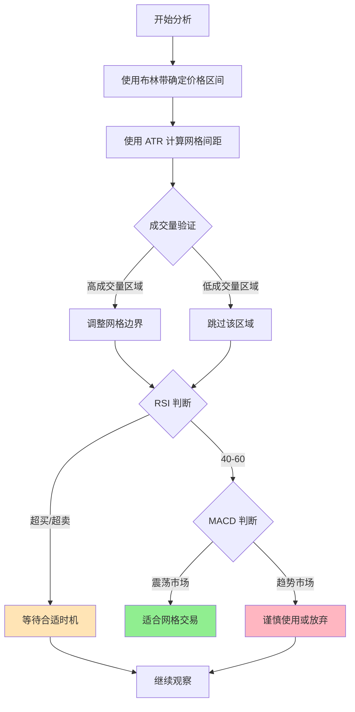

# 第 2 章：技术指标基础

## 本章导航

- [返回索引](arithmetic_grid_tutorial_index.md)
- [上一章：等差网格基础概念](arithmetic_grid_tutorial_01.md)
- [下一章：确定价格区间的方法](arithmetic_grid_tutorial_03.md)

## 2.1 技术指标在网格交易中的作用

在网格交易中，技术指标不是用来预测价格走势，而是用来：

- **确定价格区间边界**：找到合理的上限和下限
- **量化市场波动**：了解价格波动的幅度和频率
- **评估市场状态**：判断当前是否适合网格交易
- **优化网格参数**：计算合理的网格间距和层数

## 2.2 布林带（Bollinger Bands）

布林带是最常用于确定网格区间的技术指标之一。

### 2.2.1 布林带的基本原理

布林带由三条线组成：

- **中轨（Middle Band）**：N 期移动平均线（通常是 20 期 SMA）
- **上轨（Upper Band）**：中轨 + k × 标准差（k 通常为 2）
- **下轨（Lower Band）**：中轨 - k × 标准差

**计算公式**：

```
中轨 = SMA(N)
上轨 = SMA(N) + k × σ(N)
下轨 = SMA(N) - k × σ(N)
```

其中：

- `SMA(N)`：N 期简单移动平均
- `σ(N)`：N 期标准差
- `k`：宽度系数（通常为 2）

### 2.2.2 布林带在网格交易中的应用

**确定价格区间**：

- **上轨作为网格上限**：价格触及上轨时卖出
- **下轨作为网格下限**：价格触及下轨时买入
- **中轨作为参考中心**：价格围绕中轨波动

**原理**：

布林带的统计学原理是，在正态分布假设下，约 95% 的价格会落在上下轨之间（k=2 时）。这使得布林带成为一个天然的价格区间边界。

**参数选择**：

- **周期 N**：常用 20、50 或 100
  - 20：短期波动，适用于日内交易
  - 50：中期波动，适用于数日交易
  - 100：长期波动，适用于数周交易
- **宽度系数 k**：常用 2.0
  - k=1.5：更窄的区间，更频繁的交易
  - k=2.0：标准区间，平衡交易频率
  - k=2.5：更宽的区间，减少交易频率

### 2.2.3 布林带宽度（Bandwidth）

布林带宽度是衡量市场波动性的重要指标：

```
带宽 = (上轨 - 下轨) / 中轨 × 100%
```

**在网格交易中的应用**：

- **带宽 > 5%**：波动较大，网格间距可以适当增大
- **带宽 2%-5%**：波动适中，标准的网格间距
- **带宽 < 2%**：波动较小，网格间距应减小

### 2.2.4 动态调整策略

**带宽收缩扩张**：

当布林带收缩（带宽变小）时，说明波动性降低，适合设置更密集的网格。当布林带扩张时，说明波动性增加，需要调整网格区间。

**策略建议**：



## 2.3 ATR（Average True Range）

ATR 是最重要的波动率指标，在网格间距计算中起到关键作用。

### 2.3.1 ATR 的计算方法

**真实波动范围（True Range，TR）**计算：

```
TR = max(
    High - Low,
    |High - PrevClose|,
    |Low - PrevClose|
)
```

**ATR 计算**（通常使用指数移动平均）：

```
ATR(t) = EMA(TR, N)
```

其中：

- `High`：当前最高价
- `Low`：当前最低价
- `PrevClose`：前一收盘价
- `N`：周期（常用 14）

### 2.3.2 ATR 在网格间距中的应用

**核心思想**：

ATR 代表了当前市场的平均真实波动幅度，这正好是设定网格间距的理想参考值。

**间距设定方法**：

```
网格间距 = ATR × 倍数
```

**倍数选择**：

- **0.5 × ATR**：密集网格，适合高频交易
- **1.0 × ATR**：标准网格，平衡交易频率
- **1.5 × ATR**：宽松网格，减少交易频率
- **2.0 × ATR**：保守网格，仅捕捉大波动

**周期选择**：

- **ATR(14)**：短期波动，适合日内网格
- **ATR(20)**：中期波动，适合数日网格
- **ATR(30)**：长期波动，适合周级网格

### 2.3.3 ATR 百分比化

为了更好地比较不同价格水平的波动，可以使用 ATR%：

```
ATR% = (ATR / 当前价格) × 100%
```

**应用示例**：

```text
币种 A：价格 10 USDT，ATR = 0.5 USDT，ATR% = 5%
币种 B：价格 100 USDT，ATR = 3 USDT，ATR% = 3%

虽然币种 B 的 ATR 更大，但相对波动（ATR%）更小。
网格间距应该根据 ATR% 来设定，而非绝对 ATR 值。
```

### 2.3.4 ATR 趋势分析

**上升趋势**：

ATR 持续上升意味着波动性增加，可能需要加大网格间距或调整区间边界。

**下降趋势**：

ATR 持续下降意味着波动性减少，可以设置更密集的网格或缩小区间。

## 2.4 成交量分析

成交量是验证价格区间有效性的重要指标。

### 2.4.1 成交量与支撑阻力

**成交量堆积区**：

- **高成交量区域**：通常是重要的支撑或阻力位
- **低成交量区域**：价格容易快速通过

**应用方法**：

1. 在图表上识别成交量密集区域
2. 这些区域的价格水平可以作为网格的边界或关键层级
3. 在成交量高的层级增加网格密度

### 2.4.2 VWAP（成交量加权平均价）

VWAP 是日内交易中重要的参考价位。

**计算方法**：

```
VWAP = Σ(价格 × 成交量) / Σ(成交量)
```

**在网格交易中的应用**：

- VWAP 可以作为网格的中心参考价格
- 价格偏离 VWAP 越远，反弹的概率越大
- 在 VWAP 附近可以设置更密集的网格层级

### 2.4.3 OBV（On-Balance Volume）

OBV 可以反映资金流向，帮助判断趋势的可持续性。

**判断原则**：

- OBV 上升 + 价格横盘：可能即将上涨，适合做多网格
- OBV 下降 + 价格横盘：可能即将下跌，适合做空网格或谨慎做多
- OBV 与价格背离：趋势可能反转

### 2.4.4 成交量指标综合判断



## 2.5 RSI 和 MACD

这两个指标主要用于判断市场状态和入场时机。

### 2.5.1 RSI（相对强弱指标）

**基本原理**：

RSI 衡量价格变动的速度和幅度，范围 0-100。

**计算公式**：

```
RS = 平均上涨幅度 / 平均下跌幅度
RSI = 100 - (100 / (1 + RS))
```

**在网格交易中的应用**：

**市场状态判断**：

- **RSI > 70**：超买区域，价格可能回调，不适合开启新的做多网格
- **RSI 40-60**：中性区域，适合网格交易
- **RSI < 30**：超卖区域，价格可能反弹，不适合开启新的做空网格

**入场时机**：

- 当 RSI 从超买/超卖区域回到中性区域时，考虑开启网格
- 震荡市场中的 RSI 波动在 30-70 之间，是最理想的网格交易环境

**多时间框架分析**：

- 日线 RSI：判断大趋势
- 4 小时 RSI：判断中期趋势
- 1 小时 RSI：判断短期波动

### 2.5.2 MACD（指数平滑移动平均线）

**基本原理**：

MACD 通过快慢均线的差值和信号线来反映趋势变化。

**组成要素**：

- **DIF 线**：快线 EMA(12) - 慢线 EMA(26)
- **DEA 线（信号线）**：DIF 的 EMA(9)
- **MACD 柱**：(DIF - DEA) × 2

**在网格交易中的应用**：

**趋势判断**：

- **DIF > DEA 且 MACD 柱 > 0**：上升趋势，可以做多网格
- **DIF < DEA 且 MACD 柱 < 0**：下降趋势，谨慎做多或做空网格
- **DIF 与 DEA 交叉频繁**：震荡市场，适合网格交易

**震荡识别**：

当 MACD 在零轴附近频繁交叉，且柱状图较小，说明市场处于震荡状态，这正是网格交易的最佳环境。

**背离信号**：

- **价格创新高，MACD 未创新高**：顶背离，可能反转，不适合开启新的做多网格
- **价格创新低，MACD 未创新低**：底背离，可能反转，不适合开启新的做空网格

## 2.6 多指标综合应用

在实际交易中，应该综合使用多个指标，而不是依赖单一指标。

### 2.6.1 指标综合判断流程



### 2.6.2 指标权重建议

在网格交易中，各指标的权重可以这样分配：

- **布林带**：40%（主要确定区间边界）
- **ATR**：30%（主要确定网格间距）
- **成交量**：15%（验证区间有效性）
- **RSI/MACD**：15%（判断市场状态和时机）

### 2.6.3 指标冲突处理

当不同指标给出矛盾信号时：

**优先顺序**：

1. **成交量 > 价格指标**：如果成交量不支持，即使其他指标良好也应谨慎
2. **ATR > 布林带**：如果 ATR 显示波动异常，应优先考虑 ATR 的建议
3. **多时间框架一致 > 单一时间框架**：当多个时间框架一致时，信号更可靠

**等待确认**：

当指标冲突时，最好的策略是等待更多信息，而不是强行交易。

## 2.7 本章小结

技术指标在网格交易中起到关键作用，但不是用于预测，而是用于：

**核心功能**：

1. **布林带**：确定价格区间的上下边界，提供天然的交易区间
2. **ATR**：量化市场波动率，计算合理的网格间距
3. **成交量**：验证价格区间的有效性，识别关键价格点
4. **RSI/MACD**：判断市场状态，确定是否适合网格交易

**关键原则**：

- 综合使用多个指标，避免单一依赖
- 技术指标提供概率性参考，而非确定性预测
- 在指标冲突时保持谨慎，等待更多确认
- 定期重新评估指标，因为市场环境在不断变化

下一章我们将深入探讨如何将这些技术指标实际应用到价格区间的确定中。

准备好了吗？让我们继续学习 [第 3 章：确定价格区间的方法](arithmetic_grid_tutorial_03.md)，了解如何综合运用这些指标来确定网格交易的价格边界。

---

[返回索引](arithmetic_grid_tutorial_index.md) | [上一章：等差网格基础概念](arithmetic_grid_tutorial_01.md) | [下一章：确定价格区间的方法](arithmetic_grid_tutorial_03.md)
