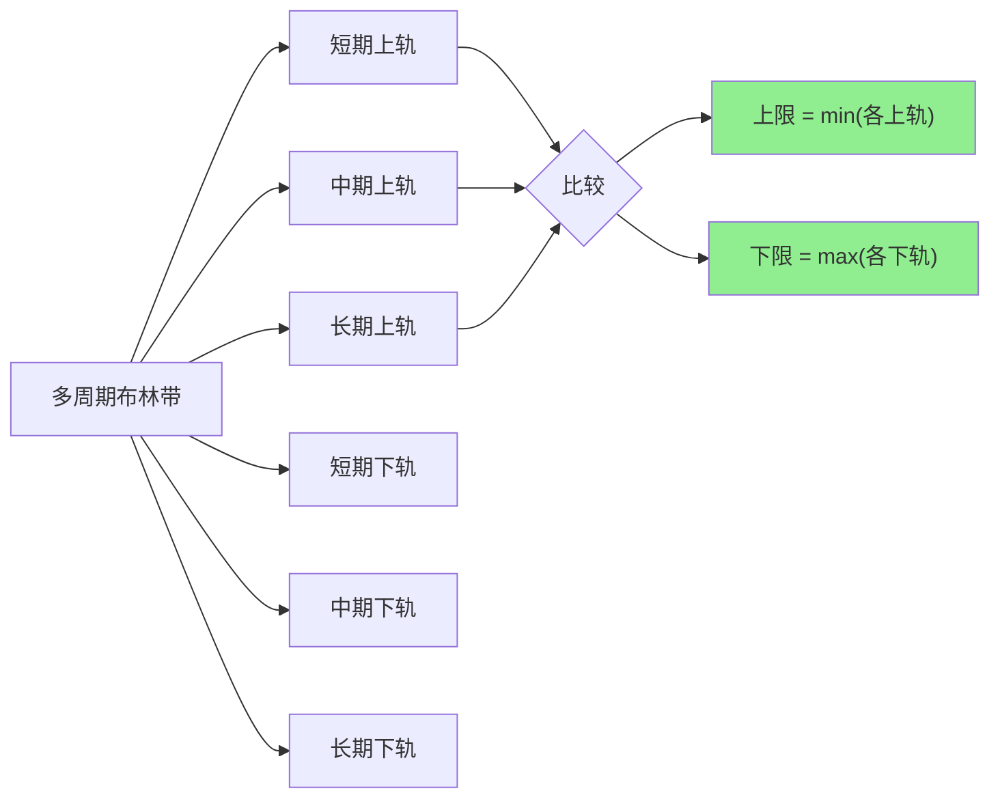
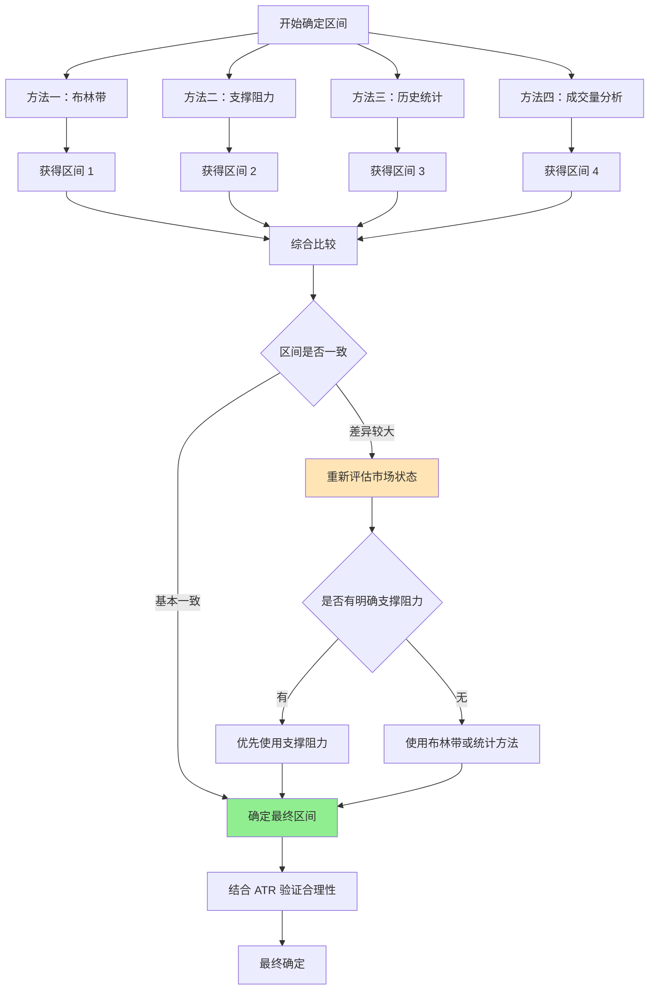

# 第 3 章：确定价格区间的方法

## 本章导航

- [返回索引](arithmetic_grid_tutorial_index.md)
- [上一章：技术指标基础](arithmetic_grid_tutorial_02.md)
- [下一章：网格间距的计算](arithmetic_grid_tutorial_04.md)

## 3.1 确定价格区间的核心原则

确定网格交易的价格区间是策略成功的关键。一个好的价格区间应该满足：

- **有效性**：价格大概率会在这个区间内波动
- **稳定性**：区间边界不会频繁被突破
- **盈利性**：区间有足够的波动空间产生盈利
- **风险可控**：即使突破区间，风险也在可接受范围内

## 3.2 方法一：使用布林带确定上下界

### 3.2.1 标准方法

**直接使用布林带上下轨**：

- **网格上限**：布林带上轨（SMA + 2σ）
- **网格下限**：布林带下轨（SMA - 2σ）

**优点**：

- 方法简单直接
- 基于统计学原理，95% 的价格会落在区间内
- 自动适应市场波动变化

**缺点**：

- 在趋势市场中可能过于保守
- 需要结合成交量验证有效性

### 3.2.2 优化方法

**扩展边界法**：

为了给网格留出更大的安全边际，可以在布林带基础上适当扩展：

```
网格上限 = 上轨 × (1 + 扩展系数)
网格下限 = 下轨 × (1 - 扩展系数)
```

**扩展系数选择**：

- **保守型**：扩展系数 = 0%，直接使用布林带
- **标准型**：扩展系数 = 2%-5%
- **激进型**：扩展系数 = 5%-10%

**注意事项**：

扩展系数不宜过大，否则会增加区间被突破的风险。

### 3.2.3 多周期布林带综合

使用不同周期的布林带可以更好地平衡短期波动和长期趋势：

**方法**：

1. **短期布林带**（20 期）：捕捉近期波动
2. **中期布林带**（50 期）：反映中期趋势
3. **长期布林带**（100 期）：识别长期支撑阻力

**区间设定**：



**示例**：

```text
BTC-USDT 当前价格：50000 USDT

20 期布林带：下轨 48000，上轨 52000
50 期布林带：下轨 47000，上轨 53000
100 期布林带：下轨 46000，上轨 54000

综合设定：
网格上限 = min(52000, 53000, 54000) = 52000
网格下限 = max(48000, 47000, 46000) = 48000

这样做可以确保区间更保守，减少突破风险。
```

### 3.2.4 布林带宽度过滤

在确定区间前，先检查布林带宽度是否合理：

**过滤条件**：

- **带宽 < 2%**：波动过小，不适合网格交易
- **带宽 2%-8%**：适合网格交易
- **带宽 > 8%**：波动过大，需要谨慎考虑或等待带宽收缩

## 3.3 方法二：使用支撑位和阻力位

### 3.3.1 历史高低点识别

**方法**：

在 K 线图上识别最近一段时间内的明显高点和低点：

- **支撑位**：价格多次触及但没有有效跌破的低点
- **阻力位**：价格多次触及但没有有效突破的高点

**时间范围选择**：

- **日内网格**：查看最近 7-30 天的高低点
- **短期网格**：查看最近 1-3 个月的高低点
- **长期网格**：查看最近 3-6 个月的高低点

### 3.3.2 支撑阻力强度判断

**强支撑/阻力**：

- 被多次测试的价格水平
- 成交量明显放大的价格水平
- 与整数位、前高前低等重要价格重合的水平

**弱支撑/阻力**：

- 仅被测试 1-2 次的价格水平
- 成交量较小的价格水平

**应用原则**：

- **网格上限**：选择强阻力位或略低于强阻力位
- **网格下限**：选择强支撑位或略高于强支撑位

### 3.3.3 趋势线支撑阻力

**上升趋势线**：

连接两个或更多的低点形成的支撑线。

- 如果价格在上升趋势线上方运行，趋势线可以作为网格下限
- 网格上限选择近期高点形成的阻力位

**下降趋势线**：

连接两个或更多的高点形成的阻力线。

- 如果价格在下降趋势线下方运行，趋势线可以作为网格上限
- 网格下限选择近期低点形成的支撑位

**横盘整理**：

- 上下两个明显的水平阻力支撑线
- 这正是网格交易的最佳环境

### 3.3.4 心理价位

**整数关口**：

- **10、100、1000** 等整数位往往是心理关口
- 价格在这些位置会有明显的支撑或阻力

**应用方法**：

- 网格上限选择整数位或略高于整数位
- 网格下限选择整数位或略低于整数位

**示例**：

```text
ETH-USDT 当前价格：2850 USDT

心理整数位：2800、2900、3000

如果判断为震荡市场：
网格下限：2800 USDT
网格上限：3000 USDT

或者在整数位附近微调：
网格下限：2790 USDT（略低于 2800）
网格上限：2990 USDT（略低于 3000）
```

## 3.4 方法三：历史波动区间分析

### 3.4.1 统计方法

**计算历史波动范围**：

统计最近 N 天的价格分布，找到合理的上下界：

```
上限 = 均值 + k × 标准差
下限 = 均值 - k × 标准差
```

**参数选择**：

- **均值**：可以使用简单移动平均或加权移动平均
- **k 值**：通常选择 2（覆盖约 95% 的价格）

### 3.4.2 分位数方法

使用历史价格的分位数来确定区间：

**方法**：

1. 收集最近 N 天的所有价格数据
2. 计算价格的分位数
3. 选择合理的分位数作为边界

**常用分位数**：

- **上边界**：90% 或 95% 分位数
- **下边界**：10% 或 5% 分位数

**优点**：

- 不依赖正态分布假设
- 更能反映实际价格分布
- 对异常值不敏感

### 3.4.3 时间窗口选择

**短期窗口（7-30 天）**：

- 适合日内或短期网格交易
- 更贴近当前市场状态
- 但可能不够稳定

**中期窗口（30-90 天）**：

- 适合数日或数周的网格交易
- 平衡稳定性和相关性
- 推荐的窗口大小

**长期窗口（90-180 天）**：

- 适合长期网格交易
- 区间更稳定
- 但可能偏离当前市场

## 3.5 方法四：成交量加权分析

### 3.5.1 VWAP 区间

**VWAP 标准差法**：

以 VWAP 为中心，使用标准差确定区间：

```
上限 = VWAP + k × VWAP_标准差
下限 = VWAP - k × VWAP_标准差
```

### 3.5.2 成交量价格分布（VPOC）

**概念**：

VPOC（Volume Profile Point of Control）是成交量最大的价格水平，通常是最重要的支撑或阻力位。

**应用方法**：

1. 构建成交量价格分布图
2. 识别 VPOC 位置
3. 以 VPOC 为中心，上下各扩展一定范围作为网格区间

**扩展范围**：

- 可以使用 ATR 的倍数
- 或者使用成交量加权价格的标准差

### 3.5.3 成交量密集区

**识别方法**：

在成交量价格分布图中，识别成交量密集的价格区间。

**应用原则**：

- **区间边界**：选择成交量密集区的边缘
- **网格中心**：成交量最大的价格可以作为网格中心参考

## 3.6 综合方法：多重验证

在实际应用中，应该综合使用多种方法，相互验证。

### 3.6.1 综合判断流程



### 3.6.2 一致性检查

**检查要点**：

1. **区间重叠度**：各方法得出的区间应该有较大重叠
2. **边界接近度**：上下边界不应该相差超过 10%
3. **市场状态一致性**：各方法对市场状态的判断应该一致

**不一致的处理**：

如果各方法得出的区间差异很大，说明：

- 市场可能处于转折期
- 数据不充分或不可靠
- 需要等待更多信息
- 或者采用最保守的区间设定

### 3.6.3 实战示例

**案例：ETH-USDT 网格区间确定**

```text
当前价格：2850 USDT

方法一：布林带（20 期）
  下轨：2750 USDT
  上轨：2950 USDT
  区间宽度：200 USDT

方法二：支撑阻力分析
  支撑位：2700 USDT（近 30 天低点）
  阻力位：3000 USDT（整数关口）
  区间宽度：300 USDT

方法三：历史统计（90 天，2σ）
  下限：2720 USDT（5% 分位数）
  上限：2980 USDT（95% 分位数）
  区间宽度：260 USDT

方法四：VWAP ± 2σ
  VWAP：2830 USDT
  下限：2730 USDT
  上限：2930 USDT
  区间宽度：200 USDT

综合评估：
- 各方法的下限集中在 2700-2750
- 各方法的上限集中在 2950-3000
- 区间重叠度较好

最终确定：
网格下限：2700 USDT（取最保守值）
网格上限：2980 USDT（略低于整数阻力位 3000）

这样设定的优势：
1. 下限 2700 是强支撑位，有较高的有效性
2. 上限 2980 低于整数位，留有安全边际
3. 区间宽度 280 USDT，约 9.8%，适合网格交易
```

### 3.6.4 最终验证

在确定区间后，还需要进行最后的验证：

**验证清单**：

1. **区间宽度**：是否在合理范围内（建议 5%-15%）
2. **当前价格位置**：是否在区间中部或偏上/偏下（偏中较好）
3. **ATR 验证**：区间宽度是否 ≥ 3 × ATR（确保有足够的波动空间）
4. **成交量验证**：区间内是否有足够的成交量支撑
5. **时间验证**：区间是否在最近一段时间内有效

## 3.7 动态调整原则

价格区间不是一成不变的，需要根据市场变化动态调整。

### 3.7.1 何时需要调整

**触发条件**：

1. 价格持续接近或触及区间边界
2. 市场波动率发生明显变化
3. 成交量模式发生改变
4. 支撑阻力位发生变化
5. 运行时间超过预设周期（如 30 天）

### 3.7.2 调整方法

**渐进式调整**：

不要一次性大幅调整，而是逐步微调：

- 每次调整幅度不超过原区间的 5%
- 观察调整后的效果再决定下一步

**等待确认**：

在调整前，等待市场给出明确的信号，而不是主观预测。

## 3.8 本章小结

确定网格交易的价格区间有多种方法，每种方法都有其适用场景：

**主要方法**：

1. **布林带法**：基于统计学原理，适合波动相对稳定的市场
2. **支撑阻力法**：基于价格行为，适合有明显支撑阻力的市场
3. **历史统计法**：基于历史数据，适合有足够历史数据的情况
4. **成交量法**：基于市场参与度，适合流动性充足的市场

**最佳实践**：

- 综合使用多种方法，相互验证
- 选择最保守的区间设定，增加安全性
- 定期重新评估和调整区间
- 始终考虑当前市场状态和波动率

下一章我们将学习如何计算网格间距，这是网格交易的另一个关键参数。

准备好了吗？让我们继续学习 [第 4 章：网格间距的计算](arithmetic_grid_tutorial_04.md)，了解如何科学地设定网格间距。

---

[返回索引](arithmetic_grid_tutorial_index.md) | [上一章：技术指标基础](arithmetic_grid_tutorial_02.md) | [下一章：网格间距的计算](arithmetic_grid_tutorial_04.md)
