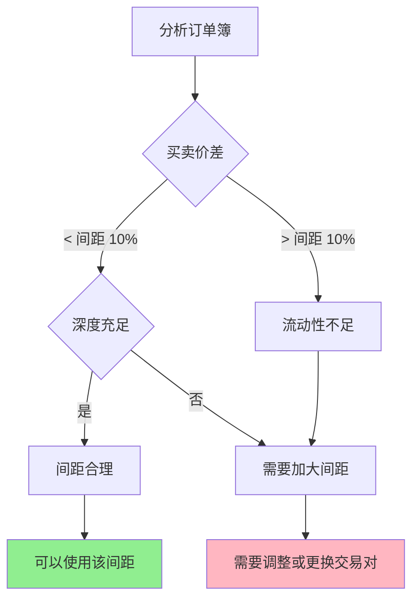
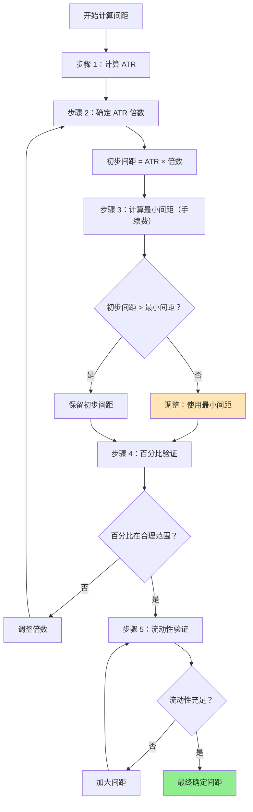

# 第 4 章：网格间距的计算

## 本章导航

- [返回索引](arithmetic_grid_tutorial_index.md)
- [上一章：确定价格区间的方法](arithmetic_grid_tutorial_03.md)
- [下一章：网格层数的确定](arithmetic_grid_tutorial_05.md)

## 4.1 网格间距的重要性

网格间距是网格交易的核心参数之一，直接影响：

- **交易频率**：间距小→交易频繁，间距大→交易较少
- **盈利能力**：间距需要覆盖交易成本，否则可能亏损
- **资金利用率**：合适的间距能提高资金利用效率
- **风险控制**：间距太大可能错失机会，间距太小可能导致过度交易

## 4.2 方法一：基于 ATR 的间距设定

ATR 是最科学和最常用的网格间距计算基准。

### 4.2.1 基本原理

ATR 代表市场的平均真实波动幅度，以此为基础设定网格间距，可以确保：

- 网格间距与市场波动相匹配
- 价格大概率会触及相邻网格层级
- 避免过度交易或交易不足

### 4.2.2 计算公式

```
网格间距 = ATR × 倍数
```

**倍数选择原则**：

| 倍数 | 特点 | 适用场景 |
|------|------|----------|
| 0.3-0.5 × ATR | 非常密集 | 高波动市场，短线交易 |
| 0.5-1.0 × ATR | 标准密集 | 正常波动市场，日内交易 |
| 1.0-1.5 × ATR | 标准间距 | 平衡型网格，数日交易 |
| 1.5-2.0 × ATR | 宽松间距 | 低波动市场，周级交易 |
| 2.0-3.0 × ATR | 非常宽松 | 趋势跟随网格，长期交易 |

### 4.2.3 ATR 周期选择

**短期 ATR（14 期）**：

- 适合日内或短期网格
- 更能反映当前波动状态
- 但可能不够稳定

**中期 ATR（20-30 期）**：

- 推荐的周期范围
- 平衡稳定性和相关性
- 适合大多数网格交易策略

**长期 ATR（50 期）**：

- 适合长期网格
- 波动率更稳定
- 但可能滞后于当前市场

**建议**：

- 主要使用中期 ATR（如 20 或 30 期）
- 可以参考短期和长期 ATR 来验证当前波动是否异常

### 4.2.4 实际应用示例

**示例 1：BTC-USDT**

```text
当前价格：50000 USDT
ATR(20) = 800 USDT
ATR% = 800 / 50000 = 1.6%

选择倍数 = 1.0

网格间距 = 800 × 1.0 = 800 USDT

验证：
- 间距百分比 = 800 / 50000 = 1.6%
- 在合理范围内（1%-3%）
```

**示例 2：ETH-USDT**

```text
当前价格：2850 USDT
ATR(20) = 45 USDT
ATR% = 45 / 2850 = 1.58%

选择倍数 = 1.2

网格间距 = 45 × 1.2 = 54 USDT

验证：
- 间距百分比 = 54 / 2850 = 1.89%
- 符合标准网格间距
```

## 4.3 方法二：基于百分比的间距设定

对于某些交易对，使用固定百分比可能更直观。

### 4.3.1 常用百分比参考

**密集网格**：0.5% - 1.0%

- 适合高波动币种
- 交易频率高
- 需要充足的资金

**标准网格**：1.0% - 2.0%

- 推荐的间距范围
- 平衡交易频率和盈利能力
- 适合大多数情况

**宽松网格**：2.0% - 3.0%

- 适合低波动币种
- 交易频率低
- 单次盈利更大

### 4.3.2 百分比与 ATR 的关系

将百分比间距与 ATR 进行对比验证：

```
期望间距百分比 = 网格间距 / 当前价格 × 100%
ATR% = ATR / 当前价格 × 100%

合理性检查：期望间距百分比应该 ≈ ATR% × 倍数
```

**示例**：

```text
当前价格：2850 USDT
ATR = 45 USDT
ATR% = 1.58%

设定 1.5% 的间距：
网格间距 = 2850 × 1.5% = 42.75 USDT ≈ 43 USDT

验证：
42.75 / 45 = 0.95，接近 1.0 × ATR
这是合理的间距设定。
```

### 4.3.3 价格水平的影响

对于不同价格水平的币种，相同的百分比间距代表的绝对金额差异很大：

```text
币种 A：价格 10 USDT，间距 1% = 0.1 USDT
币种 B：价格 100 USDT，间距 1% = 1 USDT
币种 C：价格 1000 USDT，间距 1% = 10 USDT
```

因此，百分比间距应该根据交易对的价格水平适当调整。

## 4.4 考虑手续费的最小间距

### 4.4.1 盈亏平衡计算

网格交易的盈利必须覆盖交易成本，否则会产生亏损。

**单次交易的成本**：

```
总成本 = 买入手续费 + 卖出手续费
      = 金额 × (买入费率 + 卖出费率)
```

**最小盈利要求**：

网格间距必须确保单次交易的净盈利大于成本：

```
网格间距 × 金额 > 金额 × 手续费率总和 × 2

因此：
网格间距 > 手续费率总和 × 2 × 价格
```

### 4.4.2 实际计算示例

**示例：币安现货交易**

```text
手续费率：0.1%（Maker）
总费率：0.2%（买入 + 卖出）
当前价格：2850 USDT

最小网格间距 = 0.2% × 2850 = 5.7 USDT

为了确保有合理盈利，建议：
网格间距 ≥ 手续费率 × 3 × 价格
网格间距 ≥ 0.2% × 3 × 2850 = 17.1 USDT

或者按百分比：
最小间距百分比 ≥ 手续费率总和 × 3
最小间距百分比 ≥ 0.2% × 3 = 0.6%
```

### 4.4.3 不同交易所的手续费

不同交易所的手续费率不同，需要根据实际费率调整：

| 交易所类型 | 手续费率 | 最小间距百分比 |
|-----------|---------|---------------|
| 中心化交易所（现货 Maker） | 0.1% - 0.2% | 0.6% - 1.2% |
| 中心化交易所（现货 Taker） | 0.2% - 0.4% | 1.2% - 2.4% |
| 去中心化交易所（DEX） | 0.3% - 1% | 1.8% - 6% |

### 4.4.4 手续费优化建议

**降低手续费的方法**：

1. 使用限价单（Maker）而非市价单
2. 持有平台币享受折扣
3. 选择手续费更低的交易所
4. 提高交易等级享受更低费率

**影响**：

手续费越低，就可以使用更小的网格间距，提高交易频率和资金利用率。

## 4.5 流动性与滑点考量

### 4.5.1 滑点对间距的影响

在流动性不足的市场中，实际成交价格可能偏离预期，这会影响网格的有效性。

**滑点计算**：

```
滑点 = |实际成交价 - 预期成交价| / 预期成交价 × 100%
```

**对网格的影响**：

如果滑点接近或超过网格间距的一半，网格策略可能失效。

**安全间距**：

```
建议最小间距 ≥ 2 × 平均滑点
```

### 4.5.2 订单簿深度分析

**分析要点**：

1. **买卖价差（Spread）**：应该小于网格间距的 10%
2. **订单簿深度**：在网格价格附近应该有足够的流动性
3. **挂单分布**：是否有明显的大单会影响成交

**评估方法**：



### 4.5.3 流动性风险

**风险场景**：

1. **滑点过大**：实际成交价格偏离网格价格过多
2. **部分成交**：订单无法完全成交
3. **价格跳跃**：价格直接跳过网格层级

**应对措施**：

- 选择流动性充足的交易对
- 在流动性较差的交易对上加大网格间距
- 设置合理的订单价格偏移（略优于市价）

## 4.6 综合确定间距的流程

### 4.6.1 完整决策流程



### 4.6.2 实际案例

**完整案例：SOL-USDT 网格间距确定**

```text
步骤 1：基础数据
当前价格：100 USDT
ATR(20) = 2.5 USDT
ATR% = 2.5%
交易所：币安（Maker 费率 0.1%）

步骤 2：基于 ATR 计算
选择倍数 = 1.0
初步间距 = 2.5 × 1.0 = 2.5 USDT
间距百分比 = 2.5 / 100 = 2.5%

步骤 3：手续费验证
总手续费率 = 0.2%（买入 0.1% + 卖出 0.1%）
最小间距 = 0.2% × 3 × 100 = 0.6 USDT

验证：2.5 > 0.6，通过

步骤 4：百分比验证
2.5% 在合理范围内（1%-3%），通过

步骤 5：流动性验证
买卖价差 = 0.01 USDT（0.01%）
深度充足，滑点 < 0.1%

验证：流动性良好，通过

最终确定：
网格间距 = 2.5 USDT（2.5%）
```

## 4.7 间距的动态调整

### 4.7.1 调整触发条件

**需要调大间距的情况**：

1. ATR 明显增加（如增加 30% 以上）
2. 市场波动率显著上升
3. 频繁出现价格跳过网格层级的情况
4. 交易频率过高，手续费侵蚀利润

**需要调小间距的情况**：

1. ATR 明显减少（如减少 30% 以上）
2. 市场波动率显著下降
3. 长时间没有交易，资金利用率低
4. 手续费降低或获得折扣

### 4.7.2 调整方法

**渐进调整**：

不要一次性大幅调整，建议：

- 每次调整幅度不超过原间距的 20%
- 观察调整后的效果再决定下一步
- 记录调整前后的表现，总结经验

**重新评估**：

在调整间距时，应重新评估整个网格参数：

- 网格区间是否需要调整
- 网格层数是否需要变化
- 资金分配是否需要优化

## 4.8 特殊情况的处理

### 4.8.1 高波动市场

在高波动市场中，可能需要：

- 使用更大的 ATR 倍数（如 1.5-2.0）
- 或者增加网格间距百分比
- 考虑减少网格层数，避免资金过度分散

### 4.8.2 低波动市场

在低波动市场中，可能需要：

- 使用较小的 ATR 倍数（如 0.5-0.8）
- 或者减小网格间距百分比
- 但必须确保间距仍大于最小间距（手续费）

### 4.8.3 趋势市场

在趋势市场中：

- 如果判断为短期调整，保持较小间距
- 如果判断趋势可能延续，考虑加大间距或暂停网格交易

## 4.9 本章小结

网格间距的确定需要综合考虑多个因素：

**核心方法**：

1. **ATR 基准法**：最科学的方法，基于市场波动率
2. **百分比法**：直观易懂，适合快速估算
3. **手续费约束**：必须确保盈利覆盖成本
4. **流动性验证**：确保在真实交易中可以执行

**关键原则**：

- 间距必须大于最小间距（考虑手续费）
- 间距应该与市场波动率匹配（参考 ATR）
- 间距需要在百分比合理范围内（通常 1%-3%）
- 间距应该考虑流动性条件
- 需要根据市场变化动态调整

**最佳实践**：

- 使用 ATR 作为主要基准
- 始终进行手续费验证
- 结合流动性分析
- 定期重新评估和调整

下一章我们将学习如何确定网格层数，这是网格交易策略中的另一个关键决策。

准备好了吗？让我们继续学习 [第 5 章：网格层数的确定](arithmetic_grid_tutorial_05.md)，了解如何根据资金量和市场条件确定最优网格层数。

---

[返回索引](arithmetic_grid_tutorial_index.md) | [上一章：确定价格区间的方法](arithmetic_grid_tutorial_03.md) | [下一章：网格层数的确定](arithmetic_grid_tutorial_05.md)
