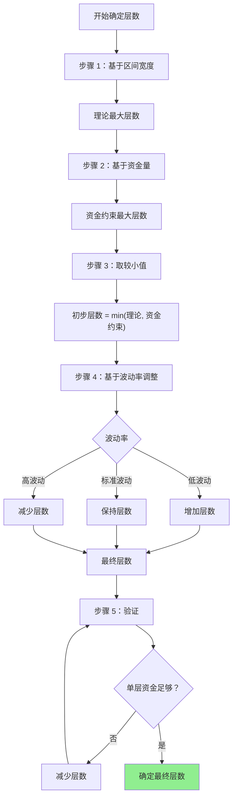

# 第 5 章：网格层数的确定

## 本章导航

- [返回索引](arithmetic_grid_tutorial_index.md)
- [上一章：网格间距的计算](arithmetic_grid_tutorial_04.md)
- [下一章：实战案例分析](arithmetic_grid_tutorial_06.md)

## 5.1 网格层数的重要性

网格层数决定了：

- **资金分布密度**：层数多→资金分散，层数少→资金集中
- **交易机会数量**：层数多→交易频繁，层数少→交易机会少
- **风险分散程度**：层数多→风险分散，层数少→风险集中
- **资金利用率**：需要平衡层数和单层资金量

## 5.2 资金量与层数的关系

### 5.2.1 基本计算公式

在等差网格中，如果每层投入相同的资金，总资金需求为：

```
总资金 = 层数 × 单层资金

单层资金 = 总资金 / 层数
```

**约束条件**：

- 单层资金必须满足最小订单金额要求
- 单层资金应该足够覆盖该层的交易成本
- 需要考虑备用资金应对价格波动

### 5.2.2 最小订单金额约束

**约束公式**：

```
单层资金 = 总资金 / 层数 ≥ 最小订单金额

因此：
层数 ≤ 总资金 / 最小订单金额
```

**实际考虑**：

为了安全起见，建议：

```
层数 ≤ 总资金 / (最小订单金额 × 1.5)
```

这样可以确保即使价格波动导致资金分配不均，也不会违反最小订单限制。

### 5.2.3 计算示例

**示例：ETH-USDT 网格**

```text
总资金：10000 USDT
最小订单金额：10 USDT
当前价格：2850 USDT
网格间距：54 USDT

理论最大层数：
层数 ≤ 10000 / (10 × 1.5) = 666 层（不现实）

考虑到价格区间：
假设区间宽度：280 USDT（约 10%）
可用层数：280 / 54 ≈ 5 层

实际可行层数：
层数 = 5 层

每层资金：
单层资金 = 10000 / 5 = 2000 USDT

验证：
- 单层资金 2000 USDT >> 最小订单 10 USDT ✓
- 单层资金充足，可以覆盖交易成本 ✓
```

## 5.3 波动率与层数的匹配

### 5.3.1 波动率对层数的影响

**高波动率市场**：

- 价格变化幅度大
- 可以用较少的层数覆盖更大的价格范围
- 但每层风险也更大

**低波动率市场**：

- 价格变化幅度小
- 需要更多的层数来捕捉小幅波动
- 但每层风险较小

### 5.3.2 基于区间的层数计算

**基本公式**：

```
层数 = (价格区间上限 - 价格区间下限) / 网格间距 + 1
```

**实际应用**：

```text
区间下限：2700 USDT
区间上限：2980 USDT
网格间距：54 USDT

层数 = (2980 - 2700) / 54 + 1
    = 280 / 54 + 1
    ≈ 5.19 + 1
    ≈ 6 层

层级分布：
第 1 层：2700 USDT
第 2 层：2754 USDT
第 3 层：2808 USDT
第 4 层：2862 USDT
第 5 层：2916 USDT
第 6 层：2970 USDT
```

### 5.3.3 ATR 与层数的关系

**参考公式**：

```
区间宽度 = (上限 - 下限)
ATR 倍数 = 区间宽度 / ATR
建议层数 = ATR 倍数 × 层数系数

层数系数：
- 密集网格：3-5 层/ATR
- 标准网格：2-3 层/ATR
- 宽松网格：1-2 层/ATR
```

**示例**：

```text
ATR = 45 USDT
区间宽度 = 280 USDT
ATR 倍数 = 280 / 45 ≈ 6.2

选择标准网格（2.5 层/ATR）：
建议层数 = 6.2 × 2.5 ≈ 15 层

但考虑到资金限制和实用性：
最终选择：10-12 层
```

## 5.4 最优层数的理论模型

### 5.4.1 收益最大化模型

**目标**：最大化网格交易的总收益

**影响因素**：

1. **交易频率**：层数多→交易频率高
2. **单次盈利**：由网格间距决定
3. **交易成本**：手续费随交易次数增加
4. **资金利用**：层数多→单层资金少

**简化模型**：

```
总收益 = 交易次数 × 单次盈利 - 交易成本

单次盈利 ≈ 网格间距 × 单层数量 × (1 - 手续费率 × 2)
交易次数 ≈ 价格波动次数 × 层数活跃度

最优层数平衡：
- 足够的层数以捕捉波动
- 单层资金足够大以保证盈利
- 总交易成本不超过总收益
```

### 5.4.2 风险分散模型

**目标**：在风险可控的前提下最大化收益

**风险因素**：

1. **价格突破风险**：层数越多，分散程度越高
2. **单层损失风险**：单层资金越大，损失越大
3. **流动性风险**：层数过多可能导致资金分散

**建议**：

```
层数应该足够多以实现风险分散
但不应过多导致单层资金过小

推荐范围：
- 最小层数：5 层（保证基本分散）
- 标准层数：10-20 层
- 最大层数：根据资金和最小订单限制确定
```

### 5.4.3 资金利用率模型

**目标**：最大化资金利用效率

**考虑因素**：

1. **总资金量**
2. **单层最小资金要求**
3. **备付资金需求**

**计算公式**：

```
资金利用率 = (实际使用资金 / 总资金) × 100%

实际使用资金 = 层数 × 单层资金

最优层数应该：
- 最大化资金利用率
- 保持足够的风险分散
- 确保单层资金充足
```

## 5.5 实际层数选择指南

### 5.5.1 基于资金量的快速参考

| 总资金量 | 推荐层数 | 说明 |
|---------|---------|------|
| < 1000 USDT | 5-8 层 | 资金有限，集中使用 |
| 1000-5000 USDT | 8-12 层 | 适中的分散度 |
| 5000-20000 USDT | 12-20 层 | 良好的资金分散 |
| > 20000 USDT | 20-30 层 | 资金充足，充分分散 |

**注意**：这只是参考，还需要结合其他因素调整。

### 5.5.2 基于波动率的参考

| 波动率（ATR%） | 推荐层数范围 | 说明 |
|--------------|------------|------|
| < 1% | 15-25 层 | 波动小，需要更多层捕捉机会 |
| 1%-2% | 10-20 层 | 标准波动，标准层数 |
| 2%-4% | 8-15 层 | 波动较大，层数可适当减少 |
| > 4% | 5-10 层 | 高波动，层数过多可能分散资金 |

### 5.5.3 综合决策流程



## 5.6 层数对策略的影响

### 5.6.1 层数过多的影响

**优点**：

- 风险分散程度高
- 交易机会更多
- 资金利用率可能更高

**缺点**：

- 单层资金可能过小
- 交易成本增加
- 管理复杂度提高
- 可能出现过度交易

### 5.6.2 层数过少的影响

**优点**：

- 单层资金充足
- 交易成本低
- 管理简单

**缺点**：

- 风险分散不足
- 交易机会少
- 资金利用率低
- 可能错失市场机会

### 5.6.3 平衡点的选择

最佳的层数应该平衡：

- **资金充足性**：单层资金足够大
- **风险分散性**：有足够的层数分散风险
- **交易频率**：不会过度交易，也不会交易不足
- **管理便利性**：不会过于复杂

## 5.7 动态调整层数

### 5.7.1 何时需要调整

**增加层数的情况**：

1. 资金量增加
2. 市场波动率降低
3. 价格区间扩大
4. 最小订单金额降低

**减少层数的情况**：

1. 资金量减少
2. 市场波动率增加
3. 价格区间缩小
4. 出现资金不足的情况

### 5.7.2 调整方法

**渐进调整**：

- 不要一次性大幅调整层数
- 每次调整 2-4 层
- 观察调整效果后再决定下一步

**重新分配资金**：

在调整层数时，需要重新分配每层资金，确保：

- 所有层级资金充足
- 资金分配合理
- 符合风险控制要求

## 5.8 实战案例

### 5.8.1 案例一：小资金网格

```text
交易对：SOL-USDT
总资金：2000 USDT
当前价格：100 USDT
网格区间：95-105 USDT（宽度 10 USDT，10%）
网格间距：2.5 USDT（2.5%）
ATR = 2.5 USDT
最小订单：5 USDT

步骤 1：基于区间
理论层数 = (105 - 95) / 2.5 + 1 = 5 层

步骤 2：基于资金
单层资金 = 2000 / 5 = 400 USDT
400 > 5 × 1.5 = 7.5，满足最小订单要求

步骤 3：验证
- 单层资金充足 ✓
- 风险分散合理（5 层） ✓
- 资金利用率高（2000 USDT 全用） ✓

最终确定：5 层网格
```

### 5.8.2 案例二：中等资金网格

```text
交易对：ETH-USDT
总资金：10000 USDT
当前价格：2850 USDT
网格区间：2700-2980 USDT（宽度 280 USDT，约 10%）
网格间距：54 USDT（1.89%）
ATR = 45 USDT
最小订单：10 USDT

步骤 1：基于区间
理论层数 = (2980 - 2700) / 54 + 1 ≈ 6 层

步骤 2：基于资金
资金约束层数 = 10000 / (10 × 1.5) ≈ 666 层
取 min(6, 666) = 6 层

步骤 3：基于波动率
ATR 倍数 = 280 / 45 ≈ 6.2
标准网格（2.5 层/ATR）：6.2 × 2.5 ≈ 15 层
但受限于实际区间，最多 6 层

步骤 4：验证
单层资金 = 10000 / 6 ≈ 1667 USDT
1667 > 15，满足要求

但考虑到 6 层可能偏少，可以：
- 减小网格间距，增加层数
- 或保持当前设置，增加单层资金

优化后方案：
减小间距至 35 USDT（1.23%）
层数 = 280 / 35 + 1 ≈ 9 层
单层资金 = 10000 / 9 ≈ 1111 USDT
1111 > 15，满足要求

最终确定：9 层网格
```

### 5.8.3 案例三：大资金网格

```text
交易对：BTC-USDT
总资金：50000 USDT
当前价格：50000 USDT
网格区间：48000-52000 USDT（宽度 4000 USDT，8%）
网格间距：400 USDT（0.8%）
ATR = 800 USDT
最小订单：50 USDT

步骤 1：基于区间
理论层数 = (52000 - 48000) / 400 + 1 = 11 层

步骤 2：基于资金
资金约束层数 = 50000 / (50 × 1.5) ≈ 666 层
取 min(11, 666) = 11 层

步骤 3：基于波动率
ATR 倍数 = 4000 / 800 = 5
标准网格（2.5 层/ATR）：5 × 2.5 = 12.5 层
与实际层数 11 接近，合理

步骤 4：验证
单层资金 = 50000 / 11 ≈ 4545 USDT
4545 > 75，满足要求

步骤 5：优化
考虑到 11 层可能可以增加以更好分散风险：
调整间距至 350 USDT
层数 = 4000 / 350 + 1 ≈ 12 层
单层资金 = 50000 / 12 ≈ 4167 USDT
4167 > 75，满足要求

最终确定：12 层网格
```

## 5.9 本章小结

确定网格层数需要综合考虑多个因素：

**关键因素**：

1. **资金量**：决定了可用层数的上限
2. **价格区间宽度**：决定了理论最大层数
3. **网格间距**：与区间宽度共同决定层数
4. **市场波动率**：影响层数的合理性
5. **最小订单限制**：约束了单层资金的下限

**计算方法**：

1. 基于区间宽度计算理论最大层数
2. 基于资金量计算资金约束的层数
3. 取两者的较小值作为初步层数
4. 根据波动率进行调整
5. 验证单层资金是否充足

**最佳实践**：

- 层数不应该过少（< 5 层），也不应该过多（根据实际情况）
- 标准网格通常使用 10-20 层
- 需要平衡风险分散和资金充足性
- 定期重新评估和调整层数

下一章我们将通过实战案例来综合运用前面学到的所有方法，看看如何在实际交易中应用这些理论。

准备好了吗？让我们继续学习 [第 6 章：实战案例分析](arithmetic_grid_tutorial_06.md)，通过真实案例来巩固前面学到的知识。

---

[返回索引](arithmetic_grid_tutorial_index.md) | [上一章：网格间距的计算](arithmetic_grid_tutorial_04.md) | [下一章：实战案例分析](arithmetic_grid_tutorial_06.md)
