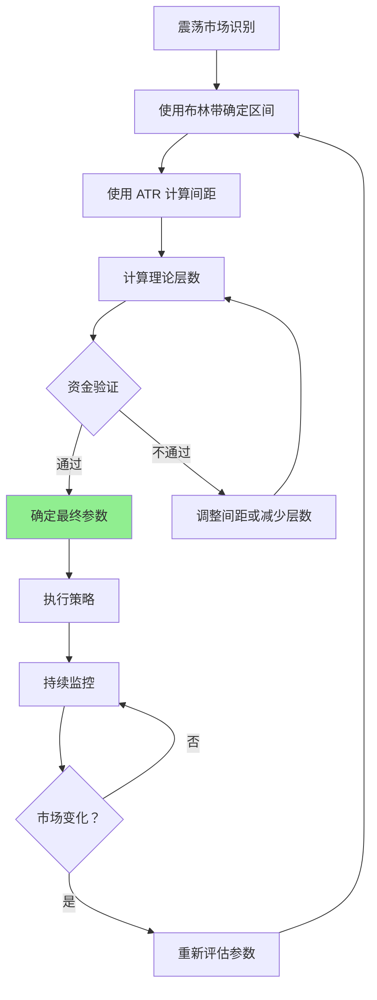

# 第 6 章：实战案例分析

## 本章导航

- [返回索引](arithmetic_grid_tutorial_index.md)
- [上一章：网格层数的确定](arithmetic_grid_tutorial_05.md)
- [下一章：动态调整策略](arithmetic_grid_tutorial_07.md)

## 6.1 案例分析方法

在分析实战案例时，我们将按照以下步骤进行：

1. **市场环境分析**：识别市场特征和趋势
2. **技术指标应用**：运用前面学到的指标确定参数
3. **参数计算**：计算网格区间、间距和层数
4. **策略制定**：制定完整的网格交易策略
5. **风险评估**：识别潜在风险和应对措施
6. **效果评估**：分析策略的预期效果

## 6.2 案例一：高流动性主流币种（ETH-USDT）

### 6.2.1 市场环境分析

**基础信息**：

- **交易对**：ETH-USDT
- **分析时间**：2024 年 1 月
- **市场状态**：震荡市场，无明显趋势

**K 线特征**：

- 价格在 2800-3100 USDT 区间震荡
- 日波动率约 2%-3%
- 成交量稳定，流动性充足
- 无明显突破信号

### 6.2.2 技术指标分析

**布林带（20 期）**：

```
中轨：2950 USDT
上轨：3120 USDT
下轨：2780 USDT
带宽：(3120 - 2780) / 2950 = 11.5%（略宽，但仍可用）
```

**ATR 分析（20 期）**：

```
ATR = 48 USDT
ATR% = 48 / 2950 = 1.63%
```

**成交量分析**：

- VWAP：2930 USDT
- 主要成交量集中在 2850-3050 USDT
- 无明显异常成交量

**RSI 和 MACD**：

- RSI：45-55 之间波动，处于中性区域
- MACD：在零轴附近波动，无明显趋势

### 6.2.3 参数确定

**步骤 1：确定价格区间**

综合各方法：

- 布林带上轨：3120 USDT
- 历史阻力位：3100 USDT（整数关口）
- 历史支撑位：2800 USDT

**最终设定**：

```
网格上限：3090 USDT（略低于整数阻力位 3100）
网格下限：2810 USDT（略高于历史支撑位 2800）
区间宽度：280 USDT（约 9.5%）
```

**步骤 2：计算网格间距**

基于 ATR：

```
ATR = 48 USDT
选择倍数：1.0（标准网格）
初步间距 = 48 × 1.0 = 48 USDT
间距百分比 = 48 / 2950 = 1.63%
```

手续费验证：

```
手续费率：0.2%（Maker）
最小间距 = 0.2% × 3 × 2950 = 17.7 USDT
48 > 17.7，通过验证
```

**最终确定**：

```
网格间距：48 USDT（约 1.6%）
```

**步骤 3：确定网格层数**

```
理论层数 = (3090 - 2810) / 48 + 1 ≈ 6.8 ≈ 7 层
```

验证资金假设（假设总资金 15000 USDT）：

```
单层资金 = 15000 / 7 ≈ 2143 USDT
最小订单要求：10 USDT
2143 > 15，满足要求
```

**最终确定**：

```
网格层数：7 层
```

### 6.2.4 完整策略配置

**网格参数总结**：

| 参数 | 数值 |
|------|------|
| 交易对 | ETH-USDT |
| 网格上限 | 3090 USDT |
| 网格下限 | 2810 USDT |
| 网格间距 | 48 USDT |
| 网格层数 | 7 层 |
| 总资金 | 15000 USDT |
| 单层资金 | 约 2143 USDT |

**层级分布**：

```
第 7 层：3090 USDT（上限）
第 6 层：3042 USDT
第 5 层：2994 USDT
第 4 层：2946 USDT（接近当前价格）
第 3 层：2898 USDT
第 2 层：2850 USDT
第 1 层：2810 USDT（下限）
```

### 6.2.5 风险评估

**潜在风险**：

1. **突破风险**：价格突破 3100 或跌破 2800
   - **应对**：设置预警，接近边界时考虑调整或暂停

2. **波动率变化**：市场波动突然增大
   - **应对**：监控 ATR，及时调整间距

3. **流动性风险**：低（ETH 流动性充足）
   - **应对**：无需特别处理

**预期效果**：

在理想的震荡市场中：
- 月交易次数：预计 15-25 次
- 单次盈利（扣除手续费）：约 0.8%（48 USDT / 2946 USDT × 99.8%）
- 月收益率：预计 12%-20%（假设平均 20 次交易）

## 6.3 案例二：中等波动币种（SOL-USDT）

### 6.3.1 市场环境分析

**基础信息**：

- **交易对**：SOL-USDT
- **分析时间**：2024 年 1 月
- **市场状态**：温和震荡，偶有小幅波动

**K 线特征**：

- 价格在 90-110 USDT 区间波动
- 日波动率约 3%-4%
- 成交量较稳定
- 支撑位在 90 USDT，阻力位在 110 USDT

### 6.3.2 技术指标分析

**布林带（20 期）**：

```
中轨：100 USDT
上轨：108 USDT
下轨：92 USDT
带宽：(108 - 92) / 100 = 16%（波动较大）
```

**ATR 分析（20 期）**：

```
ATR = 3.5 USDT
ATR% = 3.5 / 100 = 3.5%（波动率较高）
```

**成交量分析**：

- VWAP：99 USDT
- 成交量在 90-110 USDT 区间分布较均匀
- 95 和 105 有轻微成交量集中

**RSI 和 MACD**：

- RSI：40-60 之间
- MACD：震荡模式

### 6.3.3 参数确定

**步骤 1：确定价格区间**

考虑到布林带和支撑阻力：

```
网格上限：107 USDT（略低于阻力位 110）
网格下限：93 USDT（略高于支撑位 90）
区间宽度：14 USDT（14%）
```

**步骤 2：计算网格间距**

基于 ATR：

```
ATR = 3.5 USDT
选择倍数：1.2（考虑到波动率较高）
初步间距 = 3.5 × 1.2 = 4.2 USDT
间距百分比 = 4.2 / 100 = 4.2%（偏高）
```

调整策略：

由于 ATR% 较高，建议使用更小的倍数：

```
调整后间距 = 3.5 × 0.8 = 2.8 USDT ≈ 3 USDT
间距百分比 = 3 / 100 = 3%（合理范围上限）
```

手续费验证：

```
最小间距 = 0.2% × 3 × 100 = 0.6 USDT
3 > 0.6，通过验证
```

**最终确定**：

```
网格间距：3 USDT（3%）
```

**步骤 3：确定网格层数**

```
理论层数 = (107 - 93) / 3 + 1 ≈ 5.7 ≈ 6 层
```

验证资金（假设总资金 6000 USDT）：

```
单层资金 = 6000 / 6 = 1000 USDT
最小订单要求：5 USDT
1000 > 7.5，满足要求
```

**最终确定**：

```
网格层数：6 层
```

### 6.3.4 完整策略配置

**网格参数总结**：

| 参数 | 数值 |
|------|------|
| 交易对 | SOL-USDT |
| 网格上限 | 107 USDT |
| 网格下限 | 93 USDT |
| 网格间距 | 3 USDT |
| 网格层数 | 6 层 |
| 总资金 | 6000 USDT |
| 单层资金 | 1000 USDT |

### 6.3.5 风险评估

**特殊考虑**：

SOL 的波动率较高（ATR% = 3.5%），需要注意：

1. **间距调整**：已通过降低 ATR 倍数来适应
2. **监控要求**：需要更频繁地监控市场变化
3. **区间调整**：可能需要更频繁地调整区间

**预期效果**：

- 月交易次数：预计 20-30 次（波动率高）
- 单次盈利：约 2.4%（扣除手续费）
- 月收益率：预计 20%-35%（但波动率也更高）

## 6.4 案例三：震荡市场典型场景

### 6.4.1 市场环境分析

**特征**：

- 价格在明确区间内反复波动
- 无明显趋势方向
- 波动频率适中
- 典型的网格交易理想环境

### 6.4.2 通用策略模板

**参数设置原则**：



### 6.4.3 关键成功因素

1. **区间选择准确**：确保价格在区间内波动
2. **间距合理**：既要保证盈利，又要确保交易频率
3. **资金充足**：每层有足够的资金
4. **持续监控**：及时应对市场变化

## 6.5 错误案例与规避

### 6.5.1 错误案例一：区间设定过大

**问题描述**：

```
交易对：BTC-USDT
当前价格：50000 USDT
错误设定：
- 网格上限：60000 USDT
- 网格下限：40000 USDT
- 区间宽度：20000 USDT（40%）

问题：
- 区间过大，价格可能永远不会触及边界
- 网格间距即使设置合理，层数也会过多
- 资金分散，单层盈利有限
```

**正确做法**：

应该使用技术指标确定更合理的区间：

- 分析近期波动范围
- 使用布林带或其他指标
- 设定 8%-15% 的合理区间

### 6.5.2 错误案例二：间距过小

**问题描述**：

```
交易对：ETH-USDT
当前价格：2850 USDT
错误设定：
- 网格间距：10 USDT（0.35%）
- 手续费率：0.2%

问题：
- 单次盈利 10 USDT
- 手续费约 5.7 USDT
- 净盈利仅 4.3 USDT
- 盈利空间太小，容易被滑点侵蚀
```

**正确做法**：

应该确保：

```
最小间距 ≥ 手续费率 × 5 × 价格
          ≥ 0.2% × 5 × 2850
          ≥ 28.5 USDT
```

### 6.5.3 错误案例三：忽略市场趋势

**问题描述**：

在明显的上升趋势中使用网格交易：

```
交易对：某强势币种
市场状态：持续上涨，每日涨幅 3%-5%
错误做法：设置网格交易

问题：
- 价格快速突破网格上限
- 错过了上涨趋势的收益
- 网格策略失效
```

**正确做法**：

- 识别市场趋势
- 在趋势市场中，网格交易不是最佳选择
- 等待震荡市场或趋势结束

### 6.5.4 错误案例四：层数过多导致资金分散

**问题描述**：

```
总资金：5000 USDT
网格层数：50 层
单层资金：100 USDT

问题：
- 单层资金过小
- 交易成本占比过高
- 管理复杂
- 风险分散过度，收益有限
```

**正确做法**：

应该根据资金量和最小订单要求确定合理的层数：

```
最小单层资金 = 最小订单 × 1.5 = 15 USDT
最大层数 = 5000 / 15 ≈ 333 层（理论值）
但考虑到实际区间和合理性：
实际层数应该在 8-15 层之间
```

### 6.5.5 常见错误总结

| 错误类型 | 问题 | 正确做法 |
|---------|------|---------|
| 区间过大 | 资金利用率低，可能无效 | 使用技术指标设定 8%-15% 区间 |
| 间距过小 | 盈利无法覆盖成本 | 确保间距 ≥ 手续费率 × 5 × 价格 |
| 忽略趋势 | 错失趋势收益，策略失效 | 仅在震荡市场使用网格 |
| 层数过多 | 资金分散，管理困难 | 根据资金和最小订单确定合理层数 |
| 不监控调整 | 参数失效不及时调整 | 定期评估市场和参数 |

## 6.6 本章小结

通过实战案例分析，我们看到了如何综合运用前面学到的知识：

**关键步骤**：

1. **全面分析市场环境**：了解市场特征和趋势
2. **综合使用技术指标**：布林带、ATR、成交量等
3. **科学计算参数**：区间、间距、层数
4. **识别和规避错误**：避免常见陷阱

**成功要素**：

- 准确的市场分析是基础
- 科学的参数计算是关键
- 持续监控和调整是保障
- 规避常见错误是前提

下一章我们将学习如何动态调整策略，应对市场环境的变化。

准备好了吗？让我们继续学习 [第 7 章：动态调整策略](arithmetic_grid_tutorial_07.md)，了解如何在市场变化时调整网格参数。

---

[返回索引](arithmetic_grid_tutorial_index.md) | [上一章：网格层数的确定](arithmetic_grid_tutorial_05.md) | [下一章：动态调整策略](arithmetic_grid_tutorial_07.md)
