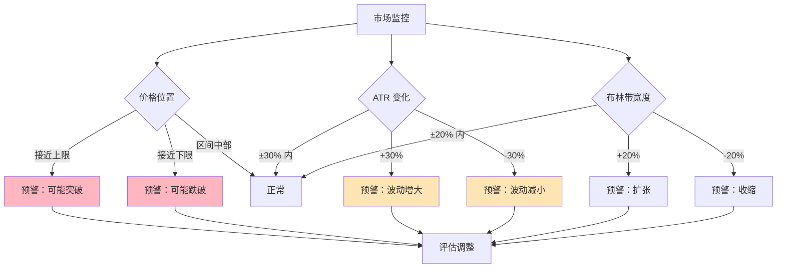
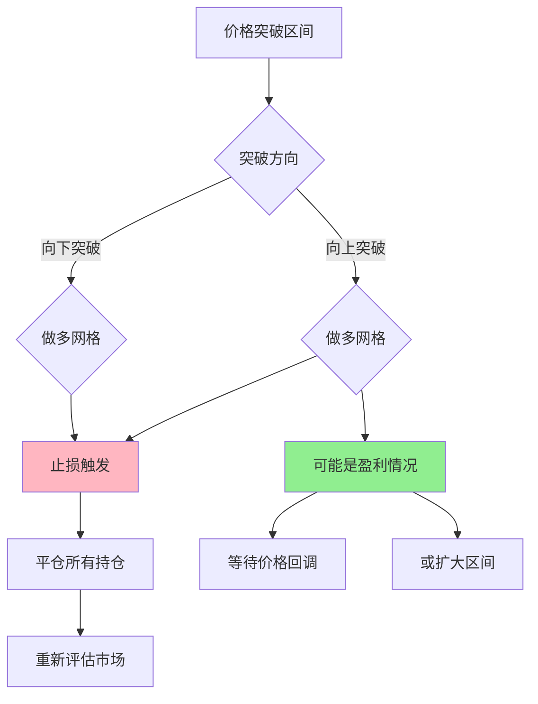
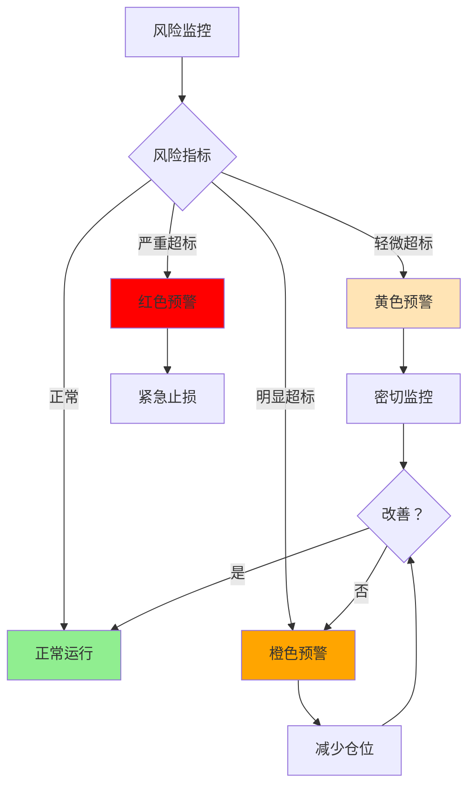
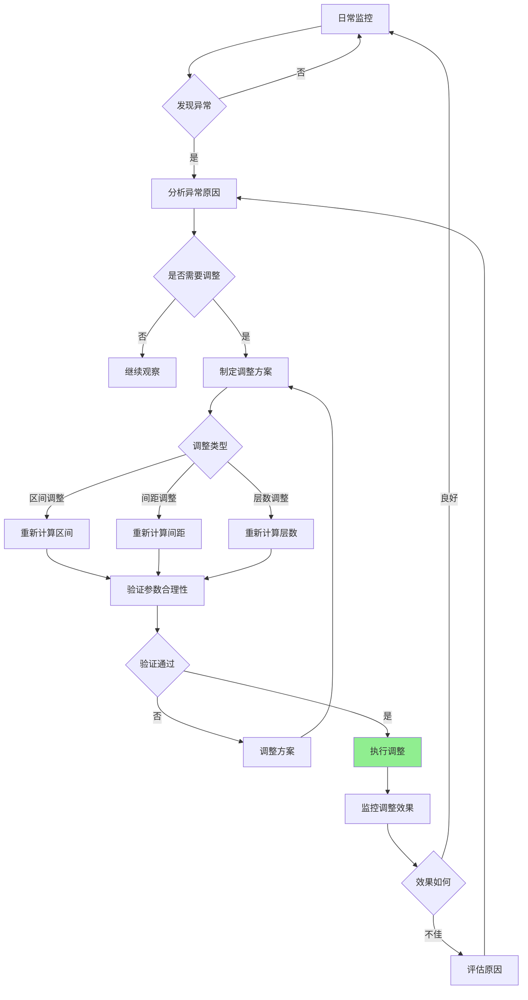

# 第 7 章：动态调整策略

## 本章导航

- [返回索引](arithmetic_grid_tutorial_index.md)
- [上一章：实战案例分析](arithmetic_grid_tutorial_06.md)
- [下一章：参考资源与工具](arithmetic_grid_tutorial_08.md)

## 7.1 动态调整的必要性

网格交易策略不是设定一次就永远有效的。市场环境在不断变化，网格参数也需要相应调整。

**需要调整的原因**：

1. **市场波动率变化**：ATR 可能上升或下降
2. **价格区间变化**：支撑阻力位可能转移
3. **趋势出现**：震荡市场可能转为趋势市场
4. **流动性变化**：市场深度可能变化
5. **资金状况变化**：可用资金可能增减

## 7.2 市场环境变化的识别

### 7.2.1 监控指标

**日常监控清单**：

| 指标 | 监控频率 | 阈值 |
|------|---------|------|
| ATR 变化 | 每日 | ±30% |
| 价格位置 | 每日 | 接近区间边界 |
| 布林带宽度 | 每日 | 收缩/扩张 20% |
| 成交量变化 | 每日 | ±50% |
| RSI | 每日 | 超买/超卖区域 |
| MACD | 每日 | 趋势信号 |

### 7.2.2 预警信号

**需要立即关注的信号**：



## 7.3 区间调整策略

### 7.3.1 何时调整区间

**调整触发条件**：

1. **价格持续接近边界**：连续 3-5 天接近但不突破
2. **价格突破边界**：价格明显突破原区间
3. **新支撑阻力形成**：出现新的明显支撑或阻力位
4. **布林带显著变化**：布林带位置和宽度明显改变
5. **运行时间过长**：区间运行超过预设周期（如 30 天）

### 7.3.2 调整方法

**渐进式调整**：

不要一次性大幅调整，建议：

```
新上限 = 原上限 × (1 + 调整幅度)
新下限 = 原下限 × (1 - 调整幅度)

调整幅度建议：
- 每次调整不超过 3%-5%
- 观察调整后效果再决定下一步
```

**重新计算法**：

当市场环境发生重大变化时：

1. 重新分析技术指标
2. 按照第 3 章的方法重新确定区间
3. 逐步迁移到新区间

### 7.3.3 调整示例

**示例：价格接近上限**

```text
原配置：
网格上限：3100 USDT
网格下限：2800 USDT
当前价格：3070 USDT（接近上限）

分析：
- 价格连续 3 天在 3060-3080 之间
- 尚未突破，但风险较高
- 最近高点是 3120 USDT

调整方案：
方案一：扩大上限
  新上限：3120 USDT（预留安全边际）
  上限调整：+20 USDT（+0.65%）

方案二：暂停新增订单
  保持原区间，但不在上限附近新增买单
  等待价格回调或突破确认

推荐：方案二（更保守）
如果价格真的突破，再考虑扩大区间
```

## 7.4 间距调整策略

### 7.4.1 何时调整间距

**调整触发条件**：

1. **ATR 显著变化**：±30% 以上
2. **交易频率异常**：过高或过低
3. **盈利不足**：单次盈利无法覆盖成本
4. **价格跳过层级**：价格经常跳过网格层级

### 7.4.2 调整方法

**基于 ATR 调整**：

```
新间距 = 新 ATR × 原倍数

如果 ATR 上升 30%：
新间距 = 原间距 × 1.3

如果 ATR 下降 30%：
新间距 = 原间距 × 0.7
```

**基于交易频率调整**：

```text
交易频率过高（每日 > 5 次）：
  加大间距 20%-30%
  
交易频率过低（每周 < 1 次）：
  减小间距 20%-30%
```

### 7.4.3 调整后的验证

间距调整后需要验证：

1. **手续费验证**：新间距仍需大于最小间距
2. **流动性验证**：新间距下的流动性是否充足
3. **层数调整**：间距变化可能需要调整层数

## 7.5 层数调整策略

### 7.5.1 何时调整层数

**增加层数的情况**：

1. 价格区间扩大
2. 网格间距减小（保持区间不变）
3. 可用资金增加

**减少层数的情况**：

1. 价格区间缩小
2. 网格间距增大（保持区间不变）
3. 可用资金减少
4. 出现资金不足的预警

### 7.5.2 调整方法

**渐进调整**：

```
每次调整 1-2 层
重新计算单层资金
确保所有层级资金充足
```

**资金重新分配**：

调整层数时，需要重新分配资金：

```
新单层资金 = 总资金 / 新层数

验证：
新单层资金 ≥ 最小订单金额 × 1.5
```

## 7.6 止损与止盈设置

### 7.6.1 网格策略的止损

**区间突破止损**：

当价格突破网格区间时：



**亏损止损**：

设定整体亏损阈值：

```
止损比例：总资金的 -10% 或 -15%
触发条件：累计亏损达到阈值
执行动作：停止策略，平仓，重新评估
```

### 7.6.2 网格策略的止盈

**目标收益止盈**：

```
止盈目标：总资金的 +20% 或 +30%
触发条件：累计盈利达到目标
执行动作：
  - 方案一：完全止盈，重新开始
  - 方案二：部分止盈（如 50%），继续运行
```

**时间止盈**：

```
运行周期：30 天或 60 天
到期动作：
  - 评估策略效果
  - 决定是否继续或调整
```

### 7.6.3 风险控制框架

**风险控制原则**：

1. **设置止损**：必须设定最大亏损额度
2. **设置止盈**：达到目标及时止盈
3. **分散投资**：不要将所有资金投入单一网格
4. **留有余地**：保留 20%-30% 的备用资金

## 7.7 风险管理与资金分配

### 7.7.1 资金分配原则

**总资金分配建议**：

```
网格交易资金：60%-70%
备用资金：20%-30%
应急资金：10%
```

**多网格分配**：

如果有多个网格同时运行：

```
单个网格资金 ≤ 总资金的 30%
建议同时运行 2-3 个网格
分散在不同交易对和市场
```

### 7.7.2 风险管理指标

**关键风险指标**：

| 指标 | 计算 | 阈值 |
|------|------|------|
| 最大回撤 | (峰值 - 当前值) / 峰值 | < 20% |
| 资金利用率 | 已用资金 / 总资金 | 60%-80% |
| 单个网格风险 | 单网格资金 / 总资金 | < 30% |
| 持仓时间 | 平均持仓天数 | 监控异常 |

### 7.7.3 风险预警机制

**预警级别**：



## 7.8 调整决策流程

### 7.8.1 完整决策流程



### 7.8.2 调整记录

**建议记录的信息**：

1. **调整时间**：何时进行的调整
2. **调整原因**：为什么需要调整
3. **调整内容**：具体调整了哪些参数
4. **调整前后对比**：参数的变化
5. **调整效果**：调整后的市场表现

**记录模板**：

```text
调整记录
========
时间：2024-01-15
原因：价格接近区间上限，连续 3 天在高位

调整前：
- 区间：2800-3100
- 间距：48 USDT
- 层数：7 层

调整后：
- 区间：2800-3120
- 间距：48 USDT
- 层数：7 层（新增边界层）

效果评估：
- 调整后 5 天，价格稳定在新区间内
- 未触发止损
- 调整成功
```

## 7.9 特殊情况处理

### 7.9.1 价格突破区间

**应对策略**：

1. **立即评估**：判断是假突破还是真突破
2. **假突破**：等待价格回到区间内
3. **真突破**：
   - 如果盈利：止盈离场
   - 如果亏损：执行止损
   - 等待市场稳定后重新评估

### 7.9.2 市场极端波动

**应对策略**：

1. **暂停交易**：暂停新增订单
2. **评估风险**：计算潜在损失
3. **调整参数**：等待市场稳定后调整
4. **考虑止损**：如果风险过大，考虑止损

### 7.9.3 流动性突然枯竭

**应对策略**：

1. **减少订单量**：降低单次订单金额
2. **增加间距**：适应可能增大的滑点
3. **考虑退出**：如果流动性长期不足，考虑退出该交易对

## 7.10 本章小结

动态调整是网格交易策略成功的关键：

**调整原则**：

1. **持续监控**：定期检查市场状态和参数有效性
2. **及时响应**：发现异常及时分析和调整
3. **渐进调整**：避免大幅度的参数变化
4. **记录学习**：记录调整过程，总结经验

**调整重点**：

1. **区间调整**：应对价格突破和市场变化
2. **间距调整**：适应波动率变化
3. **层数调整**：优化资金分配
4. **风险控制**：设置止损止盈，控制风险

**最佳实践**：

- 建立日常监控清单
- 设定明确的调整触发条件
- 制定调整决策流程
- 记录调整历史和效果
- 始终保持风险意识

下一章我们将提供一些实用的参考资源和工具，帮助您更好地应用这些知识。

准备好了吗？让我们继续学习 [第 8 章：参考资源与工具](arithmetic_grid_tutorial_08.md)，了解可用的工具和资源。

---

[返回索引](arithmetic_grid_tutorial_index.md) | [上一章：实战案例分析](arithmetic_grid_tutorial_06.md) | [下一章：参考资源与工具](arithmetic_grid_tutorial_08.md)
