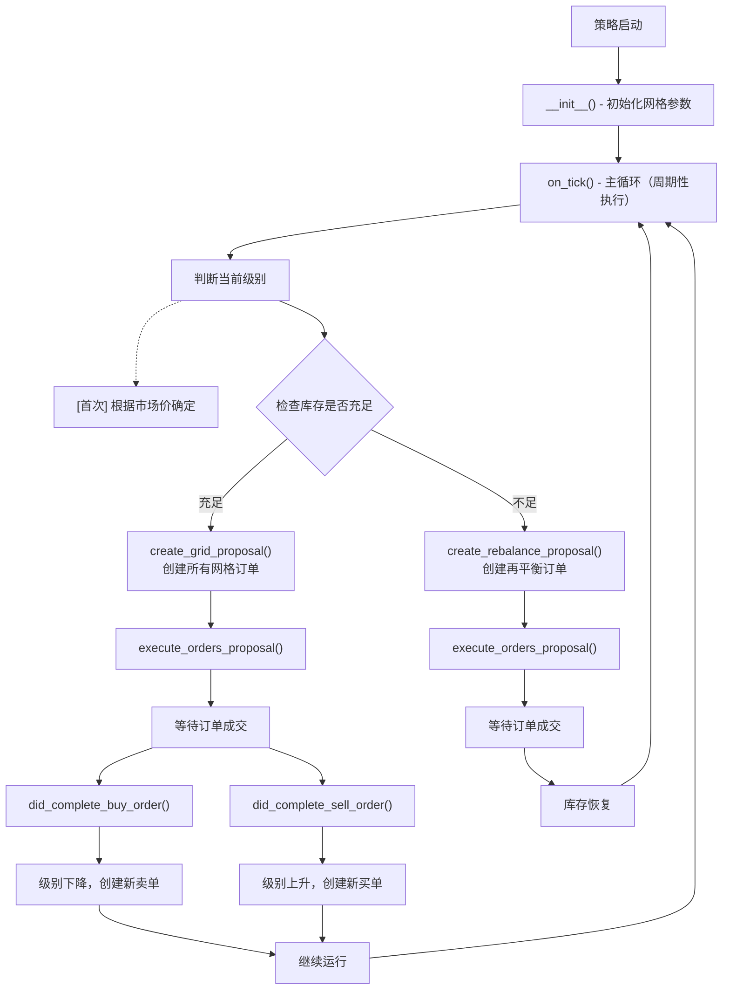

# 第 6 章：代码实现深度解析

## 本章导航

- [返回索引](fixed_grid_tutorial_index.md)
- [上一章：使用示例](fixed_grid_tutorial_05.md)
- [下一章：高级功能与扩展](fixed_grid_tutorial_07.md)

## 6.1 代码结构概览

### 6.1.1 类继承关系

```python
ScriptStrategyBase (基类)
    ↓
FixedGrid (策略类)
```

Fixed Grid 策略继承自 `ScriptStrategyBase`，这是 Hummingbot 脚本策略的基础类，提供了：

- 订单管理方法（buy、sell、cancel）
- 事件监听机制（订单成交、取消等）
- 市场数据访问接口
- 状态展示功能

### 6.1.2 核心方法列表

| 方法名 | 调用时机 | 作用 |
|--------|---------|------|
| `__init__` | 策略初始化 | 计算网格参数 |
| `on_tick` | 每个时钟周期 | 主要业务逻辑 |
| `create_grid_proposal` | 需要创建网格订单时 | 生成网格订单提案 |
| `create_rebalance_proposal` | 需要再平衡时 | 生成再平衡订单提案 |
| `did_fill_order` | 订单部分成交时 | 记录日志 |
| `did_complete_buy_order` | 买单完全成交时 | 调整级别，创建卖单 |
| `did_complete_sell_order` | 卖单完全成交时 | 调整级别，创建买单 |
| `execute_orders_proposal` | 执行订单提案时 | 批量下单 |
| `format_status` | 用户查看状态时 | 生成状态报告 |

### 6.1.3 执行流程图



## 6.2 初始化阶段：`__init__` 方法

### 6.2.1 方法签名与入口

```python 47:48:scripts/community/fixed_grid.py
def __init__(self, connectors: Dict[str, ConnectorBase]):
    super().__init__(connectors)
```

**参数**：

- `connectors`：交易所连接器字典，键为交易所名称，值为连接器对象

### 6.2.2 核心计算：网格价格层级

**步骤 1：计算最小间距**

```python 50:50:scripts/community/fixed_grid.py
self.minimum_spread = (self.grid_price_ceiling - self.grid_price_floor) / (1 + 2 * sum([pow(self.spread_scale_factor, n) for n in range(1, int(self.n_levels / 2))]))
```

**算法解析**：

这是一个等比数列求和公式的应用。当使用缩放因子时：

```text
设：
  - 缩放因子 = s
  - 层级数的一半 = m = n_levels / 2
  - 最小间距 = d

价格区间 = d × s^(m-1) + ... + d × s² + d × s¹ + d × s⁰ + d × s¹ + d × s² + ... + d × s^(m-1)
         = d × (1 + 2 × Σ(s^n))  其中 n 从 1 到 m-1

因此：
d = (上限 - 下限) / (1 + 2 × Σ(s^n))
```

**示例**（8 层网格，缩放因子 1.2）：

```text
m = 8 / 2 = 4

Σ(1.2^n) = 1.2¹ + 1.2² + 1.2³
         = 1.2 + 1.44 + 1.728
         = 4.368

分母 = 1 + 2 × 4.368 = 9.736

如果区间 0.30-0.33：
d = (0.33 - 0.30) / 9.736 ≈ 0.00308
```

**步骤 2：构建下半部分价格层级**

```python 51:54:scripts/community/fixed_grid.py
self.price_levels.append(self.grid_price_floor)
for i in range(2, int(self.n_levels / 2) + 1):
    price = self.grid_price_floor + self.minimum_spread * sum([pow(self.spread_scale_factor, int(self.n_levels / 2) - n) for n in range(1, i)])
    self.price_levels.append(price)
```

**算法解析**：

从网格下限开始，逐层累加间距（间距按缩放因子递减）：

```text
第 1 层（下限）：floor
第 2 层：floor + d × s³
第 3 层：floor + d × (s³ + s²)
第 4 层：floor + d × (s³ + s² + s¹)
```

**步骤 3：构建上半部分价格层级**

```python 58:61:scripts/community/fixed_grid.py
for i in range(int(self.n_levels / 2) + 1, self.n_levels + 1):
    price = self.price_levels[int(self.n_levels / 2) - 1] + self.minimum_spread * sum([pow(self.spread_scale_factor, n) for n in range(0, i - int(self.n_levels / 2))])
    self.price_levels.append(price)
    self.order_amount_levels.append(self.order_amount * pow(self.amount_scale_factor, i - int(self.n_levels / 2) - 1))
```

**算法解析**：

从中间层级继续向上，间距按缩放因子递增：

```text
第 5 层：middle + d × s⁰ = middle + d
第 6 层：middle + d × (s⁰ + s¹)
第 7 层：middle + d × (s⁰ + s¹ + s²)
第 8 层：middle + d × (s⁰ + s¹ + s² + s³)
```

### 6.2.3 核心计算：订单数量层级

```python 56:56:scripts/community/fixed_grid.py
self.order_amount_levels.append(self.order_amount * pow(self.amount_scale_factor, int(self.n_levels / 2) - i))
```

```python 61:61:scripts/community/fixed_grid.py
self.order_amount_levels.append(self.order_amount * pow(self.amount_scale_factor, i - int(self.n_levels / 2) - 1))
```

**算法解析**：

如果启用数量缩放（`amount_scale_factor > 1.0`），订单数量从中间向两端递增：

```text
设缩放因子 = a，基础数量 = q

下半部分：
  第 1 层：q × a³（最远离中心，数量最大）
  第 2 层：q × a²
  第 3 层：q × a¹
  第 4 层：q × a⁰ = q（中心）

上半部分：
  第 5 层：q × a⁰ = q
  第 6 层：q × a¹
  第 7 层：q × a²
  第 8 层：q × a³（最远离中心，数量最大）
```

### 6.2.4 核心计算：库存需求

```python 63:67:scripts/community/fixed_grid.py
for i in range(1, self.n_levels + 1):
    self.base_inv_levels.append(sum(self.order_amount_levels[i:self.n_levels]))
    self.quote_inv_levels.append(sum([self.price_levels[n] * self.order_amount_levels[n] for n in range(0, i - 1)]))
for i in range(self.n_levels):
    self.quote_inv_levels_current_price.append(self.quote_inv_levels[i] / self.price_levels[i])
```

**算法解析**：

**base_inv_levels**（基础资产需求）：

```text
第 i 层需要的基础资产 = 第 i+1 层到最高层的卖单总和

例如（8 层，每层 10 个）：
  第 1 层：10+10+10+10+10+10+10 = 70（需要最多）
  第 4 层：10+10+10+10 = 40（中间）
  第 8 层：0（最高层，不需要）
```

**quote_inv_levels**（报价资产需求）：

```text
第 i 层需要的报价资产 = 第 1 层到第 i-1 层的买单价值总和

例如：
  第 1 层：0（最低层，不需要）
  第 4 层：价格1×数量1 + 价格2×数量2 + 价格3×数量3
  第 8 层：所有下方买单的总价值（需要最多）
```

**quote_inv_levels_current_price**（报价资产折算为基础资产）：

```text
将报价资产需求除以当前层级价格，得到等价的基础资产数量

用于库存检查时的统一计量
```

## 6.3 主循环：`on_tick` 方法

### 6.3.1 触发机制

`on_tick` 方法在每个时钟周期（默认 1 秒）被调用一次。

### 6.3.2 时间戳检查

```python 71:71:scripts/community/fixed_grid.py
if self.create_timestamp <= self.current_timestamp:
```

**作用**：

- 控制订单创建频率
- 避免过于频繁地取消和重建订单
- 支持订单刷新时间配置

### 6.3.3 初始级别判断

```python 73:93:scripts/community/fixed_grid.py
if self.current_level == -100:
    price = self.connectors[self.exchange].get_price_by_type(self.trading_pair, self.price_source)
    # Find level closest to market
    min_diff = 1e8
    for i in range(self.n_levels):
        if min(min_diff, abs(self.price_levels[i] - price)) < min_diff:
            min_diff = abs(self.price_levels[i] - price)
            self.current_level = i

    msg = (f"Current price {price}, Initial level {self.current_level + 1}")
    self.log_with_clock(logging.INFO, msg)
    self.notify_hb_app_with_timestamp(msg)

    if price > self.grid_price_ceiling:
        msg = ("WARNING: Current price is above grid ceiling")
        self.log_with_clock(logging.WARNING, msg)
        self.notify_hb_app_with_timestamp(msg)
    elif price < self.grid_price_floor:
        msg = ("WARNING: Current price is below grid floor")
        self.log_with_clock(logging.WARNING, msg)
        self.notify_hb_app_with_timestamp(msg)
```

**算法解析**：

1. **判断是否首次运行**：`current_level == -100` 是初始值
2. **获取当前市场价格**：从交易所获取指定类型的价格
3. **查找最接近的网格层级**：遍历所有层级，计算价格差，找到最小差值对应的层级
4. **记录日志**：输出当前价格和初始级别
5. **边界检查**：如果价格超出网格范围，发出警告

**示例**：

```text
网格层级：
  第 8 层：0.33
  第 7 层：0.3243
  第 6 层：0.3186
  第 5 层：0.3129
  第 4 层：0.3072
  第 3 层：0.3014
  第 2 层：0.2957
  第 1 层：0.30

当前价格：0.31

计算：
  |0.33 - 0.31| = 0.02
  |0.3243 - 0.31| = 0.0143
  |0.3186 - 0.31| = 0.0086
  |0.3129 - 0.31| = 0.0029  ← 最小
  |0.3072 - 0.31| = 0.0028  ← 最小
  ...

选择第 4 层（0.3072），差距 0.0028
```

### 6.3.4 库存检查

```python 96:132:scripts/community/fixed_grid.py
market, trading_pair, base_asset, quote_asset = self.get_market_trading_pair_tuples()[0]
base_balance = float(market.get_balance(base_asset))
quote_balance = float(market.get_balance(quote_asset) / self.price_levels[self.current_level])

if base_balance < self.base_inv_levels[self.current_level]:
    self.inv_correct = False
    msg = (f"WARNING: Insufficient {base_asset} balance for grid bot. Will attempt to rebalance")
    self.log_with_clock(logging.WARNING, msg)
    self.notify_hb_app_with_timestamp(msg)
    if base_balance + quote_balance < self.base_inv_levels[self.current_level] + self.quote_inv_levels_current_price[self.current_level]:
        msg = (f"WARNING: Insufficient {base_asset} and {quote_asset} balance for grid bot. Unable to rebalance."
               f"Please add funds or change grid parameters")
        self.log_with_clock(logging.WARNING, msg)
        self.notify_hb_app_with_timestamp(msg)
        return
    else:
        # Calculate additional base required with 5% tolerance
        base_required = (Decimal(self.base_inv_levels[self.current_level]) - Decimal(base_balance)) * Decimal(1.05)
        self.rebalance_order_buy = True
        self.rebalance_order_amount = Decimal(base_required)
elif quote_balance < self.quote_inv_levels_current_price[self.current_level]:
    self.inv_correct = False
    msg = (f"WARNING: Insufficient {quote_asset} balance for grid bot. Will attempt to rebalance")
    self.log_with_clock(logging.WARNING, msg)
    self.notify_hb_app_with_timestamp(msg)
    if base_balance + quote_balance < self.base_inv_levels[self.current_level] + self.quote_inv_levels_current_price[self.current_level]:
        msg = (f"WARNING: Insufficient {base_asset} and {quote_asset} balance for grid bot. Unable to rebalance."
               f"Please add funds or change grid parameters")
        self.log_with_clock(logging.WARNING, msg)
        self.notify_hb_app_with_timestamp(msg)
        return
    else:
        # Calculate additional quote required with 5% tolerance
        quote_required = (Decimal(self.quote_inv_levels_current_price[self.current_level]) - Decimal(quote_balance)) * Decimal(1.05)
        self.rebalance_order_buy = False
        self.rebalance_order_amount = Decimal(quote_required)
else:
    self.inv_correct = True
```

**检查逻辑**：

1. **获取当前余额**
   - 基础资产余额（如 ENJ）
   - 报价资产余额（如 USDT）折算为基础资产

2. **检查基础资产是否充足**
   - 如果少于需求：标记 `inv_correct = False`
   - 检查总资产是否够再平衡
   - 计算需要买入的数量（加 5% 容差）

3. **检查报价资产是否充足**
   - 如果少于需求：标记 `inv_correct = False`
   - 检查总资产是否够再平衡
   - 计算需要卖出的数量（加 5% 容差）

4. **两者都充足**
   - 标记 `inv_correct = True`
   - 准备创建正常网格订单

### 6.3.5 订单提案创建与执行

```python 134:143:scripts/community/fixed_grid.py
if self.inv_correct is True:
    # Create proposals for Grid
    proposal = self.create_grid_proposal()
else:
    # Create rebalance proposal
    proposal = self.create_rebalance_proposal()

self.cancel_active_orders()
if proposal is not None:
    self.execute_orders_proposal(proposal)
```

**执行流程**：

1. 根据库存状态选择创建网格订单或再平衡订单
2. 取消所有活跃订单（避免冲突）
3. 执行新的订单提案

## 6.4 网格订单创建：`create_grid_proposal` 方法

```python 145:166:scripts/community/fixed_grid.py
def create_grid_proposal(self) -> List[OrderCandidate]:
    buys = []
    sells = []

    # Proposal will be created according to grid price levels
    for i in range(self.current_level):
        price = self.price_levels[i]
        size = self.order_amount_levels[i]
        if size > 0:
            buy_order = OrderCandidate(trading_pair=self.trading_pair, is_maker=True, order_type=OrderType.LIMIT,
                                       order_side=TradeType.BUY, amount=size, price=price)
            buys.append(buy_order)

    for i in range(self.current_level + 1, self.n_levels):
        price = self.price_levels[i]
        size = self.order_amount_levels[i]
        if size > 0:
            sell_order = OrderCandidate(trading_pair=self.trading_pair, is_maker=True, order_type=OrderType.LIMIT,
                                        order_side=TradeType.SELL, amount=size, price=price)
            sells.append(sell_order)

    return buys + sells
```

**算法解析**：

1. **创建买单**
   - 遍历当前级别以下的所有层级（`range(0, current_level)`）
   - 在每个层级创建限价买单
   - 价格和数量从预计算的数组中获取

2. **创建卖单**
   - 遍历当前级别以上的所有层级（`range(current_level + 1, n_levels)`）
   - 在每个层级创建限价卖单
   - 价格和数量从预计算的数组中获取

3. **返回订单列表**
   - 买单 + 卖单
   - 交给执行方法批量下单

**示例**（8 层网格，当前第 4 层）：

```text
买单（第 0-3 层）：
  - 第 0 层：buy 10 @ 0.3000
  - 第 1 层：buy 10 @ 0.3043
  - 第 2 层：buy 10 @ 0.3086
  - 第 3 层：buy 10 @ 0.3129

第 4 层：当前位置，不下单

卖单（第 5-7 层）：
  - 第 5 层：sell 10 @ 0.3171
  - 第 6 层：sell 10 @ 0.3214
  - 第 7 层：sell 10 @ 0.3257
```

## 6.5 再平衡订单创建：`create_rebalance_proposal` 方法

```python 168:206:scripts/community/fixed_grid.py
def create_rebalance_proposal(self):
    buys = []
    sells = []

    # Proposal will be created according to start order spread.
    if self.rebalance_order_buy is True:
        ref_price = self.connectors[self.exchange].get_price_by_type(self.trading_pair, self.price_source)
        price = ref_price * (Decimal("100") - self.rebalance_order_spread) / Decimal("100")
        size = self.rebalance_order_amount

        msg = (f"Placing buy order to rebalance; amount: {size}, price: {price}")
        self.log_with_clock(logging.INFO, msg)
        self.notify_hb_app_with_timestamp(msg)
        if size > 0:
            if self.rebalance_order_type == "limit":
                buy_order = OrderCandidate(trading_pair=self.trading_pair, is_maker=True, order_type=OrderType.LIMIT,
                                           order_side=TradeType.BUY, amount=size, price=price)
            elif self.rebalance_order_type == "market":
                buy_order = OrderCandidate(trading_pair=self.trading_pair, is_maker=True, order_type=OrderType.MARKET,
                                           order_side=TradeType.BUY, amount=size, price=price)
            buys.append(buy_order)

    if self.rebalance_order_buy is False:
        ref_price = self.connectors[self.exchange].get_price_by_type(self.trading_pair, self.price_source)
        price = ref_price * (Decimal("100") + self.rebalance_order_spread) / Decimal("100")
        size = self.rebalance_order_amount
        msg = (f"Placing sell order to rebalance; amount: {size}, price: {price}")
        self.log_with_clock(logging.INFO, msg)
        self.notify_hb_app_with_timestamp(msg)
        if size > 0:
            if self.rebalance_order_type == "limit":
                sell_order = OrderCandidate(trading_pair=self.trading_pair, is_maker=True, order_type=OrderType.LIMIT,
                                            order_side=TradeType.SELL, amount=size, price=price)
            elif self.rebalance_order_type == "market":
                sell_order = OrderCandidate(trading_pair=self.trading_pair, is_maker=True, order_type=OrderType.MARKET,
                                            order_side=TradeType.SELL, amount=size, price=price)
            sells.append(sell_order)

    return buys + sells
```

**算法解析**：

**买入再平衡**（需要更多基础资产）：

```text
获取当前市场价：ref_price
计算买入价格：price = ref_price × (1 - spread%)
创建买单：buy size @ price
```

**卖出再平衡**（需要更多报价资产）：

```text
获取当前市场价：ref_price
计算卖出价格：price = ref_price × (1 + spread%)
创建卖单：sell size @ price
```

**订单类型**：

- `limit`：创建限价单，价格略优于市价
- `market`：创建市价单，快速成交

## 6.6 订单成交处理

### 6.6.1 买单成交：`did_complete_buy_order` 方法

```213:226:scripts/community/fixed_grid.py
def did_complete_buy_order(self, event: BuyOrderCompletedEvent):
    if self.inv_correct is False:
        self.create_timestamp = self.current_timestamp + float(1.0)

    if self.inv_correct is True:
        # Set the new level
        self.current_level -= 1
        # Add sell order above current level
        price = self.price_levels[self.current_level + 1]
        size = self.order_amount_levels[self.current_level + 1]
        proposal = [OrderCandidate(trading_pair=self.trading_pair, is_maker=True, order_type=OrderType.LIMIT,
                                   order_side=TradeType.SELL, amount=size, price=price)]
        self.execute_orders_proposal(proposal)
```

**执行逻辑**：

1. **再平衡模式**（`inv_correct = False`）
   - 设置下次执行时间戳（1 秒后）
   - 不调整级别，等待再平衡完成

2. **正常网格模式**（`inv_correct = True`）
   - **级别下降**：`current_level -= 1`（价格下跌，进入更低层级）
   - **创建卖单**：在新的当前级别上方放置卖单
   - **立即执行**：不等待下一个 tick

**示例**：

```text
成交前：
  第 5 层：sell 10 @ 0.3171
  第 4 层：当前位置
  第 3 层：buy 10 @ 0.3129 ← 成交
  第 2 层：buy 10 @ 0.3086

成交后：
  第 5 层：sell 10 @ 0.3171
  第 4 层：sell 10 @ 0.3129 ← 新增
  第 3 层：当前位置（新）
  第 2 层：buy 10 @ 0.3086
```

### 6.6.2 卖单成交：`did_complete_sell_order` 方法

```227:239:scripts/community/fixed_grid.py
def did_complete_sell_order(self, event: SellOrderCompletedEvent):
    if self.inv_correct is False:
        self.create_timestamp = self.current_timestamp + float(1.0)

    if self.inv_correct is True:
        # Set the new level
        self.current_level += 1
        # Add buy order above current level
        price = self.price_levels[self.current_level - 1]
        size = self.order_amount_levels[self.current_level - 1]
        proposal = [OrderCandidate(trading_pair=self.trading_pair, is_maker=True, order_type=OrderType.LIMIT,
                                   order_side=TradeType.BUY, amount=size, price=price)]
        self.execute_orders_proposal(proposal)
```

**执行逻辑**：

1. **再平衡模式**：同买单处理
2. **正常网格模式**：
   - **级别上升**：`current_level += 1`（价格上涨，进入更高层级）
   - **创建买单**：在新的当前级别下方放置买单
   - **立即执行**

**示例**：

```text
成交前：
  第 6 层：sell 10 @ 0.3214 ← 成交
  第 5 层：sell 10 @ 0.3171
  第 4 层：当前位置
  第 3 层：buy 10 @ 0.3129

成交后：
  第 6 层：当前位置（新）
  第 5 层：buy 10 @ 0.3171 ← 新增
  第 4 层：（移除）
  第 3 层：buy 10 @ 0.3129
```

## 6.7 状态展示：`format_status` 方法

```python 300:334:scripts/community/fixed_grid.py
def format_status(self) -> str:
    """
     Displays the status of the fixed grid strategy
     Returns status of the current strategy on user balances and current active orders.
     """
    if not self.ready_to_trade:
        return "Market connectors are not ready."

    lines = []
    warning_lines = []
    warning_lines.extend(self.network_warning(self.get_market_trading_pair_tuples()))

    balance_df = self.get_balance_df()
    lines.extend(["", "  Balances:"] + ["    " + line for line in balance_df.to_string(index=False).split("\n")])

    grid_df = map_df_to_str(self.grid_status_data_frame())
    lines.extend(["", "  Grid:"] + ["    " + line for line in grid_df.to_string(index=False).split("\n")])

    assets_df = map_df_to_str(self.grid_assets_df())

    first_col_length = max(*assets_df[0].apply(len))
    df_lines = assets_df.to_string(index=False, header=False,
                                   formatters={0: ("{:<" + str(first_col_length) + "}").format}).split("\n")
    lines.extend(["", "  Assets:"] + ["    " + line for line in df_lines])

    try:
        df = self.active_orders_df()
        lines.extend(["", "  Orders:"] + ["    " + line for line in df.to_string(index=False).split("\n")])
    except ValueError:
        lines.extend(["", "  No active maker orders."])

    warning_lines.extend(self.balance_warning(self.get_market_trading_pair_tuples()))
    if len(warning_lines) > 0:
        lines.extend(["", "*** WARNINGS ***"] + warning_lines)
    return "\n".join(lines)
```

**输出构成**：

1. **Balances**：账户余额（总量、可用、已分配）
2. **Grid**：网格状态（当前级别、库存需求）
3. **Assets**：资产配比和价值
4. **Orders**：活跃订单列表
5. **Warnings**：警告信息（如有）

## 6.8 本章小结

本章深入解析了 Fixed Grid 策略的代码实现：

**核心算法**：

1. **网格构建**：支持等距和缩放两种模式，通过等比数列计算间距
2. **库存管理**：预计算每个级别的资产需求，运行时动态检查
3. **订单管理**：买单成交后级别下降补卖单，卖单成交后级别上升补买单
4. **再平衡**：检测资产不足时自动买入或卖出以恢复库存

**关键设计**：

- 使用数组预存储价格和数量层级，查询高效
- 订单成交立即触发级别调整和新订单创建
- 清晰的状态机制（inv_correct）区分正常运行和再平衡模式
- 完善的日志和状态展示便于监控

**开发者启示**：

- 代码结构清晰，易于理解和扩展
- 核心算法独立，可复用于其他策略
- 事件驱动设计，响应及时
- 适合作为学习量化策略的入门案例

下一章我们将学习 [高级功能与扩展](fixed_grid_tutorial_07.md)，了解如何在此基础上进行定制和优化。

---

[返回索引](fixed_grid_tutorial_index.md) | [上一章：使用示例](fixed_grid_tutorial_05.md) | [下一章：高级功能与扩展](fixed_grid_tutorial_07.md)
