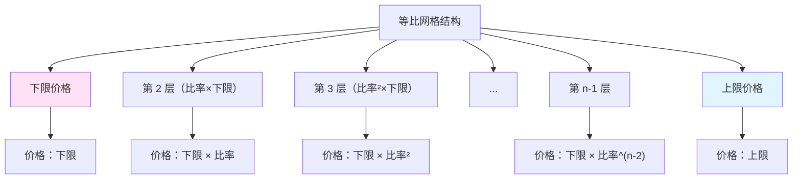
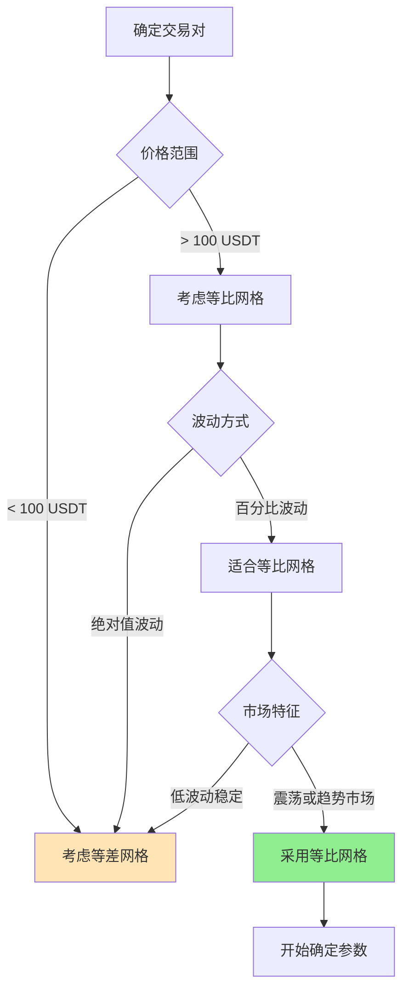

# 第 1 章：等比网格基础概念

## 本章导航

- [返回索引](geometric_grid_tutorial_index.md)
- [下一章：等比网格专用技术指标](geometric_grid_tutorial_02.md)

## 1.1 什么是等比网格

等比网格（Geometric Grid）是一种网格间距按固定百分比递增的交易策略。在这种策略中，相邻两个网格层级之间的价格比率是恒定的，使得网格在百分比尺度上均匀分布。

### 1.1.1 核心特征

**价格比率相等**：

在等比网格中，相邻两个网格层级之间的价格比率是恒定的。例如：

```text
价格区间：1000 USDT 至 1100 USDT
网格层级：10 层
等比比率：1.0095（约 0.95%）

网格层级分布：
第 1 层：1000.00 USDT（下限）
第 2 层：1009.50 USDT（1000 × 1.0095）
第 3 层：1019.10 USDT（1009.50 × 1.0095）
第 4 层：1028.78 USDT
第 5 层：1038.55 USDT
第 6 层：1048.41 USDT
第 7 层：1058.37 USDT
第 8 层：1068.42 USDT
第 9 层：1078.57 USDT
第 10 层：1088.81 USDT（接近上限）
```

### 1.1.2 数学表达式

在等比网格中，第 i 层的价格计算公式为：

```
价格_i = 下限 × 比率^(i - 1)
```

或者：

```
价格_i = 下限 × (上限/下限)^((i - 1)/(层数 - 1))
```

其中：

- `比率 = (上限/下限)^(1/(层数 - 1))`

### 1.1.3 视觉化表示

等比网格在价格图表上的分布在对数坐标中是均匀的：



## 1.2 等比网格 vs 等差网格

理解等比网格与等差网格的区别，有助于选择最适合的网格类型。

### 1.2.1 核心区别对比

| 维度 | 等差网格 | 等比网格 |
|------|---------|---------|
| 价格间距 | 固定金额差（如 10 USDT） | 固定百分比差（如 2%） |
| 数学性质 | 等差数列 | 等比数列 |
| 适用场景 | 中低价格币种、稳定波动 | 高价格币种、百分比波动 |
| 资金分布 | 各层级资金需求相对均衡 | 高价区需更多资金 |
| 成本结构 | 每层交易成本相近 | 高价层成本更高 |
| 对数尺度 | 不均匀 | 均匀分布 |

### 1.2.2 具体例子对比

假设价格区间：1000 USDT - 1100 USDT，共 10 层

**等差网格**：

```text
间距 = 11.11 USDT（固定）

层级分布：
1000.00, 1011.11, 1022.22, 1033.33, 1044.44,
1055.56, 1066.67, 1077.78, 1088.89, 1100.00

百分比间距变化：
1.11%, 1.10%, 1.09%, 1.08%, 1.07%, ...
（百分比逐渐减小）
```

**等比网格**（比率 1.0095，约 0.95%）：

```text
比率 = 1.0095（固定百分比）

层级分布：
1000.00, 1009.50, 1019.10, 1028.78, 1038.55,
1048.41, 1058.37, 1068.42, 1078.57, 1088.81

百分比间距：0.95%（固定）
金额间距：约 9.5 USDT → 约 10.2 USDT（逐渐增大）
```

### 1.2.3 价格水平的影响

**在低价区**：

```text
价格：10 USDT
等差间距：1 USDT = 10%
等比间距：10% = 1 USDT

差异不大
```

**在高价区**：

```text
价格：50000 USDT
等差间距：500 USDT = 1%
等比间距：1% = 500 USDT

差异不大（但如果是 10 USDT 等差间距，则差异巨大）
```

**关键洞察**：

- 在相对固定的百分比区间内，两者差异不大
- 但等比网格能更好地适应价格水平的变化
- 对于波动较大的价格范围，等比网格更合理

## 1.3 等比网格的优势

### 1.3.1 适应百分比波动

**核心优势**：

市场波动通常以百分比形式发生，等比网格能够：

- **保持一致性**：每个层级的百分比变化相同
- **适应价格水平**：无论价格多高或多低，比率保持一致
- **符合市场心理**：交易者通常以百分比思考价格变化

### 1.3.2 适合高价格币种

**优势体现**：

对于高价币种（如 BTC、ETH）：

- **避免极端间距**：等差网格在 BTC 上可能需要 1000 USDT 的间距
- **保持交易频率**：等比网格可以维持合理的交易频率
- **心理一致性**：2% 的波动在 50000 USDT 和 100000 USDT 都是 2%

### 1.3.3 数学优雅性

**对数尺度的均匀性**：

在对数坐标图中，等比网格是均匀分布的，这使得：

- **视觉清晰**：在对数图表上容易观察和理解
- **数学简单**：比率计算和层级分布更直观
- **易于扩展**：可以轻松扩展到更大的价格范围

## 1.4 等比网格的局限性

### 1.4.1 资金需求不均

**问题**：

在等比网格中，高价层级需要更多的资金：

```text
比率：1.02（2%）
价格：1000 USDT

如果每层投入相同的数量（如 1 ETH）：
第 1 层：1000 USDT
第 10 层：约 1219 USDT（需要 +21.9% 的资金）

总资金需求：会随着价格上涨而增加
```

**影响**：

- 在高价区，资金需求更大
- 如果价格上涨，可能需要更多资金
- 资金分配策略需要特别考虑

### 1.4.2 计算复杂度

**相比等差网格**：

- 比率计算需要先确定上下限
- 价格层级分布不是直观的加法
- 资金分配计算更复杂

### 1.4.3 价格跳跃风险

**高价区的问题**：

在高价区，即使百分比相同，绝对价格差距也更大：

```text
比率：2%
价格 50000 USDT：间距 = 1000 USDT
价格 100000 USDT：间距 = 2000 USDT

如果价格跳过层级，损失更大
```

## 1.5 适用场景分析

### 1.5.1 理想市场条件

**高价格币种**：

- BTC、ETH 等主流高价币种
- 价格通常在 1000 USDT 以上

**百分比波动为主**：

- 市场波动以百分比形式发生
- 波动幅度相对稳定
- 不同价格水平的波动率相近

**长期趋势**：

- 适合在长期上涨趋势中使用
- 可以跟随价格上涨而扩展网格

### 1.5.2 不适合的场景

**低价格币种**：

- 价格在 1 USDT 以下的币种
- 等差网格可能更合适

**绝对值波动为主**：

- 某些稳定币对可能以绝对波动为主
- 等差网格更合适

**剧烈波动市场**：

- 波动率极高且不规律的市场
- 网格策略本身可能不适合

## 1.6 关键决策流程

选择是否使用等比网格的决策流程：



## 1.7 本章小结

等比网格是一种比率相等的网格交易策略，具有以下核心特点：

**优势**：

1. 适应百分比波动，符合市场特征
2. 适合高价格币种，避免极端间距
3. 数学上更优雅，在对数尺度均匀分布

**局限性**：

1. 高价区资金需求更大
2. 计算相对复杂
3. 高价区价格跳跃风险

**适用判断**：

- 交易对价格 > 100 USDT
- 市场以百分比波动为主
- 有明显的价格区间或趋势
- 有充足的资金应对高价区需求

在确定使用等比网格后，下一章我们将学习如何使用专门的技术指标来分析市场并确定网格参数。

准备好了吗？让我们继续学习 [第 2 章：等比网格专用技术指标](geometric_grid_tutorial_02.md)，了解如何运用技术指标来辅助等比网格交易决策。

---

[返回索引](geometric_grid_tutorial_index.md) | [下一章：等比网格专用技术指标](geometric_grid_tutorial_02.md)
