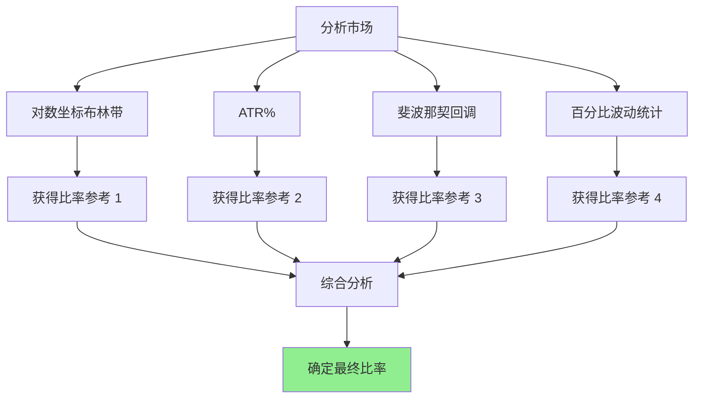

# 第 2 章：等比网格专用技术指标

## 本章导航

- [返回索引](geometric_grid_tutorial_index.md)
- [上一章：等比网格基础概念](geometric_grid_tutorial_01.md)
- [下一章：确定价格区间的方法](geometric_grid_tutorial_03.md)

## 2.1 对数坐标下的技术分析

等比网格的核心是对数尺度上的均匀分布，因此在应用技术指标时，对数坐标图分析尤为重要。

### 2.1.1 对数坐标 vs 普通坐标

**普通坐标（线性坐标）**：

- 价格变化按绝对金额显示
- 10 USDT → 20 USDT（100% 涨幅）和 1000 USDT → 1010 USDT（1% 涨幅）显示相同的距离
- 适合等差网格

**对数坐标（对数尺度）**：

- 价格变化按百分比显示
- 相同的百分比变化显示相同的距离
- 10 USDT → 20 USDT 和 1000 USDT → 2000 USDT 显示相同距离
- **适合等比网格**

### 2.1.2 对数坐标下的布林带

**关键优势**：

在对数坐标下，布林带更符合等比网格的特性：

```
对数坐标上的布林带宽度 = 对数(上轨) - 对数(下轨)
                      = log(上轨/下轨)

这个比值在对数坐标上是线性的，与等比网格的比率概念一致
```

**应用方法**：

1. 在 TradingView 等平台上切换到对数坐标
2. 查看布林带的上下轨
3. 计算上下轨的比率：`上限/下限`
4. 这个比率可以用于确定等比网格的参数

## 2.2 百分比波动率分析

对于等比网格，百分比波动率比绝对波动率更重要。

### 2.2.1 ATR 百分比化

**计算方法**：

```
ATR% = (ATR / 当前价格) × 100%

这个百分比波动率直接对应等比网格的比率
```

**应用**：

如果 `ATR% = 2.5%`，那么：

- 等比网格的比率可以设置为：`1 + 2.5% = 1.025`
- 或者稍小一点作为安全边际：`1 + 1.5% = 1.015`

### 2.2.2 历史百分比波动分析

**分析步骤**：

1. 计算最近 N 天的每日波动百分比
2. 统计这些百分比的平均值、标准差
3. 使用这些统计值来确定合理的网格比率

**示例**：

```text
最近 30 天 BTC 波动分析：
平均日波动：±2.1%
波动范围：0.5% - 5.0%
中位数波动：1.8%

建议网格比率：
- 保守：1.015（1.5%）
- 标准：1.020（2.0%）
- 激进：1.025（2.5%）
```

## 2.3 斐波那契回调位应用

斐波那契回调位是等比网格中非常有用的工具。

### 2.3.1 斐波那契比率

**常用斐波那契比率**：

```
0.236, 0.382, 0.500, 0.618, 0.786

对应的回调位：
23.6%, 38.2%, 50.0%, 61.8%, 78.6%
```

**在网格交易中的应用**：

这些比率可以作为：

1. **网格比率参考**：0.618 对应的约 1.6% 可以作为网格比率
2. **区间划分参考**：在价格区间内划分层级
3. **支撑阻力位**：识别价格回撤的潜在位置

### 2.3.2 黄金分割比例

**黄金分割比率**：0.618（或 1.618）

**应用示例**：

```text
价格区间：50000 - 60000 USDT

使用黄金分割划分：
0.618 位置：50000 + (60000 - 50000) × 0.618 = 56180 USDT

可以在这个位置设置一个重要的网格层级

或者作为比率：
网格比率 = 1.00618（约 0.618%）
```

### 2.3.3 斐波那契扩展位

**扩展比率**：

```
1.272, 1.414, 1.618, 2.000, 2.618
```

**应用**：

在趋势市场中，可以使用扩展位来设定网格的上限：

```text
起点：50000 USDT
第一个扩展位：50000 × 1.272 = 63600 USDT
第二个扩展位：50000 × 1.414 = 70700 USDT

如果判断为上涨趋势，可以用扩展位作为阶段性网格上限
```

## 2.4 百分比回撤分析

### 2.4.1 常见回撤百分比

市场在回调时，经常回到特定的百分比位置：

**常用回撤百分比**：

```
50%：最重要的回撤位（支撑/阻力）
61.8%：黄金分割位（强支撑/阻力）
38.2%：弱回撤位
23.6%：浅回撤位
```

**应用方法**：

1. 识别最近的高点和低点
2. 计算各回撤位对应的价格
3. 这些价格可以作为网格层级的候选位置

### 2.4.2 百分比扩展分析

**常见扩展百分比**：

```
127.2%（1.272 倍）
141.4%（1.414 倍）
161.8%（1.618 倍）
200%（2 倍）
```

在上涨趋势中，价格可能在这些百分比位置遇到阻力，可以作为网格上限的参考。

## 2.5 对数尺度下的趋势线

### 2.5.1 对数趋势线

在对数坐标下，趋势线具有不同的特性：

**上升趋势线**：

- 在对数坐标上可能是直线（线性增长）
- 在普通坐标上是指数曲线（百分比增长）

**应用**：

- 趋势线可以作为网格的边界参考
- 价格偏离趋势线的百分比可以作为网格间距

### 2.5.2 对数通道

**构建对数通道**：

1. 在对数坐标下绘制趋势线
2. 平行绘制上下边界线
3. 通道的宽度（百分比）可以作为网格区间宽度

**网格应用**：

```text
对数通道：
上边界：60000 USDT
下边界：50000 USDT
通道宽度：(60000 - 50000) / 50000 = 20%

可以在这个通道内设置等比网格
网格比率可以根据通道内的波动情况确定
```

## 2.6 百分比波动区间统计

### 2.6.1 波动率分布分析

**分析步骤**：

1. 收集历史数据
2. 计算每日价格变化百分比
3. 统计分布特征（均值、标准差、分位数）

**应用**：

```text
BTC 日波动分布（最近 90 天）：
均值：±1.8%
标准差：1.2%
68% 置信区间：±1.8% ± 1.2% = 0.6% - 3.0%
95% 置信区间：±1.8% ± 2.4% = -0.6% - 4.2%

网格比率建议：
- 使用 68% 区间的上限：3.0%
- 或使用均值：1.8%
```

### 2.6.2 分位数方法

**计算分位数**：

```
第 5 百分位：最小波动
第 25 百分位：较小波动
第 50 百分位（中位数）：中等波动
第 75 百分位：较大波动
第 95 百分位：最大波动
```

**网格比率设定**：

- **保守策略**：使用第 25 百分位
- **标准策略**：使用第 50 百分位（中位数）
- **激进策略**：使用第 75 百分位

## 2.7 综合应用策略

### 2.7.1 多指标融合



### 2.7.2 权重分配建议

在等比网格中，各指标的权重：

- **ATR%**：40%（最重要的波动率参考）
- **对数布林带**：25%（区间参考）
- **斐波那契**：20%（辅助参考）
- **统计分布**：15%（验证和调整）

## 2.8 本章小结

等比网格需要特别关注百分比指标：

**核心指标**：

1. **对数坐标分析**：在对数尺度上更直观
2. **ATR%**：最直接的波动率参考
3. **斐波那契比率**：数学上的优美参考
4. **百分比统计分析**：数据驱动的决策

**关键原则**：

- 始终从百分比角度思考
- 在对数坐标下进行技术分析
- 综合使用多个指标
- 考虑不同价格水平的相对性

下一章我们将学习如何确定等比网格的价格区间。

准备好了吗？让我们继续学习 [第 3 章：确定价格区间的方法](geometric_grid_tutorial_03.md)，了解如何综合运用这些指标来确定等比网格的价格边界。

---

[返回索引](geometric_grid_tutorial_index.md) | [上一章：等比网格基础概念](geometric_grid_tutorial_01.md) | [下一章：确定价格区间的方法](geometric_grid_tutorial_03.md)
