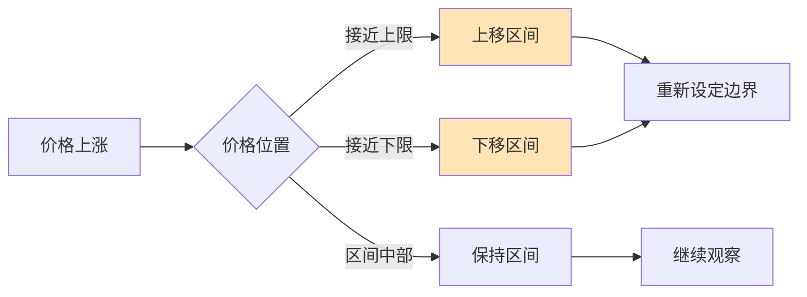
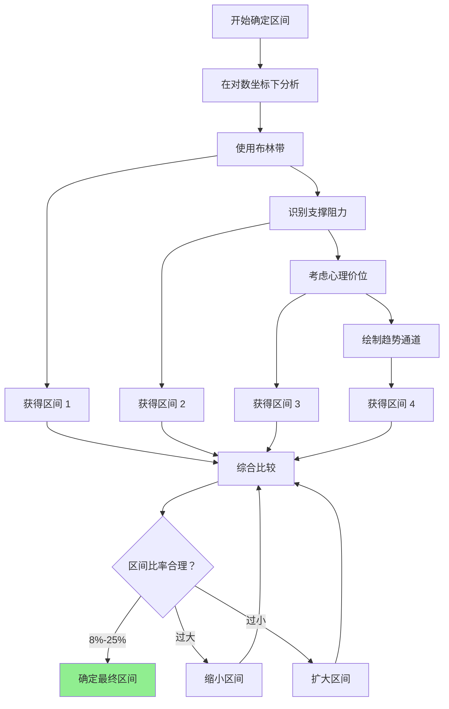

# 第 3 章：确定价格区间的方法

## 本章导航

- [返回索引](geometric_grid_tutorial_index.md)
- [上一章：等比网格专用技术指标](geometric_grid_tutorial_02.md)
- [下一章：等比比率的确定](geometric_grid_tutorial_04.md)

## 3.1 对数尺度下的区间划分

等比网格的特点决定了应该在对数尺度上确定价格区间。

### 3.1.1 对数区间的概念

在对数坐标下，区间应该以比率为基础：

```
区间比率 = 上限 / 下限

例如：
上限：60000 USDT
下限：50000 USDT
区间比率 = 60000 / 50000 = 1.2（20%）
```

### 3.1.2 使用对数坐标布林带

**方法**：

1. 在对数坐标下绘制布林带
2. 使用上下轨作为区间边界：

```
网格上限 = 布林带上轨
网格下限 = 布林带下轨
区间比率 = 上轨 / 下轨
```

**优势**：

- 在对数尺度上均匀分布
- 自动适应百分比波动
- 统计上合理（基于标准差）

## 3.2 指数增长币种的区间设定

对于长期上涨的币种，需要特殊的区间设定方法。

### 3.2.1 趋势跟随策略

**方法**：

如果币种处于上涨趋势：

1. 设定下限为当前价格的回调位（如 -10%）
2. 设定上限为上涨目标位（如 +20%）
3. 随着价格上涨，动态调整区间

**示例**：

```text
BTC 当前价格：50000 USDT
上涨趋势中

设定：
下限：45000 USDT（-10%）
上限：60000 USDT（+20%）
区间比率：60000 / 45000 = 1.333（33.3%）

当价格涨到 55000 时：
下限：49500 USDT（-10%）
上限：66000 USDT（+20%）
```

### 3.2.2 动态区间调整

在趋势市场中，区间需要定期调整：



## 3.3 心理价位与整数关口

即使是等比网格，心理价位仍然重要。

### 3.3.1 整数关口的影响

**高价币种的心理价位**：

```text
BTC：
50000、55000、60000、100000 等整数

ETH：
2000、2500、3000、5000 等整数

这些价位通常有较强的支撑或阻力
```

**应用方法**：

- 网格上限可以设置在整数位略下方
- 网格下限可以设置在整数位略上方
- 在整数位附近可以增加网格密度

### 3.3.2 心理区间的设定

**示例**：

```text
BTC 当前价格：52500 USDT

心理区间：
- 50000 USDT：重要心理支撑
- 55000 USDT：下一个整数阻力

设定网格区间：
下限：50500 USDT（略高于 50000）
上限：54500 USDT（略低于 55000）
区间比率：54500 / 50500 ≈ 1.079（7.9%）
```

## 3.4 长期趋势通道分析

### 4.4.1 构建趋势通道

**在对数坐标下**：

1. 连接低点绘制上升趋势线（支撑）
2. 平行绘制上边界线（阻力）
3. 通道宽度确定了网格区间

**应用**：

```text
对数趋势通道：
支撑线：45000 USDT（当前）
阻力线：65000 USDT（当前）
通道宽度：(65000 - 45000) / 45000 = 44.4%

可以在通道内设置等比网格
```

### 3.4.2 通道突破应对

当价格突破通道：

- **向上突破**：扩大上限或重新设定新区间
- **向下突破**：止损或调整下限

## 3.5 综合确定区间的流程



## 3.6 本章小结

确定等比网格的价格区间需要：

**关键方法**：
1. 在对数坐标下分析
2. 使用布林带确定边界
3. 考虑趋势和通道
4. 结合心理价位

**区间比率建议**：
- 最小：8%（较小的波动）
- 标准：12%-20%
- 最大：25%（高波动市场）

下一章学习如何确定等比网格的比率。

---

[返回索引](geometric_grid_tutorial_index.md) | [上一章：等比网格专用技术指标](geometric_grid_tutorial_02.md) | [下一章：等比比率的确定](geometric_grid_tutorial_04.md)
