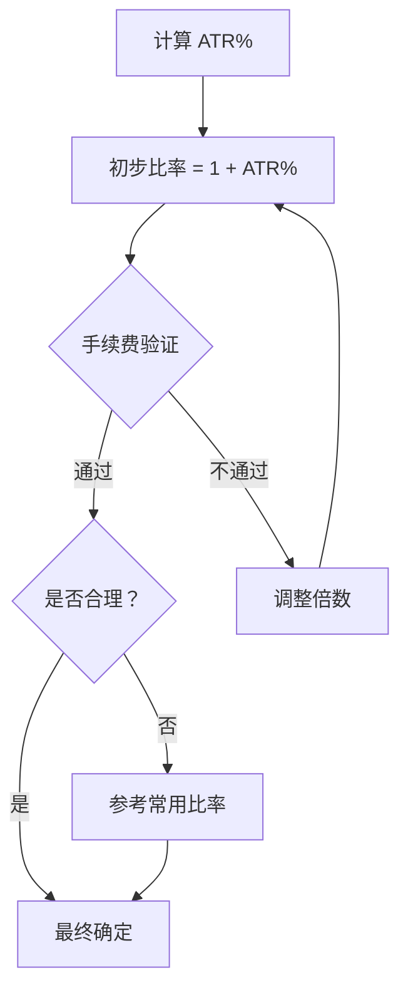

# 第 4 章：等比比率的确定

## 本章导航

- [返回索引](geometric_grid_tutorial_index.md)
- [上一章：确定价格区间的方法](geometric_grid_tutorial_03.md)
- [下一章：网格层数与资金分配](geometric_grid_tutorial_05.md)

## 4.1 比率的重要性

等比网格的比率直接决定了：

- 交易频率
- 盈利能力
- 资金需求
- 风险水平

## 4.2 基于历史波动率的比率选择

### 4.2.1 ATR% 方法

**计算公式**：

```
建议比率 = 1 + ATR% × 倍数

倍数选择：
- 保守：0.8-1.0
- 标准：1.0-1.2
- 激进：1.2-1.5
```

**示例**：

```text
ATR% = 2%
标准倍数 = 1.0
建议比率 = 1 + 2% × 1.0 = 1.02
```

### 4.2.2 波动率统计方法

使用历史波动率分布：

- 中位数波动率：标准比率
- 第 75 百分位：保守比率
- 第 25 百分位：激进比率

## 4.3 常用比率参考

| 比率 | 百分比 | 适用场景 |
|------|--------|----------|
| 1.005 | 0.5% | 极低波动，密集网格 |
| 1.010 | 1.0% | 低波动市场 |
| 1.015 | 1.5% | 标准低波动 |
| 1.020 | 2.0% | **标准比率**（推荐） |
| 1.025 | 2.5% | 中等波动 |
| 1.030 | 3.0% | 较高波动 |
| 1.050 | 5.0% | 高波动市场 |

## 4.4 比率与收益风险的关系

### 4.4.1 比率对交易频率的影响

```
比率小（如 1.01）：
- 交易频繁
- 单次盈利小
- 手续费占比高

比率大（如 1.03）：
- 交易较少
- 单次盈利大
- 手续费占比低
```

### 4.4.2 盈亏平衡分析

考虑手续费：

```
最小比率 = 1 + (手续费率 × 倍数)

例如：
手续费率：0.2%
倍数：3（确保盈利）
最小比率 = 1 + 0.2% × 3 = 1.006

实际使用应 ≥ 1.01
```

## 4.5 斐波那契比率的应用

可以使用斐波那契比率作为参考：

- 1.00618（0.618%）：黄金分割相关
- 1.01618（1.618%）：黄金比例相关

这些比率在数学上优雅，但更重要的是与市场波动匹配。

## 4.6 实战确定流程



## 4.7 本章小结

确定等比网格比率的关键：

- 基于 ATR% 计算
- 考虑手续费约束
- 参考常用比率
- 平衡收益和频率

**推荐比率范围**：1.015 - 1.030（1.5% - 3.0%）

---

[返回索引](geometric_grid_tutorial_index.md) | [上一章：确定价格区间的方法](geometric_grid_tutorial_03.md) | [下一章：网格层数与资金分配](geometric_grid_tutorial_05.md)
