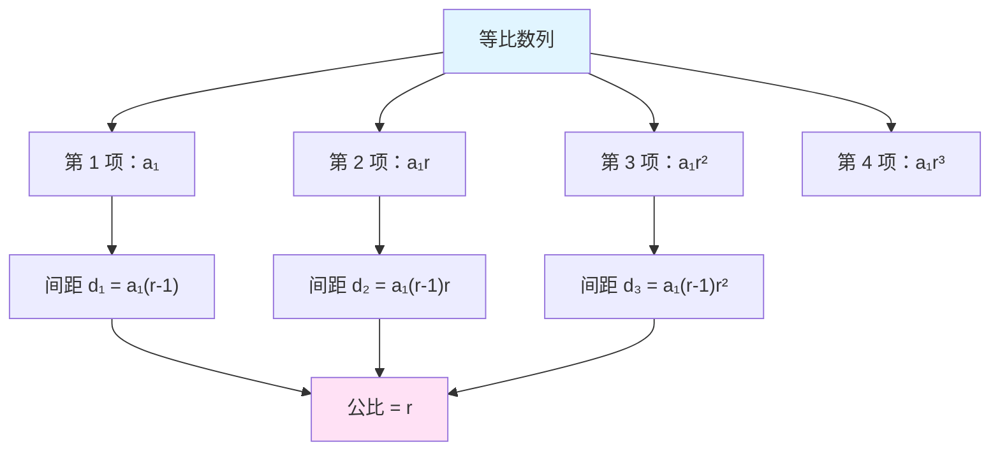
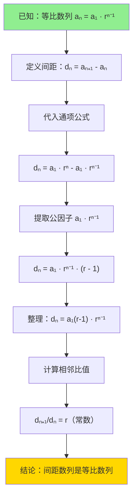
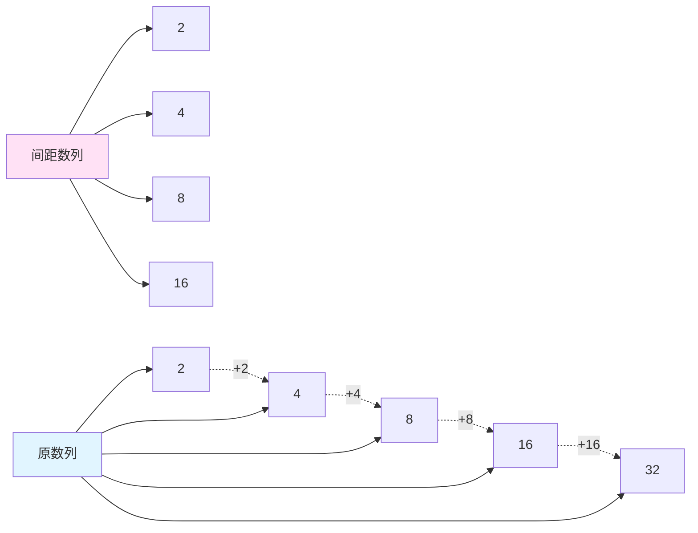

# 等比数列间距性质验证

## 问题引入

在研究等比网格交易策略时，我们经常会遇到这样一个问题：**等比数列的相邻项之间的间距（差值）是否也构成等比数列？**

这个问题不仅具有理论意义，在实际应用中也很重要。例如，在等比网格交易中，如果我们知道价格层级是等比数列，那么相邻价格层级之间的价差是否也遵循某种规律？这对于资金分配、风险管理都有重要的指导意义。

本文将通过严格的数学证明和具体的数值示例来验证这一性质。

## 数学定义

### 等比数列的一般形式

设等比数列为：

\[
a_1, a_2, a_3, a_4, ..., a_n, ...
\]

其通项公式为：

\[
a_n = a_1 \cdot r^{n-1}
\]

其中：

- \(a_1\) 是首项（第一项）
- \(r\) 是公比（\(r \neq 0\)）
- \(n\) 是项数

### 间距序列的定义

我们定义间距序列 \(d_n\) 为等比数列相邻两项的差值：

\[
d_n = a_{n+1} - a_n
\]

即间距序列为：

\[
d_1, d_2, d_3, ..., d_n, ...
\]

其中：

- \(d_1 = a_2 - a_1\)
- \(d_2 = a_3 - a_2\)
- \(d_3 = a_4 - a_3\)
- ...

## 数学证明

### 推导间距序列的通项公式

首先，我们来推导间距序列的通项公式。

根据等比数列的通项公式：

\[
a_n = a_1 \cdot r^{n-1}
\]

\[
a_{n+1} = a_1 \cdot r^n
\]

因此，间距为：

\[
d_n = a_{n+1} - a_n = a_1 \cdot r^n - a_1 \cdot r^{n-1}
\]

提取公因子 \(a_1 \cdot r^{n-1}\)：

\[
d_n = a_1 \cdot r^{n-1} \cdot (r - 1)
\]

整理得：

\[
d_n = a_1(r - 1) \cdot r^{n-1}
\]

### 验证间距序列是否为等比数列

要证明间距序列 \(d_n\) 是等比数列，我们需要证明相邻两项的比值为常数。

计算相邻间距的比值：

\[
\frac{d_{n+1}}{d_n} = \frac{a_1(r - 1) \cdot r^n}{a_1(r - 1) \cdot r^{n-1}}
\]

化简：

\[
\frac{d_{n+1}}{d_n} = \frac{r^n}{r^{n-1}} = r
\]

**结论**：相邻间距的比值恒为 \(r\)，这说明间距序列也是等比数列！

### 间距数列的性质

根据上述证明，间距数列具有以下性质：

1. **首项**：\(d_1 = a_1(r - 1)\)
2. **公比**：\(r\)（与原等比数列的公比相同）
3. **通项公式**：\(d_n = a_1(r - 1) \cdot r^{n-1}\)

### 特殊情况讨论

**当 \(r = 1\) 时**：

如果 \(r = 1\)，原等比数列变为常数列：

\[
a, a, a, a, ...
\]

此时，所有间距都为 0：

\[
d_n = a_1(1 - 1) \cdot 1^{n-1} = 0
\]

这种情况下，间距数列是全 0 数列，可以视为特殊的等比数列（公比可为任意值，但所有项都是 0）。

**当 \(r < 0\) 时**：

如果公比为负数，原等比数列的项会正负交替，间距数列仍然是等比数列，但也会出现正负交替的情况。

**当 \(0 < r < 1\) 时**：

原等比数列递减，间距数列的各项为负数，但仍然是等比数列。

## 具体数值示例

### 示例 1：简单整数等比数列

考虑等比数列：2, 4, 8, 16, 32

这是首项 \(a_1 = 2\)，公比 \(r = 2\) 的等比数列。

**原数列及其间距**：

| 项数 (n) | 原数列 \(a_n\) | 间距 \(d_n = a_{n+1} - a_n\) | 公比验证 \(d_{n+1}/d_n\) |
|---------|---------------|---------------------------|----------------------|
| 1 | 2 | 2 (= 4 - 2) | - |
| 2 | 4 | 4 (= 8 - 4) | 4/2 = 2 |
| 3 | 8 | 8 (= 16 - 8) | 8/4 = 2 |
| 4 | 16 | 16 (= 32 - 16) | 16/8 = 2 |
| 5 | 32 | - | - |

**验证**：

- 间距数列：2, 4, 8, 16
- 间距数列的公比：\(r = 2\)（与原数列公比相同）
- 间距数列首项：\(d_1 = a_1(r - 1) = 2 \times (2 - 1) = 2\) ✓

### 示例 2：交易场景中的价格序列

考虑等比网格的价格序列：1000, 1020, 1040.4, 1061.208

这是首项 \(a_1 = 1000\)，公比 \(r = 1.02\)（即每层价格上涨 2%）的等比数列。

**原数列及其间距**：

| 层级 (n) | 价格 \(a_n\) (USDT) | 间距 \(d_n\) (USDT) | 公比验证 \(d_{n+1}/d_n\) |
|---------|-------------------|-------------------|----------------------|
| 1 | 1000.000 | 20.000 | - |
| 2 | 1020.000 | 20.400 | 20.400/20.000 = 1.02 |
| 3 | 1040.400 | 20.808 | 20.808/20.400 = 1.02 |
| 4 | 1061.208 | - | - |

**验证**：

- 间距数列：20.000, 20.400, 20.808
- 间距数列的公比：\(r = 1.02\)（与原数列公比相同）
- 间距数列首项：\(d_1 = 1000 \times (1.02 - 1) = 1000 \times 0.02 = 20\) ✓

**关键洞察**：

在等比网格中，相邻价格层级之间的价差不是固定的，而是按照相同的公比递增。这意味着：

- 在低价区，价格间距较小
- 在高价区，价格间距较大
- 但间距的增长率与价格的增长率保持一致

### 示例 3：递减等比数列

考虑等比数列：100, 50, 25, 12.5

这是首项 \(a_1 = 100\)，公比 \(r = 0.5\) 的等比数列。

**原数列及其间距**：

| 项数 (n) | 原数列 \(a_n\) | 间距 \(d_n = a_{n+1} - a_n\) | 公比验证 \(d_{n+1}/d_n\) |
|---------|---------------|---------------------------|----------------------|
| 1 | 100 | -50 (= 50 - 100) | - |
| 2 | 50 | -25 (= 25 - 50) | (-25)/(-50) = 0.5 |
| 3 | 25 | -12.5 (= 12.5 - 25) | (-12.5)/(-25) = 0.5 |
| 4 | 12.5 | - | - |

**验证**：

- 间距数列：-50, -25, -12.5
- 间距数列的公比：\(r = 0.5\)（与原数列公比相同）
- 间距数列首项：\(d_1 = 100 \times (0.5 - 1) = 100 \times (-0.5) = -50\) ✓

## 可视化说明

### 等比数列与间距数列的关系

### 数学推导流程

### 示例数据可视化（r = 2 的情况）

## 结论总结

通过严格的数学证明和多个具体示例，我们得出以下结论：

### 核心结论

**等比数列的相邻项间距确实构成等比数列（当公比 \(r \neq 1\) 时）。**

具体性质如下：

1. **间距数列的首项**：\(d_1 = a_1(r - 1)\)
2. **间距数列的公比**：与原等比数列的公比 \(r\) 相同
3. **间距数列的通项**：\(d_n = a_1(r - 1) \cdot r^{n-1}\)

### 在网格交易中的应用意义

这一性质在等比网格交易中具有重要的实践意义：

**1. 间距递增规律明确**

- 相邻价格层级之间的间距按照固定比率递增
- 可以预测任意层级的价格间距
- 有助于评估价格跳跃风险

**2. 资金分配策略**

- 高价区的价格间距更大，单次交易盈利额更高
- 低价区的价格间距更小，交易频率可能更高
- 需要根据间距的递增规律合理分配资金

**3. 风险评估**

- 间距递增意味着高价区的价格跳跃风险更大
- 需要设置合适的止损和仓位管理策略
- 在极端行情下，高价区可能跳过多个层级

**4. 网格优化**

- 理解间距的等比性质有助于优化网格参数
- 可以根据预期的价格波动幅度调整公比
- 在不同价格区间保持一致的百分比收益

### 数学美学

这一性质展现了等比数列的数学美感：

- 不仅原数列具有比例关系，其间距也保持相同的比例关系
- 这种自相似性（self-similarity）是等比数列的重要特征
- 在对数坐标系中，原数列和间距数列都呈现线性关系

### 延伸思考

进一步的研究方向：

1. **二阶间距**：间距的间距（\(d_{n+1} - d_n\)）是否也有规律？
2. **累加性质**：等比数列的前 n 项和的增长规律
3. **实际应用**：在不同市场环境下，如何选择最优的公比

---

本文通过理论证明和实例验证，完整地回答了"等比数列的间距是否也是等比数列"这一问题。希望这个分析能帮助你更深入地理解等比数列的性质及其在交易中的应用。
