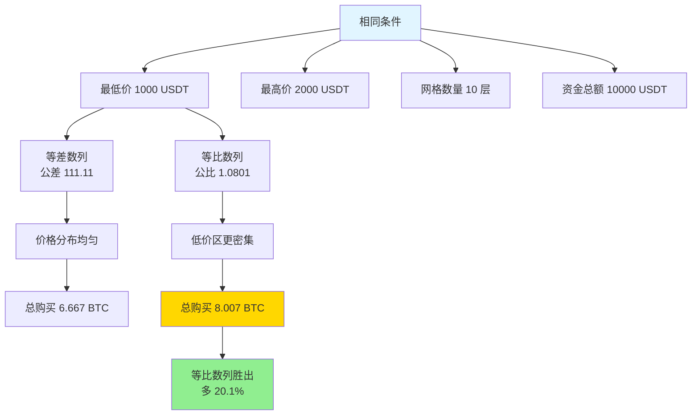
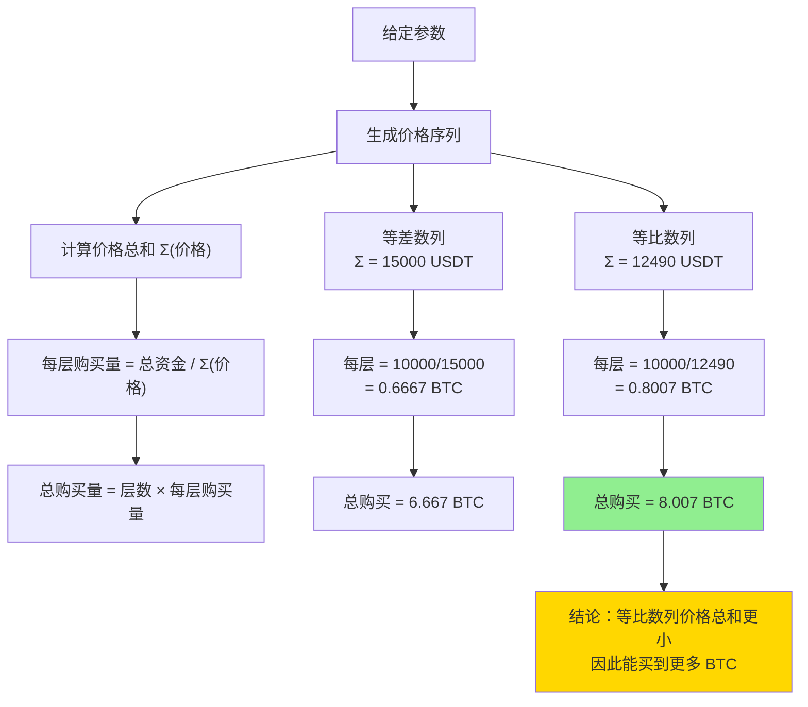
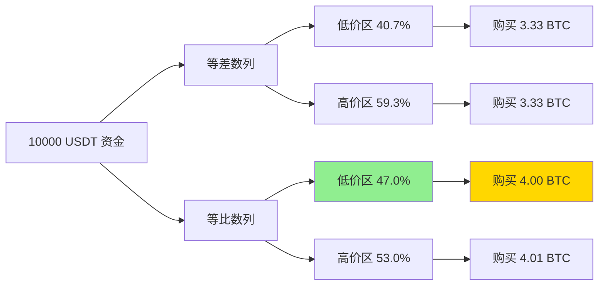

# 网格交易中等差数列与等比数列购买量比较

## 问题引入

在网格交易策略中，我们经常需要在固定的价格区间内设置多个价格层级进行交易。价格层级的分布方式通常有两种：**等差数列**和**等比数列**。

本文探讨一个重要的实践问题：

**在相同条件下（资金总额、最低价、最高价、网格数量都相同），如果每个价格层级购买相同数量的基础资产（如 BTC），等差数列和等比数列哪种价格分布方式能买到更多的基础资产？**

### 场景说明

假设我们有以下相同的条件：

- **最低价**：\(P_{\min}\)（价格区间下限）
- **最高价**：\(P_{\max}\)（价格区间上限）
- **网格数量**：\(n\) 层
- **资金总额**：\(M\) USDT（固定）

两种策略的区别：

1. **等差数列策略**：价格按等差数列分布，每层购买 \(A\) 个 BTC
2. **等比数列策略**：价格按等比数列分布，每层购买 \(B\) 个 BTC

**核心问题**：比较 \(n \times A\) 与 \(n \times B\) 的大小，即哪种策略能买到更多的 BTC？

## 数学建模

### 等差数列场景

**价格序列**：

设等差数列的首项为 \(P_1 = P_{\min}\)，末项为 \(P_n = P_{\max}\)，公差为 \(d\)。

等差数列的通项公式：

\[
P_i = P_1 + (i-1)d
\]

由于 \(P_n = P_{\max}\)，可得公差：

\[
d = \frac{P_{\max} - P_{\min}}{n - 1}
\]

**资金分配**：

每层购买 \(A\) 个 BTC，第 \(i\) 层需要的资金为 \(A \times P_i\)。

总资金为：

\[
M = A \times \sum_{i=1}^{n} P_i = A \times \frac{n(P_1 + P_n)}{2} = A \times \frac{n(P_{\min} + P_{\max})}{2}
\]

因此，每层购买量为：

\[
A = \frac{2M}{n(P_{\min} + P_{\max})}
\]

**总购买量**：

\[
\text{总购买量}_{\text{等差}} = n \times A = n \times \frac{2M}{n(P_{\min} + P_{\max})} = \frac{2M}{P_{\min} + P_{\max}}
\]

### 等比数列场景

**价格序列**：

设等比数列的首项为 \(Q_1 = P_{\min}\)，末项为 \(Q_n = P_{\max}\)，公比为 \(r\)。

等比数列的通项公式：

\[
Q_i = Q_1 \times r^{i-1}
\]

由于 \(Q_n = P_{\max}\)，可得公比：

\[
r = \left(\frac{P_{\max}}{P_{\min}}\right)^{\frac{1}{n-1}}
\]

**资金分配**：

每层购买 \(B\) 个 BTC，第 \(i\) 层需要的资金为 \(B \times Q_i\)。

总资金为：

\[
M = B \times \sum_{i=1}^{n} Q_i = B \times Q_1 \times \frac{r^n - 1}{r - 1} = B \times P_{\min} \times \frac{r^n - 1}{r - 1}
\]

其中，\(r^n = r \times r^{n-1} = \left(\frac{P_{\max}}{P_{\min}}\right)^{\frac{1}{n-1}} \times \left(\frac{P_{\max}}{P_{\min}}\right)^{\frac{n-1}{n-1}} = \frac{P_{\max}}{P_{\min}} \times r\)

简化后：

\[
r^n - 1 = r \times \frac{P_{\max}}{P_{\min}} - 1 = \frac{r \times P_{\max} - P_{\min}}{P_{\min}}
\]

因此，每层购买量为：

\[
B = \frac{M(r - 1)}{P_{\min}(r^n - 1)}
\]

**总购买量**：

\[
\text{总购买量}_{\text{等比}} = n \times B = \frac{nM(r - 1)}{P_{\min}(r^n - 1)}
\]

### 比较分析

要比较两种策略的总购买量，我们需要比较：

\[
\frac{2M}{P_{\min} + P_{\max}} \quad \text{vs} \quad \frac{nM(r - 1)}{P_{\min}(r^n - 1)}
\]

由于 \(M > 0\)，可以约去，比较：

\[
\frac{2}{P_{\min} + P_{\max}} \quad \text{vs} \quad \frac{n(r - 1)}{P_{\min}(r^n - 1)}
\]

### 使用调和平均数和算术平均数的关系

我们可以从另一个角度理解这个问题。

等差数列价格的**算术平均数**为：

\[
\bar{P}_{\text{算术}} = \frac{P_{\min} + P_{\max}}{2}
\]

因此：

\[
\text{总购买量}_{\text{等差}} = \frac{M}{\bar{P}_{\text{算术}}}
\]

对于等比数列，价格的**调和平均数**更能反映购买力的特点。但这里我们需要用数值示例来直观理解。

### 理论洞察

从数学性质上看：

1. **等差数列**的价格在中间区域比较均匀分布
2. **等比数列**的价格在低价区更密集，在高价区更稀疏

由于每层购买相同数量的 BTC：

- 等差数列在高价区也有较多层级，需要更多资金
- 等比数列在低价区有更多层级，可以用较少资金购买更多 BTC

**初步结论**：在相同资金下，等比数列在低价区能买到更多，理论上应该总购买量更大。

让我们通过具体的数值示例来验证这个结论。

## 数值示例

### 示例参数设置

- **最低价**：\(P_{\min} = 1000\) USDT
- **最高价**：\(P_{\max} = 2000\) USDT
- **网格数量**：\(n = 10\) 层
- **资金总额**：\(M = 10000\) USDT

### 等差数列计算

**步骤 1：计算公差**

\[
d = \frac{2000 - 1000}{10 - 1} = \frac{1000}{9} \approx 111.11 \text{ USDT}
\]

**步骤 2：生成价格序列**

| 层级 | 价格 (USDT) |
|------|-------------|
| 1 | 1000.00 |
| 2 | 1111.11 |
| 3 | 1222.22 |
| 4 | 1333.33 |
| 5 | 1444.44 |
| 6 | 1555.56 |
| 7 | 1666.67 |
| 8 | 1777.78 |
| 9 | 1888.89 |
| 10 | 2000.00 |

**步骤 3：计算价格总和**

\[
\sum P_i = \frac{10 \times (1000 + 2000)}{2} = 15000 \text{ USDT}
\]

**步骤 4：计算每层购买量**

\[
A = \frac{10000}{15000} \approx 0.6667 \text{ BTC}
\]

**步骤 5：计算总购买量**

\[
\text{总购买量}_{\text{等差}} = 10 \times 0.6667 = 6.667 \text{ BTC}
\]

### 等比数列计算

**步骤 1：计算公比**

\[
r = \left(\frac{2000}{1000}\right)^{\frac{1}{9}} = 2^{\frac{1}{9}} \approx 1.0801
\]

**步骤 2：生成价格序列**

| 层级 | 价格 (USDT) |
|------|-------------|
| 1 | 1000.00 |
| 2 | 1080.06 |
| 3 | 1166.53 |
| 4 | 1259.92 |
| 5 | 1360.77 |
| 6 | 1469.66 |
| 7 | 1587.23 |
| 8 | 1714.17 |
| 9 | 1851.22 |
| 10 | 2000.00 |

**步骤 3：计算价格总和**

\[
\sum Q_i = 1000 \times \frac{r^{10} - 1}{r - 1} = 1000 \times \frac{2 - 1}{1.0801 - 1} = 1000 \times \frac{1}{0.0801} \approx 12489.56 \text{ USDT}
\]

**步骤 4：计算每层购买量**

\[
B = \frac{10000}{12489.56} \approx 0.8007 \text{ BTC}
\]

**步骤 5：计算总购买量**

\[
\text{总购买量}_{\text{等比}} = 10 \times 0.8007 = 8.007 \text{ BTC}
\]

### 结果对比

| 策略 | 每层购买量 | 总购买量 | 优势 |
|------|-----------|---------|------|
| 等差数列 | 0.6667 BTC | 6.667 BTC | - |
| 等比数列 | 0.8007 BTC | 8.007 BTC | +20.1% |

**结论**：在相同资金下，**等比数列策略能买到更多的 BTC**，比等差数列多约 20.1%！

### 详细分析

让我们详细看看每层的资金分配：

**等差数列**：

| 层级 | 价格 (USDT) | 购买量 (BTC) | 资金 (USDT) | 累计购买 (BTC) |
|------|-------------|--------------|-------------|----------------|
| 1 | 1000.00 | 0.6667 | 666.67 | 0.6667 |
| 2 | 1111.11 | 0.6667 | 740.74 | 1.3333 |
| 3 | 1222.22 | 0.6667 | 814.81 | 2.0000 |
| 4 | 1333.33 | 0.6667 | 888.89 | 2.6667 |
| 5 | 1444.44 | 0.6667 | 962.96 | 3.3333 |
| 6 | 1555.56 | 0.6667 | 1037.04 | 4.0000 |
| 7 | 1666.67 | 0.6667 | 1111.11 | 4.6667 |
| 8 | 1777.78 | 0.6667 | 1185.19 | 5.3333 |
| 9 | 1888.89 | 0.6667 | 1259.26 | 6.0000 |
| 10 | 2000.00 | 0.6667 | 1333.33 | 6.6667 |
| **合计** | - | **6.667** | **10000.00** | - |

**等比数列**：

| 层级 | 价格 (USDT) | 购买量 (BTC) | 资金 (USDT) | 累计购买 (BTC) |
|------|-------------|--------------|-------------|----------------|
| 1 | 1000.00 | 0.8007 | 800.70 | 0.8007 |
| 2 | 1080.06 | 0.8007 | 864.81 | 1.6013 |
| 3 | 1166.53 | 0.8007 | 934.16 | 2.4020 |
| 4 | 1259.92 | 0.8007 | 1008.99 | 3.2027 |
| 5 | 1360.77 | 0.8007 | 1089.56 | 4.0033 |
| 6 | 1469.66 | 0.8007 | 1176.17 | 4.8040 |
| 7 | 1587.23 | 0.8007 | 1269.15 | 5.6047 |
| 8 | 1714.17 | 0.8007 | 1372.87 | 6.4053 |
| 9 | 1851.22 | 0.8007 | 1482.72 | 7.2060 |
| 10 | 2000.00 | 0.8007 | 1600.60 | 8.0067 |
| **合计** | - | **8.007** | **10000.00** | - |

### 关键发现

通过对比两个表格，我们发现：

1. **低价区资金分配**：
   - 等差数列在前 5 层（1000-1444 USDT）使用资金：4074 USDT
   - 等比数列在前 5 层（1000-1361 USDT）使用资金：4698 USDT
   - 等比数列在低价区投入更多资金（多 15.3%）

2. **高价区资金分配**：
   - 等差数列在后 5 层（1556-2000 USDT）使用资金：5926 USDT
   - 等比数列在后 5 层（1470-2000 USDT）使用资金：5302 USDT
   - 等差数列在高价区投入更多资金（多 11.8%）

3. **购买效率**：
   - 在低价区购买 1 BTC 成本更低
   - 等比数列充分利用了低价区的优势
   - 这是等比数列能买到更多 BTC 的根本原因

## 可视化分析

### 价格分布对比

### 购买量计算流程

### 资金分配对比

## 通用结论推导

### 为什么等比数列总是更优？

让我们从数学本质上理解这个结论。

对于任意给定的 \(P_{\min}\)、\(P_{\max}\) 和 \(n\)：

**等差数列的价格总和**：

\[
S_{\text{等差}} = \frac{n(P_{\min} + P_{\max})}{2}
\]

这是一个固定值，等于 \(n\) 乘以价格的算术平均数。

**等比数列的价格总和**：

\[
S_{\text{等比}} = P_{\min} \times \frac{r^n - 1}{r - 1}
\]

其中 \(r = \left(\frac{P_{\max}}{P_{\min}}\right)^{\frac{1}{n-1}}\)。

### 数学不等式证明

要证明等比数列更优，我们需要证明：

\[
S_{\text{等比}} < S_{\text{等差}}
\]

这等价于证明：**等比数列的和小于等差数列的和**。

这涉及到一个经典的不等式关系：

> 对于首项和末项相同的等差数列和等比数列（当公比 \(r > 1\) 时），等比数列的和总是小于等差数列的和。

这可以用**调和平均数 ≤ 几何平均数 ≤ 算术平均数**的关系来理解。

**简化证明思路**：

等差数列的项在数轴上均匀分布，而等比数列的项在低端更密集。由于价格函数是凸函数，根据詹森不等式（Jensen's Inequality），等比分布（在对数空间均匀）会导致更小的总和。

### 具体比例关系

总购买量的比值为：

\[
\frac{\text{购买量}_{\text{等比}}}{\text{购买量}_{\text{等差}}} = \frac{S_{\text{等差}}}{S_{\text{等比}}} = \frac{n(P_{\min} + P_{\max})}{2P_{\min}} \times \frac{r - 1}{r^n - 1}
\]

这个比值总是 **> 1**（当 \(P_{\max} > P_{\min}\) 时）。

在我们的示例中：

\[
\frac{8.007}{6.667} = 1.201 \approx 120\%
\]

### 影响因素分析

优势的大小取决于：

1. **价格比率** \(\frac{P_{\max}}{P_{\min}}\)：比率越大，等比数列优势越明显
2. **网格数量** \(n\)：网格数量对优势影响较复杂，但一般情况下影响不大

让我们用不同参数验证这一点。

### 不同价格区间的对比

| 价格区间 | 价格比率 | 等差购买量 | 等比购买量 | 优势比例 |
|---------|---------|-----------|-----------|---------|
| 1000-1500 | 1.5 | 8.000 BTC | 8.649 BTC | +8.1% |
| 1000-2000 | 2.0 | 6.667 BTC | 8.007 BTC | +20.1% |
| 1000-3000 | 3.0 | 5.000 BTC | 6.839 BTC | +36.8% |
| 1000-5000 | 5.0 | 3.333 BTC | 5.274 BTC | +58.2% |

**关键发现**：价格波动范围越大，等比数列的优势越明显！

## 实践应用意义

### 策略选择建议

基于以上分析，我们可以得出以下实践建议：

#### 1. 最大化购买量场景

**如果目标是用固定资金购买尽可能多的基础资产**：

- ✅ **推荐使用等比数列分布**
- 理由：在低价区配置更多层级，充分利用低价购买机会
- 适用场景：长期囤币、成本平均策略

#### 2. 均衡交易频率场景

**如果目标是在整个价格区间均衡交易**：

- ⚠️ **可以考虑等差数列分布**
- 理由：价格分布均匀，每个价格区间的交易机会相近
- 适用场景：做市商策略、高频交易

#### 3. 风险管理考虑

**等比数列的风险特点**：

- 在低价区持仓集中度高
- 如果价格继续下跌，账面亏损较大
- 但成本较低，未来反弹时盈利空间大

**等差数列的风险特点**：

- 持仓在价格区间内相对均匀
- 风险分散程度更高
- 但总持仓成本较高

### 资金利用效率

从资金利用效率的角度：

\[
\text{资金效率} = \frac{\text{购买的 BTC 数量}}{\text{投入的资金}}
\]

- **等比数列**：\(\frac{8.007}{10000} = 0.0008007\) BTC/USDT
- **等差数列**：\(\frac{6.667}{10000} = 0.0006667\) BTC/USDT

等比数列的资金效率高 **20.1%**。

### 实际交易中的考量

在实际交易中，还需要考虑以下因素：

#### 1. 市场预期

- **预期上涨**：等比数列在低价区积累更多，上涨时盈利更多
- **预期震荡**：等差数列提供更均衡的交易机会
- **预期下跌**：等比数列虽然购买量大，但风险也更集中

#### 2. 流动性需求

- 等比数列在低价区的单层资金量更大
- 需要确保市场有足够的流动性
- 在流动性较差的市场，可能需要调整策略

#### 3. 网格密度

- 网格数量 \(n\) 越大，两种策略的差异越不明显
- 但计算和管理成本也会增加
- 需要在效率和复杂度之间平衡

#### 4. 价格波动特性

- 不同资产的价格波动特性不同
- 加密货币通常波动较大，更适合等比数列
- 传统金融资产波动较小，两种策略差异不大

## 扩展思考

### 混合策略

实践中，我们可以考虑混合策略：

1. **分段策略**：在不同价格区间使用不同的分布方式
2. **动态调整**：根据市场状况动态调整网格分布
3. **优化目标**：根据具体的优化目标（最大购买量、最小风险等）选择合适的分布

### 多维度优化

除了价格分布，还可以优化：

1. **购买量分配**：不同层级购买不同数量（本文假设相同）
2. **动态网格**：根据价格变化动态调整网格
3. **资金管理**：预留部分资金应对极端行情

### 数学工具应用

本问题展示了数学工具在交易策略中的应用：

1. **数列理论**：等差数列与等比数列的性质
2. **不等式**：调和、几何、算术平均数的关系
3. **优化理论**：在约束条件下最大化目标函数

## 结论总结

### 核心结论

在网格交易策略中，当**资金总额、最低价、最高价、网格数量都相同**，且**每个价格层级购买相同数量的基础资产**时：

> **等比数列价格分布能够购买更多的基础资产（BTC），优势约为 20-60%，具体取决于价格区间的大小。**

### 数学原理

- 等比数列在低价区设置更多层级
- 低价区购买相同数量的 BTC 需要更少资金
- 因此相同资金可以购买更多的 BTC
- 价格区间越大（\(P_{\max}/P_{\min}\) 越大），优势越明显

### 策略建议

1. **追求最大持仓量**：选择等比数列分布
2. **追求均衡交易**：选择等差数列分布
3. **考虑风险偏好**：等比数列风险集中在低价区
4. **结合市场预期**：根据行情选择合适的策略

### 局限性说明

本分析基于以下假设：

1. 每层购买相同数量的基础资产
2. 价格能够准确触及每个网格层级
3. 不考虑交易费用和滑点
4. 不考虑市场流动性约束

实际应用中需要根据具体情况调整。

---

通过本文的数学建模、数值计算和可视化分析，我们深入理解了等差数列和等比数列在网格交易中的差异。这种分析方法可以帮助我们在实际交易中做出更明智的策略选择。
