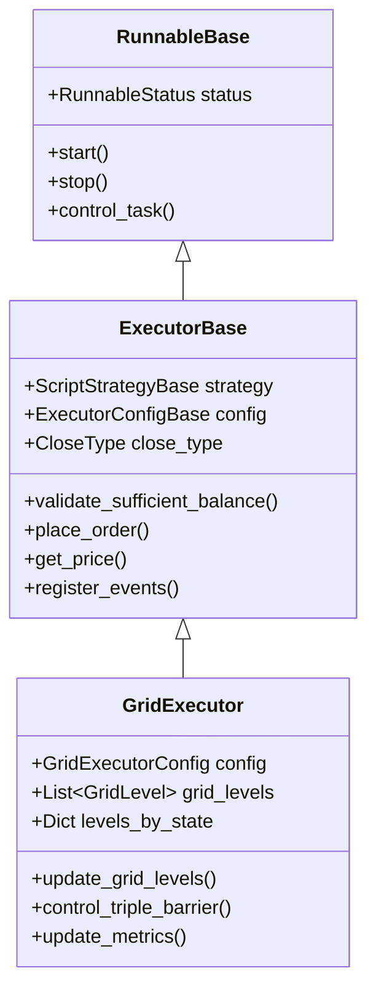
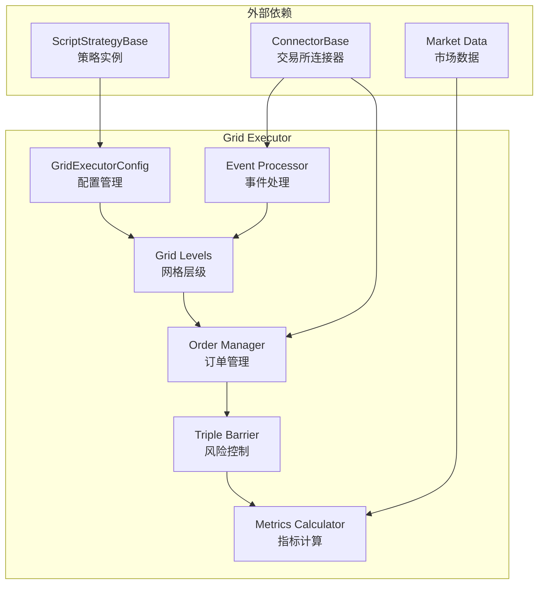
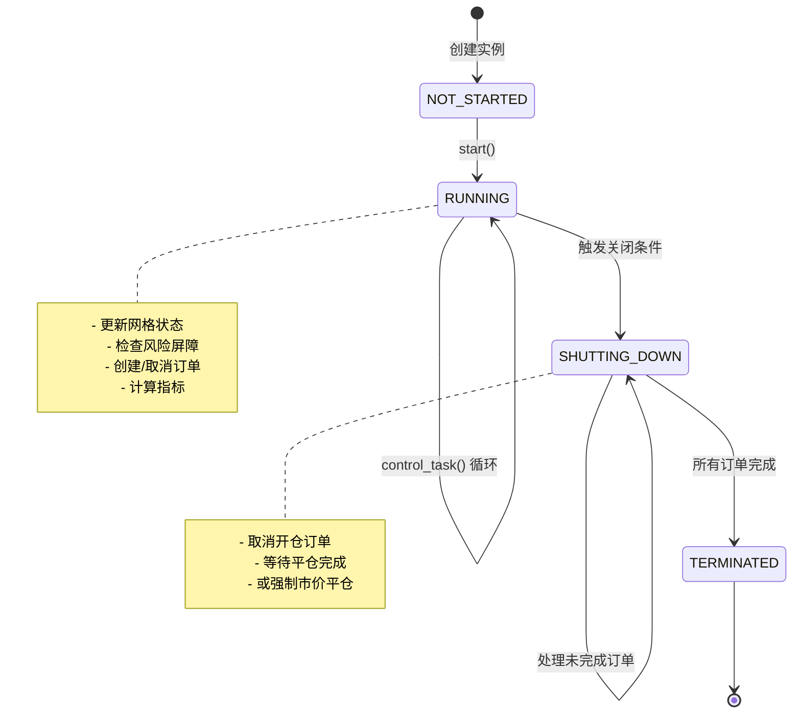
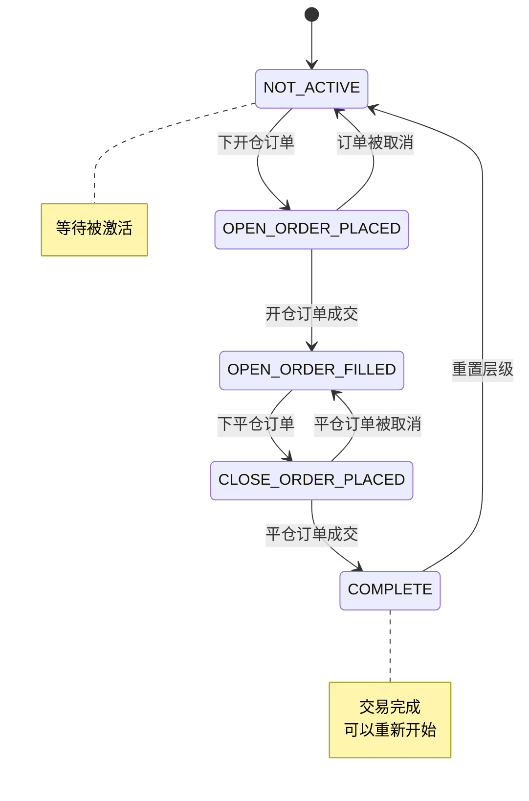
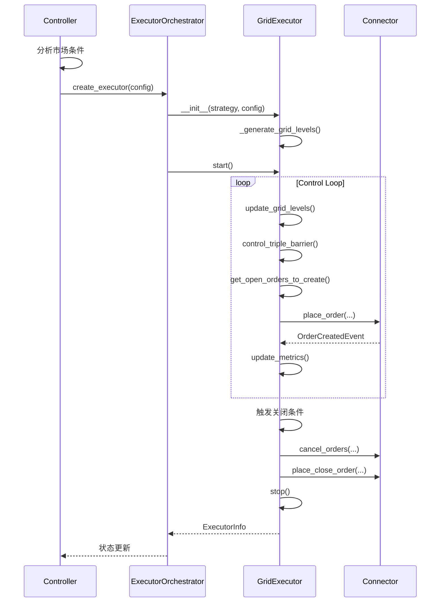
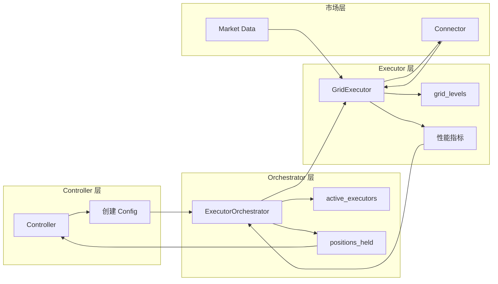

# 第 1 章：概述与架构设计

## 1.1 Grid Executor 简介

### 1.1.1 什么是 Grid Executor

Grid Executor 是 Hummingbot Strategy V2 框架中的一个核心执行器，专门用于实现网格交易策略。它通过在指定价格区间内创建多个价格层级（网格），在每个层级自动放置和管理买卖订单，从而在震荡市场中获取利润。

### 1.1.2 主要特性

- **自动网格生成**：根据价格区间和资金量自动计算最优网格层级
- **智能订单管理**：自动处理开仓和平仓订单的生命周期
- **多层风险控制**：集成 Triple Barrier 风险管理系统
- **实时性能监控**：持续跟踪仓位、盈亏和流动性指标
- **事件驱动架构**：响应订单事件，实时更新状态
- **现货/合约支持**：同时支持现货和永续合约交易

### 1.1.3 应用场景

Grid Executor 特别适合以下交易场景：

1. **震荡市场**：价格在一定区间内波动，适合高频买卖赚取差价
2. **做市策略**：在多个价格层级提供流动性
3. **套利策略**：配合 Controller 实现复杂的套利逻辑
4. **定投策略**：在价格下跌时分批建仓

## 1.2 继承结构

### 1.2.1 类继承关系

### 1.2.2 核心基类说明

**RunnableBase**

- 提供基础的生命周期管理
- 定义状态（NOT_STARTED、RUNNING、SHUTTING_DOWN、TERMINATED）
- 实现异步控制循环

**ExecutorBase**

- 提供订单管理的通用功能
- 实现事件监听和转发机制
- 提供交易规则和价格查询接口
- 管理与策略和连接器的交互

**GridExecutor**

- 实现网格特定的业务逻辑
- 管理网格层级和状态
- 实现 Triple Barrier 风险控制
- 计算和跟踪性能指标

## 1.3 核心组件概览

### 1.3.1 组件架构图

### 1.3.2 核心组件说明

**1. 配置管理 (GridExecutorConfig)**

- 定义网格的价格边界、资金分配、执行参数
- 配置风险管理规则
- 设置订单频率和数量限制

**2. 网格层级 (Grid Levels)**

- 生成均匀分布的价格层级
- 维护每个层级的状态（未激活、已下单、已成交等）
- 跟踪每个层级的订单信息

**3. 订单管理 (Order Manager)**

- 创建和调整订单候选
- 下单和撤单操作
- 管理开仓和平仓订单

**4. 风险控制 (Triple Barrier)**

- 止损控制
- 止盈控制
- 时间限制
- 追踪止损

**5. 指标计算 (Metrics Calculator)**

- 仓位大小和盈亏
- 已实现和未实现 PnL
- 流动性统计
- 手续费跟踪

**6. 事件处理 (Event Processor)**

- 监听订单创建、成交、取消事件
- 更新网格层级状态
- 同步订单信息

## 1.4 生命周期状态机

### 1.4.1 Executor 生命周期

### 1.4.2 关闭条件

Grid Executor 会在以下情况下进入 SHUTTING_DOWN 状态：

1. **止损触发**：`position_pnl_pct <= -stop_loss`
2. **止盈触发**：价格突破网格边界
3. **时间限制**：超过配置的时间限制
4. **追踪止损**：盈利回撤超过阈值
5. **限价保护**：价格触及限价
6. **手动停止**：调用 `early_stop()`

### 1.4.3 网格层级状态

## 1.5 Controller-Executor 协作模式

### 1.5.1 职责分离

Grid Executor 采用 Controller-Executor 模式，清晰地分离决策和执行：

**Controller 职责**

- 分析市场条件
- 决定是否创建 Executor
- 配置 Executor 参数
- 监控和管理多个 Executor
- 汇总和展示整体状态

**Executor 职责**

- 生成网格层级
- 管理订单生命周期
- 执行风险控制
- 计算性能指标
- 独立完成交易任务

### 1.5.2 交互流程

### 1.5.3 数据流向

## 1.6 设计理念

### 1.6.1 模块化设计

Grid Executor 遵循单一职责原则，每个方法都专注于特定功能：

- **网格生成**：`_generate_grid_levels()`
- **订单管理**：`adjust_and_place_open_order()`, `adjust_and_place_close_order()`
- **风险控制**：`control_triple_barrier()`
- **指标计算**：`update_position_metrics()`, `update_realized_pnl_metrics()`
- **事件处理**：`process_order_*_event()`

### 1.6.2 状态驱动

Grid Executor 使用状态机管理复杂的业务逻辑：

- 网格层级状态：`GridLevelStates`
- Executor 状态：`RunnableStatus`
- 关闭类型：`CloseType`

状态转换清晰，易于调试和维护。

### 1.6.3 事件驱动

通过事件转发器机制，Grid Executor 能够及时响应市场变化：

- 订单创建事件 → 更新 TrackedOrder
- 订单成交事件 → 更新网格状态
- 订单取消事件 → 重置层级状态

### 1.6.4 防御性编程

代码中包含大量的边界检查和异常处理：

- 余额验证：`validate_sufficient_balance()`
- 订单调整：`adjust_order_candidates()`
- 重试机制：`max_retries`
- 状态一致性检查

## 1.7 与其他 Executor 的对比

### 1.7.1 Position Executor

- **Position Executor**：单一仓位管理，简单的开平仓逻辑
- **Grid Executor**：多层级管理，复杂的网格状态维护

### 1.7.2 DCA Executor

- **DCA Executor**：定投执行器，按时间或价格间隔建仓
- **Grid Executor**：双向网格，同时管理买卖订单

### 1.7.3 TWAP Executor

- **TWAP Executor**：时间加权平均价格执行，分批执行大额订单
- **Grid Executor**：价格区间执行，利用震荡获利

## 1.8 关键设计决策

### 1.8.1 为什么使用层级状态？

使用 `GridLevel` 和 `GridLevelStates` 可以：

- 独立管理每个价格层级
- 清晰地跟踪订单状态
- 支持层级重用（完成后重置）
- 简化复杂的订单逻辑

### 1.8.2 为什么分离开仓和平仓？

- 允许不同的订单类型（LIMIT 开仓，LIMIT/MARKET 平仓）
- 支持独立的价格调整策略
- 便于实现追踪止盈
- 符合风险管理最佳实践

### 1.8.3 为什么需要 activation_bounds？

`activation_bounds` 参数限制订单只在价格附近创建：

- 减少无效订单（远离市价的订单成交概率低）
- 降低资金占用
- 提高资金利用率
- 动态适应市场波动

### 1.8.4 为什么使用 Triple Barrier？

Triple Barrier 提供多层风险保护：

- **止损**：保护下行风险
- **止盈**：锁定利润
- **时间限制**：避免长期占用资金
- **追踪止损**：保护已实现利润

## 1.9 性能特点

### 1.9.1 订单效率

- 批量下单支持：`max_orders_per_batch`
- 订单频率控制：`order_frequency`
- 智能订单取消：只取消超出 activation_bounds 的订单

### 1.9.2 计算优化

- 增量更新状态：只更新变化的层级
- 延迟计算：仅在需要时计算指标
- 缓存交易规则：避免重复查询

### 1.9.3 内存管理

- 限制历史订单数量
- 及时清理已完成层级
- 使用生成器处理大量数据

## 1.10 小结

本章介绍了 Grid Executor 的整体架构和设计理念：

- Grid Executor 是 Strategy V2 框架中的核心执行器
- 采用 Controller-Executor 分离模式
- 使用状态机和事件驱动架构
- 集成多层风险管理
- 支持现货和永续合约

在下一章中，我们将详细讲解 Grid Executor 的数据类型和配置参数。

---

**下一章**：[第 2 章：数据类型与配置详解](grid_executor_02.md)

**返回目录**：[教程索引](grid_executor_index.md)
