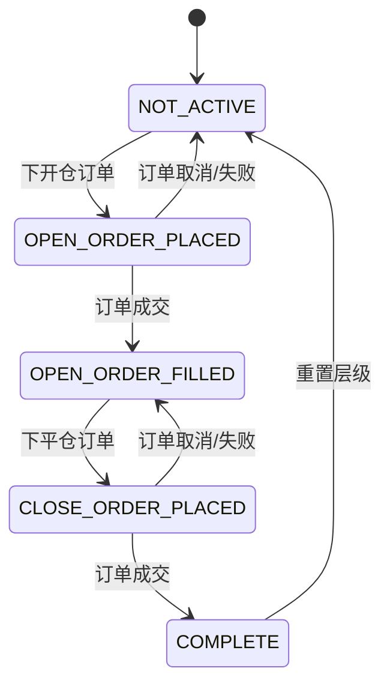

# 第 2 章：数据类型与配置详解

## 2.1 GridExecutorConfig 配置类

### 2.1.1 类定义

`GridExecutorConfig` 是 Grid Executor 的配置类，继承自 `ExecutorConfigBase`，定义了网格交易的所有参数。

```python
class GridExecutorConfig(ExecutorConfigBase):
    type: Literal["grid_executor"] = "grid_executor"
    # Boundaries - 价格边界
    connector_name: str
    trading_pair: str
    start_price: Decimal
    end_price: Decimal
    limit_price: Decimal
    side: TradeType = TradeType.BUY
    # Profiling - 资金配置
    total_amount_quote: Decimal
    min_spread_between_orders: Decimal = Decimal("0.0005")
    min_order_amount_quote: Decimal = Decimal("5")
    # Execution - 执行控制
    max_open_orders: int = 5
    max_orders_per_batch: Optional[int] = None
    order_frequency: int = 0
    activation_bounds: Optional[Decimal] = None
    safe_extra_spread: Decimal = Decimal("0.0001")
    # Risk Management - 风险管理
    triple_barrier_config: TripleBarrierConfig
    leverage: int = 20
    level_id: Optional[str] = None
    deduct_base_fees: bool = False
    keep_position: bool = False
    coerce_tp_to_step: bool = False
```

### 2.1.2 基础字段

**type**

- **类型**：`Literal["grid_executor"]`
- **默认值**：`"grid_executor"`
- **说明**：执行器类型标识，用于 ExecutorOrchestrator 识别和创建对应的执行器实例

**connector_name**

- **类型**：`str`
- **必填**：是
- **说明**：交易所连接器名称
- **示例**：`"binance_perpetual"`, `"binance"`, `"kucoin"`
- **注意**：必须是已配置且连接成功的交易所

**trading_pair**

- **类型**：`str`
- **必填**：是
- **说明**：交易对
- **格式**：`"BASE-QUOTE"`
- **示例**：`"BTC-USDT"`, `"ETH-USDT"`

### 2.1.3 价格边界参数

**start_price**

- **类型**：`Decimal`
- **必填**：是
- **说明**：网格起始价格（对于 BUY 是下边界，对于 SELL 是上边界）
- **示例**：`Decimal("100")`
- **约束**：必须 > 0

**end_price**

- **类型**：`Decimal`
- **必填**：是
- **说明**：网格结束价格（对于 BUY 是上边界，对于 SELL 是下边界）
- **示例**：`Decimal("110")`
- **约束**：
  - BUY 网格：`end_price > start_price`
  - SELL 网格：`end_price < start_price`

**limit_price**

- **类型**：`Decimal`
- **必填**：是
- **说明**：限价保护价格，触及时触发平仓或持仓
- **用途**：
  - BUY 网格：价格跌破 limit_price 时保护
  - SELL 网格：价格突破 limit_price 时保护
- **示例**：`Decimal("95")` (BUY 网格，低于 start_price)
- **配合参数**：`keep_position`

**side**

- **类型**：`TradeType`
- **默认值**：`TradeType.BUY`
- **可选值**：
  - `TradeType.BUY`：做多网格
  - `TradeType.SELL`：做空网格
- **说明**：网格方向

### 2.1.4 资金配置参数

**total_amount_quote**

- **类型**：`Decimal`
- **必填**：是
- **说明**：总投入资金（计价货币）
- **示例**：`Decimal("1000")` 表示投入 1000 USDT
- **注意**：
  - 现货：需要足够的计价货币（BUY）或基础货币（SELL）
  - 合约：需要足够的保证金（考虑杠杆）

**min_spread_between_orders**

- **类型**：`Decimal`
- **默认值**：`Decimal("0.0005")` (0.05%)
- **说明**：网格层级之间的最小价差百分比
- **用途**：确保网格层级有足够间距
- **示例**：
  - `Decimal("0.001")` = 0.1% 间距
  - `Decimal("0.005")` = 0.5% 间距

**min_order_amount_quote**

- **类型**：`Decimal`
- **默认值**：`Decimal("5")`
- **说明**：单个订单的最小金额（计价货币）
- **用途**：确保订单满足交易所最小名义价值要求
- **注意**：应 >= 交易所的 `min_notional_size`

### 2.1.5 执行控制参数

**max_open_orders**

- **类型**：`int`
- **默认值**：`5`
- **说明**：同时存在的最大开仓订单数
- **用途**：
  - 控制资金占用
  - 避免过度分散
  - 管理订单簿深度
- **建议**：
  - 小资金：3-5 个
  - 中等资金：5-10 个
  - 大资金：10-20 个

**max_orders_per_batch**

- **类型**：`Optional[int]`
- **默认值**：`None` (无限制)
- **说明**：每次控制循环最多创建的订单数
- **用途**：避免单次创建过多订单导致网络拥堵
- **示例**：`3` 表示每次最多创建 3 个订单

**order_frequency**

- **类型**：`int`
- **默认值**：`0` (无限制)
- **单位**：秒
- **说明**：两次下单之间的最小时间间隔
- **用途**：
  - 避免频繁下单
  - 降低手续费
  - 符合交易所限速要求
- **示例**：`10` 表示至少间隔 10 秒

**activation_bounds**

- **类型**：`Optional[Decimal]`
- **默认值**：`None` (无限制)
- **说明**：订单激活范围（相对于市价的百分比）
- **用途**：
  - 只在价格附近创建订单
  - 动态调整网格
  - 提高资金利用率
- **示例**：
  - `Decimal("0.02")` = 2%，只在市价 ±2% 范围内下单
  - `None` = 所有层级都可以下单

**工作机制**：

```python
# BUY 网格
activation_price = mid_price * (1 - activation_bounds)
# 只激活 price >= activation_price 的层级

# SELL 网格
activation_price = mid_price * (1 + activation_bounds)
# 只激活 price <= activation_price 的层级
```

**safe_extra_spread**

- **类型**：`Decimal`
- **默认值**：`Decimal("0.0001")` (0.01%)
- **说明**：订单价格的额外安全间距
- **用途**：确保订单价格不会与市价重叠，避免立即成交
- **应用场景**：
  - 开仓时：如果层级价格已被市价穿越，调整价格
  - 平仓时：如果止盈价格已被市价穿越，调整价格

### 2.1.6 风险管理参数

**triple_barrier_config**

- **类型**：`TripleBarrierConfig`
- **必填**：是
- **说明**：三重屏障风险管理配置
- **详见**：2.3 节 TripleBarrierConfig 详解

**leverage**

- **类型**：`int`
- **默认值**：`20`
- **说明**：杠杆倍数（仅用于永续合约）
- **约束**：1 <= leverage <= 交易所最大杠杆
- **注意**：
  - 现货交易忽略此参数
  - 高杠杆增加风险，建议谨慎使用

**level_id**

- **类型**：`Optional[str]`
- **默认值**：`None`
- **说明**：层级标识符（用于多层级策略）
- **用途**：在复杂策略中区分不同的网格实例

**deduct_base_fees**

- **类型**：`bool`
- **默认值**：`False`
- **说明**：是否从基础货币中扣除手续费
- **用途**：
  - 某些交易所手续费从基础货币扣除
  - 设为 `True` 时，平仓数量会扣除手续费
- **示例**：
  - 买入 1 BTC，手续费 0.001 BTC
  - `deduct_base_fees=True`：平仓数量 = 0.999 BTC
  - `deduct_base_fees=False`：平仓数量 = 1 BTC

**keep_position**

- **类型**：`bool`
- **默认值**：`False`
- **说明**：触及 limit_price 时是否保留仓位
- **用途**：
  - `False`：触及 limit_price 时市价平仓
  - `True`：触及 limit_price 时停止交易但保留仓位
- **应用场景**：长期持有策略，暂时退出网格但不平仓

**coerce_tp_to_step**

- **类型**：`bool`
- **默认值**：`False`
- **说明**：是否强制止盈距离等于网格步长
- **用途**：
  - `True`：`take_profit = max(step, triple_barrier_config.take_profit)`
  - `False`：`take_profit = triple_barrier_config.take_profit`
- **应用场景**：确保止盈价格不会过于接近开仓价格

## 2.2 GridLevel 网格层级类

### 2.2.1 类定义

```python
class GridLevel(BaseModel):
    id: str
    price: Decimal
    amount_quote: Decimal
    take_profit: Decimal
    side: TradeType
    open_order_type: OrderType
    take_profit_order_type: OrderType
    active_open_order: Optional[TrackedOrder] = None
    active_close_order: Optional[TrackedOrder] = None
    state: GridLevelStates = GridLevelStates.NOT_ACTIVE
    model_config = ConfigDict(arbitrary_types_allowed=True)
```

### 2.2.2 字段说明

**id**

- **类型**：`str`
- **说明**：层级唯一标识符
- **格式**：`"L{index}"`，如 `"L0"`, `"L1"`, `"L2"`

**price**

- **类型**：`Decimal`
- **说明**：该层级的开仓价格

**amount_quote**

- **类型**：`Decimal`
- **说明**：该层级的订单金额（计价货币）

**take_profit**

- **类型**：`Decimal`
- **说明**：止盈比例（小数形式）
- **示例**：`Decimal("0.01")` = 1% 止盈

**side**

- **类型**：`TradeType`
- **说明**：交易方向（BUY 或 SELL）

**open_order_type**

- **类型**：`OrderType`
- **说明**：开仓订单类型
- **常用值**：`OrderType.LIMIT`, `OrderType.LIMIT_MAKER`

**take_profit_order_type**

- **类型**：`OrderType`
- **说明**：平仓订单类型
- **常用值**：`OrderType.LIMIT`, `OrderType.LIMIT_MAKER`, `OrderType.MARKET`

**active_open_order**

- **类型**：`Optional[TrackedOrder]`
- **说明**：当前活跃的开仓订单
- **状态**：
  - `None`：无活跃开仓订单
  - `TrackedOrder`：有订单（待成交或已成交）

**active_close_order**

- **类型**：`Optional[TrackedOrder]`
- **说明**：当前活跃的平仓订单

**state**

- **类型**：`GridLevelStates`
- **说明**：当前层级状态
- **详见**：2.2.3 节

### 2.2.3 GridLevelStates 状态枚举

```python
class GridLevelStates(Enum):
    NOT_ACTIVE = "NOT_ACTIVE"
    OPEN_ORDER_PLACED = "OPEN_ORDER_PLACED"
    OPEN_ORDER_FILLED = "OPEN_ORDER_FILLED"
    CLOSE_ORDER_PLACED = "CLOSE_ORDER_PLACED"
    COMPLETE = "COMPLETE"
```

**状态说明**：

| 状态 | 说明 | 开仓订单 | 平仓订单 |
|------|------|----------|----------|
| NOT_ACTIVE | 未激活 | None | None |
| OPEN_ORDER_PLACED | 已下开仓订单 | 待成交 | None |
| OPEN_ORDER_FILLED | 开仓订单已成交 | 已成交 | None |
| CLOSE_ORDER_PLACED | 已下平仓订单 | 已成交 | 待成交 |
| COMPLETE | 完成 | 已成交 | 已成交 |

**状态转换图**：



### 2.2.4 GridLevel 方法

**update_state()**

```python
def update_state(self):
    if self.active_open_order is None:
        self.state = GridLevelStates.NOT_ACTIVE
    elif self.active_open_order.is_filled:
        self.state = GridLevelStates.OPEN_ORDER_FILLED
    else:
        self.state = GridLevelStates.OPEN_ORDER_PLACED
    if self.active_close_order is not None:
        if self.active_close_order.is_filled:
            self.state = GridLevelStates.COMPLETE
        else:
            self.state = GridLevelStates.CLOSE_ORDER_PLACED
```

根据订单状态自动更新层级状态。

**reset_open_order()**

```python
def reset_open_order(self):
    self.active_open_order = None
    self.state = GridLevelStates.NOT_ACTIVE
```

重置开仓订单，用于订单取消或失败后。

**reset_close_order()**

```python
def reset_close_order(self):
    self.active_close_order = None
    self.state = GridLevelStates.OPEN_ORDER_FILLED
```

重置平仓订单，用于平仓订单取消或失败后。

**reset_level()**

```python
def reset_level(self):
    self.active_open_order = None
    self.active_close_order = None
    self.state = GridLevelStates.NOT_ACTIVE
```

完全重置层级，用于交易完成后重新开始。

## 2.3 TripleBarrierConfig 风险配置

### 2.3.1 类定义

```python
class TripleBarrierConfig(BaseModel):
    stop_loss: Optional[Decimal] = None
    take_profit: Optional[Decimal] = None
    time_limit: Optional[int] = None
    trailing_stop: Optional[TrailingStop] = None
    open_order_type: OrderType = OrderType.LIMIT
    take_profit_order_type: OrderType = OrderType.MARKET
    stop_loss_order_type: OrderType = OrderType.MARKET
    time_limit_order_type: OrderType = OrderType.MARKET
```

### 2.3.2 风险参数

**stop_loss**

- **类型**：`Optional[Decimal]`
- **默认值**：`None` (无止损)
- **说明**：止损比例（小数形式）
- **触发条件**：`position_pnl_pct <= -stop_loss`
- **示例**：
  - `Decimal("0.05")` = 5% 止损
  - `None` = 不设止损
- **注意**：Grid Executor 中止损是基于整体仓位的 PnL

**take_profit**

- **类型**：`Optional[Decimal]`
- **默认值**：`None`
- **说明**：单个层级的止盈比例
- **用途**：每个网格层级的止盈目标
- **示例**：`Decimal("0.01")` = 1% 止盈
- **计算**：
  - BUY：`tp_price = entry_price * (1 + take_profit)`
  - SELL：`tp_price = entry_price * (1 - take_profit)`

**time_limit**

- **类型**：`Optional[int]`
- **默认值**：`None` (无时间限制)
- **单位**：秒
- **说明**：最大持有时间
- **触发条件**：`current_time >= start_time + time_limit`
- **示例**：
  - `3600` = 1 小时
  - `86400` = 24 小时

**trailing_stop**

- **类型**：`Optional[TrailingStop]`
- **默认值**：`None` (无追踪止损)
- **说明**：追踪止损配置
- **详见**：2.3.3 节

### 2.3.3 TrailingStop 追踪止损

```python
class TrailingStop(BaseModel):
    activation_price: Decimal
    trailing_delta: Decimal
```

**activation_price**

- **类型**：`Decimal`
- **说明**：激活追踪止损的盈利比例
- **示例**：`Decimal("0.02")` = 盈利达到 2% 时激活

**trailing_delta**

- **类型**：`Decimal`
- **说明**：追踪止损的回撤容忍度
- **示例**：`Decimal("0.01")` = 从最高点回撤 1% 时触发

**工作机制**：

```python
if position_pnl_pct > activation_price:
    # 激活追踪止损
    trigger_pct = position_pnl_pct - trailing_delta

    if position_pnl_pct < trigger_pct:
        # 触发止损
        close_position()
    elif position_pnl_pct > previous_max:
        # 更新触发点
        trigger_pct = position_pnl_pct - trailing_delta
```

**示例**：

```python
trailing_stop = TrailingStop(
    activation_price=Decimal("0.03"),  # 3% 激活
    trailing_delta=Decimal("0.01")     # 1% 回撤
)

# 场景：
# - 盈利达到 3%，激活追踪止损，触发点 = 2%
# - 盈利上升到 5%，更新触发点 = 4%
# - 盈利回落到 3.5%，不触发（> 4% 触发点）
# - 盈利回落到 3.9%，触发止损（< 4% 触发点）
```

### 2.3.4 订单类型参数

**open_order_type**

- **类型**：`OrderType`
- **默认值**：`OrderType.LIMIT`
- **说明**：开仓订单类型
- **推荐值**：
  - `OrderType.LIMIT_MAKER`：确保作为 maker，享受手续费返还
  - `OrderType.LIMIT`：普通限价单

**take_profit_order_type**

- **类型**：`OrderType`
- **默认值**：`OrderType.MARKET`
- **说明**：止盈订单类型
- **选项**：
  - `OrderType.LIMIT` / `OrderType.LIMIT_MAKER`：限价止盈
  - `OrderType.MARKET`：市价止盈（确保成交）

**stop_loss_order_type**

- **类型**：`OrderType`
- **默认值**：`OrderType.MARKET`
- **说明**：止损订单类型
- **注意**：Grid Executor 要求必须是 `OrderType.MARKET`

**time_limit_order_type**

- **类型**：`OrderType`
- **默认值**：`OrderType.MARKET`
- **说明**：时间限制触发的订单类型
- **注意**：Grid Executor 要求必须是 `OrderType.MARKET`

## 2.4 配置示例

### 2.4.1 基础 BUY 网格配置

```python
from decimal import Decimal
from hummingbot.core.data_type.common import OrderType, TradeType
from hummingbot.strategy_v2.executors.grid_executor.data_types import GridExecutorConfig
from hummingbot.strategy_v2.executors.position_executor.data_types import TripleBarrierConfig

# 创建 Triple Barrier 配置
triple_barrier = TripleBarrierConfig(
    stop_loss=Decimal("0.05"),           # 5% 整体止损
    take_profit=Decimal("0.01"),         # 1% 层级止盈
    time_limit=3600,                     # 1 小时时间限制
    open_order_type=OrderType.LIMIT_MAKER,
    take_profit_order_type=OrderType.LIMIT_MAKER,
)

# 创建 Grid Executor 配置
config = GridExecutorConfig(
    timestamp=time.time(),
    connector_name="binance_perpetual",
    trading_pair="BTC-USDT",
    side=TradeType.BUY,
    start_price=Decimal("40000"),        # 网格下界
    end_price=Decimal("42000"),          # 网格上界
    limit_price=Decimal("38000"),        # 止损保护价
    total_amount_quote=Decimal("1000"),  # 投入 1000 USDT
    min_spread_between_orders=Decimal("0.002"),  # 0.2% 最小间距
    min_order_amount_quote=Decimal("10"),
    max_open_orders=5,
    activation_bounds=Decimal("0.01"),   # 1% 激活范围
    leverage=10,
    triple_barrier_config=triple_barrier,
)
```

### 2.4.2 高频小网格配置

```python
# 高频网格：小间距，多订单，快速周转
triple_barrier = TripleBarrierConfig(
    take_profit=Decimal("0.003"),        # 0.3% 止盈
    open_order_type=OrderType.LIMIT_MAKER,
    take_profit_order_type=OrderType.LIMIT_MAKER,
)

config = GridExecutorConfig(
    timestamp=time.time(),
    connector_name="binance_perpetual",
    trading_pair="BTC-USDT",
    side=TradeType.BUY,
    start_price=Decimal("40000"),
    end_price=Decimal("40500"),          # 较小区间
    limit_price=Decimal("39500"),
    total_amount_quote=Decimal("5000"),
    min_spread_between_orders=Decimal("0.001"),  # 0.1% 间距
    max_open_orders=10,                  # 更多订单
    max_orders_per_batch=3,
    order_frequency=5,                   # 5 秒下单频率
    activation_bounds=Decimal("0.005"),  # 0.5% 激活范围
    leverage=20,
    triple_barrier_config=triple_barrier,
)
```

### 2.4.3 带追踪止损的配置

```python
from hummingbot.strategy_v2.executors.position_executor.data_types import TrailingStop

# 使用追踪止损保护利润
trailing_stop = TrailingStop(
    activation_price=Decimal("0.02"),    # 2% 激活
    trailing_delta=Decimal("0.01"),      # 1% 回撤触发
)

triple_barrier = TripleBarrierConfig(
    stop_loss=Decimal("0.03"),
    take_profit=Decimal("0.01"),
    trailing_stop=trailing_stop,
    open_order_type=OrderType.LIMIT_MAKER,
    take_profit_order_type=OrderType.LIMIT_MAKER,
)

config = GridExecutorConfig(
    timestamp=time.time(),
    connector_name="binance_perpetual",
    trading_pair="ETH-USDT",
    side=TradeType.BUY,
    start_price=Decimal("2000"),
    end_price=Decimal("2100"),
    limit_price=Decimal("1950"),
    total_amount_quote=Decimal("2000"),
    leverage=15,
    triple_barrier_config=triple_barrier,
)
```

### 2.4.4 SELL 网格配置（做空）

```python
# 做空网格配置
triple_barrier = TripleBarrierConfig(
    stop_loss=Decimal("0.05"),
    take_profit=Decimal("0.01"),
    open_order_type=OrderType.LIMIT_MAKER,
    take_profit_order_type=OrderType.LIMIT_MAKER,
)

config = GridExecutorConfig(
    timestamp=time.time(),
    connector_name="binance_perpetual",
    trading_pair="BTC-USDT",
    side=TradeType.SELL,                 # 做空
    start_price=Decimal("42000"),        # 做空：起始价格是上界
    end_price=Decimal("40000"),          # 做空：结束价格是下界
    limit_price=Decimal("43000"),        # 做空：限价高于起始价
    total_amount_quote=Decimal("1000"),
    leverage=10,
    triple_barrier_config=triple_barrier,
)
```

### 2.4.5 保留仓位配置

```python
# 触及限价时保留仓位而不平仓
triple_barrier = TripleBarrierConfig(
    take_profit=Decimal("0.01"),
    open_order_type=OrderType.LIMIT_MAKER,
    take_profit_order_type=OrderType.LIMIT_MAKER,
)

config = GridExecutorConfig(
    timestamp=time.time(),
    connector_name="binance_perpetual",
    trading_pair="BTC-USDT",
    side=TradeType.BUY,
    start_price=Decimal("40000"),
    end_price=Decimal("42000"),
    limit_price=Decimal("38000"),
    total_amount_quote=Decimal("1000"),
    leverage=10,
    keep_position=True,                  # 保留仓位
    triple_barrier_config=triple_barrier,
)
```

## 2.5 配置最佳实践

### 2.5.1 价格区间设置

**原则**：

1. 根据历史波动率设置区间宽度
2. 避免区间过大（网格稀疏）或过小（频繁触及边界）
3. 考虑手续费成本

**建议**：

```python
# 低波动资产（稳定币对）
grid_range = 0.02  # 2%

# 中等波动资产（主流币）
grid_range = 0.05  # 5%

# 高波动资产（山寨币）
grid_range = 0.10  # 10%
```

### 2.5.2 资金分配

**单层级金额**：

```python
# 预估单层级金额
estimated_levels = (end_price - start_price) / (start_price * min_spread_between_orders)
amount_per_level = total_amount_quote / estimated_levels

# 确保满足最小订单要求
assert amount_per_level >= min_order_amount_quote
```

**总资金**：

```python
# 现货：需要全额资金
required_quote = total_amount_quote

# 合约：考虑杠杆
required_margin = total_amount_quote / leverage
```

### 2.5.3 止盈止损设置

**层级止盈**：

```python
# 至少覆盖双边手续费
maker_fee = 0.0002  # 0.02%
taker_fee = 0.0005  # 0.05%
min_take_profit = (maker_fee + taker_fee) * 2  # 0.14%

take_profit = max(min_take_profit, Decimal("0.005"))  # 至少 0.5%
```

**整体止损**：

```python
# 根据风险承受能力设置
conservative_stop_loss = Decimal("0.02")  # 2%
moderate_stop_loss = Decimal("0.05")      # 5%
aggressive_stop_loss = Decimal("0.10")    # 10%
```

### 2.5.4 激活范围优化

**动态激活范围**：

```python
# 根据网格步长设置
step = (end_price - start_price) / start_price / estimated_levels
activation_bounds = step * 2  # 激活范围 = 2 倍步长

# 或根据波动率设置
volatility = calculate_volatility()  # 假设有波动率计算
activation_bounds = volatility * 0.5  # 半个波动率
```

### 2.5.5 常见错误

**错误 1：止盈过小**

```python
# 错误：止盈 0.1%，无法覆盖手续费
triple_barrier = TripleBarrierConfig(take_profit=Decimal("0.001"))

# 正确：止盈 0.5%，覆盖手续费并有盈利空间
triple_barrier = TripleBarrierConfig(take_profit=Decimal("0.005"))
```

**错误 2：网格区间方向错误**

```python
# 错误：BUY 网格但 end_price < start_price
config = GridExecutorConfig(
    side=TradeType.BUY,
    start_price=Decimal("42000"),
    end_price=Decimal("40000"),  # 错误！
)

# 正确
config = GridExecutorConfig(
    side=TradeType.BUY,
    start_price=Decimal("40000"),
    end_price=Decimal("42000"),
)
```

**错误 3：资金不足**

```python
# 错误：总金额 100，但最小订单要求 50，只能创建 2 个层级
config = GridExecutorConfig(
    total_amount_quote=Decimal("100"),
    min_order_amount_quote=Decimal("50"),
)

# 正确：总金额 500，可以创建多个层级
config = GridExecutorConfig(
    total_amount_quote=Decimal("500"),
    min_order_amount_quote=Decimal("50"),
)
```

## 2.6 小结

本章详细介绍了 Grid Executor 的所有配置参数和数据类型：

- **GridExecutorConfig**：主配置类，包含价格边界、资金配置、执行控制和风险管理参数
- **GridLevel**：网格层级数据结构，跟踪单个价格层级的状态和订单
- **GridLevelStates**：层级状态枚举，定义清晰的状态转换
- **TripleBarrierConfig**：风险管理配置，提供多层保护

理解这些配置是使用 Grid Executor 的基础。在下一章中，我们将深入探讨初始化流程和网格生成算法。

---

**上一章**：[第 1 章：概述与架构设计](grid_executor_01.md)

**下一章**：[第 3 章：初始化与网格生成算法](grid_executor_03.md)

**返回目录**：[教程索引](grid_executor_index.md)
