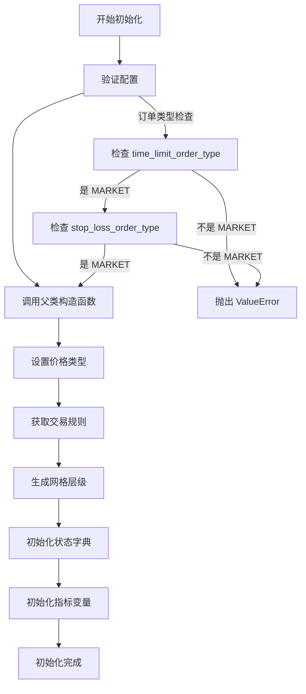
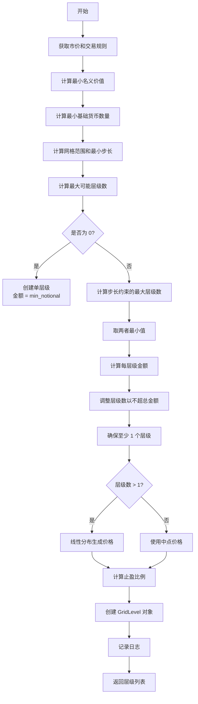

# 第 3 章：初始化与网格生成算法

## 3.1 构造函数分析

### 3.1.1 `__init__` 方法签名

```python
def __init__(self, strategy: ScriptStrategyBase, config: GridExecutorConfig,
             update_interval: float = 1.0, max_retries: int = 10):
```

**参数说明**：

- `strategy`：策略实例，提供市场数据和订单接口
- `config`：Grid Executor 配置
- `update_interval`：控制循环更新间隔（秒）
- `max_retries`：最大重试次数

### 3.1.2 初始化流程



### 3.1.3 源码解析

```python
def __init__(self, strategy: ScriptStrategyBase, config: GridExecutorConfig,
             update_interval: float = 1.0, max_retries: int = 10):
    # 1. 保存配置
    self.config: GridExecutorConfig = config

    # 2. 验证订单类型（Grid Executor 限制）
    if config.triple_barrier_config.time_limit_order_type != OrderType.MARKET or \
            config.triple_barrier_config.stop_loss_order_type != OrderType.MARKET:
        error = "Only market orders are supported for time_limit and stop_loss"
        self.logger().error(error)
        raise ValueError(error)

    # 3. 调用父类构造函数
    super().__init__(strategy=strategy, config=config, connectors=[config.connector_name],
                     update_interval=update_interval)

    # 4. 设置价格类型（用于获取盘口价格）
    # BUY: 使用 BestBid 开仓，BestAsk 平仓
    # SELL: 使用 BestAsk 开仓，BestBid 平仓
    self.open_order_price_type = PriceType.BestBid if config.side == TradeType.BUY else PriceType.BestAsk
    self.close_order_price_type = PriceType.BestAsk if config.side == TradeType.BUY else PriceType.BestBid
    self.close_order_side = TradeType.BUY if config.side == TradeType.SELL else TradeType.SELL

    # 5. 获取交易规则
    self.trading_rules = self.get_trading_rules(self.config.connector_name, self.config.trading_pair)

    # 6. 生成网格层级（核心算法）
    self.grid_levels = self._generate_grid_levels()

    # 7. 初始化按状态分类的层级字典
    self.levels_by_state = {state: [] for state in GridLevelStates}

    # 8. 初始化订单追踪
    self._close_order: Optional[TrackedOrder] = None
    self._filled_orders = []
    self._failed_orders = []
    self._canceled_orders = []

    # 9. 初始化指标变量
    self.step = Decimal("0")
    self.position_break_even_price = Decimal("0")
    self.position_size_base = Decimal("0")
    self.position_size_quote = Decimal("0")
    self.position_fees_quote = Decimal("0")
    self.position_pnl_quote = Decimal("0")
    self.position_pnl_pct = Decimal("0")
    self.open_liquidity_placed = Decimal("0")
    self.close_liquidity_placed = Decimal("0")
    self.realized_buy_size_quote = Decimal("0")
    self.realized_sell_size_quote = Decimal("0")
    self.realized_imbalance_quote = Decimal("0")
    self.realized_fees_quote = Decimal("0")
    self.realized_pnl_quote = Decimal("0")
    self.realized_pnl_pct = Decimal("0")
    self.max_open_creation_timestamp = 0
    self.max_close_creation_timestamp = 0
    self._open_fee_in_base = False

    # 10. 初始化追踪止损和重试计数
    self._trailing_stop_trigger_pct: Optional[Decimal] = None
    self._current_retries = 0
    self._max_retries = max_retries
```

### 3.1.4 关键设计决策

**为什么限制订单类型？**

```python
# 止损和时间限制必须使用市价单
if config.triple_barrier_config.time_limit_order_type != OrderType.MARKET or \
        config.triple_barrier_config.stop_loss_order_type != OrderType.MARKET:
    raise ValueError("Only market orders are supported for time_limit and stop_loss")
```

原因：

1. **确保执行**：止损和时间限制是紧急退出，必须立即成交
2. **避免滑点风险**：限价单可能无法成交，导致无法止损
3. **简化逻辑**：统一使用市价单简化代码

**价格类型选择**：

```python
# BUY 网格
self.open_order_price_type = PriceType.BestBid   # 开仓：买方最高价
self.close_order_price_type = PriceType.BestAsk  # 平仓：卖方最低价

# SELL 网格
self.open_order_price_type = PriceType.BestAsk   # 开仓：卖方最低价
self.close_order_price_type = PriceType.BestBid  # 平仓：买方最高价
```

目的：获取更有利的价格参考点

## 3.2 网格生成算法

### 3.2.1 `_generate_grid_levels()` 概览

这是 Grid Executor 最核心的算法，负责：

1. 计算最小订单要求
2. 确定最优层级数量
3. 生成价格分布
4. 创建 GridLevel 对象

### 3.2.2 算法流程图



### 3.2.3 详细源码解析

#### 步骤 1：获取基础数据

```python
def _generate_grid_levels(self):
    grid_levels = []

    # 获取当前市场价格
    price = self.get_price(self.config.connector_name, self.config.trading_pair, PriceType.MidPrice)

    # 从交易规则获取约束
    min_notional = max(
        self.config.min_order_amount_quote,     # 配置的最小金额
        self.trading_rules.min_notional_size    # 交易所要求的最小名义价值
    )
    min_base_increment = self.trading_rules.min_base_amount_increment  # 最小数量增量
```

**交易规则示例**：

```python
# Binance BTC-USDT 交易规则
trading_rules = TradingRule(
    trading_pair="BTC-USDT",
    min_order_size=Decimal("0.00001"),         # 最小订单数量 (BTC)
    min_notional_size=Decimal("5"),            # 最小名义价值 (USDT)
    min_base_amount_increment=Decimal("0.00001"),  # 数量步长
    min_price_increment=Decimal("0.01"),       # 价格步长
)
```

#### 步骤 2：计算最小订单金额（含安全边际）

```python
# 添加 5% 的安全边际，防止价格波动导致订单被拒绝
min_notional_with_margin = min_notional * Decimal("1.05")

# 计算满足名义价值要求的最小基础货币数量
min_base_amount = max(
    min_notional_with_margin / price,  # 从名义价值计算
    min_base_increment * Decimal(str(math.ceil(
        float(min_notional) / float(min_base_increment * price)
    )))  # 从数量步长计算
)

# 量化到最小增量
min_base_amount = Decimal(
    str(math.ceil(float(min_base_amount) / float(min_base_increment)))
) * min_base_increment

# 验证量化后的金额
min_quote_amount = min_base_amount * price
```

**为什么需要安全边际？**

```python
# 场景：价格波动导致订单被拒
price_at_calculation = 100
min_notional = 5
amount = 5 / 100 = 0.05

# 下单时价格变为 99
order_value = 0.05 * 99 = 4.95  # < 5，订单被拒！

# 使用安全边际
amount = (5 * 1.05) / 100 = 0.0525
order_value = 0.0525 * 99 = 5.1975  # > 5，通过验证
```

#### 步骤 3：计算网格范围和步长约束

```python
# 计算网格价格范围（百分比）
grid_range = (self.config.end_price - self.config.start_price) / self.config.start_price

# 计算最小步长（取配置值和交易规则的较大者）
min_step_size = max(
    self.config.min_spread_between_orders,     # 配置的最小间距
    self.trading_rules.min_price_increment / price  # 交易规则的价格步长转换为百分比
)
```

**示例**：

```python
# BTC-USDT 网格
start_price = 40000
end_price = 42000
grid_range = (42000 - 40000) / 40000 = 0.05  # 5%

# 最小步长
config_min_spread = 0.002  # 0.2%
price_increment = 0.01
price_increment_pct = 0.01 / 40000 = 0.00000025  # 0.000025%

min_step_size = max(0.002, 0.00000025) = 0.002  # 0.2%
```

#### 步骤 4：计算最优层级数量

```python
# 基于总金额的最大层级数
max_possible_levels = int(self.config.total_amount_quote / min_quote_amount)

if max_possible_levels == 0:
    # 资金不足以创建一个标准层级，创建单层级
    n_levels = 1
    quote_amount_per_level = min_quote_amount
else:
    # 基于步长约束的最大层级数
    max_levels_by_step = int(grid_range / min_step_size)

    # 取两者最小值
    n_levels = min(max_possible_levels, max_levels_by_step)

    # 计算每层级金额（向下取整到最小增量）
    base_amount_per_level = max(
        min_base_amount,
        Decimal(str(math.floor(
            float(self.config.total_amount_quote / (price * n_levels)) /
            float(min_base_increment)
        ))) * min_base_increment
    )

    quote_amount_per_level = base_amount_per_level * price

    # 确保不超过总金额
    n_levels = min(n_levels, int(float(self.config.total_amount_quote) / float(quote_amount_per_level)))

# 确保至少有一个层级
n_levels = max(1, n_levels)
```

**计算示例**：

```python
# 配置
total_amount_quote = 1000 USDT
start_price = 40000
end_price = 42000
price = 41000
min_quote_amount = 10 USDT
min_step_size = 0.002  # 0.2%

# 计算
grid_range = 0.05  # 5%
max_possible_levels = 1000 / 10 = 100
max_levels_by_step = 0.05 / 0.002 = 25

# 取最小值
n_levels = min(100, 25) = 25

# 每层级金额
base_amount_per_level = 1000 / (41000 * 25) = 0.000975 BTC
# 量化后
base_amount_per_level = 0.000975 BTC (假设步长足够小)
quote_amount_per_level = 0.000975 * 41000 = 39.975 USDT

# 最终层级数
n_levels = min(25, int(1000 / 39.975)) = min(25, 25) = 25
```

#### 步骤 5：生成价格分布

```python
# 生成价格层级
if n_levels > 1:
    # 多层级：使用线性分布
    prices = Distributions.linear(n_levels, float(self.config.start_price), float(self.config.end_price))
    self.step = grid_range / (n_levels - 1)
else:
    # 单层级：使用区间中点
    mid_price = (self.config.start_price + self.config.end_price) / 2
    prices = [mid_price]
    self.step = grid_range
```

**Distributions.linear 解析**：

```python
# 在 [start, end] 区间生成 n 个等间距的点
def linear(n: int, start: float, end: float) -> List[Decimal]:
    step = (end - start) / (n - 1) if n > 1 else 0
    return [Decimal(str(start + i * step)) for i in range(n)]

# 示例
linear(5, 40000, 42000)
# 返回: [40000, 40500, 41000, 41500, 42000]
```

#### 步骤 6：计算止盈比例

```python
# 如果启用 coerce_tp_to_step，止盈至少等于步长
take_profit = max(self.step, self.config.triple_barrier_config.take_profit) \
    if self.config.coerce_tp_to_step \
    else self.config.triple_barrier_config.take_profit
```

**为什么需要 coerce_tp_to_step？**

```python
# 场景 1：步长 > 止盈
step = 0.02  # 2%
config_take_profit = 0.01  # 1%

# 不使用 coerce_tp_to_step
# 问题：止盈价格可能在相邻网格之间，导致订单相互干扰
entry_price = 40000
tp_price = 40000 * (1 + 0.01) = 40400
next_level_price = 40000 * (1 + 0.02) = 40800
# 40400 在 40000 和 40800 之间

# 使用 coerce_tp_to_step
take_profit = max(0.02, 0.01) = 0.02
tp_price = 40000 * (1 + 0.02) = 40800
# 止盈价格 = 下一个网格层级，避免干扰
```

#### 步骤 7：创建 GridLevel 对象

```python
for i, price in enumerate(prices):
    grid_levels.append(
        GridLevel(
            id=f"L{i}",                          # 层级 ID: L0, L1, L2, ...
            price=price,                         # 开仓价格
            amount_quote=quote_amount_per_level, # 订单金额
            take_profit=take_profit,             # 止盈比例
            side=self.config.side,               # 交易方向
            open_order_type=self.config.triple_barrier_config.open_order_type,
            take_profit_order_type=self.config.triple_barrier_config.take_profit_order_type,
        )
    )
```

#### 步骤 8：记录日志

```python
self.logger().info(
    f"Created {len(grid_levels)} grid levels with "
    f"amount per level: {quote_amount_per_level:.4f} {self.config.trading_pair.split('-')[1]} "
    f"(base amount: {(quote_amount_per_level / price):.8f} {self.config.trading_pair.split('-')[0]})"
)

return grid_levels
```

### 3.2.4 完整示例

**输入配置**：

```python
config = GridExecutorConfig(
    connector_name="binance_perpetual",
    trading_pair="BTC-USDT",
    side=TradeType.BUY,
    start_price=Decimal("40000"),
    end_price=Decimal("42000"),
    total_amount_quote=Decimal("1000"),
    min_spread_between_orders=Decimal("0.002"),  # 0.2%
    min_order_amount_quote=Decimal("10"),
    triple_barrier_config=TripleBarrierConfig(
        take_profit=Decimal("0.01"),
        open_order_type=OrderType.LIMIT_MAKER,
        take_profit_order_type=OrderType.LIMIT_MAKER,
    ),
)
```

**生成结果**：

```python
# 假设当前价格 = 41000
# 交易规则：min_notional_size = 5, min_base_amount_increment = 0.00001

# 计算过程
min_notional = max(10, 5) = 10
min_notional_with_margin = 10 * 1.05 = 10.5
min_base_amount = 10.5 / 41000 = 0.000256 BTC
min_quote_amount = 0.000256 * 41000 = 10.5 USDT

grid_range = (42000 - 40000) / 40000 = 0.05  # 5%
min_step_size = 0.002  # 0.2%

max_possible_levels = 1000 / 10.5 = 95
max_levels_by_step = 0.05 / 0.002 = 25
n_levels = min(95, 25) = 25

base_amount_per_level = 1000 / (41000 * 25) = 0.000975 BTC
quote_amount_per_level = 0.000975 * 41000 = 39.975 USDT

# 生成价格
prices = linear(25, 40000, 42000)
# [40000, 40083.33, 40166.67, ..., 41916.67, 42000]

step = 0.05 / 24 = 0.00208  # 0.208%

# 创建 25 个 GridLevel
grid_levels = [
    GridLevel(id="L0", price=40000, amount_quote=39.975, take_profit=0.01, ...),
    GridLevel(id="L1", price=40083.33, amount_quote=39.975, take_profit=0.01, ...),
    ...
    GridLevel(id="L24", price=42000, amount_quote=39.975, take_profit=0.01, ...),
]
```

## 3.3 算法优化策略

### 3.3.1 自适应层级数量

算法会根据多个约束自动调整层级数量：

```python
n_levels = min(
    max_possible_levels,  # 资金约束
    max_levels_by_step,   # 步长约束
)
```

**场景 1：资金约束**

```python
total_amount = 100 USDT
min_order_amount = 50 USDT
max_possible_levels = 100 / 50 = 2

# 即使步长允许更多层级，也只能创建 2 个
```

**场景 2：步长约束**

```python
grid_range = 0.01  # 1%
min_step_size = 0.005  # 0.5%
max_levels_by_step = 0.01 / 0.005 = 2

# 即使资金充足，也只能创建 2 个层级
```

### 3.3.2 安全边际设计

```python
# 1. 订单金额安全边际
min_notional_with_margin = min_notional * Decimal("1.05")

# 2. 量化到最小增量
min_base_amount = math.ceil(amount / increment) * increment

# 3. 向下取整每层级金额
base_amount_per_level = math.floor(total / (price * n_levels) / increment) * increment
```

这些设计确保：

- 订单不会因价格波动被拒绝
- 所有金额符合交易所规则
- 不会因舍入误差超出总金额

### 3.3.3 边界情况处理

**情况 1：资金极少**

```python
if max_possible_levels == 0:
    # 无法创建标准层级，创建单个最小订单
    n_levels = 1
    quote_amount_per_level = min_quote_amount
```

**情况 2：单层级**

```python
if n_levels == 1:
    # 使用区间中点而不是起始点
    mid_price = (start_price + end_price) / 2
    prices = [mid_price]
```

**情况 3：层级数量调整**

```python
# 确保总金额分配不会超出
n_levels = min(n_levels, int(total_amount / amount_per_level))

# 确保至少一个层级
n_levels = max(1, n_levels)
```

## 3.4 价格分布策略

### 3.4.1 线性分布（默认）

```python
# 等间距分布
prices = Distributions.linear(n_levels, start_price, end_price)
```

**特点**：

- 每个层级间距相等
- 适合震荡市场
- 简单易理解

**示例**：

```python
# 5 层级，40000-42000
linear(5, 40000, 42000)
# [40000, 40500, 41000, 41500, 42000]
# 间距：500 USDT (1.25%)
```

### 3.4.2 其他可能的分布（未实现）

**几何分布**：

```python
# 百分比间距相等（未在 Grid Executor 中实现）
def geometric(n: int, start: float, end: float) -> List[Decimal]:
    ratio = (end / start) ** (1 / (n - 1))
    return [Decimal(str(start * (ratio ** i))) for i in range(n)]

# 示例
geometric(5, 40000, 42000)
# [40000, 40495.1, 41000.2, 41515.5, 42000]
# 百分比间距：1.237%
```

**对数分布**：

```python
# 靠近起点更密集（未在 Grid Executor 中实现）
import numpy as np

def logarithmic(n: int, start: float, end: float) -> List[Decimal]:
    log_start = np.log(start)
    log_end = np.log(end)
    log_prices = np.linspace(log_start, log_end, n)
    return [Decimal(str(np.exp(p))) for p in log_prices]
```

### 3.4.3 自定义分布扩展

如果需要自定义分布，可以继承 GridExecutor 并重写 `_generate_grid_levels`：

```python
class CustomGridExecutor(GridExecutor):
    def _generate_grid_levels(self):
        # 自定义网格生成逻辑
        grid_levels = []

        # 使用自定义分布
        prices = self._custom_distribution()

        # 创建 GridLevel
        for i, price in enumerate(prices):
            grid_levels.append(GridLevel(...))

        return grid_levels

    def _custom_distribution(self):
        # 实现自定义价格分布
        pass
```

## 3.5 网格参数计算工具

### 3.5.1 预估层级数量

```python
def estimate_grid_levels(
    start_price: Decimal,
    end_price: Decimal,
    total_amount: Decimal,
    min_order_amount: Decimal,
    min_spread: Decimal,
) -> int:
    """
    预估可以创建的网格层级数量
    """
    # 价格范围
    grid_range = (end_price - start_price) / start_price

    # 基于资金的最大层级数
    max_by_amount = int(total_amount / min_order_amount)

    # 基于步长的最大层级数
    max_by_step = int(grid_range / min_spread)

    # 取最小值
    n_levels = min(max_by_amount, max_by_step)

    return max(1, n_levels)

# 使用示例
n_levels = estimate_grid_levels(
    start_price=Decimal("40000"),
    end_price=Decimal("42000"),
    total_amount=Decimal("1000"),
    min_order_amount=Decimal("10"),
    min_spread=Decimal("0.002"),
)
print(f"预估层级数: {n_levels}")
```

### 3.5.2 计算网格步长

```python
def calculate_grid_step(
    start_price: Decimal,
    end_price: Decimal,
    n_levels: int,
) -> Decimal:
    """
    计算网格步长（百分比）
    """
    grid_range = (end_price - start_price) / start_price
    step = grid_range / (n_levels - 1) if n_levels > 1 else grid_range
    return step

# 使用示例
step = calculate_grid_step(
    start_price=Decimal("40000"),
    end_price=Decimal("42000"),
    n_levels=25,
)
print(f"网格步长: {step:.4%}")  # 0.2083%
```

### 3.5.3 反推总金额需求

```python
def calculate_required_amount(
    start_price: Decimal,
    end_price: Decimal,
    n_levels: int,
    amount_per_level: Decimal,
) -> Decimal:
    """
    根据期望的层级数和每层级金额，计算所需总金额
    """
    return n_levels * amount_per_level

# 使用示例
required = calculate_required_amount(
    start_price=Decimal("40000"),
    end_price=Decimal("42000"),
    n_levels=25,
    amount_per_level=Decimal("40"),
)
print(f"所需总金额: {required} USDT")  # 1000 USDT
```

## 3.6 实际应用示例

### 3.6.1 小资金网格

```python
# 100 USDT 小网格
config = GridExecutorConfig(
    connector_name="binance_perpetual",
    trading_pair="BTC-USDT",
    side=TradeType.BUY,
    start_price=Decimal("40000"),
    end_price=Decimal("41000"),      # 较小区间
    total_amount_quote=Decimal("100"),
    min_order_amount_quote=Decimal("10"),
    min_spread_between_orders=Decimal("0.005"),  # 0.5%
    triple_barrier_config=TripleBarrierConfig(
        take_profit=Decimal("0.01"),
        open_order_type=OrderType.LIMIT_MAKER,
        take_profit_order_type=OrderType.LIMIT_MAKER,
    ),
)

# 预期结果：
# - 层级数：约 5-10 个（受资金限制）
# - 每层级金额：10-20 USDT
# - 网格步长：0.5%-1%
```

### 3.6.2 大资金密集网格

```python
# 10000 USDT 密集网格
config = GridExecutorConfig(
    connector_name="binance_perpetual",
    trading_pair="BTC-USDT",
    side=TradeType.BUY,
    start_price=Decimal("40000"),
    end_price=Decimal("42000"),
    total_amount_quote=Decimal("10000"),
    min_order_amount_quote=Decimal("20"),
    min_spread_between_orders=Decimal("0.001"),  # 0.1%
    triple_barrier_config=TripleBarrierConfig(
        take_profit=Decimal("0.005"),
        open_order_type=OrderType.LIMIT_MAKER,
        take_profit_order_type=OrderType.LIMIT_MAKER,
    ),
)

# 预期结果：
# - 层级数：约 50 个（受步长限制）
# - 每层级金额：200 USDT
# - 网格步长：0.1%
```

### 3.6.3 宽范围稀疏网格

```python
# 宽范围网格
config = GridExecutorConfig(
    connector_name="binance_perpetual",
    trading_pair="BTC-USDT",
    side=TradeType.BUY,
    start_price=Decimal("35000"),
    end_price=Decimal("45000"),      # 宽范围
    total_amount_quote=Decimal("5000"),
    min_order_amount_quote=Decimal("50"),
    min_spread_between_orders=Decimal("0.01"),  # 1%
    triple_barrier_config=TripleBarrierConfig(
        take_profit=Decimal("0.02"),
        open_order_type=OrderType.LIMIT_MAKER,
        take_profit_order_type=OrderType.LIMIT_MAKER,
    ),
)

# 预期结果：
# - 层级数：约 25 个
# - 每层级金额：200 USDT
# - 网格步长：1%
```

## 3.7 小结

本章深入解析了 Grid Executor 的初始化流程和网格生成算法：

- **构造函数**验证配置并初始化所有组件
- **网格生成算法**智能计算最优层级数量和价格分布
- **多重约束**确保符合交易所规则和配置要求
- **安全边际**防止边界情况导致的错误
- **线性分布**提供简单有效的价格层级

理解网格生成算法是掌握 Grid Executor 的关键。在下一章中，我们将学习如何管理订单的完整生命周期。

---

**上一章**：[第 2 章：数据类型与配置详解](grid_executor_02.md)

**下一章**：[第 4 章：订单生命周期管理](grid_executor_04.md)

**返回目录**：[教程索引](grid_executor_index.md)
