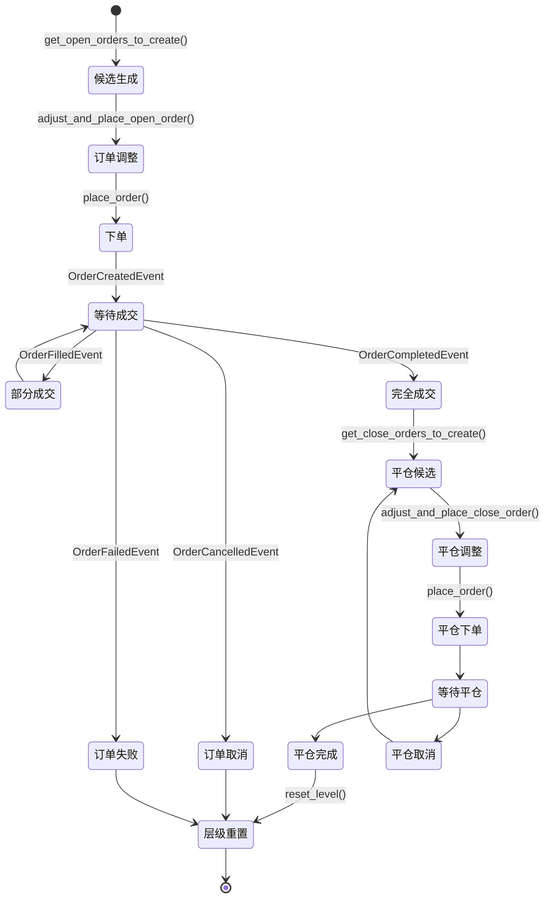
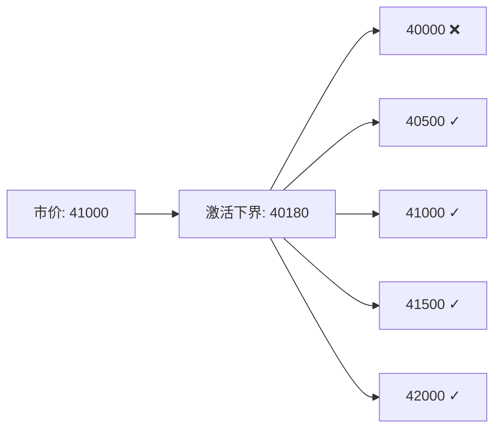
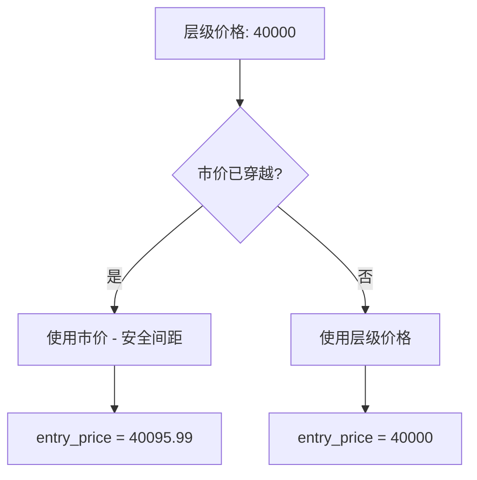
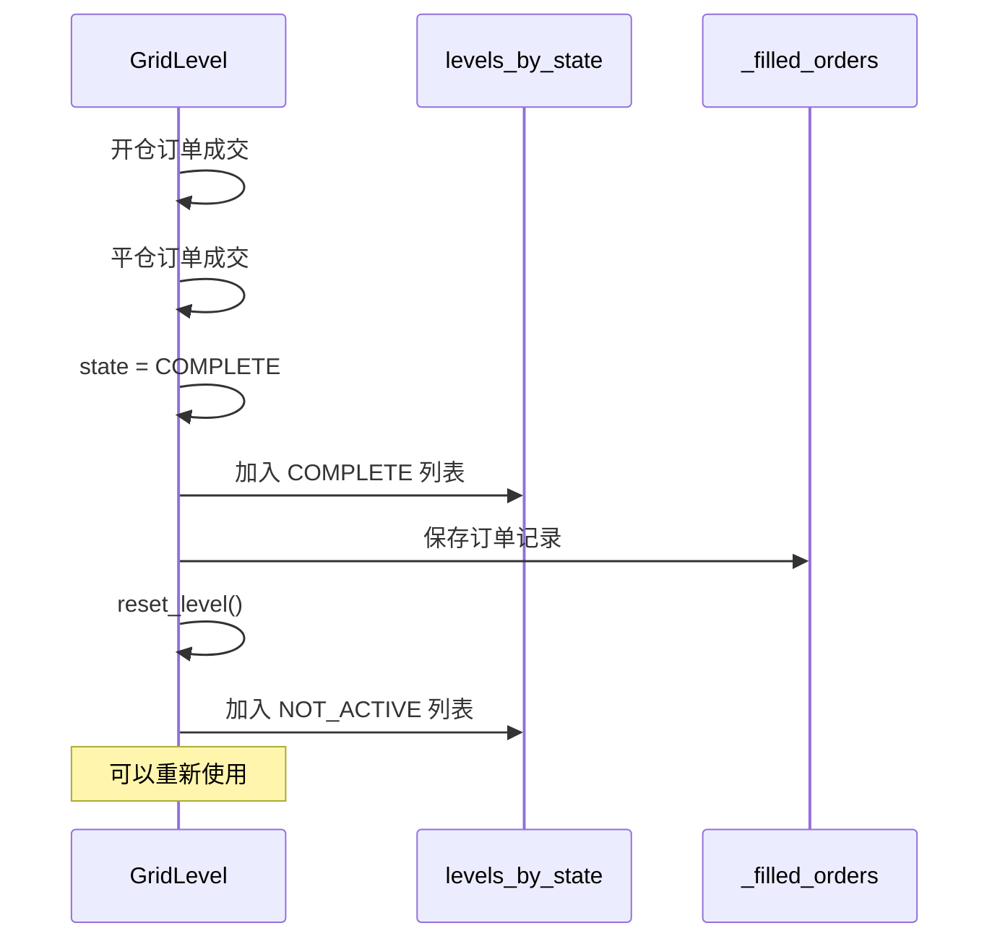
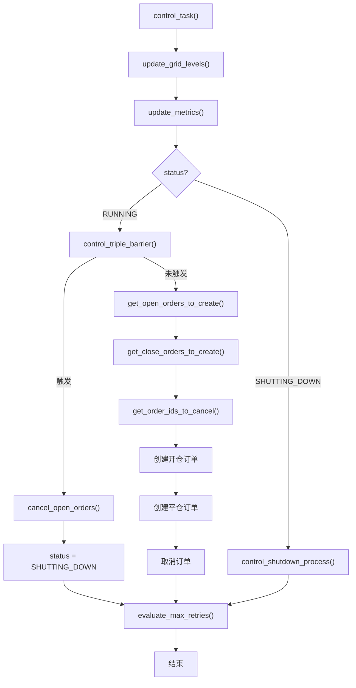

# 第 4 章：订单生命周期管理

## 4.1 订单生命周期概览

### 4.1.1 完整生命周期



### 4.1.2 核心方法概览

| 阶段 | 方法 | 职责 |
|------|------|------|
| 开仓选择 | `get_open_orders_to_create()` | 决定哪些层级需要下单 |
| 开仓调整 | `adjust_and_place_open_order()` | 调整并下开仓订单 |
| 开仓构造 | `_get_open_order_candidate()` | 构造开仓订单候选 |
| 平仓选择 | `get_close_orders_to_create()` | 决定哪些层级需要平仓 |
| 平仓调整 | `adjust_and_place_close_order()` | 调整并下平仓订单 |
| 平仓构造 | `_get_close_order_candidate()` | 构造平仓订单候选 |
| 取消逻辑 | `get_open_order_ids_to_cancel()` | 选择需要取消的开仓订单 |
| 取消逻辑 | `get_close_order_ids_to_cancel()` | 选择需要取消的平仓订单 |
| 批量取消 | `cancel_open_orders()` | 取消所有活跃订单 |

## 4.2 开仓订单管理

### 4.2.1 选择待创建的开仓订单

```python
def get_open_orders_to_create(self):
    """
    选择需要创建开仓订单的网格层级
    
    Returns:
        List[GridLevel]: 需要下单的层级列表
    """
    # 1. 检查当前活跃的开仓订单数量
    n_open_orders = len([
        level.active_open_order 
        for level in self.levels_by_state[GridLevelStates.OPEN_ORDER_PLACED]
    ])
    
    # 2. 检查是否满足下单条件
    if (self.max_open_creation_timestamp > self._strategy.current_timestamp - self.config.order_frequency or
            n_open_orders >= self.config.max_open_orders):
        return []
    
    # 3. 过滤符合激活范围的层级
    levels_allowed = self._filter_levels_by_activation_bounds()
    
    # 4. 按距离市价的远近排序
    sorted_levels_by_proximity = self._sort_levels_by_proximity(levels_allowed)
    
    # 5. 返回前 N 个层级（受 max_orders_per_batch 限制）
    return sorted_levels_by_proximity[:self.config.max_orders_per_batch]
```

**逻辑说明**：

**步骤 1：检查订单数量限制**

```python
# 已有开仓订单的数量
n_open_orders = len(self.levels_by_state[GridLevelStates.OPEN_ORDER_PLACED])

# 不超过最大限制
if n_open_orders >= self.config.max_open_orders:
    return []
```

**步骤 2：检查订单频率限制**

```python
# 距离上次下单的时间
time_since_last_order = self._strategy.current_timestamp - self.max_open_creation_timestamp

# 满足频率要求
if time_since_last_order < self.config.order_frequency:
    return []
```

**步骤 3：过滤激活范围**

详见 4.2.2 节

**步骤 4：按距离排序**

```python
def _sort_levels_by_proximity(self, levels: List[GridLevel]):
    """
    按层级价格与市价的距离排序（从近到远）
    """
    return sorted(levels, key=lambda level: abs(level.price - self.mid_price))
```

**示例**：

```python
# 当前市价：41000
# 网格层级：[40000, 40500, 41000, 41500, 42000]
# 排序结果：[41000, 40500, 41500, 40000, 42000]
# 优先创建距离市价最近的订单
```

**步骤 5：批量限制**

```python
# max_orders_per_batch = 3
sorted_levels[:3]  # 每次最多创建 3 个订单
```

### 4.2.2 激活范围过滤

```python
def _filter_levels_by_activation_bounds(self):
    """
    根据激活范围过滤网格层级
    
    Returns:
        List[GridLevel]: 符合激活范围的层级
    """
    # 获取所有未激活的层级
    not_active_levels = self.levels_by_state[GridLevelStates.NOT_ACTIVE]
    
    # 如果没有设置激活范围，返回所有未激活层级
    if not self.config.activation_bounds:
        return not_active_levels
    
    # BUY 网格：只激活价格 >= 市价 - activation_bounds 的层级
    if self.config.side == TradeType.BUY:
        activation_bounds_price = self.mid_price * (1 - self.config.activation_bounds)
        return [level for level in not_active_levels if level.price >= activation_bounds_price]
    
    # SELL 网格：只激活价格 <= 市价 + activation_bounds 的层级
    else:
        activation_bounds_price = self.mid_price * (1 + self.config.activation_bounds)
        return [level for level in not_active_levels if level.price <= activation_bounds_price]
```

**示例**：

```python
# BUY 网格
mid_price = 41000
activation_bounds = 0.02  # 2%
activation_price = 41000 * (1 - 0.02) = 40180

# 网格层级：[40000, 40500, 41000, 41500, 42000]
# 过滤结果：[40500, 41000, 41500, 42000]  (>= 40180)
# 40000 被过滤掉（太远离市价）
```

**可视化**：



### 4.2.3 调整并下开仓订单

```python
def adjust_and_place_open_order(self, level: GridLevel):
    """
    调整订单候选并下开仓订单
    
    Args:
        level: 需要下单的网格层级
    """
    # 1. 获取订单候选
    order_candidate = self._get_open_order_candidate(level)
    
    # 2. 调整订单（余额检查、数量调整等）
    self.adjust_order_candidates(self.config.connector_name, [order_candidate])
    
    # 3. 如果调整后数量 > 0，下单
    if order_candidate.amount > 0:
        order_id = self.place_order(
            connector_name=self.config.connector_name,
            trading_pair=self.config.trading_pair,
            order_type=self.config.triple_barrier_config.open_order_type,
            amount=order_candidate.amount,
            price=order_candidate.price,
            side=order_candidate.order_side,
            position_action=PositionAction.OPEN,
        )
        
        # 4. 创建 TrackedOrder 并关联到层级
        level.active_open_order = TrackedOrder(order_id=order_id)
        
        # 5. 更新时间戳
        self.max_open_creation_timestamp = self._strategy.current_timestamp
        
        # 6. 记录日志
        self.logger().debug(f"Executor ID: {self.config.id} - Placing open order {order_id}")
```

### 4.2.4 构造开仓订单候选

```python
def _get_open_order_candidate(self, level: GridLevel):
    """
    构造开仓订单候选
    
    Args:
        level: 网格层级
        
    Returns:
        OrderCandidate or PerpetualOrderCandidate
    """
    # 1. 确定下单价格
    # 如果层级价格已被市价穿越，使用市价 + 安全间距
    if ((level.side == TradeType.BUY and level.price >= self.current_open_quote) or
            (level.side == TradeType.SELL and level.price <= self.current_open_quote)):
        if level.side == TradeType.BUY:
            entry_price = self.current_open_quote * (1 - self.config.safe_extra_spread)
        else:
            entry_price = self.current_open_quote * (1 + self.config.safe_extra_spread)
    else:
        # 使用层级价格
        entry_price = level.price
    
    # 2. 计算数量（基础货币）
    amount = level.amount_quote / self.mid_price
    
    # 3. 构造订单候选
    if self.is_perpetual:
        # 永续合约订单
        return PerpetualOrderCandidate(
            trading_pair=self.config.trading_pair,
            is_maker=self.config.triple_barrier_config.open_order_type.is_limit_type(),
            order_type=self.config.triple_barrier_config.open_order_type,
            order_side=self.config.side,
            amount=amount,
            price=entry_price,
            leverage=Decimal(self.config.leverage)
        )
    else:
        # 现货订单
        return OrderCandidate(
            trading_pair=self.config.trading_pair,
            is_maker=self.config.triple_barrier_config.open_order_type.is_limit_type(),
            order_type=self.config.triple_barrier_config.open_order_type,
            order_side=self.config.side,
            amount=amount,
            price=entry_price
        )
```

**价格调整逻辑**：

```python
# BUY 订单，层级价格已被市价穿越
level.price = 40000
current_open_quote (BestBid) = 40100  # 市价已高于层级价格
safe_extra_spread = 0.0001

# 调整价格
entry_price = 40100 * (1 - 0.0001) = 40095.99
# 确保订单不会立即成交为 taker
```

**可视化**：



## 4.3 平仓订单管理

### 4.3.1 选择待创建的平仓订单

```python
def get_close_orders_to_create(self):
    """
    选择需要创建平仓订单的网格层级
    
    Returns:
        List[GridLevel]: 需要平仓的层级列表
    """
    close_orders_proposal = []
    
    # 获取开仓订单已成交的层级
    open_orders_filled = self.levels_by_state[GridLevelStates.OPEN_ORDER_FILLED]
    
    for level in open_orders_filled:
        # 如果设置了激活范围，检查止盈价格是否在范围内
        if self.config.activation_bounds:
            tp_price = self.get_take_profit_price(level)
            tp_to_mid = abs(tp_price - self.mid_price) / self.mid_price
            
            if tp_to_mid < self.config.activation_bounds:
                close_orders_proposal.append(level)
        else:
            # 无激活范围限制，所有已成交层级都可以平仓
            close_orders_proposal.append(level)
    
    return close_orders_proposal
```

**逻辑说明**：

**无 activation_bounds**：

```python
# 所有开仓已成交的层级立即创建平仓订单
for level in open_orders_filled:
    place_close_order(level)
```

**有 activation_bounds**：

```python
# 只有止盈价格接近市价时才创建平仓订单
mid_price = 41000
activation_bounds = 0.02  # 2%

level.price = 40000  # 开仓价格
tp_price = 40000 * (1 + 0.01) = 40400  # 止盈价格（1% 止盈）
tp_to_mid = abs(40400 - 41000) / 41000 = 0.0146  # 1.46%

# 1.46% < 2%，创建平仓订单
```

### 4.3.2 计算止盈价格

```python
def get_take_profit_price(self, level: GridLevel):
    """
    计算层级的止盈价格
    
    Args:
        level: 网格层级
        
    Returns:
        Decimal: 止盈价格
    """
    if self.config.side == TradeType.BUY:
        # BUY: 止盈价格 = 开仓价格 * (1 + 止盈比例)
        return level.price * (1 + level.take_profit)
    else:
        # SELL: 止盈价格 = 开仓价格 * (1 - 止盈比例)
        return level.price * (1 - level.take_profit)
```

**示例**：

```python
# BUY 网格
level.price = 40000
level.take_profit = 0.01  # 1%
tp_price = 40000 * (1 + 0.01) = 40400

# SELL 网格
level.price = 42000
level.take_profit = 0.01  # 1%
tp_price = 42000 * (1 - 0.01) = 41580
```

### 4.3.3 调整并下平仓订单

```python
def adjust_and_place_close_order(self, level: GridLevel):
    """
    调整订单候选并下平仓订单
    
    Args:
        level: 需要平仓的网格层级
    """
    # 1. 获取平仓订单候选
    order_candidate = self._get_close_order_candidate(level)
    
    # 2. 调整订单
    self.adjust_order_candidates(self.config.connector_name, [order_candidate])
    
    # 3. 下单
    if order_candidate.amount > 0:
        order_id = self.place_order(
            connector_name=self.config.connector_name,
            trading_pair=self.config.trading_pair,
            order_type=self.config.triple_barrier_config.take_profit_order_type,
            amount=order_candidate.amount,
            price=order_candidate.price,
            side=order_candidate.order_side,  # 与开仓相反
            position_action=PositionAction.CLOSE,
        )
        
        # 4. 创建 TrackedOrder
        level.active_close_order = TrackedOrder(order_id=order_id)
        
        # 5. 记录日志
        self.logger().debug(f"Executor ID: {self.config.id} - Placing close order {order_id}")
```

### 4.3.4 构造平仓订单候选

```python
def _get_close_order_candidate(self, level: GridLevel):
    """
    构造平仓订单候选
    
    Args:
        level: 网格层级
        
    Returns:
        OrderCandidate or PerpetualOrderCandidate
    """
    # 1. 计算止盈价格
    take_profit_price = self.get_take_profit_price(level)
    
    # 2. 如果止盈价格已被市价穿越，调整价格
    if ((level.side == TradeType.BUY and take_profit_price <= self.current_close_quote) or
            (level.side == TradeType.SELL and take_profit_price >= self.current_close_quote)):
        if level.side == TradeType.BUY:
            take_profit_price = self.current_close_quote * (1 + self.config.safe_extra_spread)
        else:
            take_profit_price = self.current_close_quote * (1 - self.config.safe_extra_spread)
    
    # 3. 计算平仓数量
    # 如果手续费从基础货币扣除，需要扣除手续费
    if level.active_open_order.fee_asset == self.config.trading_pair.split("-")[0] and \
            self.config.deduct_base_fees:
        amount = level.active_open_order.executed_amount_base - level.active_open_order.cum_fees_base
        self._open_fee_in_base = True
    else:
        amount = level.active_open_order.executed_amount_base
    
    # 4. 构造订单候选
    if self.is_perpetual:
        return PerpetualOrderCandidate(
            trading_pair=self.config.trading_pair,
            is_maker=self.config.triple_barrier_config.take_profit_order_type.is_limit_type(),
            order_type=self.config.triple_barrier_config.take_profit_order_type,
            order_side=self.close_order_side,  # 与开仓相反
            amount=amount,
            price=take_profit_price,
            leverage=Decimal(self.config.leverage)
        )
    else:
        return OrderCandidate(
            trading_pair=self.config.trading_pair,
            is_maker=self.config.triple_barrier_config.take_profit_order_type.is_limit_type(),
            order_type=self.config.triple_barrier_config.take_profit_order_type,
            order_side=self.close_order_side,
            amount=amount,
            price=take_profit_price
        )
```

**手续费处理**：

```python
# 场景：买入 1 BTC，手续费 0.001 BTC（从 BTC 扣除）
open_order.executed_amount_base = 1 BTC
open_order.cum_fees_base = 0.001 BTC

# deduct_base_fees = True
amount = 1 - 0.001 = 0.999 BTC  # 平仓数量扣除手续费

# deduct_base_fees = False
amount = 1 BTC  # 平仓全部数量（手续费从计价货币扣除）
```

## 4.4 订单取消逻辑

### 4.4.1 取消超出激活范围的开仓订单

```python
def get_open_order_ids_to_cancel(self):
    """
    获取需要取消的开仓订单 ID 列表
    
    Returns:
        List[str]: 订单 ID 列表
    """
    if not self.config.activation_bounds:
        return []
    
    open_orders_to_cancel = []
    
    # 获取所有已下单但未成交的开仓订单
    open_orders_placed = [
        level.active_open_order 
        for level in self.levels_by_state[GridLevelStates.OPEN_ORDER_PLACED]
    ]
    
    for order in open_orders_placed:
        price = order.price
        if price:
            # 计算订单价格与市价的距离
            distance_pct = abs(price - self.mid_price) / self.mid_price
            
            # 如果超出激活范围，取消订单
            if distance_pct > self.config.activation_bounds:
                open_orders_to_cancel.append(order.order_id)
                self.logger().debug(
                    f"Executor ID: {self.config.id} - Canceling open order {order.order_id}"
                )
    
    return open_orders_to_cancel
```

**示例**：

```python
mid_price = 41000
activation_bounds = 0.02  # 2%

# 订单 1：价格 40000
distance = abs(40000 - 41000) / 41000 = 0.0244  # 2.44%
# 2.44% > 2%，取消

# 订单 2：价格 40500
distance = abs(40500 - 41000) / 41000 = 0.0122  # 1.22%
# 1.22% < 2%，保留
```

### 4.4.2 取消超出激活范围的平仓订单

```python
def get_close_order_ids_to_cancel(self):
    """
    获取需要取消的平仓订单 ID 列表
    
    Returns:
        List[str]: 订单 ID 列表
    """
    if not self.config.activation_bounds:
        return []
    
    close_orders_to_cancel = []
    
    # 获取所有已下单但未成交的平仓订单
    close_orders_placed = [
        level.active_close_order 
        for level in self.levels_by_state[GridLevelStates.CLOSE_ORDER_PLACED]
    ]
    
    for order in close_orders_placed:
        price = order.price
        if price:
            # 计算订单价格与市价的距离
            distance_to_mid = abs(price - self.mid_price) / self.mid_price
            
            # 如果超出激活范围，取消订单
            if distance_to_mid > self.config.activation_bounds:
                close_orders_to_cancel.append(order.order_id)
    
    return close_orders_to_cancel
```

### 4.4.3 批量取消所有活跃订单

```python
def cancel_open_orders(self):
    """
    取消所有活跃的开仓和平仓订单
    """
    # 获取所有已下单的开仓订单
    open_order_placed = [
        level.active_open_order 
        for level in self.levels_by_state[GridLevelStates.OPEN_ORDER_PLACED]
    ]
    
    # 获取所有已下单的平仓订单
    close_order_placed = [
        level.active_close_order 
        for level in self.levels_by_state[GridLevelStates.CLOSE_ORDER_PLACED]
    ]
    
    # 取消所有订单
    for order in open_order_placed + close_order_placed:
        if order:
            self._strategy.cancel(
                connector_name=self.config.connector_name,
                trading_pair=self.config.trading_pair,
                order_id=order.order_id
            )
            self.logger().debug(
                f"Executor ID: {self.config.id} - Canceling open order {order.order_id}"
            )
```

## 4.5 订单状态同步

### 4.5.1 更新网格层级状态

```python
def update_grid_levels(self):
    """
    更新所有网格层级的状态，并处理已完成的层级
    """
    # 1. 重置状态字典
    self.levels_by_state = {state: [] for state in GridLevelStates}
    
    # 2. 更新每个层级的状态
    for level in self.grid_levels:
        level.update_state()  # 根据订单状态更新层级状态
        self.levels_by_state[level.state].append(level)
    
    # 3. 处理已完成的层级
    completed = self.levels_by_state[GridLevelStates.COMPLETE]
    
    for level in completed:
        # 检查订单是否完全成交
        if level.active_open_order.order.completely_filled_event.is_set() and \
                level.active_close_order.order.completely_filled_event.is_set():
            # 保存订单信息
            open_order = level.active_open_order.order.to_json()
            close_order = level.active_close_order.order.to_json()
            self._filled_orders.append(open_order)
            self._filled_orders.append(close_order)
            
            # 从完成列表移除
            self.levels_by_state[GridLevelStates.COMPLETE].remove(level)
            
            # 重置层级（允许重新使用）
            level.reset_level()
            
            # 添加到未激活列表
            self.levels_by_state[GridLevelStates.NOT_ACTIVE].append(level)
```

**层级重用机制**：



## 4.6 控制任务流程

### 4.6.1 主控制循环

```python
async def control_task(self):
    """
    主控制任务，每个更新周期执行一次
    """
    # 1. 更新所有网格层级状态
    self.update_grid_levels()
    
    # 2. 更新性能指标
    self.update_metrics()
    
    # 3. 如果状态为 RUNNING
    if self.status == RunnableStatus.RUNNING:
        # 检查 Triple Barrier 是否触发
        if self.control_triple_barrier():
            self.cancel_open_orders()
            self._status = RunnableStatus.SHUTTING_DOWN
            return
        
        # 获取需要创建和取消的订单
        open_orders_to_create = self.get_open_orders_to_create()
        close_orders_to_create = self.get_close_orders_to_create()
        open_order_ids_to_cancel = self.get_open_order_ids_to_cancel()
        close_order_ids_to_cancel = self.get_close_order_ids_to_cancel()
        
        # 创建开仓订单
        for level in open_orders_to_create:
            self.adjust_and_place_open_order(level)
        
        # 创建平仓订单
        for level in close_orders_to_create:
            self.adjust_and_place_close_order(level)
        
        # 取消订单
        for orders_id_to_cancel in open_order_ids_to_cancel + close_order_ids_to_cancel:
            self._strategy.cancel(
                connector_name=self.config.connector_name,
                trading_pair=self.config.trading_pair,
                order_id=orders_id_to_cancel
            )
    
    # 4. 如果状态为 SHUTTING_DOWN
    elif self.status == RunnableStatus.SHUTTING_DOWN:
        await self.control_shutdown_process()
    
    # 5. 检查重试次数
    self.evaluate_max_retries()
```

### 4.6.2 流程图



## 4.7 实际应用示例

### 4.7.1 完整的订单流程示例

```python
# 假设配置
config = GridExecutorConfig(
    connector_name="binance_perpetual",
    trading_pair="BTC-USDT",
    side=TradeType.BUY,
    start_price=Decimal("40000"),
    end_price=Decimal("42000"),
    total_amount_quote=Decimal("1000"),
    max_open_orders=5,
    max_orders_per_batch=2,
    order_frequency=10,  # 10 秒
    activation_bounds=Decimal("0.02"),  # 2%
    triple_barrier_config=TripleBarrierConfig(
        take_profit=Decimal("0.01"),
        open_order_type=OrderType.LIMIT_MAKER,
        take_profit_order_type=OrderType.LIMIT_MAKER,
    ),
)

# 生成的网格层级（示例）
grid_levels = [
    GridLevel(id="L0", price=40000, ...),
    GridLevel(id="L1", price=40500, ...),
    GridLevel(id="L2", price=41000, ...),
    GridLevel(id="L3", price=41500, ...),
    GridLevel(id="L4", price=42000, ...),
]

# 场景：当前市价 41000

# 第 1 次 control_task
# - 激活范围：40180 - 42000 (41000 ± 2%)
# - 过滤后层级：L1(40500), L2(41000), L3(41500), L4(42000)
# - 排序：L2, L1, L3, L4
# - 创建订单：L2, L1 (max_orders_per_batch=2)

# 第 2 次 control_task (10 秒后)
# - 当前订单：L2, L1 (待成交)
# - n_open_orders = 2 < max_open_orders(5)
# - 可继续创建：L3, L4

# L2 订单成交
# - L2.state = OPEN_ORDER_FILLED
# - 计算止盈价格：41000 * 1.01 = 41410
# - 止盈距离：abs(41410 - 41000) / 41000 = 0.01 = 1%
# - 1% < activation_bounds(2%)，创建平仓订单

# 市价上涨到 41500
# - L2 平仓订单成交（止盈价格 41410）
# - L2.state = COMPLETE
# - 保存订单记录，重置 L2
# - L2 可重新使用
```

### 4.7.2 动态调整示例

```python
# 市价从 41000 上涨到 42500

# 之前的订单（activation_bounds = 2%）
# L0(40000): 距离 = 6.1%，超出激活范围，取消
# L1(40500): 距离 = 4.9%，超出激活范围，取消
# L2(41000): 距离 = 3.6%，超出激活范围，取消

# 新的激活范围：41650 - 43350 (42500 ± 2%)
# 所有现有层级都低于 41650，不创建新订单
# 需要重新配置更高的网格区间
```

## 4.8 小结

本章详细讲解了 Grid Executor 的订单生命周期管理：

- **开仓管理**：智能选择、调整和下单
- **平仓管理**：基于止盈价格的平仓逻辑
- **取消逻辑**：动态取消超出激活范围的订单
- **状态同步**：实时更新层级和订单状态
- **层级重用**：完成的层级可以重新使用

这些机制确保 Grid Executor 能够高效地管理多个价格层级的订单，并动态适应市场变化。

在下一章中，我们将深入探讨 Triple Barrier 风险管理系统。

---

**上一章**：[第 3 章：初始化与网格生成算法](grid_executor_03.md)

**下一章**：[第 5 章：Triple Barrier 风险管理系统](grid_executor_05.md)

**返回目录**：[教程索引](grid_executor_index.md)
