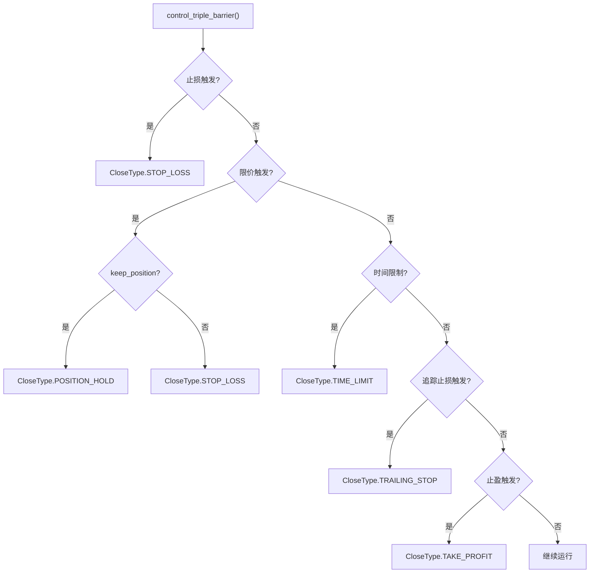
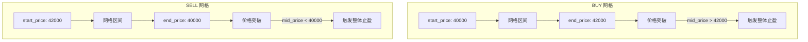
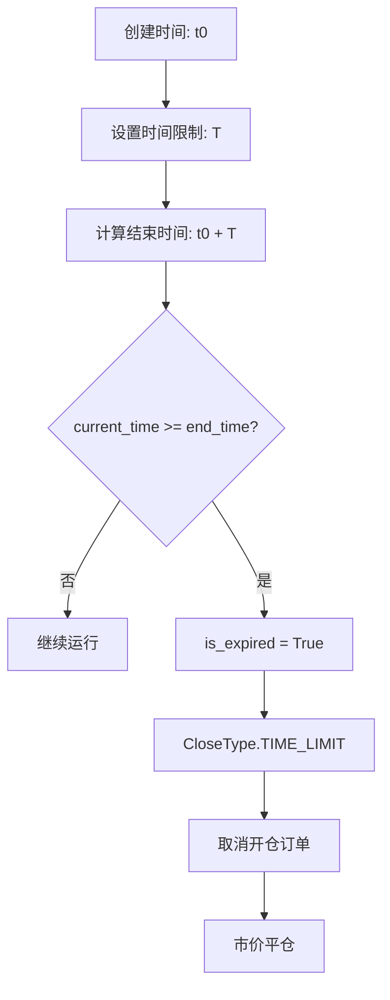
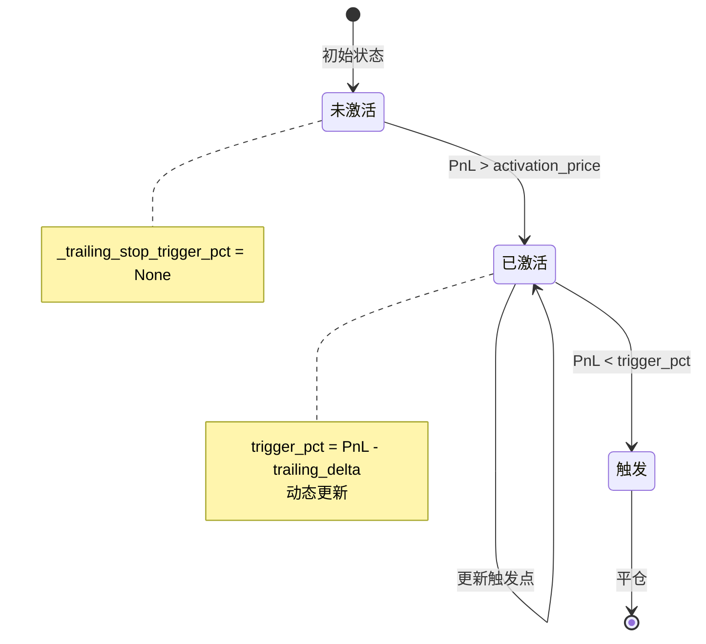
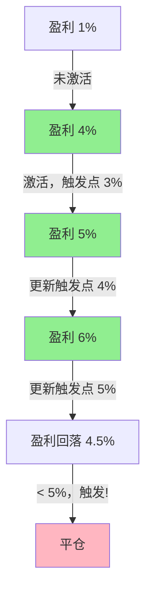
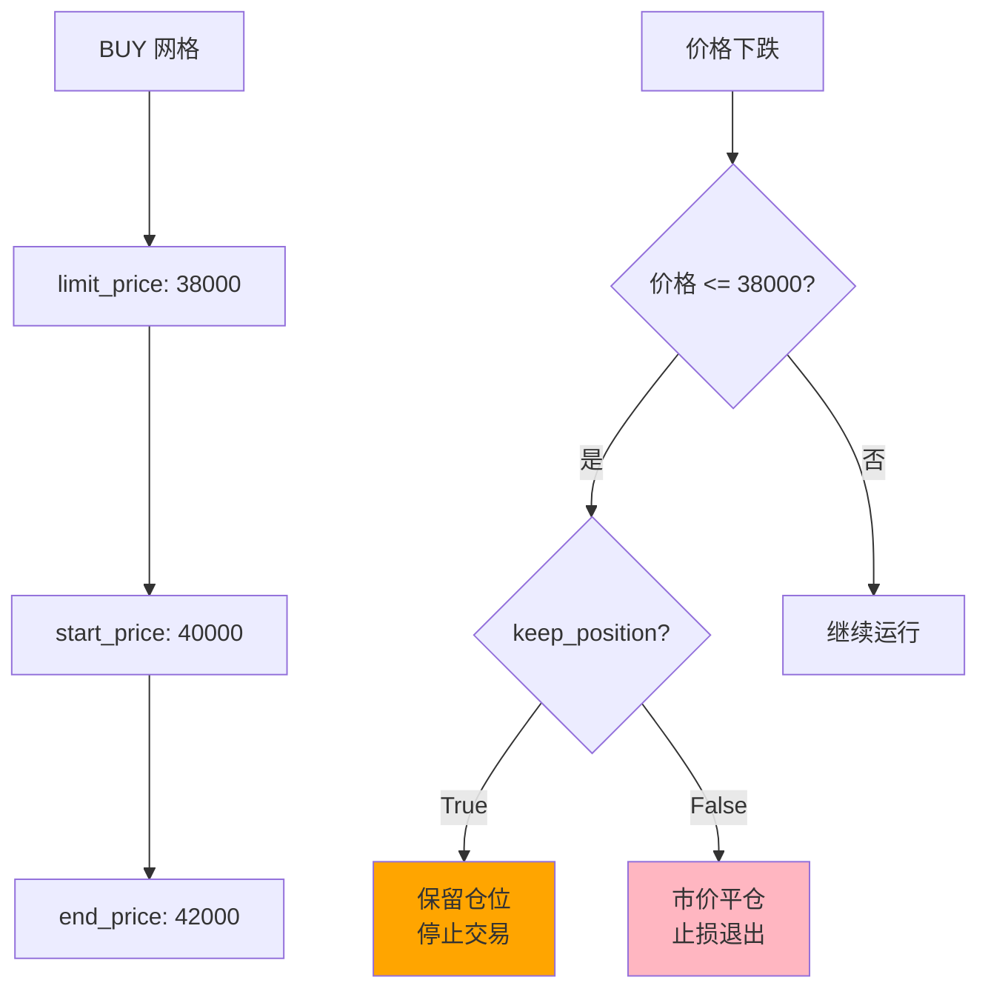
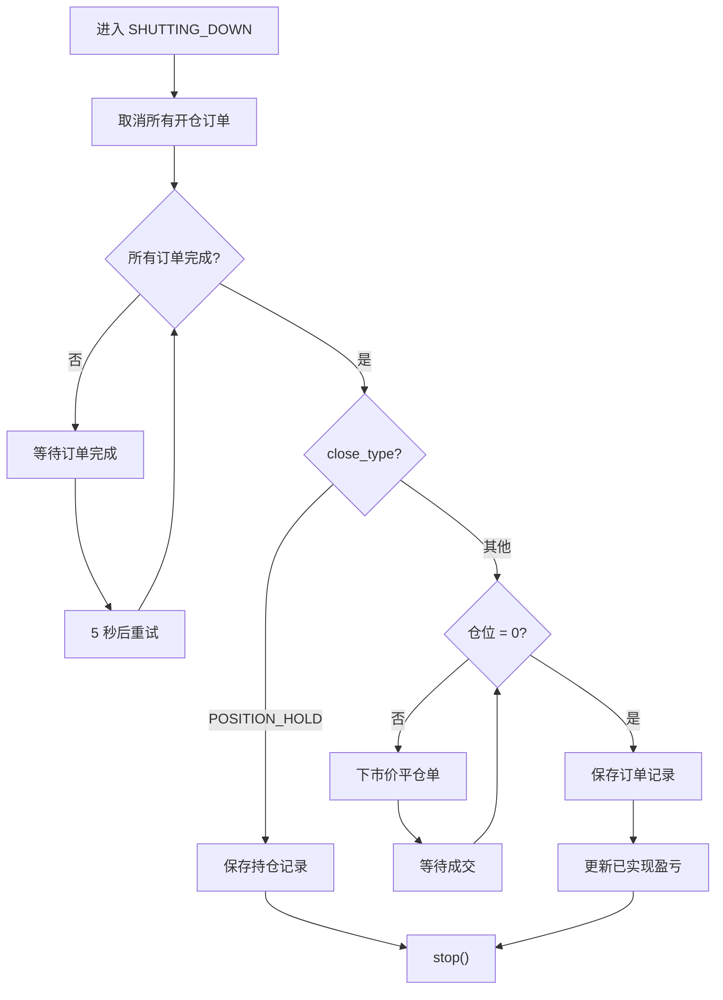

# 第 5 章：Triple Barrier 风险管理系统

## 5.1 Triple Barrier 概述

### 5.1.1 什么是 Triple Barrier

Triple Barrier（三重屏障）是一种多层风险管理策略，同时设置三种退出条件：

1. **止损（Stop Loss）**：限制最大亏损
2. **止盈（Take Profit）**：锁定利润
3. **时间限制（Time Limit）**：避免长期占用资金

Grid Executor 还增加了两个额外的屏障：

1. **追踪止损（Trailing Stop）**：保护已实现利润
2. **限价保护（Limit Price）**：价格突破预设边界

### 5.1.2 触发优先级



## 5.2 主控制流程

### 5.2.1 `control_triple_barrier()` 方法

```python
def control_triple_barrier(self):
    """
    检查所有风险屏障条件
    
    Returns:
        bool: 是否触发任一屏障（True 表示需要关闭）
    """
    # 1. 检查止损
    if self.stop_loss_condition():
        self.close_type = CloseType.STOP_LOSS
        return True
    
    # 2. 检查限价保护
    elif self.limit_price_condition():
        self.close_type = CloseType.POSITION_HOLD if self.config.keep_position else CloseType.STOP_LOSS
        return True
    
    # 3. 检查时间限制
    elif self.is_expired:
        self.close_type = CloseType.TIME_LIMIT
        return True
    
    # 4. 检查追踪止损
    elif self.trailing_stop_condition():
        self.close_type = CloseType.TRAILING_STOP
        return True
    
    # 5. 检查止盈
    elif self.take_profit_condition():
        self.close_type = CloseType.TAKE_PROFIT
        return True
    
    # 6. 未触发任何条件
    return False
```

### 5.2.2 触发后的操作

```python
# 在 control_task() 中
if self.control_triple_barrier():
    # 取消所有开仓订单
    self.cancel_open_orders()
    
    # 进入关闭流程
    self._status = RunnableStatus.SHUTTING_DOWN
    return
```

## 5.3 止损机制

### 5.3.1 止损条件

```python
def stop_loss_condition(self):
    """
    检查是否触发止损
    
    Returns:
        bool: True 表示触发止损
    """
    if self.config.triple_barrier_config.stop_loss:
        return self.position_pnl_pct <= -self.config.triple_barrier_config.stop_loss
    return False
```

**触发条件**：

```python
position_pnl_pct <= -stop_loss
```

### 5.3.2 止损示例

```python
# 配置
stop_loss = Decimal("0.05")  # 5% 止损

# 场景 1：亏损 3%
position_pnl_pct = -0.03
-0.03 <= -0.05  # False，不触发

# 场景 2：亏损 6%
position_pnl_pct = -0.06
-0.06 <= -0.05  # True，触发止损
```

### 5.3.3 止损计算详解

**position_pnl_pct 计算**（见第 6 章）：

```python
# 未实现盈亏百分比
position_pnl_pct = position_pnl_quote / position_size_quote

# 其中
position_pnl_quote = side_multiplier * ((mid_price - break_even_price) / break_even_price) * position_size_quote - position_fees_quote
```

**示例计算**：

```python
# BUY 网格
side_multiplier = 1
break_even_price = 40000  # 平均开仓价格
mid_price = 38000         # 当前市价
position_size_quote = 1000 USDT
position_fees_quote = 2 USDT

# 计算盈亏
price_change_pct = (38000 - 40000) / 40000 = -0.05  # -5%
position_pnl_quote = 1 * (-0.05) * 1000 - 2 = -52 USDT
position_pnl_pct = -52 / 1000 = -0.052  # -5.2%

# 止损触发
-0.052 <= -0.05  # True
```

### 5.3.4 止损设置建议

```python
# 保守型（低风险）
stop_loss = Decimal("0.02")  # 2%

# 稳健型（中等风险）
stop_loss = Decimal("0.05")  # 5%

# 激进型（高风险）
stop_loss = Decimal("0.10")  # 10%

# 无止损（不推荐）
stop_loss = None
```

## 5.4 止盈机制

### 5.4.1 止盈条件

```python
def take_profit_condition(self):
    """
    检查是否触发整体止盈（价格突破网格边界）
    
    Returns:
        bool: True 表示触发止盈
    """
    # BUY 网格：价格突破上界
    if self.config.side == TradeType.BUY:
        return self.mid_price > self.config.end_price
    
    # SELL 网格：价格突破下界
    else:
        return self.mid_price < self.config.start_price
```

**注意**：这是整体止盈，不同于单个层级的止盈。

### 5.4.2 两种止盈

**层级止盈**（第 4 章）：

```python
# 每个网格层级的止盈
take_profit_price = level.price * (1 + level.take_profit)

# 示例
level.price = 40000
level.take_profit = 0.01  # 1%
tp_price = 40400

# 当价格达到 40400，该层级平仓
```

**整体止盈**（本章）：

```python
# 整个网格的止盈：价格突破网格边界
# BUY 网格
config.end_price = 42000
mid_price = 42100  # 突破上界

# 触发整体止盈，关闭所有仓位
```

### 5.4.3 止盈逻辑图



### 5.4.4 止盈示例

```python
# BUY 网格配置
config = GridExecutorConfig(
    side=TradeType.BUY,
    start_price=Decimal("40000"),
    end_price=Decimal("42000"),
    triple_barrier_config=TripleBarrierConfig(
        take_profit=Decimal("0.01"),  # 层级止盈 1%
    ),
)

# 场景 1：价格 41500
mid_price = 41500
41500 > 42000  # False，继续运行
# 各层级根据自己的 1% 止盈单独平仓

# 场景 2：价格 42500
mid_price = 42500
42500 > 42000  # True，触发整体止盈
# 取消所有开仓订单，强制平仓所有仓位
```

## 5.5 时间限制

### 5.5.1 时间限制属性

```python
@property
def end_time(self) -> Optional[float]:
    """
    计算结束时间
    
    Returns:
        Optional[float]: 结束时间戳，None 表示无时间限制
    """
    if not self.config.triple_barrier_config.time_limit:
        return None
    return self.config.timestamp + self.config.triple_barrier_config.time_limit

@property
def is_expired(self) -> bool:
    """
    检查是否过期
    
    Returns:
        bool: True 表示已过期
    """
    return self.end_time and self.end_time <= self._strategy.current_timestamp
```

### 5.5.2 时间限制示例

```python
# 配置
time_limit = 3600  # 1 小时（秒）
start_time = 1700000000  # 创建时间戳

# 计算结束时间
end_time = 1700000000 + 3600 = 1700003600

# 检查过期
current_time = 1700003700
1700003600 <= 1700003700  # True，已过期

# 触发时间限制关闭
close_type = CloseType.TIME_LIMIT
```

### 5.5.3 时间限制应用场景

```python
# 场景 1：日内交易
triple_barrier = TripleBarrierConfig(
    time_limit=28800,  # 8 小时
)

# 场景 2：短期套利
triple_barrier = TripleBarrierConfig(
    time_limit=1800,  # 30 分钟
)

# 场景 3：无时间限制（长期持有）
triple_barrier = TripleBarrierConfig(
    time_limit=None,  # 无限制
)
```

### 5.5.4 时间限制流程图



## 5.6 追踪止损

### 5.6.1 追踪止损机制

```python
def trailing_stop_condition(self):
    """
    检查是否触发追踪止损
    
    Returns:
        bool: True 表示触发追踪止损
    """
    if not self.config.triple_barrier_config.trailing_stop:
        return False
    
    # 获取当前盈亏百分比
    net_pnl_pct = self.position_pnl_pct
    
    # 如果还未激活追踪止损
    if not self._trailing_stop_trigger_pct:
        # 检查是否达到激活条件
        if net_pnl_pct > self.config.triple_barrier_config.trailing_stop.activation_price:
            # 激活追踪止损，设置触发点
            self._trailing_stop_trigger_pct = net_pnl_pct - self.config.triple_barrier_config.trailing_stop.trailing_delta
    else:
        # 已激活，检查是否触发
        if net_pnl_pct < self._trailing_stop_trigger_pct:
            return True
        
        # 更新触发点（盈利增加时）
        if net_pnl_pct - self.config.triple_barrier_config.trailing_stop.trailing_delta > self._trailing_stop_trigger_pct:
            self._trailing_stop_trigger_pct = net_pnl_pct - self.config.triple_barrier_config.trailing_stop.trailing_delta
    
    return False
```

### 5.6.2 追踪止损工作原理



### 5.6.3 追踪止损示例

```python
# 配置
trailing_stop = TrailingStop(
    activation_price=Decimal("0.03"),  # 3% 激活
    trailing_delta=Decimal("0.01"),    # 1% 回撤触发
)

# 初始状态
_trailing_stop_trigger_pct = None

# 时刻 1：盈利 1%
position_pnl_pct = 0.01
0.01 > 0.03  # False，未激活

# 时刻 2：盈利 4%
position_pnl_pct = 0.04
0.04 > 0.03  # True，激活追踪止损
_trailing_stop_trigger_pct = 0.04 - 0.01 = 0.03  # 触发点：3%

# 时刻 3：盈利 5%
position_pnl_pct = 0.05
0.05 - 0.01 = 0.04 > 0.03  # True，更新触发点
_trailing_stop_trigger_pct = 0.05 - 0.01 = 0.04  # 新触发点：4%

# 时刻 4：盈利 6%
position_pnl_pct = 0.06
0.06 - 0.01 = 0.05 > 0.04  # True，更新触发点
_trailing_stop_trigger_pct = 0.06 - 0.01 = 0.05  # 新触发点：5%

# 时刻 5：盈利回落到 4.5%
position_pnl_pct = 0.045
0.045 < 0.05  # True，触发追踪止损！
```

### 5.6.4 追踪止损可视化



### 5.6.5 追踪止损参数设置

```python
# 保守型：早激活，小回撤
trailing_stop = TrailingStop(
    activation_price=Decimal("0.01"),  # 1% 激活
    trailing_delta=Decimal("0.005"),   # 0.5% 回撤
)

# 稳健型：适中激活，适中回撤
trailing_stop = TrailingStop(
    activation_price=Decimal("0.03"),  # 3% 激活
    trailing_delta=Decimal("0.01"),    # 1% 回撤
)

# 激进型：晚激活，大回撤
trailing_stop = TrailingStop(
    activation_price=Decimal("0.05"),  # 5% 激活
    trailing_delta=Decimal("0.02"),    # 2% 回撤
)
```

## 5.7 限价保护

### 5.7.1 限价保护条件

```python
def limit_price_condition(self):
    """
    检查是否触及限价保护
    
    Returns:
        bool: True 表示触及限价
    """
    if not self.config.limit_price:
        return False
    
    # BUY 网格：价格跌破限价
    if self.config.side == TradeType.BUY:
        return self.mid_price <= self.config.limit_price
    
    # SELL 网格：价格突破限价
    else:
        return self.mid_price >= self.config.limit_price
```

### 5.7.2 限价保护行为

```python
# 触发限价后的行为取决于 keep_position
if self.limit_price_condition():
    if self.config.keep_position:
        # 保留仓位，停止交易
        self.close_type = CloseType.POSITION_HOLD
    else:
        # 市价平仓
        self.close_type = CloseType.STOP_LOSS
    return True
```

### 5.7.3 限价保护示例

```python
# BUY 网格配置
config = GridExecutorConfig(
    side=TradeType.BUY,
    start_price=Decimal("40000"),
    end_price=Decimal("42000"),
    limit_price=Decimal("38000"),  # 限价保护
    keep_position=False,
)

# 场景 1：价格 39000
mid_price = 39000
39000 <= 38000  # False，未触发

# 场景 2：价格 37500
mid_price = 37500
37500 <= 38000  # True，触发限价保护
# keep_position = False，市价平仓
close_type = CloseType.STOP_LOSS
```

### 5.7.4 保留仓位模式

```python
# keep_position = True
config = GridExecutorConfig(
    side=TradeType.BUY,
    start_price=Decimal("40000"),
    end_price=Decimal("42000"),
    limit_price=Decimal("38000"),
    keep_position=True,  # 保留仓位
)

# 触发限价后
# 1. 取消所有开仓订单
# 2. 取消所有平仓订单
# 3. 不进行市价平仓
# 4. 保留已成交的仓位
# 5. close_type = CloseType.POSITION_HOLD
# 6. 仓位记录在 _held_position_orders
```

### 5.7.5 限价保护策略



## 5.8 关闭流程

### 5.8.1 `control_shutdown_process()` 方法

```python
async def control_shutdown_process(self):
    """
    控制关闭流程
    """
    # 记录关闭时间
    self.close_timestamp = self._strategy.current_timestamp
    
    # 检查订单状态
    open_orders_completed = self.open_liquidity_placed == Decimal("0")
    close_orders_completed = self.close_liquidity_placed == Decimal("0")
    
    if open_orders_completed and close_orders_completed:
        # 所有订单已完成
        if self.close_type == CloseType.POSITION_HOLD:
            # 保留仓位模式
            for level in self.levels_by_state[GridLevelStates.OPEN_ORDER_FILLED]:
                if level.active_open_order and level.active_open_order.order:
                    self._held_position_orders.append(level.active_open_order.order.to_json())
                level.reset_level()
            
            for level in self.levels_by_state[GridLevelStates.CLOSE_ORDER_PLACED]:
                if level.active_close_order and level.active_close_order.order:
                    self._held_position_orders.append(level.active_close_order.order.to_json())
                level.reset_level()
            
            if len(self._held_position_orders) == 0:
                self.close_type = CloseType.EARLY_STOP
            
            self.levels_by_state = {}
            self.stop()
        else:
            # 正常关闭模式
            order_execution_completed = self.position_size_base == Decimal("0")
            
            if order_execution_completed:
                # 保存订单记录
                for level in self.levels_by_state[GridLevelStates.OPEN_ORDER_FILLED]:
                    if level.active_open_order and level.active_open_order.order:
                        self._filled_orders.append(level.active_open_order.order.to_json())
                    level.reset_level()
                
                for level in self.levels_by_state[GridLevelStates.CLOSE_ORDER_PLACED]:
                    if level.active_close_order and level.active_close_order.order:
                        self._filled_orders.append(level.active_close_order.order.to_json())
                    level.reset_level()
                
                if self._close_order and self._close_order.order:
                    self._filled_orders.append(self._close_order.order.to_json())
                    self._close_order = None
                
                # 更新已实现盈亏
                self.update_realized_pnl_metrics()
                self.levels_by_state = {}
                self.stop()
            else:
                # 仍有仓位，继续平仓
                await self.control_close_order()
                self._current_retries += 1
    else:
        # 仍有未完成订单，取消开仓订单
        self.cancel_open_orders()
    
    # 等待 5 秒
    await self._sleep(5.0)
```

### 5.8.2 强制平仓

```python
async def control_close_order(self):
    """
    控制平仓订单（市价单）
    """
    if self._close_order:
        # 检查平仓订单状态
        in_flight_order = self.get_in_flight_order(
            self.config.connector_name,
            self._close_order.order_id
        ) if not self._close_order.order else self._close_order.order
        
        if in_flight_order:
            self._close_order.order = in_flight_order
            self.logger().info("Waiting for close order to be filled")
        else:
            # 订单失败
            self._failed_orders.append(self._close_order.order_id)
            self._close_order = None
    
    elif not self.config.keep_position or self.close_type == CloseType.TAKE_PROFIT:
        # 下市价平仓单
        self.place_close_order_and_cancel_open_orders(close_type=self.close_type)
```

### 5.8.3 关闭流程图



## 5.9 综合应用示例

### 5.9.1 完整风险配置示例

```python
from decimal import Decimal
from hummingbot.strategy_v2.executors.position_executor.data_types import (
    TripleBarrierConfig,
    TrailingStop
)

# 全面风险控制配置
triple_barrier = TripleBarrierConfig(
    # 止损：5%
    stop_loss=Decimal("0.05"),
    
    # 层级止盈：1%
    take_profit=Decimal("0.01"),
    
    # 时间限制：2 小时
    time_limit=7200,
    
    # 追踪止损：3% 激活，1% 回撤
    trailing_stop=TrailingStop(
        activation_price=Decimal("0.03"),
        trailing_delta=Decimal("0.01"),
    ),
    
    # 订单类型
    open_order_type=OrderType.LIMIT_MAKER,
    take_profit_order_type=OrderType.LIMIT_MAKER,
    stop_loss_order_type=OrderType.MARKET,
    time_limit_order_type=OrderType.MARKET,
)

config = GridExecutorConfig(
    connector_name="binance_perpetual",
    trading_pair="BTC-USDT",
    side=TradeType.BUY,
    start_price=Decimal("40000"),
    end_price=Decimal("42000"),
    limit_price=Decimal("38000"),  # 限价保护
    total_amount_quote=Decimal("1000"),
    leverage=10,
    keep_position=False,  # 触及限价时平仓
    triple_barrier_config=triple_barrier,
)
```

### 5.9.2 场景模拟

**场景 1：正常止盈**

```python
# 价格从 41000 上涨到 42500
mid_price = 42500
42500 > 42000  # True，触发整体止盈
close_type = CloseType.TAKE_PROFIT

# 执行流程
# 1. 取消所有开仓订单
# 2. 等待平仓订单成交
# 3. 强制市价平仓剩余仓位
# 4. 停止 Executor
```

**场景 2：追踪止损触发**

```python
# 价格上涨，盈利达到 5%
position_pnl_pct = 0.05
# 激活追踪止损，触发点 = 4%

# 价格回落，盈利变为 3.5%
position_pnl_pct = 0.035
0.035 < 0.04  # True，触发追踪止损
close_type = CloseType.TRAILING_STOP

# 执行流程
# 1. 取消所有开仓订单
# 2. 市价平仓所有仓位
# 3. 锁定 3.5% 的利润
```

**场景 3：止损触发**

```python
# 价格下跌，亏损达到 6%
position_pnl_pct = -0.06
-0.06 <= -0.05  # True，触发止损
close_type = CloseType.STOP_LOSS

# 执行流程
# 1. 取消所有开仓订单
# 2. 市价平仓所有仓位
# 3. 限制亏损在 6%
```

**场景 4：时间限制到期**

```python
# 2 小时后
current_time >= start_time + 7200  # True
is_expired = True
close_type = CloseType.TIME_LIMIT

# 执行流程
# 1. 取消所有开仓订单
# 2. 市价平仓所有仓位
# 3. 释放资金用于其他策略
```

**场景 5：限价保护（保留仓位）**

```python
# 配置
keep_position = True
limit_price = 38000

# 价格跌至 37500
mid_price = 37500
37500 <= 38000  # True，触发限价保护
close_type = CloseType.POSITION_HOLD

# 执行流程
# 1. 取消所有开仓订单
# 2. 取消所有平仓订单
# 3. 保留已成交仓位（不平仓）
# 4. 停止 Executor，仓位记录在 held_positions
```

## 5.10 小结

本章深入探讨了 Grid Executor 的 Triple Barrier 风险管理系统：

- **止损**：限制最大亏损
- **止盈**：价格突破网格边界时退出
- **时间限制**：避免长期占用资金
- **追踪止损**：保护已实现利润
- **限价保护**：价格极端变化时的保护机制

这些机制共同构成了完善的风险管理体系，确保 Grid Executor 能够在各种市场条件下保护资金安全。

在下一章中，我们将学习如何计算和监控性能指标。

---

**上一章**：[第 4 章：订单生命周期管理](grid_executor_04.md)

**下一章**：[第 6 章：指标计算与性能监控](grid_executor_06.md)

**返回目录**：[教程索引](grid_executor_index.md)
