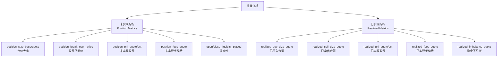

# 第 6 章：指标计算与性能监控

## 6.1 指标体系概览

### 6.1.1 指标分类

Grid Executor 维护两类性能指标：



### 6.1.2 更新时机

```python
def update_metrics(self):
    """
    更新所有性能指标（每个控制循环调用）
    """
    # 1. 更新市场价格
    self.mid_price = self.get_price(
        self.config.connector_name,
        self.config.trading_pair,
        PriceType.MidPrice
    )
    self.current_open_quote = self.get_price(
        self.config.connector_name,
        self.config.trading_pair,
        price_type=self.open_order_price_type
    )
    self.current_close_quote = self.get_price(
        self.config.connector_name,
        self.config.trading_pair,
        price_type=self.close_order_price_type
    )
    
    # 2. 更新仓位指标
    self.update_position_metrics()
    
    # 3. 更新已实现盈亏指标
    self.update_realized_pnl_metrics()
```

## 6.2 未实现指标（仓位指标）

### 6.2.1 `update_position_metrics()` 方法

```python
def update_position_metrics(self):
    """
    计算未实现盈亏和仓位信息
    """
    # 1. 获取开仓已成交和平仓中的层级
    open_filled_levels = (
        self.levels_by_state[GridLevelStates.OPEN_ORDER_FILLED] +
        self.levels_by_state[GridLevelStates.CLOSE_ORDER_PLACED]
    )
    
    # 2. 计算方向乘数
    side_multiplier = 1 if self.config.side == TradeType.BUY else -1
    
    # 3. 计算总持仓量（基础货币）
    executed_amount_base = Decimal(sum([
        level.active_open_order.order.amount 
        for level in open_filled_levels
    ]))
    
    # 4. 如果无仓位，重置所有指标
    if executed_amount_base == Decimal("0"):
        self.position_size_base = Decimal("0")
        self.position_size_quote = Decimal("0")
        self.position_fees_quote = Decimal("0")
        self.position_pnl_quote = Decimal("0")
        self.position_pnl_pct = Decimal("0")
        self.close_liquidity_placed = Decimal("0")
    else:
        # 5. 计算盈亏平衡价格（加权平均价格）
        self.position_break_even_price = sum([
            level.active_open_order.order.price * level.active_open_order.order.amount
            for level in open_filled_levels
        ]) / executed_amount_base
        
        # 6. 如果手续费从基础货币扣除
        if self._open_fee_in_base:
            executed_amount_base -= sum([
                level.active_open_order.cum_fees_base 
                for level in open_filled_levels
            ])
        
        # 7. 扣除已平仓部分
        close_order_size_base = (
            self._close_order.executed_amount_base 
            if self._close_order and self._close_order.is_done 
            else Decimal("0")
        )
        self.position_size_base = executed_amount_base - close_order_size_base
        
        # 8. 计算仓位金额（计价货币）
        self.position_size_quote = self.position_size_base * self.position_break_even_price
        
        # 9. 计算手续费
        self.position_fees_quote = Decimal(sum([
            level.active_open_order.cum_fees_quote 
            for level in open_filled_levels
        ]))
        
        # 10. 计算未实现盈亏
        self.position_pnl_quote = (
            side_multiplier * 
            ((self.mid_price - self.position_break_even_price) / self.position_break_even_price) *
            self.position_size_quote -
            self.position_fees_quote
        )
        
        # 11. 计算未实现盈亏百分比
        self.position_pnl_pct = (
            self.position_pnl_quote / self.position_size_quote 
            if self.position_size_quote > 0 
            else Decimal("0")
        )
        
        # 12. 计算平仓流动性
        self.close_liquidity_placed = sum([
            level.amount_quote 
            for level in self.levels_by_state[GridLevelStates.CLOSE_ORDER_PLACED]
            if level.active_close_order and level.active_close_order.executed_amount_base == Decimal("0")
        ])
    
    # 13. 计算开仓流动性
    if len(self.levels_by_state[GridLevelStates.OPEN_ORDER_PLACED]) > 0:
        self.open_liquidity_placed = sum([
            level.amount_quote 
            for level in self.levels_by_state[GridLevelStates.OPEN_ORDER_PLACED]
            if level.active_open_order and level.active_open_order.executed_amount_base == Decimal("0")
        ])
    else:
        self.open_liquidity_placed = Decimal("0")
```

### 6.2.2 盈亏平衡价格计算

**加权平均价格公式**：

```python
break_even_price = Σ(price_i * amount_i) / Σ(amount_i)
```

**示例**：

```python
# 三个层级已成交
# L1: 40000 USDT, 0.025 BTC
# L2: 40500 USDT, 0.025 BTC
# L3: 41000 USDT, 0.025 BTC

total_cost = (40000 * 0.025) + (40500 * 0.025) + (41000 * 0.025)
           = 1000 + 1012.5 + 1025
           = 3037.5 USDT

total_amount = 0.025 + 0.025 + 0.025 = 0.075 BTC

break_even_price = 3037.5 / 0.075 = 40500 USDT
```

### 6.2.3 未实现盈亏计算

**公式**：

```python
# BUY (side_multiplier = 1)
position_pnl_quote = ((mid_price - break_even_price) / break_even_price) * position_size_quote - fees

# SELL (side_multiplier = -1)
position_pnl_quote = -((mid_price - break_even_price) / break_even_price) * position_size_quote - fees
```

**BUY 示例**：

```python
side_multiplier = 1
break_even_price = 40500
mid_price = 41000
position_size_quote = 3037.5
position_fees_quote = 6.075  # 0.2% 手续费

# 价格变化百分比
price_change = (41000 - 40500) / 40500 = 0.01234  # 1.234%

# 未实现盈亏
position_pnl_quote = 1 * 0.01234 * 3037.5 - 6.075
                   = 37.48 - 6.075
                   = 31.405 USDT

# 百分比
position_pnl_pct = 31.405 / 3037.5 = 0.01034  # 1.034%
```

**SELL 示例**：

```python
side_multiplier = -1
break_even_price = 40500
mid_price = 40000  # 价格下跌
position_size_quote = 3037.5
position_fees_quote = 6.075

# 价格变化百分比
price_change = (40000 - 40500) / 40500 = -0.01234  # -1.234%

# 未实现盈亏（做空，价格下跌盈利）
position_pnl_quote = -1 * (-0.01234) * 3037.5 - 6.075
                   = 37.48 - 6.075
                   = 31.405 USDT
```

### 6.2.4 流动性追踪

**开仓流动性**：

```python
# 已下单但未成交的开仓订单总金额
open_liquidity_placed = sum([
    level.amount_quote 
    for level in OPEN_ORDER_PLACED
    if order.executed_amount_base == 0  # 完全未成交
])
```

**平仓流动性**：

```python
# 已下单但未成交的平仓订单总金额
close_liquidity_placed = sum([
    level.amount_quote 
    for level in CLOSE_ORDER_PLACED
    if order.executed_amount_base == 0
])
```

**用途**：

- 监控资金占用情况
- 评估订单簿深度
- 优化订单策略

## 6.3 已实现指标

### 6.3.1 `update_realized_pnl_metrics()` 方法

```python
def update_realized_pnl_metrics(self):
    """
    计算已实现盈亏（已完成的交易）
    """
    # 1. 如果没有成交订单
    if len(self._filled_orders) == 0:
        self._reset_metrics()
        return
    
    # 2. 过滤掉持仓订单
    regular_filled_orders = [
        order for order in self._filled_orders
        if order not in self._held_position_orders
    ]
    
    if len(regular_filled_orders) == 0:
        self._reset_metrics()
        return
    
    # 3. 计算已买入金额
    if self._open_fee_in_base:
        # 手续费从基础货币扣除，需要调整
        self.realized_buy_size_quote = sum([
            Decimal(order["executed_amount_quote"]) - Decimal(order["cumulative_fee_paid_quote"])
            for order in regular_filled_orders 
            if order["trade_type"] == TradeType.BUY.name
        ])
    else:
        self.realized_buy_size_quote = sum([
            Decimal(order["executed_amount_quote"])
            for order in regular_filled_orders 
            if order["trade_type"] == TradeType.BUY.name
        ])
    
    # 4. 计算已卖出金额
    self.realized_sell_size_quote = sum([
        Decimal(order["executed_amount_quote"])
        for order in regular_filled_orders 
        if order["trade_type"] == TradeType.SELL.name
    ])
    
    # 5. 计算资金不平衡
    self.realized_imbalance_quote = self.realized_buy_size_quote - self.realized_sell_size_quote
    
    # 6. 计算已实现手续费
    self.realized_fees_quote = sum([
        Decimal(order["cumulative_fee_paid_quote"])
        for order in regular_filled_orders
    ])
    
    # 7. 计算已实现盈亏
    self.realized_pnl_quote = (
        self.realized_sell_size_quote -
        self.realized_buy_size_quote -
        self.realized_fees_quote
    )
    
    # 8. 计算已实现盈亏百分比
    self.realized_pnl_pct = (
        self.realized_pnl_quote / self.realized_buy_size_quote
        if self.realized_buy_size_quote > 0 
        else Decimal("0")
    )
```

### 6.3.2 已实现盈亏公式

**基本公式**：

```python
realized_pnl = sell_amount - buy_amount - fees
```

**示例**：

```python
# 已完成的交易
# 买入：40000 USDT (手续费 8 USDT)
# 卖出：40400 USDT (手续费 8.08 USDT)

realized_buy_size_quote = 40000
realized_sell_size_quote = 40400
realized_fees_quote = 8 + 8.08 = 16.08

realized_pnl_quote = 40400 - 40000 - 16.08 = 383.92 USDT
realized_pnl_pct = 383.92 / 40000 = 0.0096 = 0.96%
```

### 6.3.3 资金不平衡

**定义**：

```python
realized_imbalance_quote = realized_buy_size_quote - realized_sell_size_quote
```

**意义**：

- **正值**：买入多于卖出，仍有未平仓位
- **负值**：卖出多于买入（做空场景）
- **零**：完全平衡，所有仓位已平仓

**示例**：

```python
# 场景 1：部分平仓
realized_buy_size_quote = 1000
realized_sell_size_quote = 600
realized_imbalance_quote = 400  # 仍有 400 USDT 未平仓

# 场景 2：完全平仓
realized_buy_size_quote = 1000
realized_sell_size_quote = 1000
realized_imbalance_quote = 0  # 完全平衡
```

### 6.3.4 指标重置

```python
def _reset_metrics(self):
    """
    重置所有已实现盈亏指标
    """
    self.realized_buy_size_quote = Decimal("0")
    self.realized_sell_size_quote = Decimal("0")
    self.realized_imbalance_quote = Decimal("0")
    self.realized_fees_quote = Decimal("0")
    self.realized_pnl_quote = Decimal("0")
    self.realized_pnl_pct = Decimal("0")
```

## 6.4 综合指标

### 6.4.1 净盈亏（Net PnL）

```python
def get_net_pnl_quote(self) -> Decimal:
    """
    计算净盈亏（已实现 + 未实现）
    
    Returns:
        Decimal: 净盈亏（计价货币）
    """
    if self.close_type != CloseType.POSITION_HOLD:
        return self.position_pnl_quote + self.realized_pnl_quote
    else:
        # 保留仓位模式，只计算已实现盈亏
        return self.realized_pnl_quote
```

**示例**：

```python
# 正常模式
position_pnl_quote = 50  # 未实现盈利 50
realized_pnl_quote = 100  # 已实现盈利 100
net_pnl_quote = 50 + 100 = 150

# 保留仓位模式
close_type = CloseType.POSITION_HOLD
net_pnl_quote = 100  # 只计算已实现
```

### 6.4.2 累计手续费

```python
def get_cum_fees_quote(self) -> Decimal:
    """
    计算累计手续费
    
    Returns:
        Decimal: 累计手续费（计价货币）
    """
    if self.close_type != CloseType.POSITION_HOLD:
        return self.position_fees_quote + self.realized_fees_quote
    else:
        return self.realized_fees_quote
```

### 6.4.3 总成交金额

```python
@property
def filled_amount_quote(self) -> Decimal:
    """
    计算总成交金额
    
    Returns:
        Decimal: 总成交金额（计价货币）
    """
    matched_volume = self.realized_buy_size_quote + self.realized_sell_size_quote
    
    if self.close_type != CloseType.POSITION_HOLD:
        return self.position_size_quote + matched_volume
    else:
        return matched_volume
```

**说明**：

- `matched_volume`：已完成买卖配对的金额
- `position_size_quote`：当前未平仓的金额

**示例**：

```python
# 场景
realized_buy_size_quote = 1000  # 已买入 1000
realized_sell_size_quote = 800   # 已卖出 800
position_size_quote = 200        # 当前仓位 200

matched_volume = 1000 + 800 = 1800
filled_amount_quote = 200 + 1800 = 2000
```

### 6.4.4 净盈亏百分比

```python
def get_net_pnl_pct(self) -> Decimal:
    """
    计算净盈亏百分比
    
    Returns:
        Decimal: 净盈亏百分比
    """
    return (
        self.get_net_pnl_quote() / self.filled_amount_quote
        if self.filled_amount_quote > 0 
        else Decimal("0")
    )
```

## 6.5 性能监控示例

### 6.5.1 实时监控代码

```python
def get_custom_info(self) -> Dict:
    """
    获取自定义信息用于监控展示
    
    Returns:
        Dict: 包含所有关键指标的字典
    """
    held_position_value = sum([
        Decimal(order["executed_amount_quote"])
        for order in self._held_position_orders
    ])
    
    return {
        # 状态信息
        "levels_by_state": {
            key.name: value 
            for key, value in self.levels_by_state.items()
        },
        "filled_orders": self._filled_orders,
        "held_position_orders": self._held_position_orders,
        "held_position_value": held_position_value,
        "failed_orders": self._failed_orders,
        "canceled_orders": self._canceled_orders,
        
        # 已实现指标
        "realized_buy_size_quote": self.realized_buy_size_quote,
        "realized_sell_size_quote": self.realized_sell_size_quote,
        "realized_imbalance_quote": self.realized_imbalance_quote,
        "realized_fees_quote": self.realized_fees_quote,
        "realized_pnl_quote": self.realized_pnl_quote,
        "realized_pnl_pct": self.realized_pnl_pct,
        
        # 未实现指标
        "position_size_quote": self.position_size_quote,
        "position_fees_quote": self.position_fees_quote,
        "break_even_price": self.position_break_even_price,
        "position_pnl_quote": self.position_pnl_quote,
        
        # 流动性
        "open_liquidity_placed": self.open_liquidity_placed,
        "close_liquidity_placed": self.close_liquidity_placed,
    }
```

### 6.5.2 监控仪表板示例

```python
def display_executor_status(executor: GridExecutor):
    """
    显示 Executor 状态的示例函数
    """
    info = executor.get_custom_info()
    
    print("=" * 60)
    print(f"Grid Executor: {executor.config.id}")
    print("=" * 60)
    
    # 基本信息
    print(f"Trading Pair: {executor.config.trading_pair}")
    print(f"Side: {executor.config.side.name}")
    print(f"Status: {executor.status.name}")
    
    # 网格信息
    print("\n--- Grid Levels ---")
    for state, levels in info["levels_by_state"].items():
        print(f"{state}: {len(levels)} levels")
    
    # 仓位信息
    print("\n--- Position ---")
    print(f"Size (Quote): {info['position_size_quote']:.2f} USDT")
    print(f"Break-even Price: {info['break_even_price']:.2f}")
    print(f"Position PnL: {info['position_pnl_quote']:.2f} USDT")
    
    # 已实现指标
    print("\n--- Realized Metrics ---")
    print(f"Buy Size: {info['realized_buy_size_quote']:.2f} USDT")
    print(f"Sell Size: {info['realized_sell_size_quote']:.2f} USDT")
    print(f"Realized PnL: {info['realized_pnl_quote']:.2f} USDT ({info['realized_pnl_pct']:.2%})")
    print(f"Fees: {info['realized_fees_quote']:.2f} USDT")
    
    # 流动性
    print("\n--- Liquidity ---")
    print(f"Open Orders: {info['open_liquidity_placed']:.2f} USDT")
    print(f"Close Orders: {info['close_liquidity_placed']:.2f} USDT")
    
    # 综合指标
    print("\n--- Net Metrics ---")
    net_pnl = executor.get_net_pnl_quote()
    net_pnl_pct = executor.get_net_pnl_pct()
    cum_fees = executor.get_cum_fees_quote()
    print(f"Net PnL: {net_pnl:.2f} USDT ({net_pnl_pct:.2%})")
    print(f"Cumulative Fees: {cum_fees:.2f} USDT")
    
    print("=" * 60)
```

**输出示例**：

```text
============================================================
Grid Executor: 1Abc2Def3Ghi
============================================================
Trading Pair: BTC-USDT
Side: BUY
Status: RUNNING

--- Grid Levels ---
NOT_ACTIVE: 15 levels
OPEN_ORDER_PLACED: 3 levels
OPEN_ORDER_FILLED: 2 levels
CLOSE_ORDER_PLACED: 2 levels
COMPLETE: 0 levels

--- Position ---
Size (Quote): 800.00 USDT
Break-even Price: 40400.00
Position PnL: 24.50 USDT

--- Realized Metrics ---
Buy Size: 1200.00 USDT
Sell Size: 800.00 USDT
Realized PnL: 18.00 USDT (1.50%)
Fees: 4.00 USDT

--- Liquidity ---
Open Orders: 120.00 USDT
Close Orders: 80.00 USDT

--- Net Metrics ---
Net PnL: 42.50 USDT (1.89%)
Cumulative Fees: 5.60 USDT
============================================================
```

## 6.6 性能分析技巧

### 6.6.1 盈利效率分析

```python
def analyze_profitability(executor: GridExecutor):
    """
    分析盈利效率
    """
    info = executor.get_custom_info()
    
    # 1. 每笔交易平均盈利
    completed_pairs = len([
        order for order in info["filled_orders"]
        if order["trade_type"] == "SELL"  # 卖单 = 完成一对交易
    ])
    
    if completed_pairs > 0:
        avg_profit_per_trade = info["realized_pnl_quote"] / completed_pairs
        print(f"Average Profit per Trade: {avg_profit_per_trade:.2f} USDT")
    
    # 2. 手续费占比
    if info["realized_buy_size_quote"] + info["realized_sell_size_quote"] > 0:
        fee_ratio = (
            info["realized_fees_quote"] /
            (info["realized_buy_size_quote"] + info["realized_sell_size_quote"])
        )
        print(f"Fee Ratio: {fee_ratio:.2%}")
    
    # 3. 资金利用率
    total_capital = executor.config.total_amount_quote
    utilized = (
        info["position_size_quote"] +
        info["open_liquidity_placed"] +
        info["close_liquidity_placed"]
    )
    utilization_rate = utilized / total_capital
    print(f"Capital Utilization: {utilization_rate:.2%}")
```

### 6.6.2 风险指标分析

```python
def analyze_risk(executor: GridExecutor):
    """
    分析风险指标
    """
    # 1. 最大回撤（需要历史数据，这里简化）
    if executor.position_pnl_pct < 0:
        print(f"Current Drawdown: {executor.position_pnl_pct:.2%}")
    
    # 2. 风险回报比
    potential_loss = abs(executor.config.triple_barrier_config.stop_loss or 0)
    potential_gain = abs(executor.config.triple_barrier_config.take_profit or 0)
    if potential_loss > 0:
        risk_reward_ratio = potential_gain / potential_loss
        print(f"Risk/Reward Ratio: 1:{risk_reward_ratio:.2f}")
    
    # 3. 仓位风险敞口
    total_capital = executor.config.total_amount_quote
    position_exposure = executor.position_size_quote / total_capital
    print(f"Position Exposure: {position_exposure:.2%}")
```

### 6.6.3 运行效率分析

```python
def analyze_efficiency(executor: GridExecutor):
    """
    分析运行效率
    """
    info = executor.get_custom_info()
    
    # 1. 订单成功率
    total_orders = (
        len(info["filled_orders"]) +
        len(info["failed_orders"]) +
        len(info["canceled_orders"])
    )
    
    if total_orders > 0:
        success_rate = len(info["filled_orders"]) / total_orders
        print(f"Order Success Rate: {success_rate:.2%}")
    
    # 2. 网格利用率
    total_levels = len(executor.grid_levels)
    active_levels = sum([
        len(levels) 
        for state, levels in info["levels_by_state"].items()
        if state != "NOT_ACTIVE"
    ])
    grid_utilization = active_levels / total_levels
    print(f"Grid Utilization: {grid_utilization:.2%}")
    
    # 3. 流动性效率
    total_liquidity = (
        info["open_liquidity_placed"] +
        info["close_liquidity_placed"]
    )
    total_filled = info["realized_buy_size_quote"] + info["realized_sell_size_quote"]
    
    if total_liquidity + total_filled > 0:
        liquidity_efficiency = total_filled / (total_liquidity + total_filled)
        print(f"Liquidity Efficiency: {liquidity_efficiency:.2%}")
```

## 6.7 小结

本章详细讲解了 Grid Executor 的指标计算和性能监控：

- **未实现指标**：跟踪当前仓位的实时盈亏
- **已实现指标**：统计已完成交易的盈亏
- **综合指标**：提供整体性能视图
- **监控工具**：实时展示和分析性能

这些指标为策略优化和风险管理提供了数据基础。在下一章中，我们将学习事件处理机制。

---

**上一章**：[第 5 章：Triple Barrier 风险管理系统](grid_executor_05.md)

**下一章**：[第 7 章：事件处理机制](grid_executor_07.md)

**返回目录**：[教程索引](grid_executor_index.md)

