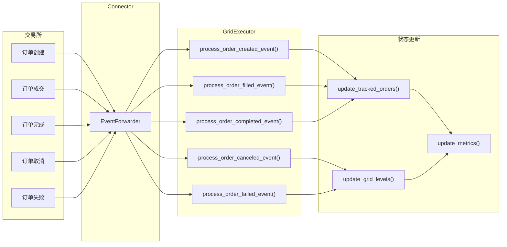
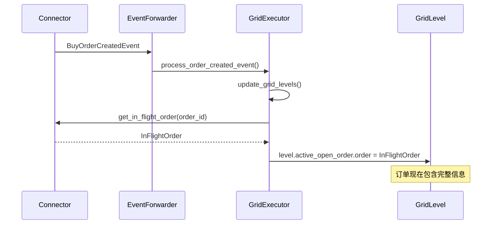

# 第 7 章：事件处理机制

## 7.1 事件驱动架构

### 7.1.1 事件系统概览

Grid Executor 使用事件驱动架构来响应市场和订单变化：



### 7.1.2 事件类型

Grid Executor 处理以下事件：

| 事件类型 | 描述 | 处理方法 |
|---------|------|---------|
| BuyOrderCreatedEvent | 买单创建 | process_order_created_event |
| SellOrderCreatedEvent | 卖单创建 | process_order_created_event |
| OrderFilledEvent | 订单部分/完全成交 | process_order_filled_event |
| BuyOrderCompletedEvent | 买单完成 | process_order_completed_event |
| SellOrderCompletedEvent | 卖单完成 | process_order_completed_event |
| OrderCancelledEvent | 订单取消 | process_order_canceled_event |
| MarketOrderFailureEvent | 订单失败 | process_order_failed_event |

## 7.2 事件转发器机制

### 7.2.1 ExecutorBase 中的事件转发器

```python
# 在 ExecutorBase.__init__ 中初始化
def __init__(self, strategy: ScriptStrategyBase, connectors: List[str], 
             config: ExecutorConfigBase, update_interval: float = 0.5):
    # ...
    
    # 创建事件转发器
    self._create_buy_order_forwarder = SourceInfoEventForwarder(
        self.process_order_created_event
    )
    self._create_sell_order_forwarder = SourceInfoEventForwarder(
        self.process_order_created_event
    )
    self._fill_order_forwarder = SourceInfoEventForwarder(
        self.process_order_filled_event
    )
    self._complete_buy_order_forwarder = SourceInfoEventForwarder(
        self.process_order_completed_event
    )
    self._complete_sell_order_forwarder = SourceInfoEventForwarder(
        self.process_order_completed_event
    )
    self._cancel_order_forwarder = SourceInfoEventForwarder(
        self.process_order_canceled_event
    )
    self._failed_order_forwarder = SourceInfoEventForwarder(
        self.process_order_failed_event
    )
```

### 7.2.2 事件注册

```python
def register_events(self):
    """
    注册所有事件监听器
    """
    # 市场事件和事件转发器的配对
    event_pairs = [
        (MarketEvent.BuyOrderCreated, self._create_buy_order_forwarder),
        (MarketEvent.SellOrderCreated, self._create_sell_order_forwarder),
        (MarketEvent.OrderFilled, self._fill_order_forwarder),
        (MarketEvent.BuyOrderCompleted, self._complete_buy_order_forwarder),
        (MarketEvent.SellOrderCompleted, self._complete_sell_order_forwarder),
        (MarketEvent.OrderCancelled, self._cancel_order_forwarder),
        (MarketEvent.OrderFailure, self._failed_order_forwarder),
    ]
    
    # 为每个连接器注册事件
    for connector_name, connector in self.connectors.items():
        for event, forwarder in event_pairs:
            connector.add_listener(event, forwarder)
```

### 7.2.3 事件注销

```python
def unregister_events(self):
    """
    注销所有事件监听器
    """
    event_pairs = [
        (MarketEvent.BuyOrderCreated, self._create_buy_order_forwarder),
        (MarketEvent.SellOrderCreated, self._create_sell_order_forwarder),
        (MarketEvent.OrderFilled, self._fill_order_forwarder),
        (MarketEvent.BuyOrderCompleted, self._complete_buy_order_forwarder),
        (MarketEvent.SellOrderCompleted, self._complete_sell_order_forwarder),
        (MarketEvent.OrderCancelled, self._cancel_order_forwarder),
        (MarketEvent.OrderFailure, self._failed_order_forwarder),
    ]
    
    for connector_name, connector in self.connectors.items():
        for event, forwarder in event_pairs:
            if connector.check_if_has_listener(event, forwarder):
                connector.remove_listener(event, forwarder)
```

## 7.3 订单跟踪更新

### 7.3.1 `update_tracked_orders_with_order_id()` 方法

这是所有事件处理的核心方法，用于同步订单信息：

```python
def update_tracked_orders_with_order_id(self, order_id: str):
    """
    使用 order_id 更新追踪订单
    
    Args:
        order_id: 订单 ID
    """
    # 1. 更新网格层级状态
    self.update_grid_levels()
    
    # 2. 获取 InFlightOrder
    in_flight_order = self.get_in_flight_order(self.config.connector_name, order_id)
    
    if in_flight_order:
        # 3. 更新所有层级的追踪订单
        for level in self.grid_levels:
            # 更新开仓订单
            if level.active_open_order and level.active_open_order.order_id == order_id:
                level.active_open_order.order = in_flight_order
            
            # 更新平仓订单
            if level.active_close_order and level.active_close_order.order_id == order_id:
                level.active_close_order.order = in_flight_order
        
        # 4. 更新强制平仓订单
        if self._close_order and self._close_order.order_id == order_id:
            self._close_order.order = in_flight_order
```

**InFlightOrder 说明**：

- 包含订单的完整信息（价格、数量、状态、手续费等）
- 由 Connector 维护
- 提供订单的实时状态

## 7.4 订单创建事件

### 7.4.1 事件处理方法

```python
def process_order_created_event(self, _, market, event: Union[BuyOrderCreatedEvent, SellOrderCreatedEvent]):
    """
    处理订单创建事件
    
    Args:
        _: 事件标签（未使用）
        market: 市场连接器
        event: 订单创建事件
    """
    # 更新追踪订单，关联 InFlightOrder
    self.update_tracked_orders_with_order_id(event.order_id)
```

### 7.4.2 事件数据结构

```python
# BuyOrderCreatedEvent / SellOrderCreatedEvent
class OrderCreatedEvent:
    order_id: str              # 订单 ID
    trading_pair: str          # 交易对
    order_type: OrderType      # 订单类型
    amount: Decimal            # 数量
    price: Decimal             # 价格
    creation_timestamp: float  # 创建时间戳
```

### 7.4.3 处理流程



### 7.4.4 应用场景

订单创建事件主要用于：

1. 关联 TrackedOrder 与 InFlightOrder
2. 获取交易所返回的实际订单价格（可能与请求价格不同）
3. 开始跟踪订单状态

## 7.5 订单成交事件

### 7.5.1 事件处理方法

```python
def process_order_filled_event(self, _, market, event: OrderFilledEvent):
    """
    处理订单成交事件（部分或完全成交）
    
    Args:
        _: 事件标签
        market: 市场连接器
        event: 订单成交事件
    """
    # 更新追踪订单，获取最新的成交信息
    self.update_tracked_orders_with_order_id(event.order_id)
```

### 7.5.2 事件数据结构

```python
class OrderFilledEvent:
    order_id: str              # 订单 ID
    trading_pair: str          # 交易对
    trade_type: TradeType      # 交易方向
    order_type: OrderType      # 订单类型
    price: Decimal             # 成交价格
    amount: Decimal            # 成交数量
    trade_fee: TradeFee        # 手续费
    timestamp: float           # 成交时间戳
```

### 7.5.3 部分成交处理

```python
# InFlightOrder 跟踪成交进度
in_flight_order.executed_amount_base  # 已成交数量
in_flight_order.amount                # 总数量

# 计算成交进度
fill_percentage = executed_amount_base / amount

# 示例
# 订单：买入 0.1 BTC @ 40000
# 第一次成交：0.03 BTC
#   - executed_amount_base = 0.03
#   - fill_percentage = 30%
# 第二次成交：0.07 BTC
#   - executed_amount_base = 0.1
#   - fill_percentage = 100%
```

### 7.5.4 手续费累积

```python
# InFlightOrder 累积手续费
in_flight_order.cum_fees_base   # 基础货币手续费
in_flight_order.cum_fees_quote  # 计价货币手续费

# 每次成交事件更新
cum_fees_quote += event.trade_fee.amount
```

## 7.6 订单完成事件

### 7.6.1 事件处理方法

```python
def process_order_completed_event(self, _, market, event: Union[BuyOrderCompletedEvent, SellOrderCompletedEvent]):
    """
    处理订单完成事件
    
    Args:
        _: 事件标签
        market: 市场连接器
        event: 订单完成事件
    """
    # 更新追踪订单
    self.update_tracked_orders_with_order_id(event.order_id)
```

### 7.6.2 事件数据结构

```python
class OrderCompletedEvent:
    order_id: str              # 订单 ID
    base_asset: str            # 基础货币
    quote_asset: str           # 计价货币
    base_asset_amount: Decimal # 基础货币数量
    quote_asset_amount: Decimal# 计价货币数量
    order_type: OrderType      # 订单类型
    timestamp: float           # 完成时间戳
```

### 7.6.3 完成事件的作用

订单完成事件触发后：

1. **更新层级状态**：
   - 开仓订单完成：`OPEN_ORDER_PLACED` → `OPEN_ORDER_FILLED`
   - 平仓订单完成：`CLOSE_ORDER_PLACED` → `COMPLETE`

2. **触发后续操作**：
   - 开仓完成 → 可以创建平仓订单
   - 平仓完成 → 层级可以重置并重用

3. **更新指标**：
   - 重新计算仓位指标
   - 更新已实现盈亏

## 7.7 订单取消事件

### 7.7.1 事件处理方法

```python
def process_order_canceled_event(self, _, market: ConnectorBase, event: OrderCancelledEvent):
    """
    处理订单取消事件
    
    Args:
        _: 事件标签
        market: 市场连接器
        event: 订单取消事件
    """
    # 1. 更新网格层级状态
    self.update_grid_levels()
    
    # 2. 获取相关层级
    levels_open_order_placed = [
        level for level in self.levels_by_state[GridLevelStates.OPEN_ORDER_PLACED]
    ]
    levels_close_order_placed = [
        level for level in self.levels_by_state[GridLevelStates.CLOSE_ORDER_PLACED]
    ]
    
    # 3. 处理开仓订单取消
    for level in levels_open_order_placed:
        if event.order_id == level.active_open_order.order_id:
            # 记录取消的订单
            self._canceled_orders.append(level.active_open_order.order_id)
            
            # 重置下单时间戳（允许立即重新下单）
            self.max_open_creation_timestamp = 0
            
            # 重置层级
            level.reset_open_order()
    
    # 4. 处理平仓订单取消
    for level in levels_close_order_placed:
        if event.order_id == level.active_close_order.order_id:
            self._canceled_orders.append(level.active_close_order.order_id)
            self.max_close_creation_timestamp = 0
            level.reset_close_order()
    
    # 5. 处理强制平仓订单取消
    if self._close_order and event.order_id == self._close_order.order_id:
        self._canceled_orders.append(self._close_order.order_id)
        self._close_order = None
```

### 7.7.2 事件数据结构

```python
class OrderCancelledEvent:
    order_id: str              # 订单 ID
    timestamp: float           # 取消时间戳
```

### 7.7.3 取消后的恢复

```python
# 开仓订单取消后
level.reset_open_order()
# - active_open_order = None
# - state = NOT_ACTIVE
# - 可以在下次 control_task 中重新下单

# 平仓订单取消后
level.reset_close_order()
# - active_close_order = None
# - state = OPEN_ORDER_FILLED
# - 可以重新创建平仓订单
```

### 7.7.4 取消原因

订单可能因以下原因被取消：

1. **主动取消**：
   - 超出 activation_bounds
   - 触发 Triple Barrier
   - 手动停止 Executor

2. **被动取消**：
   - 交易所拒绝（价格不合法等）
   - Post-only 订单会立即成交

## 7.8 订单失败事件

### 7.8.1 事件处理方法

```python
def process_order_failed_event(self, _, market, event: MarketOrderFailureEvent):
    """
    处理订单失败事件
    
    Args:
        _: 事件标签
        market: 市场连接器
        event: 订单失败事件
    """
    # 1. 更新网格层级状态
    self.update_grid_levels()
    
    # 2. 获取相关层级
    levels_open_order_placed = [
        level for level in self.levels_by_state[GridLevelStates.OPEN_ORDER_PLACED]
    ]
    levels_close_order_placed = [
        level for level in self.levels_by_state[GridLevelStates.CLOSE_ORDER_PLACED]
    ]
    
    # 3. 处理开仓订单失败
    for level in levels_open_order_placed:
        if event.order_id == level.active_open_order.order_id:
            self._failed_orders.append(level.active_open_order.order_id)
            self.max_open_creation_timestamp = 0
            level.reset_open_order()
    
    # 4. 处理平仓订单失败
    for level in levels_close_order_placed:
        if event.order_id == level.active_close_order.order_id:
            self._failed_orders.append(level.active_close_order.order_id)
            self.max_close_creation_timestamp = 0
            level.reset_close_order()
    
    # 5. 处理强制平仓订单失败
    if self._close_order and event.order_id == self._close_order.order_id:
        self._failed_orders.append(self._close_order.order_id)
        self._close_order = None
```

### 7.8.2 事件数据结构

```python
class MarketOrderFailureEvent:
    order_id: str              # 订单 ID
    order_type: OrderType      # 订单类型
    timestamp: float           # 失败时间戳
```

### 7.8.3 失败原因

常见的订单失败原因：

1. **余额不足**
2. **价格/数量不符合交易规则**
3. **市场关闭**
4. **API 限流**
5. **网络错误**

### 7.8.4 失败处理策略

```python
# Grid Executor 的失败处理
# 1. 记录失败订单
self._failed_orders.append(order_id)

# 2. 重置层级（允许重试）
level.reset_open_order()

# 3. 重试计数
self._current_retries += 1

# 4. 检查最大重试次数
if self._current_retries > self._max_retries:
    self.close_type = CloseType.FAILED
    self.stop()
```

## 7.9 事件处理流程完整示例

### 7.9.1 完整的订单生命周期事件

```python
# 场景：下开仓订单并成交

# Step 1: 下单
order_id = executor.place_order(
    connector_name="binance_perpetual",
    trading_pair="BTC-USDT",
    order_type=OrderType.LIMIT_MAKER,
    amount=Decimal("0.025"),
    price=Decimal("40000"),
    side=TradeType.BUY,
    position_action=PositionAction.OPEN,
)
# level.active_open_order = TrackedOrder(order_id="OID-BUY-1")

# Step 2: 订单创建事件
# Event: BuyOrderCreatedEvent(order_id="OID-BUY-1")
# → process_order_created_event()
# → update_tracked_orders_with_order_id("OID-BUY-1")
# → level.active_open_order.order = InFlightOrder(...)

# Step 3: 部分成交事件
# Event: OrderFilledEvent(order_id="OID-BUY-1", amount=0.01)
# → process_order_filled_event()
# → update_tracked_orders_with_order_id("OID-BUY-1")
# → level.active_open_order.order.executed_amount_base = 0.01

# Step 4: 完全成交事件
# Event: OrderFilledEvent(order_id="OID-BUY-1", amount=0.015)
# → process_order_filled_event()
# → level.active_open_order.order.executed_amount_base = 0.025

# Step 5: 订单完成事件
# Event: BuyOrderCompletedEvent(order_id="OID-BUY-1")
# → process_order_completed_event()
# → update_tracked_orders_with_order_id("OID-BUY-1")
# → level.state = OPEN_ORDER_FILLED
```

### 7.9.2 订单取消场景

```python
# 场景：订单因超出 activation_bounds 被取消

# Step 1: 订单已下单
# level.state = OPEN_ORDER_PLACED
# level.active_open_order.order_id = "OID-BUY-2"
# level.active_open_order.price = 40000

# Step 2: 价格变化，超出激活范围
mid_price = 42000  # 市价上涨
distance = abs(40000 - 42000) / 42000 = 0.0476  # 4.76%
# activation_bounds = 0.02 (2%)
# 4.76% > 2%，需要取消

# Step 3: 主动取消订单
executor._strategy.cancel(
    connector_name="binance_perpetual",
    trading_pair="BTC-USDT",
    order_id="OID-BUY-2"
)

# Step 4: 订单取消事件
# Event: OrderCancelledEvent(order_id="OID-BUY-2")
# → process_order_canceled_event()
# → level.reset_open_order()
# → level.state = NOT_ACTIVE
# → self._canceled_orders.append("OID-BUY-2")
```

### 7.9.3 订单失败场景

```python
# 场景：订单因余额不足失败

# Step 1: 尝试下单
order_id = executor.place_order(
    connector_name="binance_perpetual",
    trading_pair="BTC-USDT",
    order_type=OrderType.LIMIT_MAKER,
    amount=Decimal("10"),  # 数量过大
    price=Decimal("40000"),
    side=TradeType.BUY,
    position_action=PositionAction.OPEN,
)

# Step 2: 订单失败事件
# Event: MarketOrderFailureEvent(order_id=order_id)
# → process_order_failed_event()
# → level.reset_open_order()
# → self._failed_orders.append(order_id)
# → self._current_retries += 1

# Step 3: 下次 control_task 可能重试
# 如果 _current_retries < _max_retries，可以重新尝试下单
```

## 7.10 事件监控和调试

### 7.10.1 事件日志

```python
# 在事件处理方法中添加日志
def process_order_created_event(self, _, market, event):
    self.logger().info(
        f"Order Created: {event.order_id}, "
        f"Type: {event.order_type.name}, "
        f"Amount: {event.amount}, "
        f"Price: {event.price}"
    )
    self.update_tracked_orders_with_order_id(event.order_id)

def process_order_filled_event(self, _, market, event):
    self.logger().info(
        f"Order Filled: {event.order_id}, "
        f"Amount: {event.amount}, "
        f"Price: {event.price}, "
        f"Fee: {event.trade_fee.amount}"
    )
    self.update_tracked_orders_with_order_id(event.order_id)
```

### 7.10.2 事件统计

```python
def get_event_statistics(executor: GridExecutor):
    """
    获取事件统计信息
    """
    info = executor.get_custom_info()
    
    print("--- Event Statistics ---")
    print(f"Filled Orders: {len(info['filled_orders'])}")
    print(f"Failed Orders: {len(info['failed_orders'])}")
    print(f"Canceled Orders: {len(info['canceled_orders'])}")
    
    # 计算成功率
    total = (
        len(info['filled_orders']) +
        len(info['failed_orders']) +
        len(info['canceled_orders'])
    )
    
    if total > 0:
        success_rate = len(info['filled_orders']) / total
        print(f"Success Rate: {success_rate:.2%}")
```

## 7.11 小结

本章详细讲解了 Grid Executor 的事件处理机制：

- **事件转发器**：ExecutorBase 提供的事件监听基础设施
- **订单跟踪**：通过事件同步 InFlightOrder 信息
- **状态更新**：事件触发网格层级状态转换
- **错误处理**：取消和失败事件的恢复机制

事件驱动架构使 Grid Executor 能够及时响应市场变化，保持状态一致性。

在下一章（最后一章），我们将通过实战示例展示如何使用 Grid Executor。

---

**上一章**：[第 6 章：指标计算与性能监控](grid_executor_06.md)

**下一章**：[第 8 章：实战应用示例](grid_executor_08.md)

**返回目录**：[教程索引](grid_executor_index.md)

