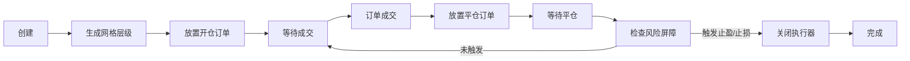

# 第 1 章：概述与简介

## 本章导航

- [返回索引](grid_strike_tutorial_index.md)
- [下一章：策略原理详解](grid_strike_tutorial_02.md)

## 1.1 什么是 GridStrike 策略

GridStrike 是一种基于 Hummingbot Strategy_v2 框架构建的智能网格交易策略，专为期货市场设计。它的核心思想是：

- 在预设价格区间内自动创建网格执行器（GridExecutor）
- 网格执行器在多个价格层级放置限价订单
- 当价格触及订单时自动成交，并在对应层级平仓获利
- 通过价格波动在网格层级间穿梭获取差价利润
- 内置 TripleBarrier 风险管理机制保护资金安全

### 1.1.1 Strategy_v2 架构优势

GridStrike 采用现代化的 Strategy_v2 框架，相比传统策略具有显著优势：

**Controller-Executor 模式**：

- **Controller**（控制器）：负责策略决策，判断何时创建或停止执行器
- **Executor**（执行器）：负责具体交易执行，管理订单生命周期
- **解耦设计**：决策逻辑与执行逻辑分离，代码更清晰易维护

**智能执行管理**：

- 每个 GridExecutor 独立管理自己的网格层级和订单
- 支持多个执行器同时运行（Multi-Grid 模式）
- 自动跟踪订单状态，无需手动管理

**强大的风险控制**：

- TripleBarrier 三重屏障机制（止盈、止损、时间限制）
- 灵活的订单类型配置（限价单、市价单）
- 实时监控和自动关闭机制

### 1.1.2 形象比喻

想象一个智能渔网系统：

- **控制器（Controller）**：就像渔船的船长，观察海况，决定在哪里撒网
- **执行器（Executor）**：就像自动渔网，撒下后自动捕鱼，装满后自动收网
- **网格层级（Grid Levels）**：就像渔网的不同深度，每层都能捕获特定大小的鱼
- **TripleBarrier**：就像安全绳，防止渔网丢失或损坏

## 1.2 与传统网格策略的区别

| 维度 | 传统网格策略 | GridStrike (Strategy_v2) |
|------|------------|-------------------------|
| 架构模式 | 单一脚本，所有逻辑混合 | Controller-Executor 分离 |
| 订单管理 | 手动跟踪订单状态 | 自动状态机管理 |
| 风险管理 | 需要手动实现 | 内置 TripleBarrier 机制 |
| 扩展性 | 修改复杂，容易出错 | 模块化设计，易于扩展 |
| 多网格支持 | 需要重写代码 | 天然支持 Multi-Grid |
| 代码复用 | 低 | 高（Executor 可复用）|
| 市场支持 | 主要现货市场 | 期货市场（支持杠杆）|

## 1.3 适用场景和市场条件

GridStrike 策略并非适用于所有市场情况，它有明确的适用场景。

### 1.3.1 理想市场条件

**震荡市场（横盘整理）**

- 价格在一定区间内反复波动
- 没有明显的单边趋势
- 波动幅度适中，有规律性

**示例**：某期货合约在 2.00-2.20 USDT 区间内持续震荡 1-2 周。

### 1.3.2 适用的交易对特征

1. **流动性充足**
   - 订单簿深度好，滑点小
   - 日均交易量稳定
   - 买卖价差较小（适合限价单成交）

2. **波动性适中**
   - 日波动率在 3%-10% 之间较为理想
   - 过低：利润空间小，资金利用率低
   - 过高：容易突破网格区间，触发止损

3. **价格区间稳定**
   - 在可预见的时间内保持区间震荡
   - 有明显的支撑位和阻力位
   - 适合设置网格边界

4. **资金费率合理**
   - 期货市场特有指标
   - 资金费率不宜过高（侵蚀利润）
   - 理想情况：中性或略有利于持仓方向

### 1.3.3 不适用的场景

**强势单边行情**

- 价格持续上涨或下跌
- 快速突破网格上限或下限
- **风险**：可能触发止损，或错过单边收益

**低流动性市场**

- 订单簿稀疏，价差大
- 订单难以成交或滑点高
- **风险**：实际成交价格偏离预期

**高波动性市场**

- 价格剧烈波动，缺乏规律
- 频繁触及止损或网格边界
- **风险**：频繁开平仓，手续费高

## 1.4 核心概念：Controller-Executor 模式

### 1.4.1 GridStrike Controller

**职责**：

- 监控市场价格是否在网格区间内
- 决定何时创建 GridExecutor
- 管理执行器的生命周期
- 提供状态展示和监控

**核心逻辑**：

```python
if 当前价格在网格区间内 and 没有活跃的执行器:
    创建 GridExecutor
```

### 1.4.2 GridExecutor

**职责**：

- 生成网格价格层级
- 在每个层级放置和管理订单
- 跟踪订单成交和仓位状态
- 执行 TripleBarrier 风险控制
- 平仓后自动关闭

**生命周期**：



### 1.4.3 交互流程

1. **Controller** 定期检查市场条件
2. 条件满足时，**Controller** 创建 **GridExecutor**
3. **GridExecutor** 独立运行，管理订单和仓位
4. **GridExecutor** 将状态信息反馈给 **Controller**
5. **Controller** 汇总显示所有执行器的状态
6. **GridExecutor** 完成任务后自动关闭

## 1.5 策略优势

### 1.5.1 架构优势

- **模块化设计**：决策和执行分离，易于理解和维护
- **状态管理清晰**：执行器自动跟踪网格层级状态
- **易于扩展**：可以轻松添加新功能或自定义逻辑
- **代码复用**：GridExecutor 可在多个策略中使用

### 1.5.2 交易优势

- **自动化执行**：无需盯盘，策略 24/7 自动运行
- **利用震荡市场**：在横盘市场中赚取差价
- **风险可控**：TripleBarrier 自动止盈止损
- **灵活配置**：支持多种参数组合，适应不同市场

### 1.5.3 期货市场优势

- **杠杆支持**：提高资金利用率
- **双向交易**：可以做多或做空网格
- **仓位模式**：支持单向持仓和双向持仓
- **精细控制**：可设置限价保护，避免不利成交

### 1.5.4 风险管理优势

- **止盈机制**：达到目标利润自动平仓
- **止损保护**：限制单次最大亏损
- **时间限制**：避免长时间持仓
- **实时监控**：可随时查看执行器状态

## 1.6 策略风险

### 1.6.1 市场风险

**单边行情风险**

- **价格持续上涨**（做多网格）：快速触及止盈，错过后续上涨
- **价格持续下跌**（做多网格）：可能触发止损，产生亏损
- **突破网格区间**：Controller 停止创建新执行器，策略失效

**高波动风险**

- 价格剧烈波动可能频繁触发止损
- 网格层级频繁成交，手续费成本高
- 实际收益可能低于预期

### 1.6.2 杠杆风险

**强平风险**

- 使用杠杆放大亏损
- 极端行情可能导致强制平仓
- 需要保持足够的保证金余额

**资金费率风险**

- 持仓需要支付或收取资金费率
- 长期持仓可能侵蚀利润
- 需要考虑资金费率方向

### 1.6.3 技术风险

**网络风险**

- 网络故障可能导致订单无法及时下达
- 交易所 API 限流可能影响策略执行
- 需要稳定的网络环境

**配置风险**

- 参数设置不当可能导致策略失效
- 杠杆过高增加强平风险
- 止损设置过小可能频繁触发

### 1.6.4 资金管理风险

**资金不足**

- 网格策略需要充足的保证金
- 资金不足可能无法创建执行器
- 需要预留应对市场波动的缓冲资金

**过度分散**

- 同时运行过多网格可能分散资金
- 单个网格资金过少影响收益
- 需要平衡网格数量和资金分配

## 1.7 适合谁使用

### 1.7.1 适合的用户

**量化交易爱好者**

- 对自动化交易感兴趣
- 愿意学习和优化策略
- 能够理解基本的编程概念

**震荡市场交易者**

- 擅长识别横盘整理行情
- 不追求单边暴利，注重稳健收益
- 有耐心等待价格在区间内波动

**开发者**

- 想要学习 Strategy_v2 框架
- 需要在 GridExecutor 基础上扩展功能
- 希望开发自定义网格策略

### 1.7.2 不适合的用户

**追求暴利者**

- GridStrike 是稳健型策略，不适合追求短期暴利
- 收益主要来自反复套利，而非单次大幅盈利

**不懂风险管理者**

- 期货杠杆交易风险极高
- 需要充分理解止损、仓位管理等概念
- 缺乏风险意识容易导致重大亏损

**无法监控策略者**

- 虽然策略自动运行，但仍需定期检查
- 需要及时调整参数应对市场变化
- 完全放任不管可能导致问题

## 1.8 成功案例与收益预期

### 1.8.1 收益来源

GridStrike 的收益主要来自：

1. **网格套利**：价格在层级间波动产生的买卖价差
2. **止盈累积**：多次小额止盈累积成可观收益
3. **资金费率**（如果有利）：持仓收取的资金费率
4. **复利效应**：利润再投资，增加网格规模

### 1.8.2 收益率估算

在理想条件下（震荡市场，合理参数配置，10x-20x 杠杆）：

- **保守型配置**：月收益率 5%-15%
- **均衡型配置**：月收益率 15%-30%
- **激进型配置**：月收益率 30%-60%（但风险也更高）

**注意**：以上仅为理论估算，实际收益取决于多种因素：

- 市场波动性和波动频率
- 网格参数设置（间距、止盈等）
- 交易手续费和资金费率
- 杠杆倍数
- 市场流动性

### 1.8.3 风险收益比

**示例场景：中等波动的震荡市场**

- 交易对：WLD-USDT 期货
- 价格区间：2.00-2.20 USDT（10% 波动区间）
- 网格配置：20 个层级，0.5% 间距
- 杠杆：20x
- 止盈：0.3%，止损：0.5%
- 投入保证金：1000 USDT
- 运行时间：30 天
- 价格在区间内波动 15 次

**收益计算**（简化模型）：

- 单次止盈：1000 USDT × 20x × 0.3% = 60 USDT
- 15 次止盈：60 × 15 = 900 USDT（理论最大值）
- 扣除手续费（约 10%）：900 × 0.9 = 810 USDT
- 扣除资金费率（假设中性）：0
- 考虑止损次数（假设 3 次）：3 × 1000 × 20x × 0.5% = -300 USDT
- **净收益**：810 - 300 = 510 USDT
- **月收益率**：510 / 1000 = 51%

**重要提醒**：

- 以上为理想化计算，实际情况会更复杂
- 市场不会完美按照预期波动
- 滑点、部分成交等因素会影响收益
- 单边行情可能导致策略失效
- **风险与收益并存，谨慎使用高杠杆**

## 1.9 本章小结

GridStrike 策略是基于 Strategy_v2 框架的现代化网格交易策略，专为期货市场的震荡行情设计。

**关键要点**：

1. **Controller-Executor 架构**：决策与执行分离，模块化设计
2. **最适合震荡市场**：不适合强势单边行情
3. **内置风险管理**：TripleBarrier 自动止盈止损
4. **期货市场专用**：支持杠杆、双向交易、仓位模式
5. **收益稳健但需承担风险**：杠杆放大收益也放大风险

在决定使用 GridStrike 策略之前，请确保：

- 充分理解 Strategy_v2 架构和策略原理
- 了解期货杠杆交易的风险
- 选择合适的市场和交易对
- 准备足够的保证金
- 有能力监控和调整策略
- 做好风险管理和资金管理

准备好了吗？下一章我们将深入学习 [策略原理详解](grid_strike_tutorial_02.md)，了解 Controller-Executor 模式和 GridExecutor 的工作机制。

---

[返回索引](grid_strike_tutorial_index.md) | [下一章：策略原理详解](grid_strike_tutorial_02.md)
