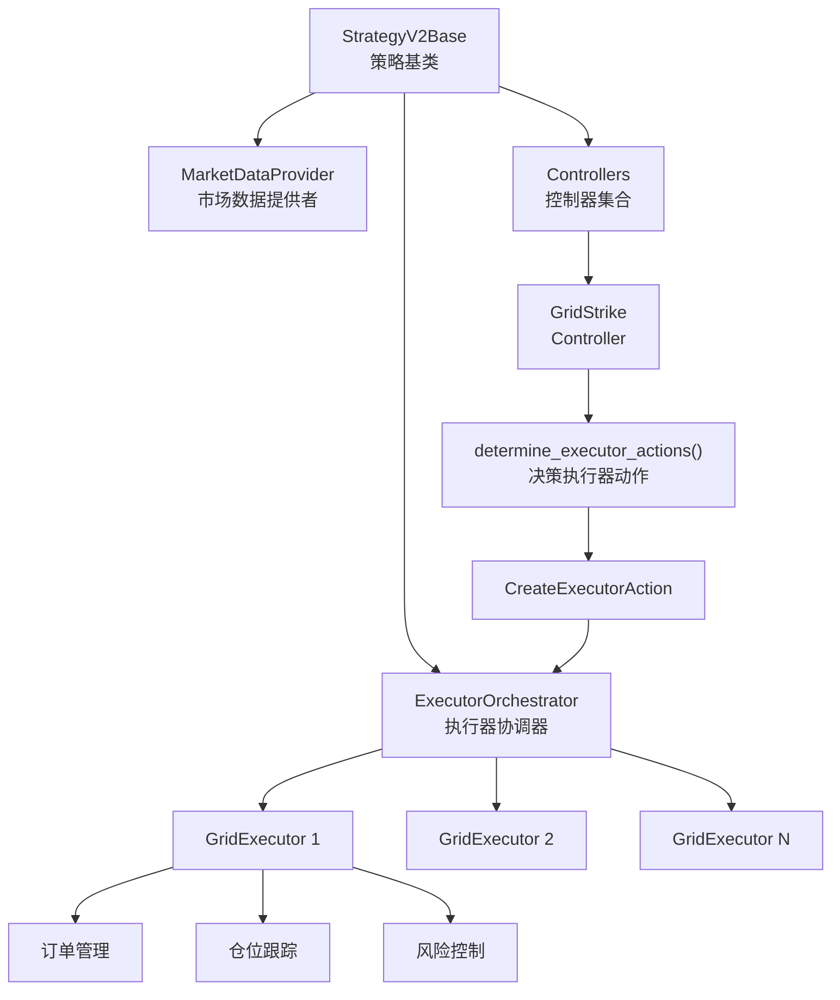
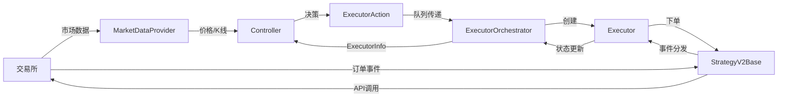
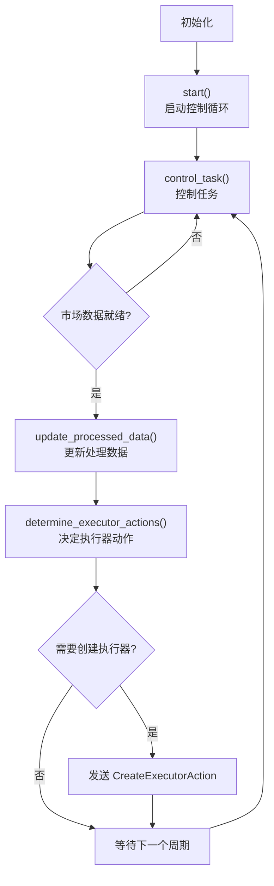
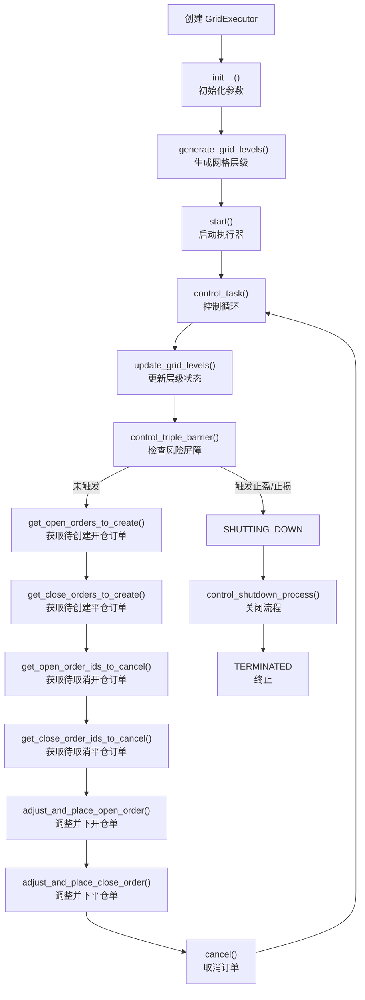
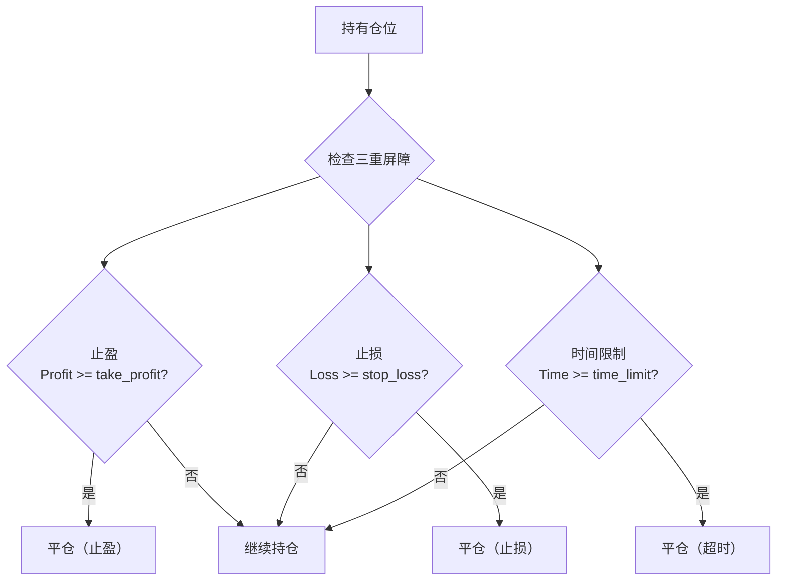

# 第 2 章：策略原理详解

## 本章导航

- [返回索引](grid_strike_tutorial_index.md)
- [上一章：概述与简介](grid_strike_tutorial_01.md)
- [下一章：参数配置完全指南](grid_strike_tutorial_03.md)

## 2.1 Strategy_v2 框架架构

### 2.1.1 整体架构图



### 2.1.2 核心组件职责

**StrategyV2Base（策略基类）**

- 管理所有控制器的生命周期
- 提供市场数据访问接口
- 协调控制器和执行器的交互
- 处理订单事件和市场事件

**MarketDataProvider（市场数据提供者）**

- 实时获取市场价格（MidPrice、BestBid、BestAsk）
- 管理 K 线数据（如果需要）
- 提供价格转换和汇率查询
- 缓存数据以提高性能

**ExecutorOrchestrator（执行器协调器）**

- 接收控制器发送的执行器动作
- 创建和管理执行器实例
- 跟踪所有活跃执行器的状态
- 收集和汇总执行器的性能数据

**Controller（控制器）**

- 实现策略的决策逻辑
- 监控市场条件
- 决定何时创建或停止执行器
- 管理策略参数

**Executor（执行器）**

- 执行具体的交易逻辑
- 管理订单生命周期
- 跟踪仓位和盈亏
- 实现风险控制

### 2.1.3 数据流动



## 2.2 GridStrike Controller 原理

### 2.2.1 Controller 生命周期



### 2.2.2 核心决策逻辑

GridStrike Controller 的决策逻辑非常简洁：

```python
def determine_executor_actions(self) -> List[ExecutorAction]:
    mid_price = self.market_data_provider.get_price_by_type(
        self.config.connector_name, 
        self.config.trading_pair, 
        PriceType.MidPrice
    )
    
    # 条件1：当前没有活跃的执行器
    # 条件2：价格在网格区间内
    if len(self.active_executors()) == 0 and self.is_inside_bounds(mid_price):
        return [CreateExecutorAction(
            controller_id=self.config.id,
            executor_config=GridExecutorConfig(...)
        )]
    
    return []
```

**决策要点**：

1. **单执行器模式**：同一时间只创建一个 GridExecutor
2. **价格边界检查**：只在价格位于 `start_price` 和 `end_price` 之间时创建
3. **自动重启**：上一个执行器关闭后，如果条件满足会自动创建新的

### 2.2.3 边界检查

```python
def is_inside_bounds(self, price: Decimal) -> bool:
    return self.config.start_price <= price <= self.config.end_price
```

**作用**：

- 防止在不利价格创建执行器
- 确保网格订单价格合理
- 避免在单边行情中继续入场

## 2.3 GridExecutor 工作机制

### 2.3.1 Executor 生命周期



### 2.3.2 网格层级生成

GridExecutor 的核心是网格层级（Grid Levels）的生成和管理。

**生成算法**：

```python
def _generate_grid_levels(self) -> List[GridLevel]:
    levels = []
    
    # 计算总网格间距
    total_spread = self.config.end_price - self.config.start_price
    
    # 计算单个层级数量
    num_levels = int(total_spread / self.config.min_spread_between_orders)
    
    # 确保不超过最大订单数
    num_levels = min(num_levels, self.config.max_open_orders)
    
    # 生成每个层级
    for i in range(num_levels):
        price = self.config.start_price + i * self.config.min_spread_between_orders
        
        # 计算该层级的订单金额
        amount_quote = self.config.total_amount_quote / num_levels
        amount_quote = max(amount_quote, self.config.min_order_amount_quote)
        
        # 创建网格层级
        level = GridLevel(
            id=f"{self.config.id}_level_{i}",
            price=price,
            amount_quote=amount_quote,
            take_profit=self.config.triple_barrier_config.take_profit,
            side=self.config.side,
            open_order_type=self.config.triple_barrier_config.open_order_type,
            take_profit_order_type=self.config.triple_barrier_config.take_profit_order_type
        )
        
        levels.append(level)
    
    return levels
```

**示例**（做多网格）：

```
配置：
- start_price: 2.00 USDT
- end_price: 2.20 USDT
- min_spread_between_orders: 0.01 (1%)
- total_amount_quote: 1000 USDT
- max_open_orders: 5

生成层级：
Level 0: price=2.00, amount=200 USDT
Level 1: price=2.02, amount=200 USDT (2.00 * 1.01)
Level 2: price=2.04, amount=200 USDT (2.02 * 1.01)
Level 3: price=2.06, amount=200 USDT
Level 4: price=2.08, amount=200 USDT
（共5个层级，用完 max_open_orders）
```

### 2.3.3 网格层级状态机

每个网格层级都有自己的状态，随着订单执行而转换。


**状态说明**：

1. **NOT_ACTIVE**：层级刚创建，或订单被取消后
2. **OPEN_ORDER_PLACED**：开仓限价单已提交，等待成交
3. **OPEN_ORDER_FILLED**：开仓单成交，持有仓位
4. **CLOSE_ORDER_PLACED**：平仓止盈单已提交，等待成交
5. **COMPLETE**：平仓单成交，该层级交易完成

**状态更新逻辑**：

```python
def update_state(self):
    if self.active_open_order is None:
        self.state = GridLevelStates.NOT_ACTIVE
    elif self.active_open_order.is_filled:
        self.state = GridLevelStates.OPEN_ORDER_FILLED
    else:
        self.state = GridLevelStates.OPEN_ORDER_PLACED
    
    if self.active_close_order is not None:
        if self.active_close_order.is_filled:
            self.state = GridLevelStates.COMPLETE
        else:
            self.state = GridLevelStates.CLOSE_ORDER_PLACED
```

### 2.3.4 订单执行流程

**开仓流程**：

1. 检查层级状态为 `NOT_ACTIVE`
2. 检查是否满足激活条件（activation_bounds）
3. 调整订单价格和数量（满足交易规则）
4. 提交限价买单/卖单
5. 更新层级状态为 `OPEN_ORDER_PLACED`

**平仓流程**：

1. 检查层级状态为 `OPEN_ORDER_FILLED`
2. 计算止盈价格：`entry_price * (1 + take_profit)` (做多)
3. 提交限价卖单/买单
4. 更新层级状态为 `CLOSE_ORDER_PLACED`

**示例**（做多网格，20x 杠杆）：

```
Layer 2 开仓：
- 价格：2.04 USDT
- 数量：200 / 2.04 / 20 = 4.9 个币（考虑杠杆）
- 订单：Buy 4.9 @ 2.04 USDT LIMIT

Layer 2 成交后平仓：
- 止盈价格：2.04 * (1 + 0.003) = 2.046 USDT (0.3% 止盈)
- 订单：Sell 4.9 @ 2.046 USDT LIMIT
```

## 2.4 TripleBarrier 风险管理机制

### 2.4.1 三重屏障概念

TripleBarrier 是一种同时使用三个退出条件的风险管理机制：



### 2.4.2 止盈（Take Profit）

**计算方式**：

```python
# 对于做多
realized_pnl_pct = (current_price - entry_price) / entry_price

# 对于做空
realized_pnl_pct = (entry_price - current_price) / entry_price

if realized_pnl_pct >= take_profit:
    触发止盈
```

**配置示例**：

```python
TripleBarrierConfig(
    take_profit=Decimal("0.003"),  # 0.3% 止盈
    take_profit_order_type=OrderType.LIMIT_MAKER  # 使用限价单
)
```

**作用**：

- 锁定利润，避免贪婪
- 每个层级独立止盈
- 累积小额利润

### 2.4.3 止损（Stop Loss）

**计算方式**：

```python
# 对于做多
realized_pnl_pct = (current_price - entry_price) / entry_price

if realized_pnl_pct <= -stop_loss:
    触发止损
```

**配置示例**：

```python
TripleBarrierConfig(
    stop_loss=Decimal("0.01"),  # 1% 止损
    stop_loss_order_type=OrderType.MARKET  # 使用市价单快速平仓
)
```

**作用**：

- 限制单次最大亏损
- 防止单边行情导致重大损失
- 保护本金安全

### 2.4.4 时间限制（Time Limit）

**计算方式**：

```python
time_elapsed = current_timestamp - entry_timestamp

if time_elapsed >= time_limit:
    触发时间限制
```

**配置示例**：

```python
TripleBarrierConfig(
    time_limit=3600,  # 1小时（秒）
    time_limit_order_type=OrderType.MARKET
)
```

**作用**：

- 避免长时间持仓
- 减少资金费率支出
- 提高资金周转率

### 2.4.5 综合示例

```python
TripleBarrierConfig(
    take_profit=Decimal("0.005"),      # 0.5% 止盈
    stop_loss=Decimal("0.015"),        # 1.5% 止损
    time_limit=7200,                   # 2小时
    open_order_type=OrderType.LIMIT_MAKER,
    take_profit_order_type=OrderType.LIMIT_MAKER,
    stop_loss_order_type=OrderType.MARKET,
    time_limit_order_type=OrderType.MARKET
)
```

**解读**：

- 开仓使用限价单（Maker，低手续费）
- 止盈使用限价单（追求更好价格）
- 止损使用市价单（确保快速平仓）
- 超时使用市价单（快速退出）

## 2.5 订单管理策略

### 2.5.1 批量下单控制

GridExecutor 支持批量下单控制，避免同时下太多订单。

**配置参数**：

- `max_open_orders`：最多同时存在的开仓订单数
- `max_orders_per_batch`：每次最多下几个订单
- `order_frequency`：订单刷新间隔（秒）

**执行逻辑**：

```python
# 获取需要创建的订单
open_orders_to_create = self.get_open_orders_to_create()

# 限制批量下单数量
if self.config.max_orders_per_batch is not None:
    open_orders_to_create = open_orders_to_create[:self.config.max_orders_per_batch]

# 检查订单刷新频率
if time.time() - self.last_order_time < self.config.order_frequency:
    return  # 跳过本次下单
```

**示例场景**：

```
配置：
- max_open_orders = 10
- max_orders_per_batch = 3
- order_frequency = 5

执行：
- 第 0 秒：下 3 个订单（Level 0-2）
- 第 5 秒：下 3 个订单（Level 3-5）
- 第 10 秒：下 3 个订单（Level 6-8）
- 第 15 秒：下 1 个订单（Level 9）
```

### 2.5.2 订单调整机制

在下单前，GridExecutor 会调整订单参数以满足交易规则。

**价格调整**：

```python
def adjust_order_price(self, price, side):
    # 获取交易规则
    price_step = self.trading_rules.min_price_increment
    
    # 价格向下取整到步长的倍数
    adjusted_price = (price // price_step) * price_step
    
    return adjusted_price
```

**数量调整**：

```python
def adjust_order_amount(self, amount):
    # 获取交易规则
    min_order_size = self.trading_rules.min_order_size
    quantity_step = self.trading_rules.min_base_amount_increment
    
    # 数量向下取整到步长的倍数
    adjusted_amount = (amount // quantity_step) * quantity_step
    
    # 确保不低于最小下单量
    adjusted_amount = max(adjusted_amount, min_order_size)
    
    return adjusted_amount
```

### 2.5.3 订单取消策略

GridExecutor 会在以下情况取消订单：

1. **开仓订单超时未成交**（根据 activation_bounds）
2. **触发风险屏障**（止盈、止损、时间限制）
3. **执行器关闭**（early_stop 或正常结束）

**取消逻辑**：

```python
def get_open_order_ids_to_cancel(self):
    to_cancel = []
    
    for level in self.grid_levels:
        if level.state == GridLevelStates.OPEN_ORDER_PLACED:
            # 检查订单是否超时
            if self.is_order_expired(level.active_open_order):
                to_cancel.append(level.active_open_order.order_id)
    
    return to_cancel
```

## 2.6 盈利模式分析

### 2.6.1 基本盈利模型

GridStrike 的基本盈利来自网格套利：

```
单次盈利 = 持仓金额 × 止盈比例
        = (订单金额 × 杠杆) × take_profit

示例（20x 杠杆，0.3% 止盈）：
单次盈利 = 200 USDT × 20 × 0.003 = 12 USDT
```

**累积收益**：

```
总收益 = 成功平仓次数 × 平均单次盈利 - 手续费 - 资金费率
```

### 2.6.2 收益影响因素

**正向因素**：

1. **市场波动频率**：波动越频繁，成交次数越多
2. **止盈比例**：止盈越高，单次收益越大（但成交频率降低）
3. **杠杆倍数**：杠杆越高，收益放大（风险也放大）
4. **网格密度**：层级越多，捕获机会越多

**负向因素**：

1. **交易手续费**：每次开仓和平仓都需支付手续费
2. **资金费率**：期货持仓需要支付资金费率（可能为负）
3. **滑点**：实际成交价格偏离预期
4. **止损**：触发止损导致亏损

### 2.6.3 盈利场景分析

**理想场景：规律震荡**

```
价格走势：2.00 → 2.10 → 2.00 → 2.10 → 2.00
触发层级：多个层级反复成交
收益：高（多次止盈）
```

**中性场景：宽幅震荡**

```
价格走势：2.00 → 2.15 → 2.05 → 2.18
触发层级：部分层级成交
收益：中等（少量止盈）
```

**不利场景：单边突破**

```
价格走势：2.00 → 2.25（突破网格上限）
触发层级：所有层级快速成交并止盈
收益：低（错过后续上涨），或触发止损
```

## 2.7 本章小结

本章深入讲解了 GridStrike 策略的核心原理：

**Strategy_v2 架构**：

1. **Controller-Executor 模式**：决策与执行分离，职责清晰
2. **ExecutorOrchestrator**：协调管理所有执行器
3. **MarketDataProvider**：统一的市场数据访问接口

**GridStrike Controller**：

1. **简洁决策**：价格在区间内且无活跃执行器时创建
2. **边界保护**：避免在不利价格入场
3. **自动重启**：执行器关闭后自动创建新的

**GridExecutor**：

1. **网格层级生成**：根据配置自动计算层级价格和数量
2. **状态机管理**：清晰的层级状态转换
3. **批量下单**：控制订单创建频率和数量

**TripleBarrier 风险管理**：

1. **止盈**：锁定利润
2. **止损**：限制亏损
3. **时间限制**：控制持仓时间

**盈利模式**：

- 基于震荡市场的网格套利
- 收益 = 成交次数 × 单次盈利 - 成本
- 杠杆放大收益，也放大风险

理解了这些原理后，下一章我们将详细学习 [参数配置完全指南](grid_strike_tutorial_03.md)，掌握如何配置策略参数以适应不同的市场条件。

---

[返回索引](grid_strike_tutorial_index.md) | [上一章：概述与简介](grid_strike_tutorial_01.md) | [下一章：参数配置完全指南](grid_strike_tutorial_03.md)

