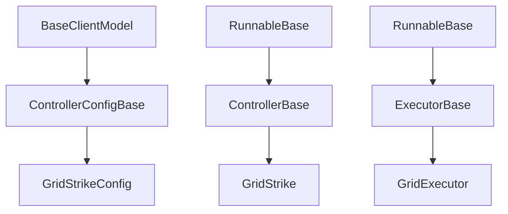
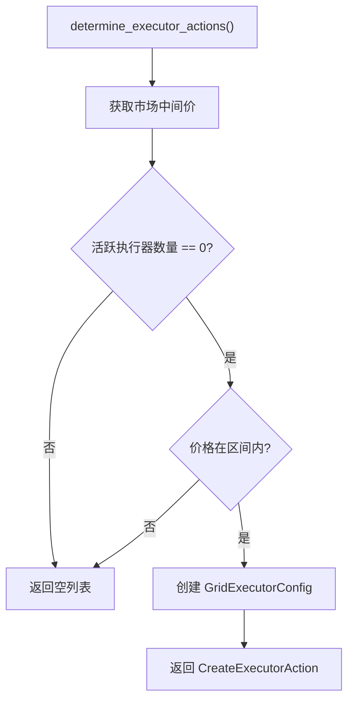
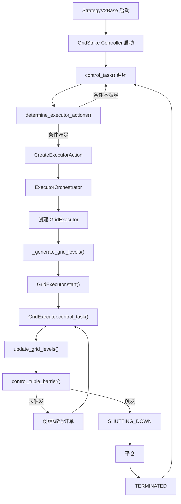

# 第 6 章：代码实现深度解析

## 本章导航

- [返回索引](grid_strike_tutorial_index.md)
- [上一章：使用示例](grid_strike_tutorial_05.md)
- [下一章：高级功能与扩展](grid_strike_tutorial_07.md)

## 6.1 代码结构概览

### 6.1.1 类继承关系



**说明**：

- `GridStrikeConfig`：配置类，继承自 `ControllerConfigBase`
- `GridStrike`：控制器类，继承自 `ControllerBase`
- `GridExecutor`：执行器类，继承自 `ExecutorBase`

### 6.1.2 核心文件列表

| 文件路径 | 作用 | 关键类/方法 |
|---------|------|-----------|
| `controllers/generic/grid_strike.py` | GridStrike 控制器 | GridStrikeConfig, GridStrike |
| `hummingbot/strategy_v2/controllers/controller_base.py` | 控制器基类 | ControllerBase |
| `hummingbot/strategy_v2/executors/grid_executor/grid_executor.py` | 网格执行器 | GridExecutor |
| `hummingbot/strategy_v2/executors/grid_executor/data_types.py` | 数据类型定义 | GridExecutorConfig, GridLevel |
| `hummingbot/strategy_v2/executors/executor_orchestrator.py` | 执行器协调器 | ExecutorOrchestrator |

## 6.2 GridStrikeConfig 配置类

### 6.2.1 类定义

```python 16:54:controllers/generic/grid_strike.py
class GridStrikeConfig(ControllerConfigBase):
    """
    Configuration required to run the GridStrike strategy for one connector and trading pair.
    """
    controller_type: str = "generic"
    controller_name: str = "grid_strike"
    candles_config: List[CandlesConfig] = []

    # Account configuration
    leverage: int = 20
    position_mode: PositionMode = PositionMode.HEDGE

    # Boundaries
    connector_name: str = "binance_perpetual"
    trading_pair: str = "WLD-USDT"
    side: TradeType = TradeType.BUY
    start_price: Decimal = Field(default=Decimal("0.58"), json_schema_extra={"is_updatable": True})
    end_price: Decimal = Field(default=Decimal("0.95"), json_schema_extra={"is_updatable": True})
    limit_price: Decimal = Field(default=Decimal("0.55"), json_schema_extra={"is_updatable": True})

    # Profiling
    total_amount_quote: Decimal = Field(default=Decimal("1000"), json_schema_extra={"is_updatable": True})
    min_spread_between_orders: Optional[Decimal] = Field(default=Decimal("0.001"), json_schema_extra={"is_updatable": True})
    min_order_amount_quote: Optional[Decimal] = Field(default=Decimal("5"), json_schema_extra={"is_updatable": True})

    # Execution
    max_open_orders: int = Field(default=2, json_schema_extra={"is_updatable": True})
    max_orders_per_batch: Optional[int] = Field(default=1, json_schema_extra={"is_updatable": True})
    order_frequency: int = Field(default=3, json_schema_extra={"is_updatable": True})
    activation_bounds: Optional[Decimal] = Field(default=None, json_schema_extra={"is_updatable": True})
    keep_position: bool = Field(default=False, json_schema_extra={"is_updatable": True})

    # Risk Management
    triple_barrier_config: TripleBarrierConfig = TripleBarrierConfig(
        take_profit=Decimal("0.001"),
        open_order_type=OrderType.LIMIT_MAKER,
        take_profit_order_type=OrderType.LIMIT_MAKER,
    )

    def update_markets(self, markets: MarketDict) -> MarketDict:
        return markets.add_or_update(self.connector_name, self.trading_pair)
```

**关键点**：

1. **is_updatable 标记**：标记为 `True` 的参数可以在运行时动态调整
2. **默认值**：提供合理的默认配置
3. **类型提示**：使用 Python 类型提示和 Pydantic 验证
4. **update_markets 方法**：告诉框架需要连接哪个市场

### 6.2.2 参数分组逻辑

配置参数按功能分为六组，便于理解和维护：

```python
# 1. Account configuration（账户配置）
leverage, position_mode

# 2. Boundaries（网格边界）
connector_name, trading_pair, side
start_price, end_price, limit_price

# 3. Profiling（资金配置）
total_amount_quote, min_spread_between_orders, min_order_amount_quote

# 4. Execution（执行控制）
max_open_orders, max_orders_per_batch, order_frequency
activation_bounds, keep_position

# 5. Risk Management（风险管理）
triple_barrier_config

# 6. Advanced（高级选项）
candles_config
```

## 6.3 GridStrike 控制器类

### 6.3.1 初始化方法

```python 60:66:controllers/generic/grid_strike.py
def __init__(self, config: GridStrikeConfig, *args, **kwargs):
    super().__init__(config, *args, **kwargs)
    self.config = config
    self._last_grid_levels_update = 0
    self.trading_rules = None
    self.grid_levels = []
    self.initialize_rate_sources()
```

**初始化流程**：

1. 调用父类初始化
2. 保存配置引用
3. 初始化内部状态变量
4. 初始化汇率数据源

**内部变量说明**：

- `_last_grid_levels_update`：上次网格层级更新时间（未使用）
- `trading_rules`：交易规则（未使用）
- `grid_levels`：网格层级列表（未使用）

### 6.3.2 汇率源初始化

```python 68:70:controllers/generic/grid_strike.py
def initialize_rate_sources(self):
    self.market_data_provider.initialize_rate_sources([ConnectorPair(connector_name=self.config.connector_name,
                                                                     trading_pair=self.config.trading_pair)])
```

**作用**：

- 初始化价格数据源
- 确保 `market_data_provider` 能够获取实时价格
- 支持跨币种汇率转换

### 6.3.3 活跃执行器查询

```python 72:76:controllers/generic/grid_strike.py
def active_executors(self) -> List[ExecutorInfo]:
    return [
        executor for executor in self.executors_info
        if executor.is_active
    ]
```

**功能**：

- 筛选出状态为活跃的执行器
- `is_active` 包括：`RUNNING`、`NOT_STARTED`、`SHUTTING_DOWN`
- 排除已终止的执行器

**使用场景**：

```python
# 判断是否需要创建新执行器
if len(self.active_executors()) == 0:
    # 没有活跃执行器，可以创建新的
    create_new_executor()
```

### 6.3.4 边界检查

```python 78:79:controllers/generic/grid_strike.py
def is_inside_bounds(self, price: Decimal) -> bool:
    return self.config.start_price <= price <= self.config.end_price
```

**逻辑**：

```python
# 价格必须在 [start_price, end_price] 区间内
# 示例
start_price = 2.00
end_price = 2.20
current_price = 2.10

is_inside = 2.00 <= 2.10 <= 2.20  # True
```

**作用**：

- 避免在不利价格创建执行器
- 确保网格订单价格合理
- 单边行情时停止创建新执行器

### 6.3.5 核心决策方法

```81:107:controllers/generic/grid_strike.py
def determine_executor_actions(self) -> List[ExecutorAction]:
    mid_price = self.market_data_provider.get_price_by_type(
        self.config.connector_name, self.config.trading_pair, PriceType.MidPrice)
    if len(self.active_executors()) == 0 and self.is_inside_bounds(mid_price):
        return [CreateExecutorAction(
            controller_id=self.config.id,
            executor_config=GridExecutorConfig(
                timestamp=self.market_data_provider.time(),
                connector_name=self.config.connector_name,
                trading_pair=self.config.trading_pair,
                start_price=self.config.start_price,
                end_price=self.config.end_price,
                leverage=self.config.leverage,
                limit_price=self.config.limit_price,
                side=self.config.side,
                total_amount_quote=self.config.total_amount_quote,
                min_spread_between_orders=self.config.min_spread_between_orders,
                min_order_amount_quote=self.config.min_order_amount_quote,
                max_open_orders=self.config.max_open_orders,
                max_orders_per_batch=self.config.max_orders_per_batch,
                order_frequency=self.config.order_frequency,
                activation_bounds=self.config.activation_bounds,
                triple_barrier_config=self.config.triple_barrier_config,
                level_id=None,
                keep_position=self.config.keep_position,
            ))]
    return []
```

**决策逻辑流程图**：



**关键点**：

1. **单执行器模式**：同时最多只有 1 个 GridExecutor
2. **条件触发**：
   - 没有活跃执行器
   - 价格在 `start_price` 和 `end_price` 之间
3. **配置传递**：将所有控制器配置传递给执行器

### 6.3.6 更新处理数据

```109:110:controllers/generic/grid_strike.py
async def update_processed_data(self):
    pass
```

**说明**：

- GridStrike 不需要额外的数据处理
- 如果需要技术指标等数据，在此方法中计算
- 保持为空方法满足基类要求

## 6.4 状态展示方法

### 6.4.1 to_format_status 方法

```112:196:controllers/generic/grid_strike.py
def to_format_status(self) -> List[str]:
    status = []
    mid_price = self.market_data_provider.get_price_by_type(
        self.config.connector_name, self.config.trading_pair, PriceType.MidPrice)
    # Define standard box width for consistency
    box_width = 114
    # Top Grid Configuration box with simple borders
    status.append("┌" + "─" * box_width + "┐")
    # First line: Grid Configuration and Mid Price
    left_section = "Grid Configuration:"
    padding = box_width - len(left_section) - 4  # -4 for the border characters and spacing
    config_line1 = f"│ {left_section}{' ' * padding}"
    padding2 = box_width - len(config_line1) + 1  # +1 for correct right border alignment
    config_line1 += " " * padding2 + "│"
    status.append(config_line1)
    # Second line: Configuration parameters
    config_line2 = f"│ Start: {self.config.start_price:.4f} │ End: {self.config.end_price:.4f} │ Side: {self.config.side} │ Limit: {self.config.limit_price:.4f} │ Mid Price: {mid_price:.4f} │"
    padding = box_width - len(config_line2) + 1  # +1 for correct right border alignment
    config_line2 += " " * padding + "│"
    status.append(config_line2)
    # Third line: Max orders and Inside bounds
    config_line3 = f"│ Max Orders: {self.config.max_open_orders}   │ Inside bounds: {1 if self.is_inside_bounds(mid_price) else 0}"
    padding = box_width - len(config_line3) + 1  # +1 for correct right border alignment
    config_line3 += " " * padding + "│"
    status.append(config_line3)
    status.append("└" + "─" * box_width + "┘")
    for level in self.active_executors():
        # Define column widths for perfect alignment
        col_width = box_width // 3  # Dividing the total width by 3 for equal columns
        total_width = box_width
        # Grid Status header - use long line and running status
        status_header = f"Grid Status: {level.id} (RunnableStatus.RUNNING)"
        status_line = f"┌ {status_header}" + "─" * (total_width - len(status_header) - 2) + "┐"
        status.append(status_line)
        # Calculate exact column widths for perfect alignment
        col1_end = col_width
        # Column headers
        header_line = "│ Level Distribution" + " " * (col1_end - 20) + "│"
        header_line += " Order Statistics" + " " * (col_width - 18) + "│"
        header_line += " Performance Metrics" + " " * (col_width - 21) + "│"
        status.append(header_line)
        # Data for the three columns
        level_dist_data = [
            f"NOT_ACTIVE: {len(level.custom_info['levels_by_state'].get('NOT_ACTIVE', []))}",
            f"OPEN_ORDER_PLACED: {len(level.custom_info['levels_by_state'].get('OPEN_ORDER_PLACED', []))}",
            f"OPEN_ORDER_FILLED: {len(level.custom_info['levels_by_state'].get('OPEN_ORDER_FILLED', []))}",
            f"CLOSE_ORDER_PLACED: {len(level.custom_info['levels_by_state'].get('CLOSE_ORDER_PLACED', []))}",
            f"COMPLETE: {len(level.custom_info['levels_by_state'].get('COMPLETE', []))}"
        ]
        order_stats_data = [
            f"Total: {sum(len(level.custom_info[k]) for k in ['filled_orders', 'failed_orders', 'canceled_orders'])}",
            f"Filled: {len(level.custom_info['filled_orders'])}",
            f"Failed: {len(level.custom_info['failed_orders'])}",
            f"Canceled: {len(level.custom_info['canceled_orders'])}"
        ]
        perf_metrics_data = [
            f"Buy Vol: {level.custom_info['realized_buy_size_quote']:.4f}",
            f"Sell Vol: {level.custom_info['realized_sell_size_quote']:.4f}",
            f"R. PnL: {level.custom_info['realized_pnl_quote']:.4f}",
            f"R. Fees: {level.custom_info['realized_fees_quote']:.4f}",
            f"P. PnL: {level.custom_info['position_pnl_quote']:.4f}",
            f"Position: {level.custom_info['position_size_quote']:.4f}"
        ]
        # Build rows with perfect alignment
        max_rows = max(len(level_dist_data), len(order_stats_data), len(perf_metrics_data))
        for i in range(max_rows):
            col1 = level_dist_data[i] if i < len(level_dist_data) else ""
            col2 = order_stats_data[i] if i < len(order_stats_data) else ""
            col3 = perf_metrics_data[i] if i < len(perf_metrics_data) else ""
            row = "│ " + col1
            row += " " * (col1_end - len(col1) - 2)  # -2 for the "│ " at the start
            row += "│ " + col2
            row += " " * (col_width - len(col2) - 2)  # -2 for the "│ " before col2
            row += "│ " + col3
            row += " " * (col_width - len(col3) - 2)  # -2 for the "│ " before col3
            row += "│"
            status.append(row)
        # Liquidity line with perfect alignment
        status.append("├" + "─" * total_width + "┤")
        liquidity_line = f"│ Open Liquidity: {level.custom_info['open_liquidity_placed']:.4f} │ Close Liquidity: {level.custom_info['close_liquidity_placed']:.4f} │"
        liquidity_line += " " * (total_width - len(liquidity_line) + 1)  # +1 for correct right border alignment
        liquidity_line += "│"
        status.append(liquidity_line)
        status.append("└" + "─" * total_width + "┘")
    return status
```

**输出格式**：

```
┌──────────────────────────────────────────────────────────────────────────────┐
│ Grid Configuration:                                                           │
│ Start: 2.0000 │ End: 2.2000 │ Side: BUY │ Limit: 1.9500 │ Mid Price: 2.1200│
│ Max Orders: 5   │ Inside bounds: 1                                           │
└──────────────────────────────────────────────────────────────────────────────┘

┌ Grid Status: executor_id (RunnableStatus.RUNNING) ────────────────────────────┐
│ Level Distribution    │ Order Statistics      │ Performance Metrics           │
│ NOT_ACTIVE: 2         │ Total: 15             │ Buy Vol: 2500.0000           │
│ OPEN_ORDER_PLACED: 3  │ Filled: 12            │ Sell Vol: 2400.0000          │
│ OPEN_ORDER_FILLED: 0  │ Failed: 1             │ R. PnL: 150.2500             │
│ CLOSE_ORDER_PLACED: 0 │ Canceled: 2           │ R. Fees: 15.0000             │
│ COMPLETE: 5           │                       │ P. PnL: 0.0000               │
│                       │                       │ Position: 0.0000             │
├──────────────────────────────────────────────────────────────────────────────┤
│ Open Liquidity: 0.0000 │ Close Liquidity: 0.0000                             │
└──────────────────────────────────────────────────────────────────────────────┘
```

**数据来源**：

- `level.custom_info`：执行器提供的自定义信息
- `levels_by_state`：按状态分组的层级
- `filled_orders`、`failed_orders`、`canceled_orders`：订单统计
- `realized_pnl_quote`、`position_pnl_quote`：盈亏数据

## 6.5 GridExecutor 核心机制

虽然 `GridExecutor` 不在 `grid_strike.py` 文件中，但它是策略的核心执行组件。

### 6.5.1 网格层级生成

GridExecutor 在初始化时生成网格层级：

```python
def _generate_grid_levels(self) -> List[GridLevel]:
    levels = []
    
    # 计算价格区间
    total_spread = self.config.end_price - self.config.start_price
    
    # 计算层级数量
    num_levels = int(total_spread / (self.config.start_price * self.config.min_spread_between_orders))
    num_levels = min(num_levels, self.config.max_open_orders)
    
    # 生成层级
    for i in range(num_levels):
        price = self.config.start_price + (total_spread * i / num_levels)
        amount_quote = self.config.total_amount_quote / num_levels
        
        # 确保不低于最小订单金额
        amount_quote = max(amount_quote, self.config.min_order_amount_quote)
        
        levels.append(GridLevel(
            id=f"{self.config.id}_level_{i}",
            price=price,
            amount_quote=amount_quote,
            take_profit=self.config.triple_barrier_config.take_profit,
            side=self.config.side,
            open_order_type=self.config.triple_barrier_config.open_order_type,
            take_profit_order_type=self.config.triple_barrier_config.take_profit_order_type
        ))
    
    return levels
```

### 6.5.2 控制循环

GridExecutor 的主控制循环：

```python
async def control_task(self):
    # 更新网格层级状态
    self.update_grid_levels()
    
    # 更新性能指标
    self.update_metrics()
    
    if self.status == RunnableStatus.RUNNING:
        # 检查风险屏障
        if self.control_triple_barrier():
            self.cancel_open_orders()
            self._status = RunnableStatus.SHUTTING_DOWN
            return
        
        # 获取需要创建的订单
        open_orders_to_create = self.get_open_orders_to_create()
        close_orders_to_create = self.get_close_orders_to_create()
        
        # 获取需要取消的订单
        open_order_ids_to_cancel = self.get_open_order_ids_to_cancel()
        close_order_ids_to_cancel = self.get_close_order_ids_to_cancel()
        
        # 创建订单
        for level in open_orders_to_create:
            self.adjust_and_place_open_order(level)
        
        for level in close_orders_to_create:
            self.adjust_and_place_close_order(level)
        
        # 取消订单
        for order_id in open_order_ids_to_cancel + close_order_ids_to_cancel:
            self._strategy.cancel(...)
    
    elif self.status == RunnableStatus.SHUTTING_DOWN:
        await self.control_shutdown_process()
```

### 6.5.3 TripleBarrier 检查

```python
def control_triple_barrier(self) -> bool:
    """
    检查是否触发三重屏障
    返回 True 表示需要关闭执行器
    """
    # 止盈检查
    if self.config.triple_barrier_config.take_profit:
        if self.realized_pnl_pct >= self.config.triple_barrier_config.take_profit:
            self.close_type = CloseType.TAKE_PROFIT
            return True
    
    # 止损检查
    if self.config.triple_barrier_config.stop_loss:
        if self.realized_pnl_pct <= -self.config.triple_barrier_config.stop_loss:
            self.close_type = CloseType.STOP_LOSS
            return True
    
    # 时间限制检查
    if self.config.triple_barrier_config.time_limit:
        elapsed_time = current_time - self.start_time
        if elapsed_time >= self.config.triple_barrier_config.time_limit:
            self.close_type = CloseType.TIME_LIMIT
            return True
    
    return False
```

## 6.6 执行流程总结

### 6.6.1 完整执行流程



### 6.6.2 关键时间点

1. **T=0**：Controller 启动，开始监控市场
2. **T=1**：价格进入区间，创建 GridExecutor
3. **T=2**：GridExecutor 生成网格层级
4. **T=3**：开始下开仓订单
5. **T=4-N**：订单成交，创建平仓订单，循环运行
6. **T=N+1**：触发 TripleBarrier，关闭执行器
7. **T=N+2**：Controller 检测到无活跃执行器，准备创建新的

## 6.7 本章小结

本章深入解析了 GridStrike 的代码实现：

**GridStrikeConfig**：

- 使用 Pydantic 进行参数验证
- `is_updatable` 标记支持动态调整
- 参数按功能分组，便于维护

**GridStrike Controller**：

- 简洁的决策逻辑：价格在区间 + 无活跃执行器
- 单执行器模式，避免过度分散资金
- 精美的状态展示界面

**GridExecutor**：

- 自动生成网格层级
- 状态机管理层级生命周期
- TripleBarrier 风险控制

**关键设计**：

- Controller-Executor 分离，职责清晰
- 配置驱动，灵活性高
- 自动化程度高，无需手动干预

下一章我们将学习 [高级功能与扩展](grid_strike_tutorial_07.md)，了解如何在 GridStrike 基础上进行定制和扩展。

---

[返回索引](grid_strike_tutorial_index.md) | [上一章：使用示例](grid_strike_tutorial_05.md) | [下一章：高级功能与扩展](grid_strike_tutorial_07.md)
