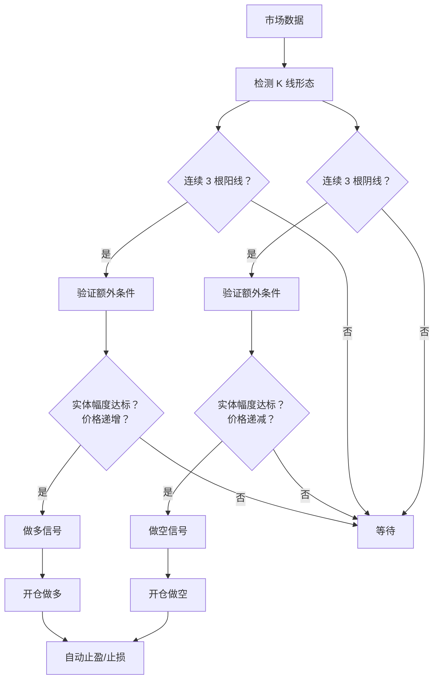

# 第 1 章：快速入门

欢迎来到三连阳/三连阴趋势策略！本章将帮助您在 15 分钟内快速部署并运行这个策略。

## 策略核心理念

### 什么是三连阳/三连阴？

三连阳/三连阴是技术分析中的经典形态，代表市场的强势趋势：

- **三连阳**：连续三根阳线（收盘价高于开盘价），表示买盘强劲，价格持续上涨
- **三连阴**：连续三根阴线（收盘价低于开盘价），表示卖盘强劲，价格持续下跌



### 策略优势

✅ **逻辑简单清晰**：基于直观的 K 线形态，易于理解和验证

✅ **趋势跟踪**：只在强势趋势中入场，提高胜率

✅ **严格过滤**：多重条件验证，减少假信号

✅ **自动风控**：集成止盈止损，无需手动平仓

✅ **参数灵活**：可根据市场特性调整参数

### 策略限制

⚠️ **震荡市场表现一般**：在横盘整理时容易产生假信号

⚠️ **需要明确趋势**：适合趋势明显的市场环境

⚠️ **滞后性**：需要等待 3 根 K 线完成才能确认信号

⚠️ **杠杆风险**：高杠杆可能导致快速亏损

---

## 5 分钟快速部署

### 步骤 1：检查环境

确保您已经：

1. ✅ 安装并配置好 Hummingbot
2. ✅ 配置好交易所 API 密钥（建议先使用测试网）
3. ✅ 账户中有足够的资金

### 步骤 2：复制策略文件

策略文件已经位于：

```bash
scripts/my_strategies/three_candles_trend_strategy.py
scripts/my_strategies/three_candles_trend_config.yml
```

### 步骤 3：修改配置文件

打开 `three_candles_trend_config.yml`，根据需要调整参数：

```yaml
# 基础配置
exchange: binance_perpetual        # 您的交易所
trading_pair: BTC-USDT            # 交易对
candles_interval: 1h              # K 线周期

# 策略参数
trade_direction: LONG             # LONG (仅做多) 或 SHORT (仅做空)
leverage: 20                      # 杠杆倍数（建议从低开始）
order_amount_quote: 10            # 每次开仓金额（USDT）

# 风险管理
stop_loss: 0.02                   # 止损 2%
take_profit: 0.015                # 止盈 1.5%
```

**新手建议配置**：

```yaml
leverage: 10                      # 使用较低杠杆
order_amount_quote: 10            # 小额测试
stop_loss: 0.03                   # 稍大的止损空间
take_profit: 0.02                 # 稍大的止盈空间
```

### 步骤 4：启动 Hummingbot

在终端中启动 Hummingbot：

```bash
cd ~/hummingbot
./start
```

### 步骤 5：导入并启动策略

在 Hummingbot 命令行中执行：

```
# 导入策略
import scripts/my_strategies/three_candles_trend_strategy.py

# 启动策略
start --script scripts/my_strategies/three_candles_trend_strategy.py --conf three_candles_trend_config.yml
```

### 步骤 6：监控运行状态

使用以下命令监控策略：

```
# 查看策略状态
status

# 查看账户余额
balance

# 查看历史交易
history
```

---

## 最小化配置示例

### 示例 1：BTC 1 小时趋势做多

**市场特点**：BTC 波动适中，流动性好

```yaml
exchange: binance_perpetual
trading_pair: BTC-USDT
candles_exchange: binance_perpetual
candles_pair: BTC-USDT
candles_interval: 1h
candles_length: 10

trade_direction: LONG
min_candle_body_pct: 0.001        # 0.1% 实体幅度
leverage: 20
order_amount_quote: 10
position_mode: ONEWAY

stop_loss: 0.02                   # 2% 止损
take_profit: 0.015                # 1.5% 止盈
```

**适用场景**：BTC 处于上升趋势，希望捕捉日内上涨机会

---

### 示例 2：ETH 15 分钟高频交易

**市场特点**：ETH 波动较大，适合短周期

```yaml
exchange: binance_perpetual
trading_pair: ETH-USDT
candles_exchange: binance_perpetual
candles_pair: ETH-USDT
candles_interval: 15m             # 15 分钟周期
candles_length: 10

trade_direction: LONG
min_candle_body_pct: 0.002        # 0.2% 更高的过滤阈值
leverage: 10                      # 较低杠杆
order_amount_quote: 20
position_mode: ONEWAY

stop_loss: 0.015                  # 1.5% 止损
take_profit: 0.01                 # 1% 止盈
```

**适用场景**：短线交易，快进快出

---

### 示例 3：保守型配置

**市场特点**：追求稳健，降低风险

```yaml
exchange: binance_perpetual
trading_pair: BTC-USDT
candles_exchange: binance_perpetual
candles_pair: BTC-USDT
candles_interval: 4h              # 更大周期，信号更可靠
candles_length: 10

trade_direction: LONG
min_candle_body_pct: 0.005        # 0.5% 更严格的过滤
leverage: 5                       # 低杠杆
order_amount_quote: 10
position_mode: ONEWAY

stop_loss: 0.03                   # 3% 更大止损空间
take_profit: 0.04                 # 4% 更大止盈目标
```

**适用场景**：风险承受能力较低，追求稳定收益

---

## 常见问题解答（FAQ）

### Q1：策略多久检查一次信号？

**A**：策略会实时监控市场数据，但信号检测基于 K 线完成。例如使用 1 小时 K 线，则每小时会检查一次新的信号。

---

### Q2：可以同时做多和做空吗？

**A**：当前版本不支持同时持有多空仓位。策略设计为单向持仓，同一时间只能持有一个方向的仓位。如需双向持仓，需要：

- 设置 `position_mode: HEDGE`
- 修改策略代码以支持同时管理多空仓位

---

### Q3：为什么没有开仓？

**A**：检查以下几点：

1. **信号条件未满足**：
   - 查看 `status` 命令，确认当前信号状态
   - 三根 K 线必须全部满足条件（阳线/阴线、实体幅度、价格递增/递减）

2. **已有持仓**：
   - 策略限制只能持有一个仓位
   - 等待当前仓位止盈/止损后才会开新仓

3. **方向限制**：
   - 如果 `trade_direction: LONG`，则只会在三连阳时开仓
   - 即使出现三连阴信号也不会开空单

4. **资金不足**：
   - 检查账户余额是否足够开仓

---

### Q4：止盈止损如何计算？

**A**：基于开仓价格计算：

- **做多止损**：当前价格 ≤ 开仓价 × (1 - stop_loss)
- **做多止盈**：当前价格 ≥ 开仓价 × (1 + take_profit)
- **做空止损**：当前价格 ≥ 开仓价 × (1 + stop_loss)
- **做空止盈**：当前价格 ≤ 开仓价 × (1 - take_profit)

例如：

- 开仓价 100 USDT，做多，stop_loss=0.02，take_profit=0.015
- 止损价：100 × (1 - 0.02) = 98 USDT
- 止盈价：100 × (1 + 0.015) = 101.5 USDT

---

### Q5：如何调整参数以提高胜率？

**A**：以下调整可能提高胜率（但会降低交易频率）：

1. **增加 K 线周期**：从 15m 改为 1h 或 4h
2. **提高实体幅度阈值**：从 0.001 增加到 0.002 或 0.005
3. **使用更大的止损空间**：从 0.02 增加到 0.03
4. **选择趋势明显的市场**：避免在震荡市场中使用

---

### Q6：策略支持哪些交易所？

**A**：理论上支持所有 Hummingbot 支持的永续合约交易所，常见的有：

- Binance Perpetual
- Bybit Perpetual
- OKX Perpetual
- Hyperliquid Perpetual
- dYdX

确保交易所支持：

- 永续合约交易
- 设置杠杆
- MARKET 和 LIMIT 订单类型

---

### Q7：如何停止策略？

**A**：在 Hummingbot 命令行中执行：

```
stop
```

**注意**：停止策略后，已有的持仓不会自动平仓，仍会继续执行止盈止损。如需立即平仓，需要手动在交易所操作或使用 Hummingbot 的手动平仓功能。

---

### Q8：可以在实盘前测试吗？

**A**：强烈建议先测试！有以下几种方式：

1. **交易所测试网**：
   - Binance Testnet
   - Bybit Testnet
   - 使用测试网 API 密钥配置

2. **纸上交易（Paper Trading）**：
   - Hummingbot 支持纸上交易模式
   - 模拟真实交易但不实际下单

3. **小额实盘**：
   - 使用最小金额（如 10 USDT）
   - 低杠杆（如 5-10 倍）测试

---

### Q9：策略会自动复利吗？

**A**：当前版本使用固定金额（`order_amount_quote`）开仓，不会自动复利。如需复利：

1. **手动调整**：定期修改配置文件中的 `order_amount_quote`
2. **代码修改**：修改策略逻辑，根据账户余额动态计算开仓金额

---

### Q10：如何处理连续亏损？

**A**：建议设置以下保护机制：

1. **每日最大亏损**：手动设置，达到后停止策略
2. **连续亏损次数限制**：需要修改代码实现
3. **降低仓位**：亏损后减少 `order_amount_quote`
4. **暂停交易**：连续亏损后暂停几天，等待市场环境改善

**示例保护逻辑**（需要修改代码）：

```python
# 在配置中添加
max_daily_loss: Decimal = Field(default=Decimal("50"))  # 每日最大亏损
max_consecutive_losses: int = Field(default=3)  # 最大连续亏损次数

# 在策略中检查
if self.daily_loss >= self.config.max_daily_loss:
    self.logger().warning("达到每日最大亏损，停止交易")
    return []
```

---

## 下一步学习

恭喜您完成快速入门！现在您已经能够运行策略了。

### 建议学习路径

1. **运行观察**：
   - 在测试环境运行 24-48 小时
   - 观察信号生成频率和准确性
   - 记录盈亏情况

2. **参数调优**：
   - 阅读 [第 2 章：配置详解](./02-configuration-guide.md)
   - 根据观察结果调整参数
   - 测试不同配置的效果

3. **深入理解**：
   - 如果想修改策略逻辑，阅读 [第 3 章：代码详解](./03-code-walkthrough.md)
   - 学习 Hummingbot V2 框架的工作原理

4. **高级优化**：
   - 阅读 [第 4 章：高级用法](./04-advanced-usage.md)
   - 探索性能优化和功能扩展

### 实战建议

📌 **第一周**：

- 在测试网运行，熟悉操作
- 尝试不同的参数组合
- 记录每次交易的情况

📌 **第二周**：

- 小额实盘测试（10-20 USDT）
- 验证策略在真实市场的表现
- 调整参数优化性能

📌 **第三周及以后**：

- 根据历史数据优化参数
- 逐步增加仓位
- 建立完整的风险管理体系

---

## 获取帮助

遇到问题？以下资源可以帮助您：

- 📖 [策略完整文档](../three_candles_trend_strategy.md)
- 💬 [Hummingbot Discord 社区](https://discord.gg/hummingbot)
- 📚 [Hummingbot 官方文档](https://docs.hummingbot.org/)
- 🔍 查看策略日志文件了解详细信息

---

[← 返回目录](./README.md) | [下一章：配置详解 →](./02-configuration-guide.md)
