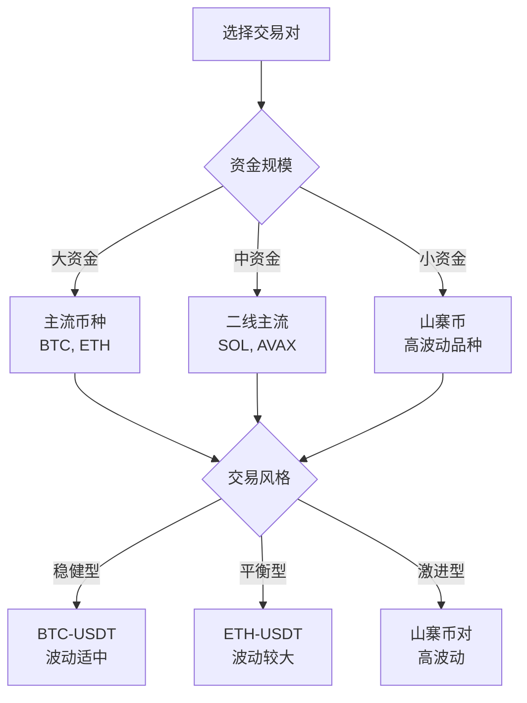
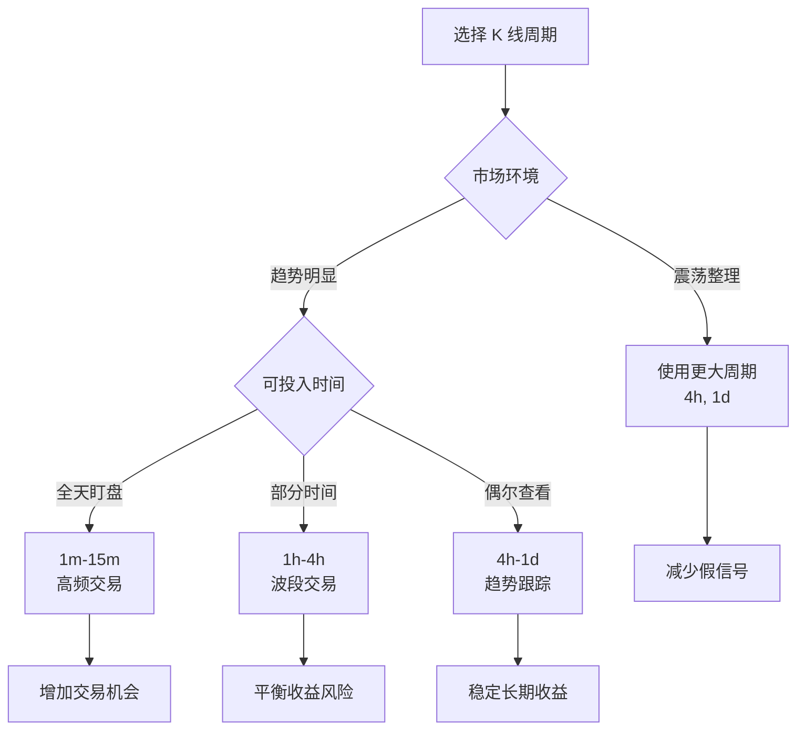
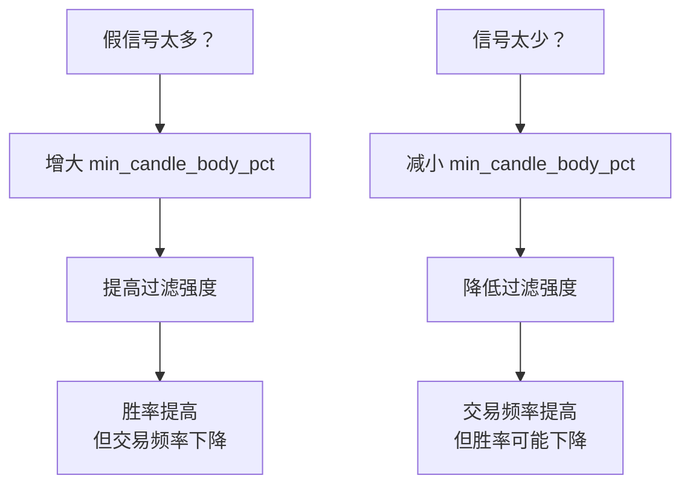
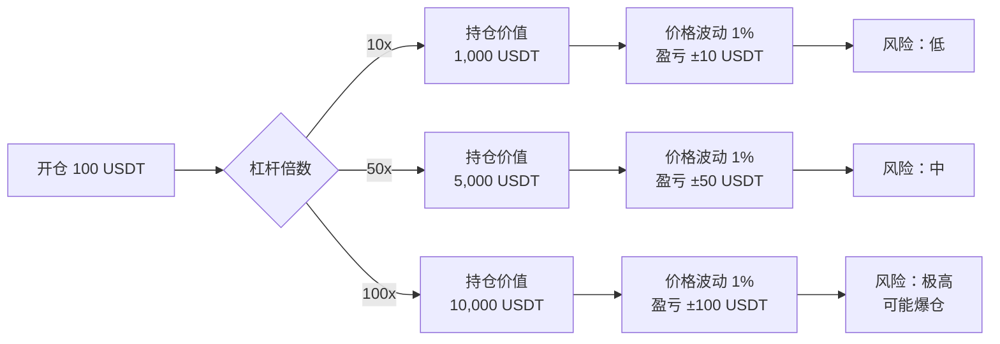
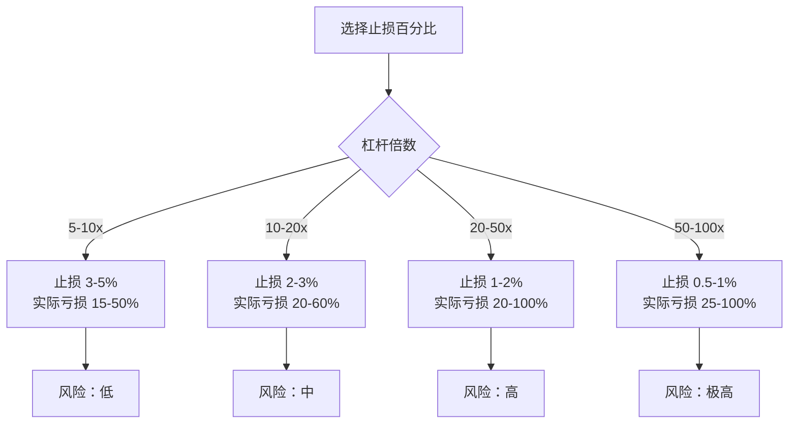
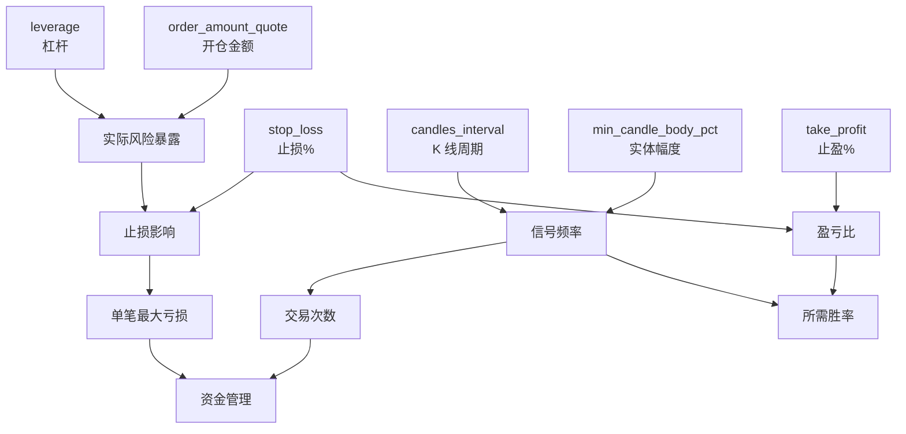

# 第 2 章：配置详解

本章将深入解析三连阳/三连阴趋势策略的所有配置参数，帮助您理解每个参数的作用、优化方法以及它们之间的相互影响。

## 配置文件结构

配置文件采用 YAML 格式，结构清晰、易于编辑：

```yaml
# 三连阳/三连阴趋势策略配置文件

# ========== 交易所配置 ==========
exchange: binance_perpetual
trading_pair: BTC-USDT

# ========== K 线数据源配置 ==========
candles_exchange: binance_perpetual
candles_pair: BTC-USDT
candles_interval: 1h
candles_length: 10

# ========== 策略参数 ==========
trade_direction: LONG
min_candle_body_pct: 0.001
leverage: 50
order_amount_quote: 10
position_mode: ONEWAY

# ========== 风险管理参数 ==========
stop_loss: 0.01
take_profit: 0.02

# ========== 实盘控制 ==========
is_live_trading: false
```

配置分为四个主要部分：

1. 交易所配置
2. K 线数据源配置
3. 策略参数
4. 风险管理参数

> ✅ **自动补全**：如果在 YAML 中未显式声明 `candles_config`，策略会在初始化阶段自动创建一份与上述字段一致的 `CandlesConfig`，确保数据订阅正确无误。

---

## 交易所配置

### exchange

**类型**：`string`

**说明**：执行交易的交易所名称

**默认值**：`binance_perpetual`

**可选值**：

- `binance_perpetual` - Binance 永续合约
- `bybit_perpetual` - Bybit 永续合约
- `okx_perpetual` - OKX 永续合约
- `hyperliquid_perpetual` - Hyperliquid 永续合约
- 其他 Hummingbot 支持的永续合约交易所

**选择建议**：

| 交易所 | 优势 | 劣势 | 适用场景 |
|--------|------|------|---------|
| Binance | 流动性最好，手续费低 | 部分地区受限 | 大资金、高频交易 |
| Bybit | 界面友好，支持多币种 | 流动性略低 | 中小资金 |
| OKX | 产品丰富，深度好 | API 稳定性一般 | 多样化交易 |
| Hyperliquid | 去中心化，透明度高 | 流动性一般 | 追求去中心化 |

**注意事项**：

- 确保已在 Hummingbot 中配置好该交易所的 API 密钥
- 建议先在测试网测试
- 检查交易所是否支持您所在地区

---

### trading_pair

**类型**：`string`

**说明**：交易的币对

**默认值**：`BTC-USDT`

**格式要求**：

- 使用连字符 `-` 分隔基础货币和报价货币
- 示例：`BTC-USDT`, `ETH-USDT`, `BTC-USD`

**选择建议**：



**不同币种特点**：

| 币种类型 | 代表币种 | 波动特点 | 建议杠杆 | 风险等级 |
|---------|---------|---------|---------|---------|
| 一线主流 | BTC, ETH | 波动适中 | 20-50x | ⭐⭐ |
| 二线主流 | SOL, BNB, AVAX | 波动较大 | 10-30x | ⭐⭐⭐ |
| 三线币种 | DOGE, SHIB | 波动很大 | 5-20x | ⭐⭐⭐⭐ |
| 小市值币 | 新币种 | 极端波动 | 3-10x | ⭐⭐⭐⭐⭐ |

**注意事项**：

- 选择流动性好的币对，避免滑点过大
- 波动大的币种需要更宽的止损空间
- 新手建议从 BTC 或 ETH 开始

---

## K 线数据源配置

### candles_exchange

**类型**：`string`

**说明**：K 线数据来源的交易所

**默认值**：`binance_perpetual`

**为什么需要单独配置？**

在某些场景下，交易执行和数据获取可能使用不同的交易所：

```yaml
# 场景 1: 数据和交易使用同一交易所（推荐）
exchange: binance_perpetual
candles_exchange: binance_perpetual

# 场景 2: 数据和交易使用不同交易所
exchange: hyperliquid_perpetual     # 在 Hyperliquid 执行交易
candles_exchange: binance_perpetual # 使用 Binance 的 K 线数据（更稳定）
```

**选择建议**：

- ✅ **推荐**：使用与 `exchange` 相同的交易所
- ✅ **可选**：使用流动性更好的交易所作为数据源
- ❌ **不推荐**：使用不同交易所且价格差异大

---

### candles_pair

**类型**：`string`

**说明**：K 线数据的币对

**默认值**：`BTC-USDT`

**建议**：通常与 `trading_pair` 保持一致

**特殊场景**：

```yaml
# 场景 1: 标准配置（推荐）
trading_pair: BTC-USDT
candles_pair: BTC-USDT

# 场景 2: 不同报价货币但价格相关
trading_pair: BTC-USD         # 在美元市场交易
candles_pair: BTC-USDT        # 使用 USDT 市场的 K 线（流动性更好）

# 注意：仅在两个市场高度相关时使用
```

---

### candles_interval

**类型**：`string`

**说明**：K 线的时间周期

**默认值**：`1h`

**可选值**：

- `1m` - 1 分钟
- `3m` - 3 分钟
- `5m` - 5 分钟
- `15m` - 15 分钟
- `30m` - 30 分钟
- `1h` - 1 小时
- `2h` - 2 小时
- `4h` - 4 小时
- `1d` - 1 天

**不同周期的特点**：

| 周期 | 信号频率 | 信号质量 | 持仓时间 | 适用场景 |
|------|---------|---------|---------|---------|
| 1m-5m | 非常高 | 较低（噪音多） | 几分钟-几小时 | 高频交易、盘中波段 |
| 15m-30m | 高 | 中等 | 几小时-半天 | 日内交易 |
| 1h-4h | 中等 | 较高 | 半天-几天 | 波段交易 |
| 1d | 低 | 高 | 几天-几周 | 长线趋势 |

**周期选择策略**：



**优化建议**：

1. **新手起步**：

   ```yaml
   candles_interval: 1h  # 信号质量和频率平衡
   ```

2. **高频交易者**：

   ```yaml
   candles_interval: 5m  # 配合更严格的过滤条件
   min_candle_body_pct: 0.003  # 提高实体幅度要求
   ```

3. **稳健交易者**：

   ```yaml
   candles_interval: 4h  # 信号更可靠
   min_candle_body_pct: 0.005  # 确保趋势强度
   ```

---

### candles_length

**类型**：`int`

**说明**：保留的 K 线数量

**默认值**：`10`

**最小值**：`3`（策略需要至少 3 根 K 线）

**说明**：

- 策略只使用最近 3 根 K 线进行信号判断
- 保留更多 K 线可用于未来扩展（如添加移动平均线等指标）
- 数量过大会占用更多内存，建议 10-50

**建议配置**：

```yaml
# 基础使用
candles_length: 10

# 如果要添加技术指标（如 MA20）
candles_length: 30

# 如果要添加更长周期指标（如 MA200）
candles_length: 210
```

> ℹ️ **内部机制**：`get_signal` 会在计算前复制并裁剪数据帧，确保只使用已经闭合的 K 线。如果无法确认当前周期，策略会自动丢弃最后一根，避免因半成品蜡烛导致误判。

---

## 策略参数

### trade_direction

**类型**：`string`

**说明**：策略的交易方向

**默认值**：`LONG`

**可选值**：

- `LONG` - 仅做多（只在三连阳时开仓）
- `SHORT` - 仅做空（只在三连阴时开仓）

**使用场景**：

```yaml
# 场景 1: 牛市环境，只做多
trade_direction: LONG

# 场景 2: 熊市环境，只做空
trade_direction: SHORT
```

**为什么不支持双向交易？**

当前版本采用单向交易设计，原因如下：

1. **风险控制**：避免同时持有多空仓位导致的复杂风险
2. **逻辑清晰**：单向交易更容易管理和监控
3. **资金利用**：集中资金在一个方向上

**如何实现双向交易？**

需要修改代码，参考 [第 4 章：高级用法](./04-advanced-usage.md) 中的双向持仓实现。

---

### min_candle_body_pct

**类型**：`Decimal` (小数)

**说明**：K 线实体的最小幅度百分比，用于过滤弱势 K 线

**默认值**：`0.001` (0.1%)

**有效范围**：`0.0001` - `0.01` (0.01% - 1%)

**计算方式**：

```python
# 阳线实体幅度
body_pct = (close - open) / open

# 阴线实体幅度
body_pct = (open - close) / open

# 判断条件
if body_pct >= min_candle_body_pct:
    # K 线实体达标
```

**示例**：

```yaml
# 假设 BTC 开盘价 50000 USDT
min_candle_body_pct: 0.001  # 0.1%

# 阳线收盘价至少需要达到：
# 50000 × (1 + 0.001) = 50050 USDT
# 即实体至少 50 USDT

# 如果收盘价只有 50020 USDT
# 实体幅度 = (50020 - 50000) / 50000 = 0.0004 = 0.04%
# 小于 0.1%，该 K 线不符合条件
```

**不同市场建议值**：

| 市场类型 | 推荐值 | 理由 |
|---------|--------|------|
| BTC (1h) | 0.001-0.002 | 波动适中 |
| ETH (1h) | 0.002-0.003 | 波动较大 |
| 山寨币 (1h) | 0.005-0.01 | 波动极大，需严格过滤 |
| BTC (15m) | 0.0005-0.001 | 短周期，降低要求 |
| BTC (4h) | 0.003-0.005 | 大周期，提高要求 |

**调优策略**：



**最佳实践**：

1. **回测优化**：

   ```python
   # 测试不同的 min_candle_body_pct 值
   test_values = [0.0005, 0.001, 0.002, 0.003, 0.005]
   # 统计每个值的胜率和收益
   # 选择夏普比率最高的值
   ```

2. **动态调整**：

   ```yaml
   # 震荡市场：提高要求
   min_candle_body_pct: 0.005
   
   # 趋势市场：适当降低
   min_candle_body_pct: 0.001
   ```

---

### leverage

**类型**：`int`

**说明**：杠杆倍数

**默认值**：`50`

**有效范围**：`1` - `125`（取决于交易所限制）

**杠杆风险说明**：



**杠杆选择建议**：

| 风险偏好 | 杠杆倍数 | 止损设置 | 适用人群 |
|---------|---------|---------|---------|
| 极保守 | 1-5x | 5-10% | 新手、长线 |
| 保守 | 5-10x | 3-5% | 稳健投资者 |
| 平衡 | 10-20x | 2-3% | 有经验者 |
| 激进 | 20-50x | 1-2% | 专业交易者 |
| 极激进 | 50-125x | 0.5-1% | 不推荐 |

**实际盈亏计算**：

```yaml
# 配置示例
leverage: 20
order_amount_quote: 100
stop_loss: 0.01
take_profit: 0.02

# 计算：
# 持仓价值 = 100 × 20 = 2,000 USDT
# 止损亏损 = 2,000 × 0.01 = 20 USDT（本金的 20%）
# 止盈盈利 = 2,000 × 0.02 = 40 USDT（本金的 40%）
```

**⚠️ 关键警告**：

- 高杠杆 = 高风险，可能导致快速爆仓
- 建议新手从 5-10x 开始
- 杠杆越高，止损应该越小
- 永远不要使用超过承受能力的杠杆

**杠杆与止损配合**：

```yaml
# 保守配置：低杠杆 + 大止损
leverage: 10
stop_loss: 0.05      # 5% 止损，实际亏损 50%

# 激进配置：高杠杆 + 小止损
leverage: 50
stop_loss: 0.01      # 1% 止损，实际亏损 50%

# 两者的风险相似，但激进配置更容易被止损
```

---

### order_amount_quote

**类型**：`Decimal`

**说明**：每次开仓的金额（以 USDT 计价）

**默认值**：`10` USDT

**有效范围**：取决于交易所最小订单限制（通常 5-10 USDT）

**实际持仓计算**：

```python
# 持仓价值 = order_amount_quote × leverage
# 持仓数量 = order_amount_quote / 当前价格

# 示例：
order_amount_quote = 10
leverage = 50
current_price = 50000  # BTC 价格

# 持仓价值 = 10 × 50 = 500 USDT
# 持仓数量 = 10 / 50000 = 0.0002 BTC
```

**仓位管理策略**：

| 账户余额 | 建议单次开仓 | 占比 | 风险等级 |
|---------|-------------|------|---------|
| 100 USDT | 5-10 USDT | 5-10% | 高 |
| 500 USDT | 20-50 USDT | 4-10% | 中高 |
| 1000 USDT | 50-100 USDT | 5-10% | 中 |
| 5000 USDT | 100-500 USDT | 2-10% | 中低 |
| 10000+ USDT | 500-1000 USDT | 5-10% | 低 |

**凯利公式参考**：

```python
# 凯利公式：最优仓位比例
# f = (p × b - q) / b
# p = 胜率，q = 败率 (1-p)，b = 盈亏比

# 示例：
p = 0.6  # 60% 胜率
win_loss_ratio = 1.5  # 盈亏比 1.5:1
q = 1 - p

optimal_fraction = (p * win_loss_ratio - q) / win_loss_ratio
# = (0.6 × 1.5 - 0.4) / 1.5 = 0.333

# 建议仓位：账户的 33.3%（凯利公式）
# 实际使用：账户的 10-20%（保守的半凯利或四分之一凯利）
```

**动态调整策略**：

```yaml
# 初始阶段：小仓位测试
order_amount_quote: 10

# 策略验证后：逐步增加
order_amount_quote: 20

# 稳定盈利后：按比例增加
# order_amount_quote = 账户余额 × 5-10%
```

---

### position_mode

**类型**：`PositionMode`

**说明**：持仓模式

**默认值**：`ONEWAY`

**可选值**：

- `ONEWAY` - 单向持仓模式
- `HEDGE` - 双向持仓模式

**模式对比**：

| 特性 | ONEWAY | HEDGE |
|------|--------|-------|
| 持仓方式 | 同一币对只能单向持仓 | 可同时持有多空仓位 |
| 风险 | 简单明了 | 复杂，需要仔细管理 |
| 适用场景 | 单向趋势判断 | 套利、对冲策略 |
| 保证金 | 较少 | 较多（两个方向） |
| 推荐程度 | ✅ 推荐 | ⚠️ 高级用户 |

**ONEWAY 示例**：

```yaml
position_mode: ONEWAY
trade_direction: LONG

# 行为：
# - 只在三连阳时开多单
# - 同时只能持有一个多单
# - 平仓后才能开新单
```

**HEDGE 示例**（需要修改代码）：

```yaml
position_mode: HEDGE

# 潜在行为（需要代码支持）：
# - 可同时持有多单和空单
# - 适合对冲策略
# - 保证金需求更高
```

**⚠️ 注意**：

- 本策略当前主要设计为 ONEWAY 模式
- 使用 HEDGE 模式需要修改策略逻辑
- 新手强烈建议使用 ONEWAY
- 策略启动时会自动调用交易所连接器设置持仓模式和杠杆，确保账户权限允许这些操作

---

## 风险管理参数

### stop_loss

**类型**：`Decimal`

**说明**：止损百分比

**默认值**：`0.01` (1%)

**有效范围**：`0.001` - `0.1` (0.1% - 10%)

**计算方式**：

```python
# 做多止损价
stop_loss_price = entry_price × (1 - stop_loss)

# 做空止损价
stop_loss_price = entry_price × (1 + stop_loss)

# 示例：
entry_price = 50000 USDT
stop_loss = 0.01  # 1%

# 做多止损价 = 50000 × (1 - 0.01) = 49500 USDT
# 做空止损价 = 50000 × (1 + 0.01) = 50500 USDT
```

**不同杠杆的止损建议**：



**实际亏损计算**：

| 杠杆 | 止损 | 实际亏损（占本金） |
|------|------|------------------|
| 10x | 5% | 50% |
| 10x | 3% | 30% |
| 20x | 3% | 60% |
| 20x | 2% | 40% |
| 50x | 2% | 100%（全亏） |
| 50x | 1% | 50% |

**止损设置策略**：

1. **基于 ATR (平均真实波幅)**：

   ```yaml
   # BTC 日均波动 2-4%
   stop_loss: 0.03  # 设置为 1.5 倍日波动
   
   # ETH 日均波动 3-6%
   stop_loss: 0.05  # 设置为 1.5 倍日波动
   ```

2. **基于风险承受能力**：

   ```yaml
   # 每笔交易愿意承受的最大亏损
   max_loss_per_trade = 20 USDT  # 固定金额
   order_amount_quote = 100 USDT
   leverage = 20
   
   # 计算止损百分比
   # stop_loss = max_loss / (order_amount × leverage)
   # = 20 / (100 × 20) = 0.01 = 1%
   stop_loss: 0.01
   ```

3. **基于技术位**：

   ```yaml
   # 如果支撑位在入场价下方 3%
   stop_loss: 0.03
   ```

**⚠️ 止损陷阱**：

❌ **止损太小**：

- 容易被市场噪音触发
- 频繁止损导致死亡螺旋
- 建议：至少是正常波动的 1.5-2 倍

❌ **止损太大**：

- 单次亏损过重
- 影响整体资金管理
- 建议：不超过账户的 10%

✅ **合理止损**：

- 基于市场波动特性
- 结合技术支撑/阻力
- 与杠杆倍数匹配

---

### take_profit

**类型**：`Decimal`

**说明**：止盈百分比

**默认值**：`0.02` (2%)

**有效范围**：`0.001` - `0.1` (0.1% - 10%)

**计算方式**：

```python
# 做多止盈价
take_profit_price = entry_price × (1 + take_profit)

# 做空止盈价
take_profit_price = entry_price × (1 - take_profit)

# 示例：
entry_price = 50000 USDT
take_profit = 0.02  # 2%

# 做多止盈价 = 50000 × (1 + 0.02) = 51000 USDT
# 做空止盈价 = 50000 × (1 - 0.02) = 49000 USDT
```

**盈亏比设置**：

盈亏比 = take_profit / stop_loss

| 止损 | 止盈 | 盈亏比 | 所需胜率 | 评级 |
|------|------|--------|---------|------|
| 2% | 1% | 0.5:1 | >67% | ⚠️ 不推荐 |
| 2% | 2% | 1:1 | >50% | ⚠️ 勉强 |
| 2% | 3% | 1.5:1 | >40% | ✅ 合理 |
| 2% | 4% | 2:1 | >33% | ✅ 推荐 |
| 2% | 6% | 3:1 | >25% | ✅ 优秀 |

**盈亏比计算公式**：

```python
# 盈亏平衡所需胜率
breakeven_win_rate = stop_loss / (stop_loss + take_profit)

# 示例：
stop_loss = 0.02  # 2%
take_profit = 0.03  # 3%

breakeven_win_rate = 0.02 / (0.02 + 0.03) = 0.4 = 40%

# 意味着：只要胜率超过 40%，长期就能盈利
```

**不同周期的止盈建议**：

```yaml
# 1 分钟 K 线：小止盈
candles_interval: 1m
stop_loss: 0.005
take_profit: 0.003
# 盈亏比 0.6:1，需要高胜率

# 15 分钟 K 线：平衡
candles_interval: 15m
stop_loss: 0.015
take_profit: 0.015
# 盈亏比 1:1

# 1 小时 K 线：推荐
candles_interval: 1h
stop_loss: 0.02
take_profit: 0.03
# 盈亏比 1.5:1

# 4 小时 K 线：大止盈
candles_interval: 4h
stop_loss: 0.03
take_profit: 0.06
# 盈亏比 2:1
```

**动态止盈策略**（需要修改代码）：

```python
# 分批止盈
# 第一目标：1%，平仓 50%
# 第二目标：2%，平仓 30%
# 第三目标：3%，平仓 20%
# 优点：锁定部分利润，保留趋势空间
```

---

## 实盘控制参数

### is_live_trading

**类型**：`bool`

**说明**：是否执行真实下单。

**默认值**：`false`

**工作机制**：

1. `false`（默认）：策略处于模拟模式，只会在日志和通知中提示检测到信号，不会向交易所发送真实订单。
2. `true`：策略会在满足信号条件时创建 `CreateExecutorAction`，由执行器负责真实下单和平仓。

```python
if signal == 1 and self.config.trade_direction == "LONG":
    if not self.config.is_live_trading:
        message = (
            f"检测到做多信号 (交易对: {self.config.trading_pair}, 价格: {mid_price:.4f})，"
            "当前为模拟模式，未执行真实下单。"
        )
        self.logger().info(message)
        self.notify(message)
        return create_actions
```

> ⚠️ **风险提示**：启用实盘前，请在测试网或低仓位环境中充分验证配置与信号，否则可能因误设参数导致意外下单。

**使用建议**：

- 在初次部署或调参阶段保持 `false`，便于观察日志与状态面板输出。
- 确认策略逻辑、API 配置、资金规模均正确后，再将其设为 `true` 并重新加载配置。
- 实盘开启后可借助 Hummingbot 通知系统（如 Discord、Telegram 集成）监控信号执行情况。

---

## 参数间的相互影响

### 核心参数关系图



### 配置协同示例

#### 场景 1：保守稳健型

```yaml
# 目标：降低风险，追求稳定收益
candles_interval: 4h          # 大周期，信号可靠
min_candle_body_pct: 0.005    # 严格过滤
leverage: 10                  # 低杠杆
order_amount_quote: 50        # 中等仓位（假设账户 1000 U）
stop_loss: 0.04               # 4% 止损
take_profit: 0.06             # 6% 止盈
# 盈亏比 1.5:1
# 单笔最大亏损 = 50 × 10 × 0.04 = 20 USDT (账户 2%)
```

**特点**：

- ✅ 风险可控
- ✅ 信号质量高
- ❌ 交易频率低
- ❌ 需要耐心等待

---

#### 场景 2：激进高频型

```yaml
# 目标：高频交易，快进快出
candles_interval: 5m          # 小周期，信号频繁
min_candle_body_pct: 0.002    # 适度过滤
leverage: 30                  # 高杠杆
order_amount_quote: 20        # 小仓位
stop_loss: 0.01               # 1% 止损
take_profit: 0.015            # 1.5% 止盈
# 盈亏比 1.5:1
# 单笔最大亏损 = 20 × 30 × 0.01 = 6 USDT
```

**特点**：

- ✅ 交易机会多
- ✅ 单笔亏损小
- ❌ 需要频繁监控
- ❌ 手续费成本高

---

#### 场景 3：平衡型（推荐）

```yaml
# 目标：平衡风险和收益
candles_interval: 1h          # 中等周期
min_candle_body_pct: 0.002    # 中等过滤
leverage: 20                  # 中等杠杆
order_amount_quote: 30        # 适中仓位（假设账户 500 U）
stop_loss: 0.02               # 2% 止损
take_profit: 0.03             # 3% 止盈
# 盈亏比 1.5:1
# 单笔最大亏损 = 30 × 20 × 0.02 = 12 USDT (账户 2.4%)
```

**特点**：

- ✅ 风险收益平衡
- ✅ 交易频率适中
- ✅ 易于管理
- ✅ 适合大多数人

---

## 配置验证机制

策略使用 Pydantic 进行配置验证，确保参数合法性。

### Field Validator 详解

#### 1. position_mode 验证

```python
@field_validator("position_mode", mode="before")
@classmethod
def validate_position_mode(cls, v: str) -> PositionMode:
    if v.upper() in PositionMode.__members__:
        return PositionMode[v.upper()]
    raise ValueError(
        f"Invalid position mode: {v}. "
        f"Valid options are: {', '.join(PositionMode.__members__)}"
    )
```

**作用**：

- 自动将字符串转换为 PositionMode 枚举
- 支持大小写不敏感（`oneway` 和 `ONEWAY` 都可以）
- 提供清晰的错误提示

**示例**：

```yaml
# 以下都是有效的
position_mode: ONEWAY
position_mode: oneway
position_mode: Oneway

# 以下会报错
position_mode: ONE_WAY  # 错误：无效的模式
```

---

#### 2. trade_direction 验证

```python
@field_validator("trade_direction", mode="before")
@classmethod
def validate_trade_direction(cls, v: str) -> str:
    v_upper = v.upper()
    if v_upper not in ["LONG", "SHORT"]:
        raise ValueError(
            f"Invalid trade direction: {v}. "
            f"Valid options are: LONG, SHORT"
        )
    return v_upper
```

**作用**：

- 确保只能是 LONG 或 SHORT
- 自动转换为大写
- 防止配置错误

**示例**：

```yaml
# 有效配置
trade_direction: LONG
trade_direction: long
trade_direction: Long

# 无效配置
trade_direction: BUY   # 错误：应该用 LONG
trade_direction: BOTH  # 错误：不支持双向
```

---

#### 3. 数值范围验证

```python
# 在 Field 定义中使用 gt (greater than)
leverage: int = Field(default=50, gt=0)
order_amount_quote: Decimal = Field(default=Decimal("10"), gt=0)
stop_loss: Decimal = Field(default=Decimal("0.01"), gt=0)
```

**作用**：

- 确保数值大于 0
- 防止负数或零值导致的错误

**错误示例**：

```yaml
leverage: 0          # 错误：必须大于 0
leverage: -10        # 错误：不能为负数
order_amount_quote: 0  # 错误：必须大于 0
```

---

## 配置最佳实践

### 1. 配置文件管理

```bash
# 为不同策略创建不同配置
conf/
├── three_candles_btc_1h.yml      # BTC 1小时策略
├── three_candles_eth_15m.yml     # ETH 15分钟策略
├── three_candles_conservative.yml # 保守配置
└── three_candles_aggressive.yml   # 激进配置
```

### 2. 配置版本控制

```yaml
# 在配置文件顶部添加注释
# 配置版本：v1.2
# 创建日期：2024-01-15
# 最后修改：2024-01-20
# 修改说明：调整止盈止损比例
# 测试结果：胜率 55%，盈亏比 1.5:1

exchange: binance_perpetual
# ... 其他配置
```

### 3. 参数调整日志

建议记录参数调整过程：

```markdown
## 参数调整日志

### 2024-01-15
- 初始配置
- leverage: 50, stop_loss: 0.01, take_profit: 0.02
- 结果：频繁止损，胜率 30%

### 2024-01-17
- 调整杠杆和止损
- leverage: 20, stop_loss: 0.03, take_profit: 0.03
- 结果：胜率提升至 45%，但盈亏比下降

### 2024-01-20
- 优化盈亏比
- leverage: 20, stop_loss: 0.02, take_profit: 0.03
- 结果：胜率 50%，盈亏比 1.5:1，整体盈利
```

### 4. 配置检查清单

在启动策略前，检查以下项目：

- [ ] 交易所 API 已正确配置
- [ ] trading_pair 在交易所可用
- [ ] leverage 不超过交易所限制
- [ ] order_amount_quote 符合最小订单要求
- [ ] stop_loss + take_profit 盈亏比合理（≥1:1）
- [ ] 单笔最大亏损在可承受范围内
- [ ] candles_interval 与交易风格匹配
- [ ] 已在测试环境验证配置
- [ ] is_live_trading 已按预期设置（模拟 = false，实盘 = true）

### 5. 常见配置错误

❌ **错误 1**：盈亏比不合理

```yaml
# 不推荐
stop_loss: 0.03
take_profit: 0.01
# 盈亏比 0.33:1，需要 75% 胜率才能盈利
```

✅ **正确**：

```yaml
stop_loss: 0.02
take_profit: 0.03
# 盈亏比 1.5:1，只需 40% 胜率即可盈利
```

---

❌ **错误 2**：杠杆与止损不匹配

```yaml
# 危险配置
leverage: 100
stop_loss: 0.02
# 价格波动 2% 就会爆仓
```

✅ **正确**：

```yaml
leverage: 100
stop_loss: 0.005
# 或者降低杠杆
leverage: 20
stop_loss: 0.02
```

---

❌ **错误 3**：仓位过大

```yaml
# 账户余额 100 USDT
order_amount_quote: 80
leverage: 50
# 单笔风险过高，容易爆仓
```

✅ **正确**：

```yaml
# 账户余额 100 USDT
order_amount_quote: 10
leverage: 20
# 单笔风险控制在合理范围
```

---

## 下一步

现在您已经全面了解了策略的配置参数，建议：

1. **实践优化**：基于本章知识调整您的配置
2. **深入代码**：阅读 [第 3 章：代码详解](./03-code-walkthrough.md)，理解参数如何在代码中使用
3. **高级技巧**：学习 [第 4 章：高级用法](./04-advanced-usage.md)，掌握参数回测和优化方法

---

[← 上一章：快速入门](./01-getting-started.md) | [返回目录](./README.md) | [下一章：代码详解 →](./03-code-walkthrough.md)
