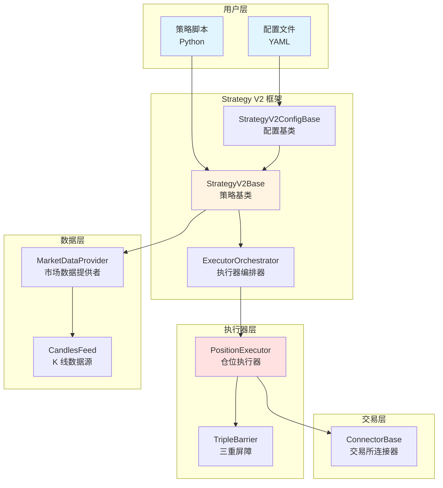
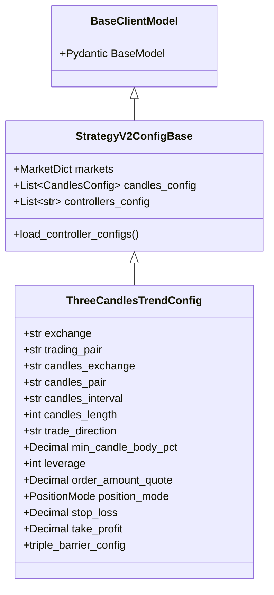
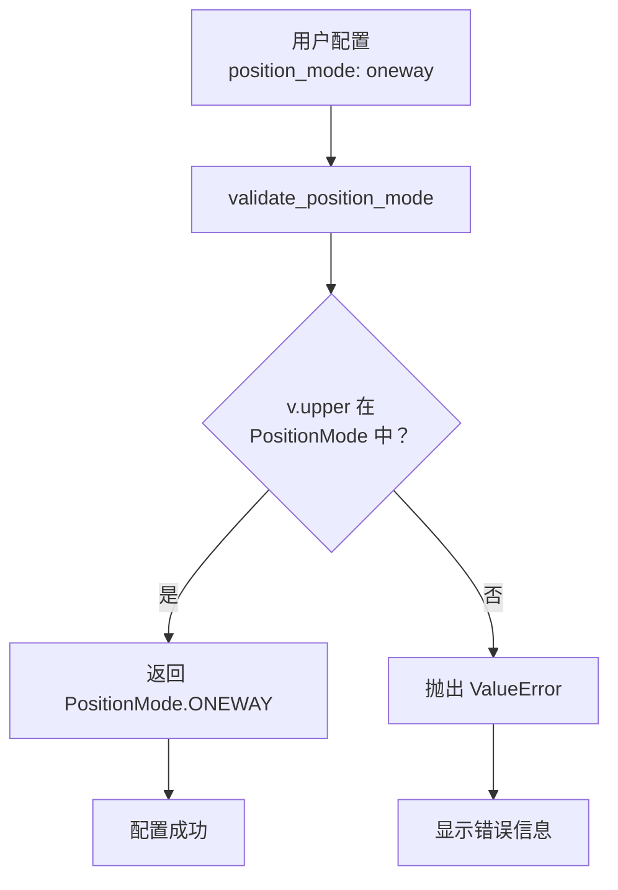
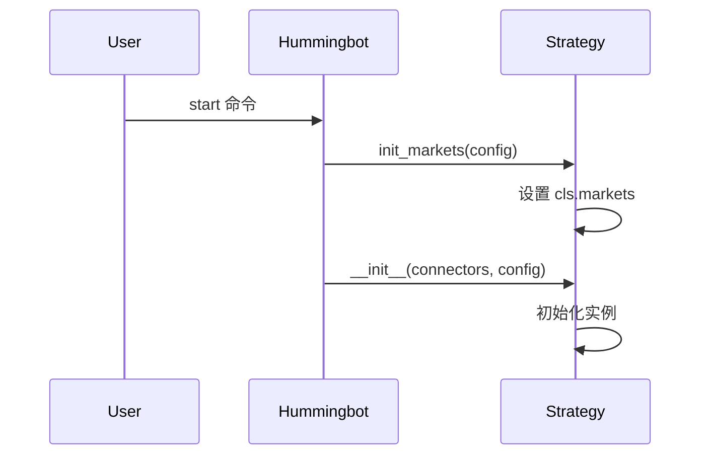
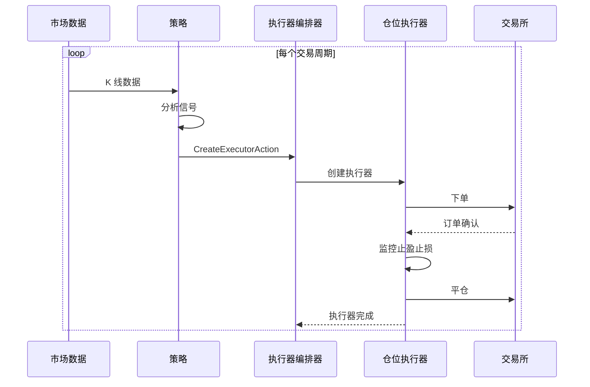

# 第 3 章：代码详解

本章将深入分析三连阳/三连阴趋势策略的源代码实现，帮助您理解 Hummingbot Strategy V2 框架的工作原理以及策略的每个组件。

## Hummingbot Strategy V2 架构概述

### 架构层次图



### 核心概念

**1. 策略 (Strategy)**

- 负责市场分析和决策
- 生成交易信号
- 创建执行器动作

**2. 执行器 (Executor)**

- 负责具体的交易执行
- 管理订单生命周期
- 处理止盈止损

**3. 编排器 (Orchestrator)**

- 管理多个执行器
- 协调执行器之间的关系
- 监控执行器状态

**这种架构的优势**：

- ✅ 关注点分离：策略专注决策，执行器专注执行
- ✅ 可复用性：执行器可在不同策略间复用
- ✅ 可扩展性：易于添加新的执行器类型
- ✅ 可测试性：各组件可独立测试

---

## 配置类详解：ThreeCandlesTrendConfig

### 类定义和继承关系

```python
class ThreeCandlesTrendConfig(StrategyV2ConfigBase):
    """
    三连阳/三连阴趋势策略配置类
    """
```

**继承关系图**：



### 字段定义解析

#### 1. 脚本和市场配置

```python
script_file_name: str = os.path.basename(__file__)
markets: Dict[str, List[str]] = {}
candles_config: List[CandlesConfig] = []
controllers_config: List[str] = []
```

**作用**：

- `script_file_name`：自动获取脚本文件名，用于日志和识别
- `markets`：交易市场字典，格式为 `{交易所: [交易对列表]}`
- `candles_config`：K 线数据源配置列表
- `controllers_config`：控制器配置（本策略未使用）

**为什么 markets 和 candles_config 默认为空？**

这些字段会在策略初始化时动态填充：

```python
# 在 init_markets 类方法中填充
@classmethod
def init_markets(cls, config: ThreeCandlesTrendConfig):
    cls.markets = {config.exchange: {config.trading_pair}}

# 在 __init__ 方法中填充
if len(config.candles_config) == 0:
    config.candles_config.append(
        CandlesConfig(
            connector=config.candles_exchange,
            trading_pair=config.candles_pair,
            interval=config.candles_interval,
            max_records=config.candles_length,
        )
    )
```

---

#### 2. 交易所配置字段

```python
exchange: str = Field(default="binance_perpetual")
trading_pair: str = Field(default="BTC-USDT")
```

**Field 函数的作用**：

- 设置默认值
- 提供元数据（如提示信息）
- 定义验证规则

**完整的 Field 定义示例**：

```python
leverage: int = Field(
    default=50,           # 默认值
    gt=0,                # 验证：必须大于 0
    description="杠杆倍数",  # 描述
    json_schema_extra={
        "prompt": "请输入杠杆倍数：",
        "prompt_on_new": True
    }
)
```

---

#### 3. K 线数据源配置

```python
candles_exchange: str = Field(default="binance_perpetual")
candles_pair: str = Field(default="BTC-USDT")
candles_interval: str = Field(default="1h")
candles_length: int = Field(default=10, gt=0)
```

**gt=0 验证**：

```python
# Pydantic 会在配置加载时验证
candles_length: int = Field(default=10, gt=0)  # 必须 > 0

# 如果用户配置了非法值
candles_length: 0   # 报错：必须大于 0
candles_length: -5  # 报错：必须大于 0
```

---

#### 4. 策略参数

```python
trade_direction: str = Field(default="LONG")
min_candle_body_pct: Decimal = Field(default=Decimal("0.001"), gt=0)
leverage: int = Field(default=50, gt=0)
order_amount_quote: Decimal = Field(default=Decimal("10"), gt=0)
position_mode: PositionMode = Field(default="ONEWAY")
```

**为什么使用 Decimal 而不是 float？**

```python
# float 存在精度问题
>>> 0.1 + 0.2
0.30000000000000004

# Decimal 精确计算
>>> from decimal import Decimal
>>> Decimal("0.1") + Decimal("0.2")
Decimal('0.3')
```

在金融计算中，精度至关重要，因此使用 `Decimal`。

---

#### 5. 风险管理参数

```python
stop_loss: Decimal = Field(default=Decimal("0.02"), gt=0)
take_profit: Decimal = Field(default=Decimal("0.015"), gt=0)
```

---

### Property：triple_barrier_config

```python
@property
def triple_barrier_config(self) -> TripleBarrierConfig:
    """
    三重屏障配置，用于自动止盈止损
    """
    return TripleBarrierConfig(
        stop_loss=self.stop_loss,
        take_profit=self.take_profit,
        open_order_type=OrderType.MARKET,
        take_profit_order_type=OrderType.LIMIT,
        stop_loss_order_type=OrderType.MARKET,
    )
```

**@property 装饰器的作用**：

将方法转换为属性，可以像访问字段一样访问：

```python
# 使用 @property
config = ThreeCandlesTrendConfig()
barrier = config.triple_barrier_config  # 像访问属性一样

# 不使用 @property
barrier = config.triple_barrier_config()  # 需要加括号调用
```

**TripleBarrierConfig 详解**：

三重屏障包含三个退出条件：

1. **止损 (stop_loss)**：价格触及止损线时平仓
2. **止盈 (take_profit)**：价格触及止盈线时平仓
3. **时间限制 (time_limit)**：持仓时间超时时平仓（本策略未使用）

**订单类型选择**：

```python
open_order_type=OrderType.MARKET,        # 开仓用市价单，立即成交
take_profit_order_type=OrderType.LIMIT,  # 止盈用限价单，减少滑点
stop_loss_order_type=OrderType.MARKET,   # 止损用市价单，确保成交
```

**为什么止盈用 LIMIT，止损用 MARKET？**

- **止盈 LIMIT**：
  - 价格对我们有利，可以耐心等待
  - 使用限价单可以获得更好的成交价
  - 例：目标止盈价 101 USDT，设置限价单正好 101 USDT

- **止损 MARKET**：
  - 价格对我们不利，需要快速止损
  - 市价单确保立即成交，避免亏损扩大
  - 例：触发止损时，不管价格多少都立即平仓

---

### Field Validator：字段验证器

#### 1. position_mode 验证器

```python
@field_validator("position_mode", mode="before")
@classmethod
def validate_position_mode(cls, v: str) -> PositionMode:
    if v.upper() in PositionMode.__members__:
        return PositionMode[v.upper()]
    raise ValueError(
        f"Invalid position mode: {v}. "
        f"Valid options are: {', '.join(PositionMode.__members__)}"
    )
```

**逐行解析**：

```python
@field_validator("position_mode", mode="before")
# @field_validator: Pydantic 装饰器，用于字段验证
# "position_mode": 要验证的字段名
# mode="before": 在 Pydantic 的类型转换之前运行验证

@classmethod
# 类方法，可以访问类本身（cls）

def validate_position_mode(cls, v: str) -> PositionMode:
# cls: 类本身（ThreeCandlesTrendConfig）
# v: 字段值（用户配置的值）
# 返回类型：PositionMode 枚举

    if v.upper() in PositionMode.__members__:
    # v.upper(): 转换为大写
    # PositionMode.__members__: 枚举的所有成员名称
    # 检查转换后的值是否是有效的枚举成员
    
        return PositionMode[v.upper()]
        # 返回对应的枚举值
        
    raise ValueError(...)
    # 如果验证失败，抛出异常
```

**工作流程**：



**示例**：

```python
# 有效输入
"ONEWAY" → PositionMode.ONEWAY
"oneway" → PositionMode.ONEWAY
"Oneway" → PositionMode.ONEWAY
"HEDGE"  → PositionMode.HEDGE

# 无效输入
"BOTH"   → ValueError: Invalid position mode: BOTH
"ONE"    → ValueError: Invalid position mode: ONE
```

---

#### 2. trade_direction 验证器

```python
@field_validator("trade_direction", mode="before")
@classmethod
def validate_trade_direction(cls, v: str) -> str:
    v_upper = v.upper()
    if v_upper not in ["LONG", "SHORT"]:
        raise ValueError(
            f"Invalid trade direction: {v}. "
            f"Valid options are: LONG, SHORT"
        )
    return v_upper
```

**与 position_mode 验证器的区别**：

| 特性 | trade_direction | position_mode |
|------|----------------|---------------|
| 返回类型 | `str` | `PositionMode` 枚举 |
| 验证方式 | 直接检查列表 | 检查枚举成员 |
| 转换 | 转大写 | 转换为枚举 |

**为什么不用枚举？**

`trade_direction` 只有两个简单的值（LONG/SHORT），使用字符串更简单直接。如果未来需要更多选项或更复杂的逻辑，可以改用枚举。

---

## 策略类详解：ThreeCandlesTrendStrategy

### 类定义和继承

```python
class ThreeCandlesTrendStrategy(StrategyV2Base):
    """
    三连阳/三连阴趋势跟踪策略
    """
    account_config_set = False
```

**类变量 account_config_set**：

```python
account_config_set = False  # 类变量，所有实例共享

# 用于确保账户配置（杠杆、持仓模式）只设置一次
# 避免重复设置导致的 API 调用浪费
```

---

### 初始化流程

#### 1. init_markets 类方法

```python
@classmethod
def init_markets(cls, config: ThreeCandlesTrendConfig):
    """
    初始化交易市场
    """
    cls.markets = {config.exchange: {config.trading_pair}}
```

**调用时机**：



**为什么用类方法？**

`init_markets` 需要在创建实例之前执行，用于告诉 Hummingbot 需要连接哪些交易所。

**markets 字典格式**：

```python
cls.markets = {
    "binance_perpetual": {"BTC-USDT"}
}

# 如果需要多个交易对
cls.markets = {
    "binance_perpetual": {"BTC-USDT", "ETH-USDT"}
}

# 如果需要多个交易所
cls.markets = {
    "binance_perpetual": {"BTC-USDT"},
    "okx_perpetual": {"ETH-USDT"}
}
```

---

#### 2. **init** 方法

```python
def __init__(self, connectors: Dict[str, ConnectorBase], config: ThreeCandlesTrendConfig):
    """
    初始化策略
    """
    # 如果没有配置 K 线数据源，自动添加
    if len(config.candles_config) == 0:
        config.candles_config.append(
            CandlesConfig(
                connector=config.candles_exchange,
                trading_pair=config.candles_pair,
                interval=config.candles_interval,
                max_records=config.candles_length,
            )
        )
    super().__init__(connectors, config)
    self.config = config
    self.current_signal = None
```

**逐行解析**：

```python
# 1. 自动配置 K 线数据源
if len(config.candles_config) == 0:
    # 如果用户没有在配置文件中指定 candles_config
    # 自动从其他配置项创建
    
    config.candles_config.append(
        CandlesConfig(
            connector=config.candles_exchange,     # K 线数据交易所
            trading_pair=config.candles_pair,      # K 线数据交易对
            interval=config.candles_interval,      # K 线周期
            max_records=config.candles_length,     # 保留的 K 线数量
        )
    )

# 2. 调用父类初始化
super().__init__(connectors, config)
# connectors: 交易所连接器字典
# config: 策略配置

# 3. 保存配置引用
self.config = config
# 方便后续访问配置参数

# 4. 初始化信号状态
self.current_signal = None
# 用于记录当前的交易信号
# None: 无信号, 1: 做多, -1: 做空
```

**CandlesConfig 的作用**：

告诉 Hummingbot 从哪里获取 K 线数据：

```python
CandlesConfig(
    connector="binance_perpetual",  # 从 Binance 获取
    trading_pair="BTC-USDT",       # BTC-USDT 交易对的数据
    interval="1h",                 # 1 小时 K 线
    max_records=10,                # 保留最近 10 根
)
```

Hummingbot 会自动：

- 连接到 Binance
- 订阅 BTC-USDT 的 1h K 线
- 维护一个包含最近 10 根 K 线的缓存
- 每小时更新一次

---

#### 3. start 方法

```python
def start(self, clock: Clock, timestamp: float) -> None:
    """
    启动策略，调用父类方法完成初始化
    """
    super().start(clock, timestamp)
```

**调用时机**：

当用户执行 `start` 命令时，Hummingbot 调用此方法。

**参数说明**：

- `clock`：时钟对象，用于时间管理
- `timestamp`：当前时间戳

**为什么调用父类方法？**

父类 `StrategyV2Base.start()` 已经实现了以下重要功能：

1. **设置时间戳**：`self._last_timestamp = timestamp`
2. **应用初始设置**：调用 `self.apply_initial_setting()`（子类已重写）
3. **MQTT 性能发布器初始化**：如果启用了 MQTT，会创建性能数据发布器
4. **启动控制器**：启动所有已配置的 controllers（如果有）

```python
# 父类 StrategyV2Base.start() 的实现逻辑
def start(self, clock: Clock, timestamp: float) -> None:
    self._last_timestamp = timestamp
    self.apply_initial_setting()
    
    # 检查并初始化 MQTT 性能发布器
    if HummingbotApplication.main_application()._mqtt is not None:
        self.mqtt_enabled = True
        self._pub = ETopicPublisher("performance", use_bot_prefix=True)
    
    # 启动所有控制器
    for controller in self.controllers.values():
        controller.start()
```

**设计原则**：

- ✅ 遵循面向对象的继承原则，复用父类功能
- ✅ 避免代码重复，提高可维护性
- ✅ 确保不会遗漏父类的重要功能
- ✅ 如果将来父类增加新功能，子类会自动继承

---

#### 4. apply_initial_setting 方法

```python
def apply_initial_setting(self):
    """
    应用初始设置: 设置杠杆和持仓模式
    """
    if not self.account_config_set:
        for connector_name, connector in self.connectors.items():
            if self.is_perpetual(connector_name):
                # 设置持仓模式
                connector.set_position_mode(self.config.position_mode)
                # 设置杠杆
                for trading_pair in self.market_data_provider.get_trading_pairs(connector_name):
                    connector.set_leverage(trading_pair, self.config.leverage)
        self.account_config_set = True
```

**逐行解析**：

```python
if not self.account_config_set:
    # 检查是否已经设置过
    # 使用类变量确保只设置一次
    
    for connector_name, connector in self.connectors.items():
        # 遍历所有交易所连接器
        # connector_name: "binance_perpetual"
        # connector: BinancePerpetualConnector 实例
        
        if self.is_perpetual(connector_name):
            # 检查是否是永续合约交易所
            # 现货交易所不支持杠杆和持仓模式
            
            connector.set_position_mode(self.config.position_mode)
            # 设置持仓模式（ONEWAY 或 HEDGE）
            # 调用交易所 API
            
            for trading_pair in self.market_data_provider.get_trading_pairs(connector_name):
                # 遍历该交易所的所有交易对
                
                connector.set_leverage(trading_pair, self.config.leverage)
                # 为每个交易对设置杠杆
                # 调用交易所 API
                
    self.account_config_set = True
    # 标记已设置，避免重复调用
```

**为什么需要这个方法？**

永续合约交易需要在开始交易前设置：

1. 持仓模式（单向或双向）
2. 杠杆倍数

这些设置通过交易所 API 完成，需要在策略开始时执行一次。

---

### 执行器模式：核心交易流程

#### 概念理解

Strategy V2 采用"执行器模式"，将策略分为两层：

**策略层（Strategy）**：

- 分析市场数据
- 生成交易信号
- 创建执行器动作

**执行器层（Executor）**：

- 执行具体交易
- 管理订单
- 处理止盈止损



---

#### create_actions_proposal 方法

这是策略的核心方法，负责生成交易动作。

```python
def create_actions_proposal(self) -> List[CreateExecutorAction]:
    """
    创建执行器动作提议
    
    流程:
    1. 检查是否已有持仓，有则不开新仓
    2. 获取开仓信号
    3. 根据 trade_direction 过滤信号
    4. 生成开仓动作
    """
    create_actions = []
    
    # 检查是否已有活跃持仓
    active_executors = self.get_active_executors(
        self.config.exchange, 
        self.config.trading_pair
    )
    if len(active_executors) > 0:
        # 已有持仓，不再开新仓
        return create_actions
    
    # 获取信号
    signal = self.get_signal(
        self.config.candles_exchange, 
        self.config.candles_pair
    )
    self.current_signal = signal
    
    if signal is None:
        # 无信号
        return create_actions
    
    # 获取当前市场价格
    mid_price = self.market_data_provider.get_price_by_type(
        self.config.exchange, 
        self.config.trading_pair, 
        PriceType.MidPrice
    )
    
    # 根据 trade_direction 过滤信号
    if signal == 1 and self.config.trade_direction == "LONG":
        # 做多信号，且策略允许做多
        if not self.config.is_live_trading:
            message = (
                f"检测到做多信号 (交易对: {self.config.trading_pair}, 价格: {mid_price:.4f})，"
                "当前为模拟模式，未执行真实下单。"
            )
            self.logger().info(message)
            self.notify(message)
            return create_actions

        create_actions.append(
            CreateExecutorAction(
                executor_config=PositionExecutorConfig(
                    timestamp=self.current_timestamp,
                    connector_name=self.config.exchange,
                    trading_pair=self.config.trading_pair,
                    side=TradeType.BUY,
                    entry_price=mid_price,
                    amount=self.config.order_amount_quote / mid_price,
                    triple_barrier_config=self.config.triple_barrier_config,
                    leverage=self.config.leverage,
                )
            )
        )
    elif signal == -1 and self.config.trade_direction == "SHORT":
        # 做空信号，且策略允许做空
        if not self.config.is_live_trading:
            message = (
                f"检测到做空信号 (交易对: {self.config.trading_pair}, 价格: {mid_price:.4f})，"
                "当前为模拟模式，未执行真实下单。"
            )
            self.logger().info(message)
            self.notify(message)
            return create_actions

        create_actions.append(
            CreateExecutorAction(
                executor_config=PositionExecutorConfig(
                    timestamp=self.current_timestamp,
                    connector_name=self.config.exchange,
                    trading_pair=self.config.trading_pair,
                    side=TradeType.SELL,
                    entry_price=mid_price,
                    amount=self.config.order_amount_quote / mid_price,
                    triple_barrier_config=self.config.triple_barrier_config,
                    leverage=self.config.leverage,
                )
            )
        )
    
    return create_actions
```

**详细解析**：

**步骤 1：检查活跃持仓**

```python
active_executors = self.get_active_executors(
    self.config.exchange, 
    self.config.trading_pair
)
if len(active_executors) > 0:
    return create_actions  # 返回空列表，不开新仓
```

**为什么要检查？**

- 本策略设计为单仓位模式
- 避免重复开仓导致风险失控
- 确保资金集中在一个方向

**步骤 2：获取交易信号**

```python
signal = self.get_signal(
    self.config.candles_exchange, 
    self.config.candles_pair
)
self.current_signal = signal
```

返回值：

- `1`：做多信号（三连阳）
- `-1`：做空信号（三连阴）
- `None`：无信号

**步骤 3：获取市场价格**

```python
mid_price = self.market_data_provider.get_price_by_type(
    self.config.exchange, 
    self.config.trading_pair, 
    PriceType.MidPrice
)
```

`PriceType.MidPrice` = (最佳买价 + 最佳卖价) / 2

**步骤 4：根据模式决定是否创建执行器**

```python
if signal == 1 and self.config.trade_direction == "LONG":
    if not self.config.is_live_trading:
        message = (
            f"检测到做多信号 (交易对: {self.config.trading_pair}, 价格: {mid_price:.4f})，"
            "当前为模拟模式，未执行真实下单。"
        )
        self.logger().info(message)
        self.notify(message)
        return create_actions

    create_actions.append(
        CreateExecutorAction(
            executor_config=PositionExecutorConfig(
                timestamp=self.current_timestamp,
                connector_name=self.config.exchange,
                trading_pair=self.config.trading_pair,
                side=TradeType.BUY,
                entry_price=mid_price,
                amount=self.config.order_amount_quote / mid_price,
                triple_barrier_config=self.config.triple_barrier_config,
                leverage=self.config.leverage,
            )
        )
    )
```

做空逻辑与之镜像。模拟模式直接返回空列表，避免误下单；仅在 `is_live_trading = true` 时才会交由执行器处理真实订单。

**amount 计算示例**：

```python
# 假设
order_amount_quote = Decimal("10")
mid_price = Decimal("50000")

# 计算下单数量（名义持仓 = 数量 × 价格）
amount = order_amount_quote / mid_price  # 0.0002 BTC

# 杠杆 50x 时的名义持仓规模
notional = amount * mid_price * self.config.leverage  # 0.0002 × 50000 × 50 = 500 USDT
```

---

### 信号生成逻辑

#### get_signal 方法

```python
def get_signal(self, connector_name: str, trading_pair: str) -> Optional[int]:
    """
    获取交易信号

    Returns:
        1: 做多信号 (三连阳)
        -1: 做空信号 (三连阴)
        None: 无信号
    """
    try:
        # 获取 K 线数据
        candles = self.market_data_provider.get_candles_df(
            connector_name, trading_pair, self.config.candles_interval, self.config.candles_length
        )

        if candles is None or len(candles) < 3:
            # K 线数据不足
            return None

        candles = candles.copy()

        candles_interval_seconds = None
        try:
            candles_feed = self.market_data_provider.get_candles_feed(
                CandlesConfig(
                    connector=connector_name,
                    trading_pair=trading_pair,
                    interval=self.config.candles_interval,
                    max_records=self.config.candles_length,
                )
            )
            candles_interval_seconds = getattr(candles_feed, "interval_in_seconds", None)
        except Exception:
            # 无法获取蜡烛图周期时忽略，使用退化方案
            candles_interval_seconds = None

        if "timestamp" in candles.columns and candles_interval_seconds:
            timestamps = candles["timestamp"].astype(float)
            # 处理毫秒级时间戳
            if timestamps.max() > 1e12:
                timestamps = timestamps / 1000

            current_time = int(self.current_timestamp)
            interval_start = current_time - (current_time % candles_interval_seconds)
            candles = candles.loc[timestamps < interval_start]
        else:
            # 无法准确定位当前 K 线时，直接移除最后一根
            candles = candles.iloc[:-1]

        if candles is None or len(candles) < 3:
            return None

        last_3 = candles.tail(3)
        opens = last_3["open"].values
        closes = last_3["close"].values
        candle_lines = "\n".join(
            [f"  #{index + 1}: open={opens[index]:.4f}, close={closes[index]:.4f}" for index in range(3)]
        )
        self.logger().info(
            "最近 3 根 K 线数据 (%s %s %s):\n%s",
            connector_name,
            trading_pair,
            self.config.candles_interval,
            candle_lines,
        )

        # 检查三连阳 (做多信号)
        if self.check_three_bullish_candles(candles):
            return 1

        # 检查三连阴 (做空信号)
        if self.check_three_bearish_candles(candles):
            return -1

        return None

    except Exception as e:
        self.logger().error(f"获取信号时发生错误: {e}")
        return None
```

**K 线数据结构**：

```python
# candles 是一个 Pandas DataFrame
#          timestamp    open    high     low    close   volume
# 0  1700000000.0   50000  50500  49500  50200  1000.5
# 1  1700003600.0   50200  50800  50100  50600   950.3
# 2  1700007200.0   50600  51000  50500  50900   890.7
# ...
```

**关键步骤解析**：

1. **复制 DataFrame**：调用 `candles.copy()`，避免后续裁剪操作影响缓存中的原始数据。
2. **移除未完成 K 线**：
   - 当能获取 `interval_in_seconds` 时，通过当前时间戳对齐区间，仅保留在最新完整区间之前的记录。
   - 若无法确认周期，则使用退化策略 `candles.iloc[:-1]` 直接丢弃最后一根 K 线。
3. **记录调试信息**：格式化最近 3 根 K 线的开收盘价，写入日志，便于在日志中快速验证信号来源。
4. **分支判断**：依次调用 `check_three_bullish_candles` 与 `check_three_bearish_candles`，返回对应信号；若均不满足则返回 `None`。

**异常处理**：

```python
try:
    # 可能抛出异常的代码
    candles = self.market_data_provider.get_candles_df(...)
except Exception as e:
    # 捕获所有异常，记录日志，返回 None
    self.logger().error(f"获取信号时发生错误: {e}")
    return None
```

这样即使获取数据失败，策略也能继续运行，不会崩溃。

---

#### check_three_bullish_candles 方法

```python
def check_three_bullish_candles(self, candles) -> bool:
    """
    检查是否满足三连阳条件
    """
    if len(candles) < 3:
        return False

    # 获取最近 3 根已完成 K 线
    last_3 = candles.tail(3).dropna(subset=["open", "close"])
    if len(last_3) < 3:
        return False
    opens = last_3["open"].values
    closes = last_3["close"].values

    min_body_pct = float(self.config.min_candle_body_pct)
    bullish_flags = [closes[i] > opens[i] for i in range(3)]
    body_pcts = [(closes[i] - opens[i]) / opens[i] for i in range(3)]
    body_flags = [body_pcts[i] >= min_body_pct for i in range(3)]
    closes_increasing = closes[0] < closes[1] < closes[2]
    opens_increasing = opens[0] < opens[1] < opens[2]

    bullish_condition = all(bullish_flags)
    body_condition = all(body_flags)
    result = bullish_condition and body_condition and closes_increasing and opens_increasing

    self.logger().info(
        "三连阳判定结果: %s\n  阳线达标: %s\n  实体达标: %s\n  收盘递增: %s\n  开盘递增: %s",
        result,
        bullish_condition,
        body_condition,
        closes_increasing,
        opens_increasing,
    )

    return result
```

**逐步解析**：

1. **保证数据完整**：`dropna(subset=["open", "close"])` 防止缺失值干扰判定。
2. **计算布尔标记**：
   - `bullish_flags` 表示每根 K 线是否收阳。
   - `body_flags` 检查实体百分比是否达到阈值。
3. **趋势判断**：`closes_increasing` 和 `opens_increasing` 保证上涨动能持续。
4. **日志追踪**：将各条件和最终结果写入日志，便于调试与复盘。
5. **返回结果**：仅当所有条件同时满足时才返回 `True`，否则返回 `False`。

当其中任意条件失败，策略会记录日志并返回 `False`，因此不会生成做多信号。

---

#### check_three_bearish_candles 方法

逻辑与 `check_three_bullish_candles` 类似，但方向相反：

```python
def check_three_bearish_candles(self, candles) -> bool:
    """
    检查是否满足三连阴条件
    """
    if len(candles) < 3:
        return False

    # 获取最近 3 根已完成 K 线
    last_3 = candles.tail(3).dropna(subset=["open", "close"])
    if len(last_3) < 3:
        return False
    opens = last_3["open"].values
    closes = last_3["close"].values

    min_body_pct = float(self.config.min_candle_body_pct)
    bearish_flags = [closes[i] < opens[i] for i in range(3)]
    body_pcts = [(opens[i] - closes[i]) / opens[i] for i in range(3)]
    body_flags = [body_pcts[i] >= min_body_pct for i in range(3)]
    closes_decreasing = closes[0] > closes[1] > closes[2]
    opens_decreasing = opens[0] > opens[1] > opens[2]

    bearish_condition = all(bearish_flags)
    body_condition = all(body_flags)
    result = bearish_condition and body_condition and closes_decreasing and opens_decreasing

    self.logger().info(
        "三连阴判定结果: %s\n  阴线达标: %s\n  实体达标: %s\n  收盘递减: %s\n  开盘递减: %s",
        result,
        bearish_condition,
        body_condition,
        closes_decreasing,
        opens_decreasing,
    )

    return result
```

---

### 持仓管理

#### get_active_executors 方法

```python
def get_active_executors(self, connector_name: str, trading_pair: str) -> List:
    """
    获取指定交易对的活跃执行器列表
    """
    active_executors = self.filter_executors(
        executors=self.get_all_executors(),
        filter_func=lambda e: (
            e.connector_name == connector_name 
            and e.trading_pair == trading_pair 
            and e.is_active
        ),
    )
    return active_executors
```

**逐步解析**：

```python
# 1. 获取所有执行器
all_executors = self.get_all_executors()
# 返回当前所有的执行器（活跃的和已完成的）

# 2. 过滤执行器
filter_func = lambda e: (
    e.connector_name == connector_name    # 匹配交易所
    and e.trading_pair == trading_pair    # 匹配交易对
    and e.is_active                       # 仍在活跃中
)

active_executors = self.filter_executors(
    executors=all_executors,
    filter_func=filter_func
)
```

**执行器状态**：

```python
# 执行器的生命周期
创建 → 活跃 → 完成

# is_active 状态
executor.is_active = True   # 正在执行交易
executor.is_active = False  # 已完成（止盈/止损/取消）
```

---

### 状态展示：format_status 方法

```python
def format_status(self) -> str:
    """
    格式化策略状态信息
    """
    if not self.ready_to_trade:
        return "Market connectors are not ready."
    
    lines = []
    
    # 显示余额信息
    balance_df = self.get_balance_df()
    lines.extend([
        "", 
        "  账户余额:"
    ] + [
        "    " + line 
        for line in balance_df.to_string(index=False).split("\n")
    ])
    
    # 显示策略配置
    lines.extend([
        "",
        "  策略配置:",
        f"    交易所: {self.config.exchange}",
        f"    交易对: {self.config.trading_pair}",
        f"    K 线周期: {self.config.candles_interval}",
        f"    交易方向: {self.config.trade_direction}",
        f"    最小实体幅度: {self.config.min_candle_body_pct:.2%}",
        f"    杠杆倍数: {self.config.leverage}x",
        f"    开仓金额: {self.config.order_amount_quote} USDT",
        f"    止损: {self.config.stop_loss:.2%}",
        f"    止盈: {self.config.take_profit:.2%}",
    ])
    
    # 显示当前信号
    signal_text = "无信号"
    if self.current_signal == 1:
        signal_text = "做多信号 (三连阳)"
    elif self.current_signal == -1:
        signal_text = "做空信号 (三连阴)"
    
    lines.extend(["", f"  当前信号: {signal_text}"])
    
    # 显示活跃持仓
    active_executors = self.get_active_executors(
        self.config.exchange, 
        self.config.trading_pair
    )
    if len(active_executors) > 0:
        lines.extend(["", "  活跃持仓:"])
        for executor in active_executors:
            side_text = "做多" if executor.side == TradeType.BUY else "做空"
            lines.append(
                f"    [{executor.id[:8]}] {side_text} | "
                f"数量: {executor.amount:.4f} | "
                f"入场价: {executor.config.entry_price:.2f} | "
                f"PnL: {executor.net_pnl_quote:.2f} USDT "
                f"({executor.net_pnl_pct:.2%})"
            )
    else:
        lines.extend(["", "  当前无持仓"])
    
    # 显示活跃订单
    try:
        orders_df = self.active_orders_df()
        if not orders_df.empty:
            lines.extend([
                "", 
                "  活跃订单:"
            ] + [
                "    " + line 
                for line in orders_df.to_string(index=False).split("\n")
            ])
    except ValueError:
        pass
    
    return "\n".join(lines)
```

**输出示例**：

```
  账户余额:
    Exchange      Asset    Total  Available  Allocated
    binance  USDT  1000.00    950.00      50.00

  策略配置:
    交易所: binance_perpetual
    交易对: BTC-USDT
    K 线周期: 1h
    交易方向: LONG
    最小实体幅度: 0.10%
    杠杆倍数: 20x
    开仓金额: 10 USDT
    止损: 2.00%
    止盈: 3.00%

  当前信号: 做多信号 (三连阳)

  活跃持仓:
    [1a2b3c4d] 做多 | 数量: 0.0002 | 入场价: 50000.00 | PnL: 12.00 USDT (1.20%)

  活跃订单:
    Order ID    Type    Side    Price      Amount    Status
    abc123    LIMIT    BUY   51500.00    0.0002    OPEN
```

---

## 关键设计决策解析

### 1. 为什么使用执行器模式？

**优点**：

- ✅ 策略只需关注信号生成，不用管理订单细节
- ✅ 执行器可以复用，不同策略可以使用相同的执行器
- ✅ 易于测试，可以单独测试策略和执行器
- ✅ 支持复杂的执行逻辑（如分批建仓、移动止损等）

**对比传统模式**：

```python
# 传统模式：策略直接下单
class TraditionalStrategy:
    def on_signal(self):
        order_id = self.buy(...)
        self.track_order(order_id)
        self.check_stop_loss(order_id)
        # 策略需要管理所有订单细节

# 执行器模式：策略创建执行器
class ExecutorStrategy:
    def create_actions_proposal(self):
        return [CreateExecutorAction(...)]
        # 执行器自动管理订单
```

---

### 2. 为什么 stop_loss 用 MARKET，take_profit 用 LIMIT？

**止损用 MARKET**：

- 优先保证成交，避免亏损扩大
- 价格对我们不利，需要立即退出
- 轻微的滑点可以接受

**止盈用 LIMIT**：

- 价格对我们有利，可以等待更好的价格
- 减少滑点，获得更好的成交价
- 如果不成交，可以继续等待或调整价格

**示例**：

```python
# 做多，入场价 50000
entry_price = 50000
stop_loss = 0.02     # 2%
take_profit = 0.03   # 3%

# 止损价：50000 × (1 - 0.02) = 49000
# 当价格跌到 49000 时，用市价单立即卖出

# 止盈价：50000 × (1 + 0.03) = 51500
# 当价格涨到 51500 时，挂限价单 51500 卖出
# 如果市场继续上涨到 51600，仍然以 51500 成交（更好）
```

---

### 3. 为什么检查四个条件？

**只检查三连阳/阴不够吗？**

不够，会产生很多假信号：

```python
# 场景 1：K 线实体太小（十字星）
# 虽然都是阳线，但没有明显趋势
开盘: 50000, 收盘: 50005  # 实体 0.01%
开盘: 50005, 收盘: 50010  # 实体 0.01%
开盘: 50010, 收盘: 50015  # 实体 0.01%
# → 不符合条件（实体幅度不达标）

# 场景 2：价格没有递增（可能是震荡）
开盘: 50000, 收盘: 50500  # 阳线
开盘: 50300, 收盘: 50400  # 阳线，但收盘价下降了
开盘: 50200, 收盘: 50600  # 阳线
# → 不符合条件（价格不递增）
```

**四个条件的作用**：

1. 都是阳线/阴线：确认方向一致
2. 实体幅度达标：过滤弱势K线
3. 收盘价递增/递减：确认趋势
4. 开盘价递增/递减：确认趋势强度

---

### 4. 为什么 amount 要除以 mid_price？

```python
amount = self.config.order_amount_quote / mid_price
```

**原因**：

`order_amount_quote` 是以 USDT 计价的金额，但交易所需要的是币的数量。

**计算示例**：

```python
# 配置
order_amount_quote = 10 USDT
mid_price = 50000 USDT/BTC

# 计算
amount = 10 / 50000 = 0.0002 BTC

# 验证
0.0002 BTC × 50000 USDT/BTC = 10 USDT ✓
```

**考虑杠杆后的持仓价值**：

```python
amount = 0.0002 BTC
leverage = 20

# 持仓价值
position_value = 0.0002 × 50000 × 20 = 200 USDT

# 但本金只用了
margin = 0.0002 × 50000 = 10 USDT
```

---

## 总结

通过本章，您应该已经：

✅ 理解了 Hummingbot Strategy V2 的架构设计

✅ 掌握了配置类的所有字段和验证机制

✅ 了解了策略类的初始化流程

✅ 理解了执行器模式的工作原理

✅ 掌握了信号生成的完整逻辑

✅ 了解了关键设计决策的原因

### 下一步

现在您已经完全理解了策略的源码实现，可以：

1. **修改策略**：根据需要调整信号生成逻辑
2. **扩展功能**：添加新的技术指标和条件
3. **优化性能**：改进算法效率

详见 [第 4 章：高级用法](./04-advanced-usage.md)。

---

[← 上一章：配置详解](./02-configuration-guide.md) | [返回目录](./README.md) | [下一章：高级用法 →](./04-advanced-usage.md)
