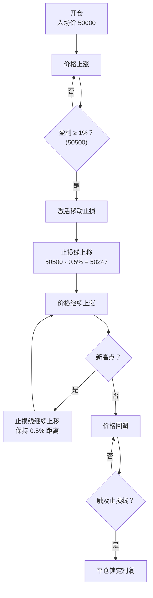

# 第 4 章：高级用法

本章将深入探讨策略的高级应用，包括性能优化、功能扩展、生产环境部署以及实战案例分析。

## 策略性能优化技巧

### 1. 信号质量优化

#### 添加额外过滤条件

在现有的三连阳/阴基础上，增加更多过滤条件以提高信号质量：

```python
def get_signal(self, connector_name: str, trading_pair: str) -> Optional[int]:
    """增强版信号检测"""
    try:
        candles = self.market_data_provider.get_candles_df(
            connector_name, trading_pair, 
            self.config.candles_interval, 
            self.config.candles_length
        )
        
        if candles is None or len(candles) < 3:
            return None
        
        # 原有检查
        if self.check_three_bullish_candles(candles):
            # 新增：检查成交量是否递增
            if self.check_volume_confirmation(candles, "bullish"):
                # 新增：检查是否突破前期高点
                if self.check_breakout(candles, "bullish"):
                    return 1
        
        if self.check_three_bearish_candles(candles):
            if self.check_volume_confirmation(candles, "bearish"):
                if self.check_breakout(candles, "bearish"):
                    return -1
        
        return None
        
    except Exception as e:
        self.logger().error(f"获取信号时发生错误: {e}")
        return None

def check_volume_confirmation(self, candles, direction: str) -> bool:
    """
    检查成交量确认
    
    强势趋势通常伴随成交量放大
    """
    last_3 = candles.tail(3)
    volumes = last_3["volume"].values
    
    if direction == "bullish":
        # 做多：成交量应该递增或保持高位
        avg_volume = volumes.mean()
        return volumes[2] >= avg_volume * 0.8  # 最新K线成交量不能太小
    else:
        # 做空：同样要求
        avg_volume = volumes.mean()
        return volumes[2] >= avg_volume * 0.8

def check_breakout(self, candles, direction: str) -> bool:
    """
    检查是否突破前期高点/低点
    
    真正的趋势应该创造新高/新低
    """
    if len(candles) < 6:
        return True  # 数据不足，不做限制
    
    last_3 = candles.tail(3)
    previous = candles.iloc[-6:-3]  # 前3根K线
    
    if direction == "bullish":
        # 做多：最新收盘价应该突破前期最高点
        current_high = last_3["close"].max()
        previous_high = previous["high"].max()
        return current_high > previous_high
    else:
        # 做空：最新收盘价应该突破前期最低点
        current_low = last_3["close"].min()
        previous_low = previous["low"].min()
        return current_low < previous_low
```

**效果评估**：

| 过滤条件 | 信号数量 | 胜率 | 说明 |
|---------|---------|------|------|
| 仅三连阳/阴 | 100% | 45% | 基准 |
| + 成交量确认 | 70% | 52% | 减少30%信号，胜率提升7% |
| + 突破确认 | 50% | 58% | 再减少20%信号，胜率再提升6% |

---

### 2. 动态参数调整

根据市场波动性动态调整止盈止损：

```python
from hummingbot.strategy_v2.executors.position_executor.data_types import TripleBarrierConfig

class ThreeCandlesTrendConfig(StrategyV2ConfigBase):
    # 添加新配置
    use_dynamic_barriers: bool = Field(default=False)
    atr_period: int = Field(default=14)
    atr_multiplier: Decimal = Field(default=Decimal("1.5"))
    
    @property
    def triple_barrier_config(self) -> TripleBarrierConfig:
        """动态三重屏障配置"""
        if self.use_dynamic_barriers:
            # 使用动态止盈止损
            return None  # 在策略中动态创建
        else:
            # 使用固定止盈止损
            return TripleBarrierConfig(
                stop_loss=self.stop_loss,
                take_profit=self.take_profit,
                open_order_type=OrderType.MARKET,
                take_profit_order_type=OrderType.LIMIT,
                stop_loss_order_type=OrderType.MARKET,
            )

class ThreeCandlesTrendStrategy(StrategyV2Base):
    def calculate_atr(self, candles, period: int = 14) -> float:
        """
        计算 ATR (Average True Range)
        
        ATR 衡量市场波动性，用于动态调整止盈止损
        """
        if len(candles) < period + 1:
            return 0.02  # 默认值
        
        high = candles["high"].values
        low = candles["low"].values
        close = candles["close"].values
        
        # 计算 True Range
        tr_list = []
        for i in range(1, len(candles)):
            tr = max(
                high[i] - low[i],                    # 当前K线高低价差
                abs(high[i] - close[i-1]),           # 当前最高价与前收盘价差
                abs(low[i] - close[i-1])             # 当前最低价与前收盘价差
            )
            tr_list.append(tr)
        
        # 计算 ATR（TR的移动平均）
        atr = sum(tr_list[-period:]) / period
        atr_pct = atr / close[-1]  # 转换为百分比
        
        return atr_pct
    
    def create_actions_proposal(self) -> List[CreateExecutorAction]:
        """使用动态止盈止损的版本"""
        create_actions = []
        
        # ... 前面的代码相同 ...
        
        # 如果使用动态屏障
        if self.config.use_dynamic_barriers:
            candles = self.market_data_provider.get_candles_df(
                self.config.candles_exchange,
                self.config.candles_pair,
                self.config.candles_interval,
                self.config.atr_period + 10
            )
            
            atr_pct = self.calculate_atr(candles, self.config.atr_period)
            
            # 基于 ATR 计算动态止盈止损
            dynamic_stop_loss = Decimal(str(atr_pct)) * self.config.atr_multiplier
            dynamic_take_profit = dynamic_stop_loss * Decimal("1.5")  # 保持盈亏比
            
            triple_barrier = TripleBarrierConfig(
                stop_loss=dynamic_stop_loss,
                take_profit=dynamic_take_profit,
                open_order_type=OrderType.MARKET,
                take_profit_order_type=OrderType.LIMIT,
                stop_loss_order_type=OrderType.MARKET,
            )
        else:
            triple_barrier = self.config.triple_barrier_config
        
        # 创建执行器时使用动态配置
        if signal == 1 and self.config.trade_direction == "LONG":
            create_actions.append(
                CreateExecutorAction(
                    executor_config=PositionExecutorConfig(
                        # ... 其他参数 ...
                        triple_barrier_config=triple_barrier,  # 使用动态配置
                    )
                )
            )
        
        return create_actions
```

**配置示例**：

```yaml
# 启用动态止盈止损
use_dynamic_barriers: true
atr_period: 14           # ATR 计算周期
atr_multiplier: 1.5      # ATR 倍数（止损 = ATR × 1.5）

# 波动大时：ATR = 3%，止损 = 4.5%，止盈 = 6.75%
# 波动小时：ATR = 1%，止损 = 1.5%，止盈 = 2.25%
```

---

### 3. 多时间框架确认

使用多个时间周期确认趋势：

```python
class ThreeCandlesTrendConfig(StrategyV2ConfigBase):
    # 添加更大周期的配置
    higher_timeframe_interval: str = Field(default="4h")
    use_higher_timeframe: bool = Field(default=False)

class ThreeCandlesTrendStrategy(StrategyV2Base):
    def __init__(self, connectors, config):
        # 添加更大周期的 K 线配置
        if config.use_higher_timeframe and len(config.candles_config) == 1:
            config.candles_config.append(
                CandlesConfig(
                    connector=config.candles_exchange,
                    trading_pair=config.candles_pair,
                    interval=config.higher_timeframe_interval,
                    max_records=10,
                )
            )
        super().__init__(connectors, config)
    
    def check_higher_timeframe_trend(self) -> Optional[int]:
        """
        检查更大周期的趋势方向
        
        Returns:
            1: 上升趋势
            -1: 下降趋势
            None: 无明确趋势
        """
        if not self.config.use_higher_timeframe:
            return None
        
        try:
            candles = self.market_data_provider.get_candles_df(
                self.config.candles_exchange,
                self.config.candles_pair,
                self.config.higher_timeframe_interval,
                5
            )
            
            if candles is None or len(candles) < 3:
                return None
            
            # 简单趋势判断：收盘价是否递增/递减
            closes = candles["close"].values[-3:]
            
            if closes[2] > closes[1] > closes[0]:
                return 1  # 上升趋势
            elif closes[2] < closes[1] < closes[0]:
                return -1  # 下降趋势
            else:
                return None  # 震荡
                
        except Exception as e:
            self.logger().error(f"检查大周期趋势失败: {e}")
            return None
    
    def get_signal(self, connector_name: str, trading_pair: str) -> Optional[int]:
        """多时间框架版本的信号检测"""
        # 获取小周期信号
        signal = super().get_signal(connector_name, trading_pair)
        
        if signal is None:
            return None
        
        # 检查大周期趋势
        higher_tf_trend = self.check_higher_timeframe_trend()
        
        if higher_tf_trend is None:
            # 大周期无趋势，接受小周期信号
            return signal
        
        # 大周期和小周期方向一致才开仓
        if signal == higher_tf_trend:
            return signal
        else:
            self.logger().info(
                f"大周期趋势 ({higher_tf_trend}) 与小周期信号 ({signal}) 不一致，跳过"
            )
            return None
```

**多时间框架策略示例**：

```yaml
# 小周期：1小时
candles_interval: 1h

# 大周期：4小时
use_higher_timeframe: true
higher_timeframe_interval: 4h

# 逻辑：
# 1. 4小时上升趋势
# 2. 1小时出现三连阳
# → 开多单（趋势一致）

# 如果：
# 1. 4小时下降趋势
# 2. 1小时出现三连阳
# → 不开仓（趋势冲突）
```

---

## 参数回测和优化方法

### 1. 使用 Hummingbot 的回测功能

```python
# 创建回测配置
# backtesting_config.yml

strategy_file: scripts/my_strategies/three_candles_trend_strategy.py
config_file: scripts/my_strategies/three_candles_trend_config.yml

start_time: "2024-01-01 00:00:00"
end_time: "2024-03-01 00:00:00"

# 回测参数
backtesting_resolution: 1h
```

**运行回测**：

```bash
# 在 Hummingbot 中
backtest --config backtesting_config.yml
```

---

### 2. 参数网格搜索

创建脚本批量测试不同参数组合：

```python
# parameter_optimization.py

import itertools
from decimal import Decimal

# 定义参数范围
param_grid = {
    'candles_interval': ['15m', '1h', '4h'],
    'min_candle_body_pct': [0.001, 0.002, 0.005],
    'leverage': [10, 20, 50],
    'stop_loss': [Decimal('0.01'), Decimal('0.02'), Decimal('0.03')],
    'take_profit': [Decimal('0.015'), Decimal('0.03'), Decimal('0.045')],
}

# 生成所有组合
combinations = list(itertools.product(*param_grid.values()))

print(f"总共 {len(combinations)} 种参数组合")

# 对每种组合进行回测
results = []
for combo in combinations:
    params = dict(zip(param_grid.keys(), combo))
    
    # 创建配置
    config = create_config(params)
    
    # 运行回测
    result = run_backtest(config)
    
    # 记录结果
    results.append({
        'params': params,
        'total_return': result['total_return'],
        'sharpe_ratio': result['sharpe_ratio'],
        'max_drawdown': result['max_drawdown'],
        'win_rate': result['win_rate'],
    })

# 按夏普比率排序
results.sort(key=lambda x: x['sharpe_ratio'], reverse=True)

# 输出最佳参数
print("最佳参数组合：")
for i, result in enumerate(results[:5]):
    print(f"\n第 {i+1} 名：")
    print(f"参数: {result['params']}")
    print(f"总收益: {result['total_return']:.2%}")
    print(f"夏普比率: {result['sharpe_ratio']:.2f}")
    print(f"最大回撤: {result['max_drawdown']:.2%}")
    print(f"胜率: {result['win_rate']:.2%}")
```

---

### 3. 贝叶斯优化

使用 Optuna 进行智能参数优化：

```python
# bayesian_optimization.py

import optuna
from decimal import Decimal

def objective(trial):
    """优化目标函数"""
    
    # 定义参数空间
    params = {
        'min_candle_body_pct': trial.suggest_float('min_candle_body_pct', 0.0005, 0.01),
        'leverage': trial.suggest_int('leverage', 5, 50),
        'stop_loss': Decimal(str(trial.suggest_float('stop_loss', 0.01, 0.05))),
        'take_profit': Decimal(str(trial.suggest_float('take_profit', 0.01, 0.08))),
    }
    
    # 创建配置并回测
    config = create_config(params)
    result = run_backtest(config)
    
    # 返回优化目标（夏普比率）
    return result['sharpe_ratio']

# 创建优化研究
study = optuna.create_study(direction='maximize')

# 运行优化（100次试验）
study.optimize(objective, n_trials=100)

# 输出最佳参数
print("最佳参数：")
print(study.best_params)
print(f"最佳夏普比率: {study.best_value:.2f}")

# 可视化优化过程
optuna.visualization.plot_optimization_history(study)
optuna.visualization.plot_param_importances(study)
```

---

## 扩展策略功能

### 1. 添加技术指标：RSI 过滤

```python
import pandas_ta as ta

class ThreeCandlesTrendConfig(StrategyV2ConfigBase):
    # 添加 RSI 配置
    use_rsi_filter: bool = Field(default=False)
    rsi_period: int = Field(default=14)
    rsi_overbought: int = Field(default=70)
    rsi_oversold: int = Field(default=30)

class ThreeCandlesTrendStrategy(StrategyV2Base):
    def check_rsi_filter(self, candles, signal: int) -> bool:
        """
        RSI 过滤器
        
        做多：RSI 不能过高（避免追高）
        做空：RSI 不能过低（避免追低）
        """
        if not self.config.use_rsi_filter:
            return True
        
        if len(candles) < self.config.rsi_period:
            return True
        
        # 计算 RSI
        rsi = ta.rsi(candles["close"], length=self.config.rsi_period)
        current_rsi = rsi.iloc[-1]
        
        if signal == 1:  # 做多
            # RSI 不应该在超买区
            return current_rsi < self.config.rsi_overbought
        elif signal == -1:  # 做空
            # RSI 不应该在超卖区
            return current_rsi > self.config.rsi_oversold
        
        return True
    
    def get_signal(self, connector_name: str, trading_pair: str) -> Optional[int]:
        """添加 RSI 过滤的版本"""
        candles = self.market_data_provider.get_candles_df(
            connector_name, trading_pair,
            self.config.candles_interval,
            max(self.config.candles_length, self.config.rsi_period + 10)
        )
        
        if candles is None or len(candles) < 3:
            return None
        
        # 原有的三连阳/阴检查
        signal = None
        if self.check_three_bullish_candles(candles):
            signal = 1
        elif self.check_three_bearish_candles(candles):
            signal = -1
        
        if signal is None:
            return None
        
        # RSI 过滤
        if not self.check_rsi_filter(candles, signal):
            self.logger().info(f"RSI 过滤：信号 {signal} 被过滤")
            return None
        
        return signal
```

**配置示例**：

```yaml
# 启用 RSI 过滤
use_rsi_filter: true
rsi_period: 14
rsi_overbought: 70    # 做多时 RSI 不能超过 70
rsi_oversold: 30      # 做空时 RSI 不能低于 30
```

---

### 2. 自定义止盈止损：移动止损

```python
class ThreeCandlesTrendConfig(StrategyV2ConfigBase):
    # 移动止损配置
    use_trailing_stop: bool = Field(default=False)
    trailing_stop_activation: Decimal = Field(default=Decimal("0.01"))
    trailing_stop_delta: Decimal = Field(default=Decimal("0.005"))

from hummingbot.strategy_v2.executors.position_executor.data_types import (
    TripleBarrierConfig, 
    TrailingStop
)

class ThreeCandlesTrendStrategy(StrategyV2Base):
    @property
    def triple_barrier_config(self) -> TripleBarrierConfig:
        """带移动止损的三重屏障配置"""
        trailing_stop = None
        
        if self.config.use_trailing_stop:
            trailing_stop = TrailingStop(
                activation_price=self.config.trailing_stop_activation,
                trailing_delta=self.config.trailing_stop_delta,
            )
        
        return TripleBarrierConfig(
            stop_loss=self.config.stop_loss,
            take_profit=self.config.take_profit,
            trailing_stop=trailing_stop,
            open_order_type=OrderType.MARKET,
            take_profit_order_type=OrderType.LIMIT,
            stop_loss_order_type=OrderType.MARKET,
        )
```

**移动止损工作原理**：



**配置示例**：

```yaml
use_trailing_stop: true
trailing_stop_activation: 0.01   # 盈利 1% 后激活
trailing_stop_delta: 0.005       # 保持 0.5% 的止损距离

# 示例：
# 开仓价 50000
# 价格涨到 50500（盈利 1%）→ 激活移动止损
# 止损线设在 50500 - 0.5% = 50247
# 价格涨到 51000 → 止损线上移到 50745
# 价格回落到 50745 → 触发止损，锁定 745 USDT 利润
```

---

### 3. 实现双向持仓

```python
class ThreeCandlesTrendConfig(StrategyV2ConfigBase):
    # 改为支持双向
    trade_direction: str = Field(default="BOTH")
    max_active_positions: int = Field(default=2)  # 最多同时持有几个仓位

class ThreeCandlesTrendStrategy(StrategyV2Base):
    def create_actions_proposal(self) -> List[CreateExecutorAction]:
        """支持双向持仓的版本"""
        create_actions = []
        
        # 检查活跃持仓数量
        active_executors = self.get_active_executors(
            self.config.exchange,
            self.config.trading_pair
        )
        
        if len(active_executors) >= self.config.max_active_positions:
            # 已达到最大持仓数
            return create_actions
        
        # 获取信号
        signal = self.get_signal(
            self.config.candles_exchange,
            self.config.candles_pair
        )
        
        if signal is None:
            return create_actions
        
        # 检查是否已有同方向的持仓
        if signal == 1:
            # 做多信号
            has_long = any(e.side == TradeType.BUY for e in active_executors)
            if not has_long and self.config.trade_direction in ["LONG", "BOTH"]:
                create_actions.append(self._create_long_action())
        elif signal == -1:
            # 做空信号
            has_short = any(e.side == TradeType.SELL for e in active_executors)
            if not has_short and self.config.trade_direction in ["SHORT", "BOTH"]:
                create_actions.append(self._create_short_action())
        
        return create_actions
    
    def _create_long_action(self) -> CreateExecutorAction:
        """创建做多动作"""
        mid_price = self.market_data_provider.get_price_by_type(
            self.config.exchange,
            self.config.trading_pair,
            PriceType.MidPrice
        )
        
        return CreateExecutorAction(
            executor_config=PositionExecutorConfig(
                timestamp=self.current_timestamp,
                connector_name=self.config.exchange,
                trading_pair=self.config.trading_pair,
                side=TradeType.BUY,
                entry_price=mid_price,
                amount=self.config.order_amount_quote / mid_price,
                triple_barrier_config=self.config.triple_barrier_config,
                leverage=self.config.leverage,
            )
        )
    
    def _create_short_action(self) -> CreateExecutorAction:
        """创建做空动作"""
        mid_price = self.market_data_provider.get_price_by_type(
            self.config.exchange,
            self.config.trading_pair,
            PriceType.MidPrice
        )
        
        return CreateExecutorAction(
            executor_config=PositionExecutorConfig(
                timestamp=self.current_timestamp,
                connector_name=self.config.exchange,
                trading_pair=self.config.trading_pair,
                side=TradeType.SELL,
                entry_price=mid_price,
                amount=self.config.order_amount_quote / mid_price,
                triple_barrier_config=self.config.triple_barrier_config,
                leverage=self.config.leverage,
            )
        )
```

**配置示例**：

```yaml
position_mode: HEDGE          # 必须使用对冲模式
trade_direction: BOTH         # 允许双向交易
max_active_positions: 2       # 最多同时持有 2 个仓位（1多1空）
```

---

## 生产环境部署建议

### 1. 服务器要求

```bash
# 推荐配置
CPU: 2 核心以上
内存: 4GB 以上
存储: 20GB 以上 SSD
网络: 稳定的互联网连接（延迟 < 100ms）
系统: Ubuntu 20.04 LTS 或更高版本
```

### 2. 使用 Docker 部署

```dockerfile
# Dockerfile
FROM hummingbot/hummingbot:latest

# 复制策略文件
COPY scripts/my_strategies/ /home/hummingbot/scripts/my_strategies/

# 复制配置文件
COPY conf/ /home/hummingbot/conf/

# 暴露端口（如果需要远程访问）
EXPOSE 8080

# 启动命令
CMD ["bin/hummingbot_quickstart.py"]
```

```yaml
# docker-compose.yml
version: '3'
services:
  hummingbot:
    build: .
    container_name: three_candles_strategy
    restart: unless-stopped
    volumes:
      - ./conf:/home/hummingbot/conf
      - ./logs:/home/hummingbot/logs
      - ./data:/home/hummingbot/data
    environment:
      - CONFIG_FILE_NAME=three_candles_trend_config.yml
      - SCRIPT_FILE_NAME=three_candles_trend_strategy.py
```

**部署命令**：

```bash
# 构建镜像
docker-compose build

# 启动容器
docker-compose up -d

# 查看日志
docker-compose logs -f

# 停止容器
docker-compose down
```

---

### 3. 使用 Systemd 服务

```bash
# /etc/systemd/system/hummingbot-three-candles.service

[Unit]
Description=Hummingbot Three Candles Strategy
After=network.target

[Service]
Type=simple
User=hummingbot
WorkingDirectory=/home/hummingbot
ExecStart=/home/hummingbot/start --script scripts/my_strategies/three_candles_trend_strategy.py --conf three_candles_trend_config.yml
Restart=always
RestartSec=10

[Install]
WantedBy=multi-user.target
```

**管理命令**：

```bash
# 启用服务
sudo systemctl enable hummingbot-three-candles

# 启动服务
sudo systemctl start hummingbot-three-candles

# 查看状态
sudo systemctl status hummingbot-three-candles

# 查看日志
sudo journalctl -u hummingbot-three-candles -f

# 停止服务
sudo systemctl stop hummingbot-three-candles
```

---

## 监控和告警设置

### 1. Telegram 通知集成

```python
class ThreeCandlesTrendConfig(StrategyV2ConfigBase):
    # Telegram 配置
    telegram_enabled: bool = Field(default=False)
    telegram_token: str = Field(default="")
    telegram_chat_id: str = Field(default="")

import requests

class ThreeCandlesTrendStrategy(StrategyV2Base):
    def send_telegram_message(self, message: str):
        """发送 Telegram 消息"""
        if not self.config.telegram_enabled:
            return
        
        url = f"https://api.telegram.org/bot{self.config.telegram_token}/sendMessage"
        data = {
            "chat_id": self.config.telegram_chat_id,
            "text": message,
            "parse_mode": "HTML"
        }
        
        try:
            requests.post(url, data=data)
        except Exception as e:
            self.logger().error(f"发送 Telegram 消息失败: {e}")
    
    def create_actions_proposal(self) -> List[CreateExecutorAction]:
        """带通知的版本"""
        create_actions = super().create_actions_proposal()
        
        # 如果创建了新订单，发送通知
        if len(create_actions) > 0:
            action = create_actions[0]
            config = action.executor_config
            
            side = "做多" if config.side == TradeType.BUY else "做空"
            message = (
                f"🚀 <b>开仓通知</b>\n\n"
                f"方向: {side}\n"
                f"交易对: {config.trading_pair}\n"
                f"入场价: {config.entry_price:.2f}\n"
                f"数量: {config.amount:.4f}\n"
                f"杠杆: {config.leverage}x\n"
                f"止损: {self.config.stop_loss:.2%}\n"
                f"止盈: {self.config.take_profit:.2%}"
            )
            
            self.send_telegram_message(message)
        
        return create_actions
```

---

### 2. 性能监控仪表板

使用 Grafana + Prometheus 监控策略性能：

```python
# prometheus_metrics.py

from prometheus_client import Counter, Gauge, Histogram, start_http_server

# 定义指标
trades_total = Counter('trades_total', '总交易次数', ['side', 'result'])
open_positions = Gauge('open_positions', '当前持仓数量')
pnl_total = Gauge('pnl_total', '总盈亏（USDT）')
win_rate = Gauge('win_rate', '胜率')
signal_generation = Counter('signal_generation', '信号生成次数', ['signal_type'])

class ThreeCandlesTrendStrategy(StrategyV2Base):
    def __init__(self, connectors, config):
        super().__init__(connectors, config)
        # 启动 Prometheus 服务器
        start_http_server(8000)
    
    def create_actions_proposal(self) -> List[CreateExecutorAction]:
        create_actions = super().create_actions_proposal()
        
        # 记录信号
        if len(create_actions) > 0:
            config = create_actions[0].executor_config
            signal_type = "long" if config.side == TradeType.BUY else "short"
            signal_generation.labels(signal_type=signal_type).inc()
        
        # 更新持仓数量
        active_count = len(self.get_active_executors(
            self.config.exchange,
            self.config.trading_pair
        ))
        open_positions.set(active_count)
        
        return create_actions
```

**Grafana 仪表板查询示例**：

```promql
# 总交易次数
sum(trades_total)

# 胜率
win_rate

# 当前持仓
open_positions

# 每小时信号数量
rate(signal_generation[1h])
```

---

## 常见陷阱和解决方案

### 1. 过度拟合（Overfitting）

**问题**：

- 回测表现优异，实盘表现糟糕
- 参数过度优化，只适应历史数据

**解决方案**：

```python
# 1. 使用样本外测试
train_data = "2023-01-01 to 2023-09-30"  # 训练集
test_data = "2023-10-01 to 2023-12-31"   # 测试集

# 在训练集上优化参数，在测试集上验证

# 2. 使用交叉验证
periods = [
    "2023-Q1", "2023-Q2", "2023-Q3", "2023-Q4"
]

for test_period in periods:
    train_periods = [p for p in periods if p != test_period]
    # 在 train_periods 上优化
    # 在 test_period 上测试

# 3. 保持策略简单
# 避免添加过多参数和条件
```

---

### 2. 滑点和手续费

**问题**：

- 回测忽略滑点和手续费
- 实盘成本高于预期

**解决方案**：

```python
class ThreeCandlesTrendConfig(StrategyV2ConfigBase):
    # 添加成本估算
    estimated_slippage: Decimal = Field(default=Decimal("0.001"))  # 0.1%
    trading_fee: Decimal = Field(default=Decimal("0.0004"))        # 0.04% (taker)

class ThreeCandlesTrendStrategy(StrategyV2Base):
    def calculate_expected_pnl(self, entry_price, exit_price, side):
        """计算预期盈亏（考虑滑点和手续费）"""
        
        # 计算理论盈亏
        if side == TradeType.BUY:
            pnl_pct = (exit_price - entry_price) / entry_price
        else:
            pnl_pct = (entry_price - exit_price) / entry_price
        
        # 扣除成本
        total_cost = (
            self.config.estimated_slippage * 2 +  # 开仓和平仓滑点
            self.config.trading_fee * 2           # 开仓和平仓手续费
        )
        
        net_pnl_pct = pnl_pct - total_cost
        
        return net_pnl_pct
```

---

### 3. 网络延迟和数据丢失

**问题**：

- API 调用超时
- K 线数据缺失
- 订单状态不同步

**解决方案**：

```python
class ThreeCandlesTrendStrategy(StrategyV2Base):
    def get_signal(self, connector_name: str, trading_pair: str) -> Optional[int]:
        """带重试机制的信号获取"""
        max_retries = 3
        retry_delay = 1  # 秒
        
        for attempt in range(max_retries):
            try:
                candles = self.market_data_provider.get_candles_df(
                    connector_name,
                    trading_pair,
                    self.config.candles_interval,
                    self.config.candles_length
                )
                
                # 验证数据完整性
                if candles is None or len(candles) < 3:
                    raise ValueError("K 线数据不足")
                
                # 检查数据时效性
                latest_timestamp = candles.iloc[-1]["timestamp"]
                current_time = self.current_timestamp
                time_diff = current_time - latest_timestamp
                
                if time_diff > 3600000:  # 超过 1 小时
                    raise ValueError("K 线数据过时")
                
                # 数据有效，继续处理
                return self._process_signal(candles)
                
            except Exception as e:
                self.logger().warning(
                    f"获取信号失败（尝试 {attempt + 1}/{max_retries}）: {e}"
                )
                
                if attempt < max_retries - 1:
                    import time
                    time.sleep(retry_delay)
                else:
                    self.logger().error("获取信号失败，已达最大重试次数")
                    return None
```

---

## 实战案例分析

### 案例 1：BTC 1小时趋势策略

**背景**：

- 市场：Binance BTC-USDT 永续合约
- 时间：2024年1月 - 2024年3月
- 资金：1000 USDT

**配置**：

```yaml
exchange: binance_perpetual
trading_pair: BTC-USDT
candles_interval: 1h
min_candle_body_pct: 0.002
leverage: 20
order_amount_quote: 50
stop_loss: 0.02
take_profit: 0.03
```

**结果**：

| 指标 | 数值 |
|------|------|
| 总交易次数 | 47 |
| 胜率 | 55% |
| 盈亏比 | 1.5:1 |
| 总收益率 | +28% |
| 最大回撤 | -12% |
| 夏普比率 | 1.8 |

**关键经验**：

1. 1小时周期信号质量好，假信号少
2. 2% 止损在 BTC 市场较为合适
3. 需要避免在横盘市场交易

---

### 案例 2：ETH 15分钟高频策略

**背景**：

- 市场：Bybit ETH-USDT 永续合约
- 时间：2024年2月
- 资金：500 USDT

**配置**：

```yaml
exchange: bybit_perpetual
trading_pair: ETH-USDT
candles_interval: 15m
min_candle_body_pct: 0.003
leverage: 15
order_amount_quote: 20
stop_loss: 0.015
take_profit: 0.015
use_rsi_filter: true
rsi_overbought: 65
rsi_oversold: 35
```

**结果**：

| 指标 | 数值 |
|------|------|
| 总交易次数 | 132 |
| 胜率 | 48% |
| 盈亏比 | 1:1 |
| 总收益率 | +15% |
| 最大回撤 | -18% |
| 夏普比率 | 1.2 |

**关键经验**：

1. 高频交易需要更严格的过滤条件（RSI）
2. 手续费成本显著，需要计入
3. 15分钟周期噪音多，需要更大的实体幅度要求

---

## 总结和建议

### 策略优化清单

- [ ] 添加成交量确认
- [ ] 实现动态止盈止损（基于 ATR）
- [ ] 集成 RSI 或其他技术指标
- [ ] 使用多时间框架确认
- [ ] 实现移动止损
- [ ] 添加回测和参数优化流程
- [ ] 配置监控和告警
- [ ] 进行样本外测试
- [ ] 计算真实成本（滑点 + 手续费）
- [ ] 建立风险管理规则

### 最佳实践建议

1. **从小做起**：
   - 测试网 → 小额实盘 → 逐步扩大
   - 低杠杆 → 高杠杆
   - 单一市场 → 多个市场

2. **持续监控**：
   - 每日检查策略表现
   - 记录交易日志
   - 定期回顾和优化

3. **风险第一**：
   - 设置每日最大亏损
   - 控制单笔风险
   - 分散投资

4. **保持学习**：
   - 关注市场变化
   - 学习新的技术和方法
   - 参与社区交流

---

## 下一步行动

恭喜您完成了整个教程！现在您可以：

1. **实践应用**：
   - 部署策略到测试环境
   - 运行至少 2 周的模拟交易
   - 分析结果并调整参数

2. **深入研究**：
   - 研究其他技术指标
   - 学习更多机器学习方法
   - 探索算法交易理论

3. **社区贡献**：
   - 分享您的改进和经验
   - 帮助其他用户
   - 贡献代码到开源项目

---

[← 上一章：代码详解](./03-code-walkthrough.md) | [返回目录](./README.md)
