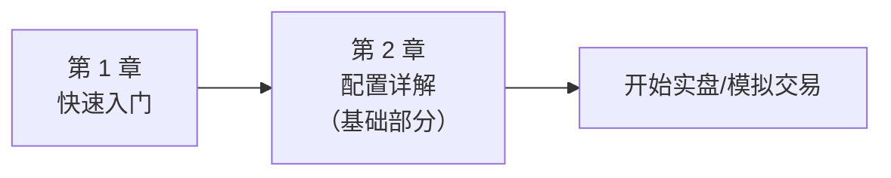
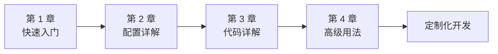
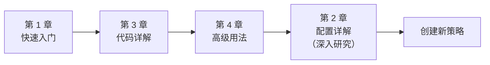

# 三连阳/三连阴趋势策略深度教程

欢迎来到三连阳/三连阴趋势策略的深度教程！本教程将带您从零开始，深入理解这个基于 Hummingbot Strategy V2 框架的趋势跟踪策略。

## 📚 教程导航

本教程采用循序渐进的学习路径设计，包含以下章节：

### [第 1 章：快速入门](./01-getting-started.md)

**适合人群**：所有用户

**学习时长**：15-20 分钟

**内容概要**：

- 策略核心理念与交易逻辑
- 5 分钟快速部署指南
- 最小化配置示例
- 常见问题解答

**学习目标**：能够快速部署并运行策略，理解基本工作原理。

---

### [第 2 章：配置详解](./02-configuration-guide.md)

**适合人群**：希望优化策略参数的用户

**学习时长**：30-40 分钟

**内容概要**：

- 配置文件完整结构解析
- 每个参数的深度说明与优化建议
- 参数间的相互影响与协同效应
- 不同市场条件下的配置策略
- Pydantic 验证机制详解
- 配置最佳实践与常见陷阱

**学习目标**：掌握参数调优技巧，能够根据市场特性定制配置。

---

### [第 3 章：代码详解](./03-code-walkthrough.md)

**适合人群**：希望深入理解实现细节或扩展功能的开发者

**学习时长**：60-90 分钟

**内容概要**：

- Hummingbot Strategy V2 架构深度解析
- 配置类源码逐行分析
- 策略类核心方法详解
- 执行器模式工作原理
- K 线数据处理机制
- 信号生成算法实现
- 关键设计决策与权衡

**学习目标**：完全理解策略源码，能够修改和扩展功能。

---

### [第 4 章：高级用法](./04-advanced-usage.md)

**适合人群**：追求卓越性能的高级用户

**学习时长**：45-60 分钟

**内容概要**：

- 策略性能优化技巧
- 参数回测与优化方法
- 功能扩展实战
  - 集成更多技术指标
  - 自定义止盈止损逻辑
  - 实现双向持仓模式
  - 多时间框架分析
- Controller 模式集成
- 生产环境部署指南
- 监控告警体系搭建
- 实战案例分析

**学习目标**：掌握高级技巧，能够构建生产级交易系统。

---

## 🎯 学习路径建议

### 路径 1：快速实战型

**目标**：尽快上手运行策略

**建议**：

1. 完成第 1 章，快速部署策略
2. 阅读第 2 章的基础配置部分
3. 使用模拟交易测试和调整参数

---

### 路径 2：深度理解型

**目标**：全面掌握策略原理和实现

**建议**：

1. 按章节顺序完整学习
2. 动手实践每个示例
3. 尝试修改源码进行实验

---

### 路径 3：开发扩展型

**目标**：基于本策略开发自己的策略

**建议**：

1. 快速浏览第 1 章了解策略
2. 深入学习第 3 章的架构设计
3. 参考第 4 章的扩展案例
4. 研究第 2 章的参数设计模式

---

## 📋 前置知识要求

### 必备知识

- **Python 基础**：理解类、方法、装饰器等基本概念
- **交易基础**：了解永续合约、杠杆、止盈止损等概念
- **K 线基础**：理解阳线、阴线、开盘价、收盘价等

### 推荐知识

- **Pandas 基础**：有助于理解数据处理部分
- **Pydantic 基础**：有助于理解配置验证机制
- **异步编程**：有助于理解 Hummingbot 框架
- **技术分析**：有助于扩展策略功能

### 环境要求

- **Hummingbot**：已安装并配置好 Hummingbot
- **交易所账户**：已配置好交易所 API 密钥（建议先用测试网）
- **Python 环境**：Python 3.8+

---

## 🛠️ 相关资源

### 策略文件

- [策略源码](../three_candles_trend_strategy.py)
- [配置文件](../three_candles_trend_config.yml)
- [策略说明](../three_candles_trend_strategy.md)

### Hummingbot 官方资源

- [Hummingbot 官方文档](https://docs.hummingbot.org/)
- [Strategy V2 开发指南](https://docs.hummingbot.org/v2-strategies/)
- [Discord 社区](https://discord.gg/hummingbot)
- [GitHub 仓库](https://github.com/hummingbot/hummingbot)

### 技术参考

- [Pydantic 文档](https://docs.pydantic.dev/)
- [Pandas 文档](https://pandas.pydata.org/docs/)
- [技术分析基础](https://www.investopedia.com/terms/t/technicalanalysis.asp)

---

## 💡 使用建议

### 学习建议

1. **循序渐进**：不要跳过章节，每个章节都有其价值
2. **动手实践**：理论结合实践，运行示例代码
3. **记录笔记**：记录参数调整过程和结果
4. **社区交流**：遇到问题及时在社区寻求帮助

### 风险提示

⚠️ **重要提示**：

- 本策略仅供学习和参考，不构成投资建议
- 数字货币交易具有高风险，可能导致本金损失
- 建议先在测试网或模拟环境中充分测试
- 实盘交易前请确保完全理解策略逻辑和风险
- 合理控制仓位，不要使用过高杠杆
- 做好风险管理，设置合理的止损

---

## 📝 更新日志

### v1.1.0 (2025)

- ✅ `get_signal` 新增未完成 K 线过滤与日志输出，信号更加可靠
- ✅ `create_actions_proposal` 在模拟模式下记录通知并阻断真实下单
- ✅ 配置文档同步最新默认值（如杠杆 50x、自动补全 `candles_config`）
- ✅ 完善三连阳/三连阴判定日志，增强调试可读性
- ✅ 更新全套文档与示例代码保持与源码一致

### v1.0.0 (2024)

- ✅ 完成策略核心功能
- ✅ 实现三连阳/三连阴信号检测
- ✅ 集成 TripleBarrier 风险管理
- ✅ 完善状态监控和展示
- ✅ 编写完整教程文档

---

## 🤝 贡献与反馈

如果您在使用过程中发现问题或有改进建议，欢迎：

- 提交 Issue 或 Pull Request
- 在 Hummingbot Discord 社区分享经验
- 完善和改进文档

---

## 📄 许可证

本策略遵循 Apache 2.0 开源许可证。

---

## 🚀 开始学习

准备好了吗？让我们从[第 1 章：快速入门](./01-getting-started.md)开始吧！
