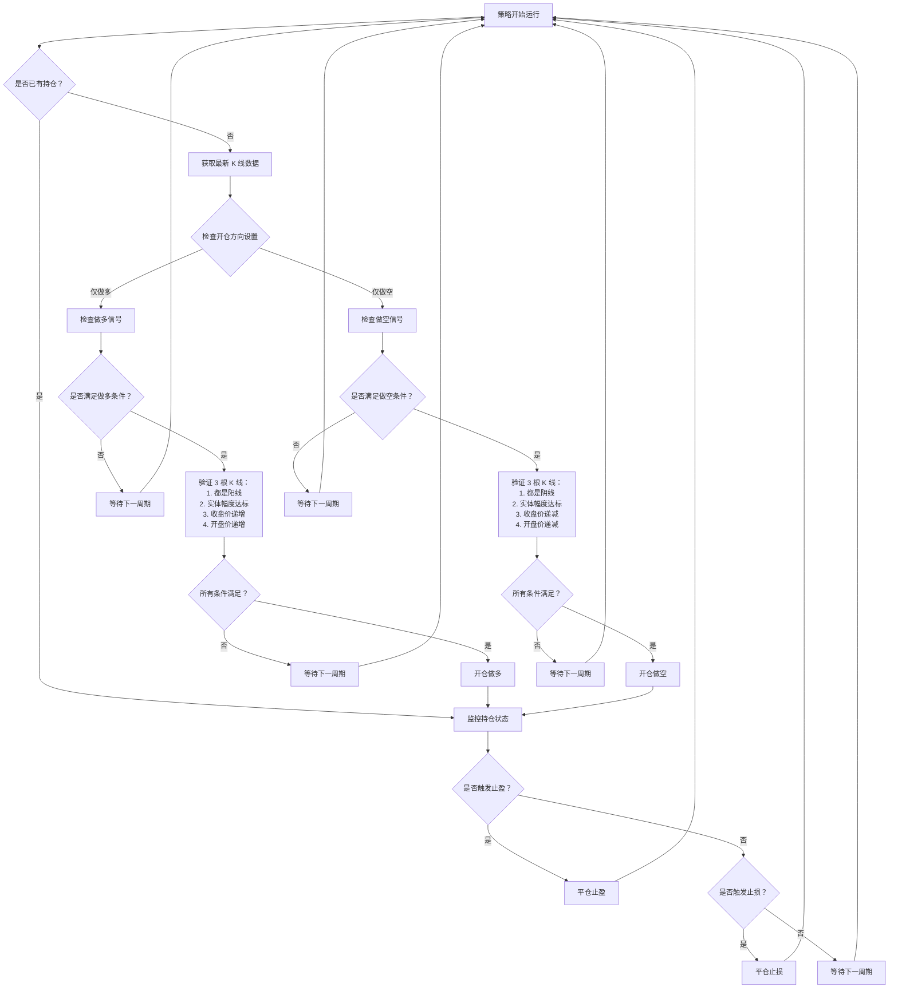

# 三连阳/三连阴趋势策略

## 策略概述

**策略名称**：三连阳/三连阴趋势跟踪策略

**策略类型**：方向性交易 / 趋势跟踪策略

**适用市场**：永续合约市场（支持杠杆交易）

本策略通过识别连续三根同向 K 线形态来捕捉市场趋势，当市场出现连续三根阳线时开仓做多，出现连续三根阴线时开仓做空。通过严格的 K 线形态过滤和风险控制，确保只在强势趋势中开仓。

## 策略逻辑

### 开仓条件

策略采用严格的趋势确认机制，需要同时满足多个条件才会触发开仓信号。

#### 做多条件

连续 3 根 K 线需要**同时满足**以下所有条件：

1. **每根 K 线都是阳线**
   - `close[i] > open[i]`
   - `close[i-1] > open[i-1]`
   - `close[i-2] > open[i-2]`

2. **每根 K 线实体幅度达标**
   - `(close[i] - open[i]) / open[i] >= min_candle_body_pct`
   - `(close[i-1] - open[i-1]) / open[i-1] >= min_candle_body_pct`
   - `(close[i-2] - open[i-2]) / open[i-2] >= min_candle_body_pct`
   - 用于过滤实体过小的假突破信号

3. **收盘价逐根升高**
   - `close[i] > close[i-1] > close[i-2]`

4. **开盘价逐根升高**
   - `open[i] > open[i-1] > open[i-2]`

#### 做空条件

连续 3 根 K 线需要**同时满足**以下所有条件：

1. **每根 K 线都是阴线**
   - `close[i] < open[i]`
   - `close[i-1] < open[i-1]`
   - `close[i-2] < open[i-2]`

2. **每根 K 线实体幅度达标**
   - `(open[i] - close[i]) / open[i] >= min_candle_body_pct`
   - `(open[i-1] - close[i-1]) / open[i-1] >= min_candle_body_pct`
   - `(open[i-2] - close[i-2]) / open[i-2] >= min_candle_body_pct`
   - 用于过滤实体过小的假突破信号

3. **收盘价逐根降低**
   - `close[i] < close[i-1] < close[i-2]`

4. **开盘价逐根降低**
   - `open[i] < open[i-1] < open[i-2]`

### 风险控制

- **单一持仓限制**：同时只允许持有一个仓位（做多或做空），防止重复开单
- **信号过滤**：在已有持仓的情况下，即使出现新的开仓信号也不会开新仓
- **方向控制**：可通过 `trade_direction` 参数限制只做多或只做空

### 平仓条件

根据设置的止盈止损参数自动平仓：

- **触发止盈**：价格达到 `开仓价 × (1 ± take_profit)`
  - 做多：`当前价格 >= 开仓价 × (1 + take_profit)`
  - 做空：`当前价格 <= 开仓价 × (1 - take_profit)`

- **触发止损**：价格达到 `开仓价 × (1 ± stop_loss)`
  - 做多：`当前价格 <= 开仓价 × (1 - stop_loss)`
  - 做空：`当前价格 >= 开仓价 × (1 + stop_loss)`

### 策略流程图



## 参数配置说明

### 基础参数

| 参数名称 | 类型 | 说明 | 示例值 |
|---------|------|------|--------|
| `exchange` | string | 交易所名称 | `hyperliquid_perpetual` |
| `trading_pair` | string | 交易对 | `BTC-USD`, `ETH-USD` |
| `candles_exchange` | string | K 线数据源交易所 | `binance_perpetual` |
| `candles_pair` | string | K 线数据源交易对 | `BTC-USDT`, `ETH-USDT` |
| `candles_interval` | string | K 线周期 | `1m`, `5m`, `15m`, `1h` |

### 策略参数

| 参数名称 | 类型 | 说明 | 默认值 |
|---------|------|------|--------|
| `trade_direction` | string | 开仓方向：`LONG`（仅做多）或 `SHORT`（仅做空） | `LONG` |
| `min_candle_body_pct` | float | K 线实体最小幅度百分比，用于过滤假突破 | `0.001`（0.1%） |
| `leverage` | int | 杠杆倍数 | `100` |
| `order_amount_quote` | float | 开仓金额（以 USDT 计价） | `30` |

### 风险管理参数

| 参数名称 | 类型 | 说明 | 示例值 |
|---------|------|------|--------|
| `stop_loss` | float | 止损百分比 | `0.02`（2%） |
| `take_profit` | float | 止盈百分比 | `0.01`（1%） |

## 配置示例

以下是一个完整的策略配置示例：

```yaml
# 三连阳/三连阴趋势策略配置

# 交易所配置
exchange: hyperliquid_perpetual
trading_pair: BTC-USD

# K 线数据源配置
candles_exchange: binance_perpetual
candles_pair: BTC-USDT
candles_interval: 5m

# 策略参数
trade_direction: LONG          # 仅做多（可选值：LONG, SHORT）
min_candle_body_pct: 0.001     # K 线实体最小幅度 0.1%
leverage: 100                  # 100 倍杠杆
order_amount_quote: 50         # 每次开仓 50 USDT

# 风险管理
stop_loss: 0.02                # 止损 2%
take_profit: 0.015             # 止盈 1.5%
```

### 配置说明

1. **交易所和交易对**：
   - 在 `hyperliquid_perpetual` 交易所交易 `BTC-USD`
   - 使用 `binance_perpetual` 的 `BTC-USDT` K 线数据（流动性更好）

2. **K 线周期**：
   - 使用 5 分钟 K 线
   - 建议根据市场波动性调整，波动大的市场可以使用更大周期

3. **开仓方向**：
   - 设置为 `LONG` 表示只做多
   - 如需做空，改为 `SHORT`

4. **K 线实体过滤**：
   - `min_candle_body_pct: 0.001` 表示每根 K 线的实体（收盘价-开盘价）至少要达到开盘价的 0.1%
   - 可根据交易品种的波动性调整，波动小的品种可以降低此值

5. **杠杆和仓位**：
   - 100 倍杠杆风险极高，建议谨慎使用
   - 每次开仓 50 USDT，实际持仓价值为 5000 USDT

6. **止盈止损**：
   - 止损 2%，止盈 1.5%
   - 盈亏比为 1:0.75，建议根据回测结果调整

## 使用方法

### 创建配置文件

1. 在 Hummingbot 配置目录下创建配置文件：

```bash
# 进入配置目录
cd ~/hummingbot/conf

# 创建配置文件
nano three_candles_trend.yml
```

2. 将上述配置示例复制到文件中，并根据需要修改参数

3. 保存文件（Ctrl+O，Enter，Ctrl+X）

### 运行策略

1. 启动 Hummingbot：

```bash
cd ~/hummingbot
./start
```

2. 在 Hummingbot 命令行中加载策略：

```bash
# 导入策略脚本
import scripts/my_strategies/three_candles_trend.py

# 启动策略
start
```

### 监控策略运行状态

在策略运行期间，可以使用以下命令监控：

- `status`：查看当前策略状态、持仓和收益
- `balance`：查看账户余额
- `history`：查看历史交易记录
- `stop`：停止策略运行

## 参数优化建议

### K 线周期选择

- **1 分钟**：适合高频交易，信号频繁，但噪音较多
- **5 分钟**：平衡信号质量和频率，适合日内交易
- **15 分钟 / 1 小时**：信号更可靠，但交易频率降低

### 实体幅度阈值

- **低波动品种**（如稳定币对）：`0.0005`（0.05%）
- **中等波动品种**（如主流币）：`0.001`（0.1%）
- **高波动品种**（如山寨币）：`0.002`（0.2%）

### 杠杆倍数

- **保守型**：10-20 倍
- **平衡型**：20-50 倍
- **激进型**：50-100 倍

⚠️ **警告**：高杠杆意味着高风险，建议从低杠杆开始测试。

### 止盈止损比例

建议根据回测数据优化，常见设置：

- **1:1**：`stop_loss: 0.02`, `take_profit: 0.02`
- **1:1.5**：`stop_loss: 0.02`, `take_profit: 0.03`
- **1:2**：`stop_loss: 0.01`, `take_profit: 0.02`
